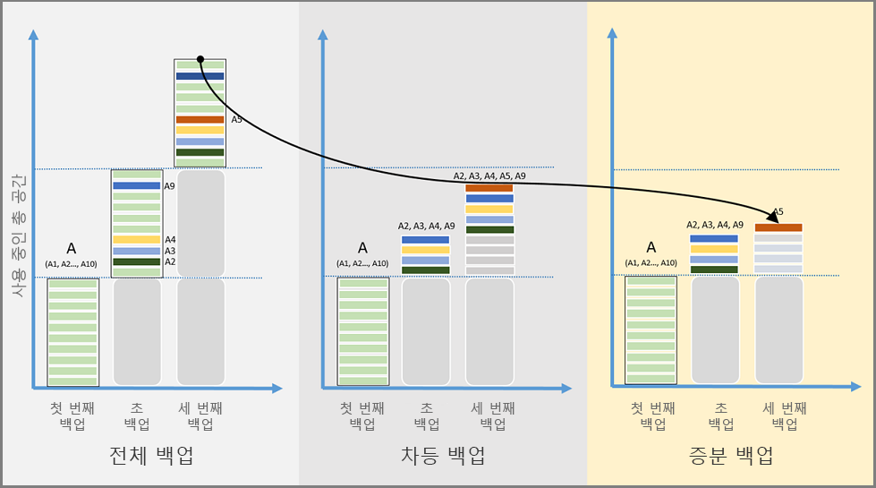

# Azure Backup의 기능에 대한 개요
Azure Backup은 Microsoft 클라우드에서 데이터를 백업(또는 보호)하고 복원하는 데 사용할 수 있는 Azure 기반 서비스이며, 기존의 온-프레미스 또는 오프사이트 백업 솔루션을 신뢰할 수 있고 안전하며 가격 경쟁력이 있는 클라우드 기반 솔루션으로 대체합니다. Azure Backup에서는 컴퓨터, 서버 또는 클라우드에 적절히 다운로드하고 배포하는 여러 구성 요소를 제공합니다. 배포하는 구성 요소 또는 에이전트는 보호하려는 대상에 따라 달라집니다. 온-프레미스 또는 클라우드에서 데이터를 보호하는지 여부에 관계 없이 모든 Azure Backup 구성 요소는 Azure에서 Recovery Services 자격 증명 모음에 데이터를 백업하는 데 사용할 수 있습니다. 특정 데이터, 애플리케이션 또는 워크로드 보호하는 데 사용할 구성 요소에 대한 내용은 이 문서의 뒷부분에 있는 [Azure Backup 구성 요소 표](backup-introduction-to-azure-backup.md#which-azure-backup-components-should-i-use)를 참조하세요.

[Azure Backup의 비디오 개요 시청](https://azure.microsoft.com/documentation/videos/what-is-azure-backup/)

## Azure Backup을 사용하는 이유
기존의 백업 솔루션은 클라우드를 디스크 또는 테이프와 유사한 엔드포인트 또는 정적 저장소 대상으로 간주하도록 발전했습니다. 이 방법은 단순하지만 제한적이며, 고가의 비효율적 인 솔루션으로 전환하는 기본 클라우드 플랫폼을 완전히 활용하지 않습니다. 다른 솔루션은 필요하지 않은 잘못된 저장소 형식 또는 저장소를 위해 지불하게 되어 비용이 많이 들고, 필요한 저장소의 형식이나 크기를 제공하지 않고 관리 작업에 너무 많은 시간이 소모되어 종종 비효율적입니다. 반면 Azure Backup은 다음과 같은 주요 이점을 제공합니다.

**자동 저장소 관리** - 일부는 온-프레미스, 일부는 클라우드인 하이브리드 환경에는 종종 다른 유형의 저장소가 필요합니다. Azure Backup을 사용하면 온-프레미스 저장소 디바이스를 사용하기 위한 비용이 들지 않습니다. Azure Backup은 백업 저장소를 자동으로 할당하고 관리하며 사용한 만큼 지불(pay-as-you-use) 모델을 사용합니다. ‘사용한 만큼 지불’은 사용하는 저장소에 대한 요금만 지불한다는 의미입니다. 자세한 내용은 [Azure 가격 책정](https://azure.microsoft.com/pricing/details/backup)을 참조하세요.

**무제한 확장** - Azure Backup은 유지 관리 및 모니터링 비용을 부담할 필요 없이 기본 전력과 Azure 클라우드의 무제한 확장을 사용하여 높은 가용성을 제공합니다. 이벤트 정보를 제공하도록 경고를 설정할 수 있지만 클라우드에 있는 데이터의 고가용성에 대해 걱정할 필요가 없습니다.

**여러 저장소 옵션** - 높은 가용성의 한 양상으로 저장소 복제가 있습니다. Azure Backup에는 두 가지 유형의 복제, 즉 [로컬 중복 저장소](../storage/common/storage-redundancy-lrs.md)와 [지역 중복 저장소](../storage/common/storage-redundancy-grs.md)가 있습니다. 필요에 따라 다음과 같은 백업 저장소 옵션을 선택합니다.

* LRS(로컬 중복 저장소)는 데이터 센터의 저장소 배율 단위로 데이터를 세 번 복제합니다(세 개의 데이터 복사본을 만듦). 모든 데이터 복사본은 동일한 지역 내에 있습니다. LRS는 로컬 하드웨어 오류로부터 데이터를 보호하기 위한 저비용 옵션입니다.

* GRS(지역 중복 저장소)는 기본값이며 권장되는 복제 옵션입니다. GRS는 데이터 원본의 기본 위치에서 수백 마일 떨어진 보조 지역으로 데이터를 복제합니다. GRS는 LRS보다 많은 비용이 소요되지만 GRS는 지역 가동 중단이 발생해도 높은 수준의 데이터 내구성을 제공합니다.

**무제한 데이터 전송** - Azure Backup은 인바운드 또는 아웃바운드 데이터를 무제한으로 전송할 수 있습니다. 또한 전송되는 데이터에 대해 요금을 청구하지 않습니다. 그러나 Azure Import/Export 서비스를 통해 대량의 데이터를 가져오는 경우 인바운드 데이터와 관련 된 비용이 발생합니다. 이 비용에 대한 자세한 내용은 [Azure Backup의 오프라인 백업 워크플로](backup-azure-backup-import-export.md)를 참조하세요. 아웃바운드 데이터는 복원 작업 중에 Recovery Services 자격 증명 모음에서 전송된 데이터입니다.

**데이터 암호화** - 공용 클라우드에서 데이터의 전송 및 저장을 보호합니다. 암호화 암호는 로컬에서 저장되며, Azure에서 전송되거나 저장되지는 않습니다. 데이터를 복원해야 하는 경우 암호화 암호 또는 키만 이으면 됩니다.

**응용 프로그램 일치 백업** - 복구 지점에 백업 복사본을 복원하는 데 필요한 모든 데이터가 있음을 의미합니다. Azure Backup에서 애플리케이션 일치 백업을 제공하므로 데이터를 복원하기 위한 추가 수정 프로그램이 필요하지 않습니다. 애플리케이션 일치 데이터를 복원하면 실행 상태로 빠르게 돌아갈 수 있으므로 복원 시간을 줄여줍니다.

**장기 보존** - 단기 및 장기 데이터 보존을 위해 Recovery Services 자격 증명 모음을 사용할 수 있습니다. Azure는 Recovery Services 자격 증명 모음에 데이터를 유지할 수 있는 기간을 제한하지 않습니다. 원하는 만큼 자격 증명 모음에 데이터를 유지할 수 있습니다. Azure Backup에는 보호된 인스턴스당 9999개 복구 지점의 제한이 있습니다. 이 제한이 백업 필요성에 어떻게 영향을 줄 수 있는지에 대한 설명은 이 문서의 [Backup 및 보존](backup-introduction-to-azure-backup.md#backup-and-retention) 섹션을 참조하세요.

## 어떤 Azure Backup 구성 요소를 사용해야 합니까?
각 Azure Backup 구성 요소로 보호할 수 있는 항목에 대한 자세한 내용은 다음 표를 참조하세요. 

| 구성 요소 | 이점 | 제한 | 보호 대상 | 백업 저장 위치 |
| --- | --- | --- | --- | --- |
| Azure Backup(MARS) 에이전트 |<li>실제 또는 가상 Windows OS에 있는 파일 및 폴더를 백업함(온-프레미스 또는 Azure에 VM 배치 가능)<li>별도의 백업 서버가 필요하지 않음 |<li>매일 3회 Backup <li>애플리케이션 인식 안 함. 파일, 폴더, 볼륨 수준 복원만 지원 <li>  Linux 지원 안 함 |<li>파일 <li>폴더 <li>시스템 상태 |Recovery Services 자격 증명 모음 |
| System Center DPM |<li>VSS(애플리케이션 인식 스냅숏)<li>백업을 가져올 때 충분한 유연성<li>복구 세분성(모두)<li>Recovery Services 자격 증명 모음을 사용할 수 있음<li>Hyper-V 및 VMware VM에 대한 Linux 지원 <li>DPM 2012 R2를 사용하여 VMware VM 백업 및 복원 |Oracle 워크로드는 백업할 수 없음|<li>파일 <li>폴더<li> 볼륨 <li>VM<li> 애플리케이션<li> 워크로드 <li>시스템 상태 |<li>Recovery Services 자격 증명 모음<li> 로컬 연결된 디스크<li>  테이프(온-프레미스 전용) |
| Azure Backup 서버 |<li>VSS(애플리케이션 인식 스냅숏)<li>백업을 가져올 때 충분한 유연성<li>복구 세분성(모두)<li>Recovery Services 자격 증명 모음을 사용할 수 있음<li>Hyper-V 및 VMware VM에 대한 Linux 지원<li>VMware VM 백업 및 복원 <li>System Center 라이선스 필요하지 않음 |<li>Oracle 워크로드는 백업할 수 없음<li>항상 라이브 Azure 구독 필요<li>테이프 백업 지원 안 함 |<li>파일 <li>폴더<li> 볼륨 <li>VM<li> 애플리케이션<li> 워크로드 <li>시스템 상태 |<li>Recovery Services 자격 증명 모음<li> 로컬 연결된 디스크 |
| Azure IaaS VM Backup |<li>VSS(애플리케이션 인식 스냅숏)<li>Windows/Linux용 기본 백업<li>특정 에이전트 설치할 필요 없음<li>백업 인프라가 필요 없는 패브릭 수준 백업 |<li>하루 한 번 VM 백업 <li>디스크 수준에서만 VM 복원<li>온-프레미스 백업 불가능 |<li>VM <li>모든 디스크(PowerShell 사용) |
Recovery Services 자격 증명 모음
 |

## 각 구성 요소에 대한 배포 시나리오는 무엇입니까?
| 구성 요소 | Azure에 배포할 수 있나요? | 온-프레미스로 배포할 수 있나요? | 지원되는 대상 저장소 |
| --- | --- | --- | --- |
| Azure Backup(MARS) 에이전트 |
**예**
 
Azure Backup 에이전트는 Azure에서 실행하는 모든 Windows Server VM에 배포할 수 있습니다.
 |
**예**
 
Azure Backup 에이전트는 모든 Windows Server VM 또는 물리적 컴퓨터에 배포할 수 있습니다.
 |
Recovery Services 자격 증명 모음
 |
| System Center DPM |
**예**

[System Center DPM을 사용하여 Azure에서 워크로드를 보호하는 방법](backup-azure-dpm-introduction.md)에 대해 자세히 알아봅니다.
 |
**예**
 
[데이터 센터에서 워크로드 및 VM을 보호하는 방법](https://technet.microsoft.com/system-center-docs/dpm/data-protection-manager)에 대해 자세히 알아봅니다.
 |
로컬 연결된 디스크
 
Recovery Services 자격 증명 모음
 
테이프(온-프레미스 전용)
 |
| Azure Backup 서버 |
**예**

[Azure Backup Server를 사용하여 Azure에서 워크로드를 보호하는 방법](backup-azure-microsoft-azure-backup.md)에 대해 자세히 알아봅니다.
 |
**예**
 
[Azure Backup Server를 사용하여 Azure에서 워크로드를 보호하는 방법](backup-azure-microsoft-azure-backup.md)에 대해 자세히 알아봅니다.
 |
로컬 연결된 디스크
 
Recovery Services 자격 증명 모음
 |
| Azure IaaS VM Backup |
**예**

Azure 패브릭의 일부

[Azure IaaS(Infrastructure as a Service) 가상 머신의 백업](backup-azure-vms-introduction.md)에 맞게 특별히 설정됩니다.
 |
**아니요**
 
System Center DPM을 사용하여 데이터 센터의 가상 머신을 백업합니다.
 |
Recovery Services 자격 증명 모음
 |

## 어떤 애플리케이션 및 워크로드를 백업할 수 있나요?
다음 표에서는 Azure Backup을 사용하여 보호할 수 있는 데이터와 워크로드의 매트릭스를 제공합니다. Azure Backup 솔루션 열에는 해당 솔루션의 배포 설명서에 대한 링크가 있습니다. 

| 데이터 또는 워크로드 | 원본 환경 | Azure Backup 솔루션 |
| --- | --- | --- |
| 파일 및 폴더 |Windows Server |
[Azure Backup 에이전트](backup-configure-vault.md)
 
[System Center DPM](backup-azure-dpm-introduction.md)(+ Azure Backup 에이전트)
 
[Azure Backup Server](backup-azure-microsoft-azure-backup.md)(Azure Backup 에이전트 포함)
 |
| 파일 및 폴더 |Windows 컴퓨터 |
[Azure Backup 에이전트](backup-configure-vault.md)
 
[System Center DPM](backup-azure-dpm-introduction.md)(+ Azure Backup 에이전트)
 
[Azure Backup Server](backup-azure-microsoft-azure-backup.md)(Azure Backup 에이전트 포함)
 |
| Hyper-V 가상 컴퓨터(Windows) |Windows Server |
[System Center DPM](backup-azure-backup-sql.md)(+ Azure Backup 에이전트)
 
[Azure Backup Server](backup-azure-microsoft-azure-backup.md)(Azure Backup 에이전트 포함)
 |
| Hyper-V 가상 머신(Linux) |Windows Server |
[System Center DPM](backup-azure-backup-sql.md)(+ Azure Backup 에이전트)
 
[Azure Backup Server](backup-azure-microsoft-azure-backup.md)(Azure Backup 에이전트 포함)
 |
| VMware 가상 머신 |Windows Server |
[System Center DPM](backup-azure-backup-sql.md)(+ Azure Backup 에이전트)
 
[Azure Backup Server](backup-azure-microsoft-azure-backup.md)(Azure Backup 에이전트 포함)
 |
| Microsoft SQL Server에 대한 연결 문자열 |Windows Server |
[System Center DPM](backup-azure-backup-sql.md)(+ Azure Backup 에이전트)
 
[Azure Backup Server](backup-azure-microsoft-azure-backup.md)(Azure Backup 에이전트 포함)
 |
| Microsoft SharePoint |Windows Server |
[System Center DPM](backup-azure-backup-sql.md)(+ Azure Backup 에이전트)
 
[Azure Backup Server](backup-azure-microsoft-azure-backup.md)(Azure Backup 에이전트 포함)
 |
| Microsoft Exchange |Windows Server |
[System Center DPM](backup-azure-backup-sql.md)(+ Azure Backup 에이전트)
 
[Azure Backup Server](backup-azure-microsoft-azure-backup.md)(Azure Backup 에이전트 포함)
 |
| Azure IaaS VM(Windows) |Azure에서 실행 |[Azure Backup(VM 확장)](backup-azure-vms-introduction.md) |
| Azure IaaS VM(Linux) |Azure에서 실행 |[Azure Backup(VM 확장)](backup-azure-vms-introduction.md) |

## Linux 지원
다음 표에서는 Linux를 지원하는 Azure Backup 구성 요소를 보여 줍니다.  

| 구성 요소 | Linux(Azure 인증) 지원 |
| --- | --- |
| Azure Backup(MARS) 에이전트 |아니요(Windows 기반 에이전트만) |
| System Center DPM |<li> Hyper-V 및 VMWare에서 일관성 있는 Linux 게스트 VM 파일 백업  <li> Hyper-V 및 VMWare Linux 게스트 VM의 VM 복원      *Azure VM에서 파일 일치 백업을 사용할 수 없음*   |
| Azure Backup 서버 |<li>Hyper-V 및 VMWare에서 일관성 있는 Linux 게스트 VM 파일 백업  <li> Hyper-V 및 VMWare Linux 게스트 VM의 VM 복원    *Azure VM에서 파일 일치 백업을 사용할 수 없음*  |
| Azure IaaS VM Backup |[사전 스크립트 및 사후 스크립트 프레임워크](backup-azure-linux-app-consistent.md)를 사용하여 응용 프로그램 일치 백업  [세분화된 파일 복구](backup-azure-restore-files-from-vm.md)  [모든 VM 디스크 복원](backup-azure-arm-restore-vms.md#restore-backed-up-disks)  [VM 복원](backup-azure-arm-restore-vms.md#create-a-new-vm-from-a-restore-point) |

## Azure Backup에서 Premium Storage VM 사용
Azure Backup은 Premium Storage VM을 보호합니다. Azure Premium Storage는 I/O 집중 워크로드를 지원하도록 설계된 SSD(반도체 드라이브) 기반 저장소이며, Premium Storage는 VM(가상 컴퓨터) 워크로드에 유용합니다. Premium Storage에 대한 자세한 내용은 [Premium Storage: Azure Virtual Machine 워크로드를 위한 고성능 저장소](../virtual-machines/windows/premium-storage.md)를 참조하세요.

### Premium Storage VM 백업
Premium Storage VM을 백업하는 동안, Backup 서비스는 프리미엄 저장소 계정에 "AzureBackup-"이라는 임시 준비 위치를 만듭니다. 준비 위치의 크기는 복구 지점 스냅숏의 크기와 같습니다. Premium Storage 계정에 임시 준비 위치에 맞게 충분한 여유 공간이 있어야 합니다. 자세한 내용은 [Premium Storage 제한](../virtual-machines/windows/premium-storage.md#scalability-and-performance-targets) 문서를 참조하세요. 백업 작업이 완료되면, 준비 위치가 삭제됩니다. 준비 위치에 사용된 저장소의 가격은 모든 [프리미엄 저장소 가격 책정](../virtual-machines/windows/premium-storage.md#pricing-and-billing)과 일치합니다.

> [!NOTE]
> 준비 위치를 수정하거나 편집하지 마십시오.
>
>

### Premium Storage VM 복원
Premium Storage VM을 Premium Storage 또는 Standard Storage에 복원할 수 있습니다. Premium Storage VM 복구 지점을 Premium Storage에 복원하는 것이 일반적인 프로세스입니다. 그러나 VM에서 파일의 하위 집합이 필요한 경우 Premium Storage VM 복구 지점을 Standard Storage에 복원하는 것이 비용 효율적일 수 있습니다.

## Azure Backup으로 Managed Disks VM 사용
Azure Backup은 Managed Disks VM을 보호합니다. Managed Disks를 사용하면 가상 머신의 저장소 계정을 관리하지 않아도 되며 VM 프로비전이 매우 간소화됩니다.

### Managed Disks VM 백업
VM을 Managed Disks에 백업하는 것은 Resource Manager VM을 백업하는 것과 다르지 않습니다. Azure Portal의 경우 Virtual Machine 보기 또는 Recovery Services 자격 증명 보기에서 백업 작업을 바로 구성할 수 있습니다. Managed Disks에 VM 백업은 Managed Disks를 기반으로 구축된 RestorePoint 컬렉션을 통해 지원됩니다. Azure Backup도 Azure Disk Encryption(ADE)을 사용하여 암호화된 Managed Disks VM을 백업하도록 지원합니다.

### Managed Disks VM 복원
Azure Backup을 사용하면 관리 디스크로 전체 VM을 복원하거나 관리 디스크를 저장소 계정에 복원할 수 있습니다. Azure는 복원 프로세스 중에 Managed Disks를 관리합니다. 사용자(고객)은 복원 프로세스의 일부로 생성된 저장소 계정을 관리합니다. 관리되고 암호화된 VM을 복원할 때 복원 작업을 시작하기 전에 VM의 키와 비밀이 키 자격 증명 모음에 존재해야 합니다.

## 각 Backup 구성 요소의 기능은 무엇입니까?
다음 표에서는 각 Azure Backup 구성 요소의 다양한 기능에 대한 가용성 또는 지원을 요약하고 있습니다. 추가 지원 및 자세한 내용에 대해서는 각 표에 포함된 정보를 참조하세요.

### Storage
| 기능 | Azure Backup 에이전트 | System Center DPM | Azure Backup 서버 | Azure IaaS VM Backup |
| --- | --- | --- | --- | --- |
| Recovery Services 자격 증명 모음 |![yes][green] |![예][green] |![예][green] |![yes][green] |
| 디스크 저장소 | |![yes][green] |![yes][green] | |
| 테이프 저장소 | |![yes][green] | | |
| 압축  (Recovery Services 자격 증명 모음에서) |![yes][green] |![예][green] |![yes][green] | |
| 증분 백업 |![yes][green] |![예][green] |![예][green] |![yes][green] |
| 디스크 중복 제거 | |![부분적으로][yellow] |![부분적으로][yellow] | | |

Recovery Services 자격 증명 모음은 모든 구성 요소에서 기본 설정 저장소 대상이 됩니다. System Center DPM 및 Azure Backup Server는 로컬 디스크 복사 옵션도 제공합니다. 그러나 테이프 저장 디바이스에 데이터 쓰기 옵션을 제공하는 것은 System Center DPM밖에 없습니다.

#### 압축
필요한 저장소 공간을 줄이기 위해 Backup이 압축됩니다. 압축을 사용하지 않는 유일한 구성 요소는 VM 확장입니다. VM 확장은 저장소 계정의 모든 백업 데이터를 동일한 지역의 Recovery Services 자격 증명 모음으로 복사합니다. 데이터를 전송할 때 압축이 사용되지 않습니다. 압축을 사용하지 않고 데이터를 전송하면 사용되는 저장소 공간이 약간 늘어납니다. 하지만 데이터를 압축하지 않고 저장하는 경우 더 빠르게 복원할 수 있습니다. 해당 복구 지점만 필요합니다.

#### 디스크 중복 제거
[Azure Backup Server 가상 머신에서](http://blogs.technet.com/b/dpm/archive/2015/01/06/deduplication-of-dpm-storage-reduce-dpm-storage-consumption.aspx) System Center DPM 또는 Azure Backup Server를 배포할 때 중복 제거를 활용할 수 있습니다. Windows Server는 백업 저장소로 가상 머신에 연결된 VHD(가상 하드 디스크)에서 호스트 수준 중복 제거를 수행합니다.

> [!NOTE]
> Azure에서 중복 제거를 모든  Backup 구성 요소에 제공하지는 않습니다. System Center DPM 및 Backup 서버가 Azure에 배포될 경우 VM에 연결된 저장소 디스크는 중복을 제거할 수 없습니다.
>
>

### 증분 백업 설명
모든 Azure Backup 구성 요소는 대상 저장소(디스크, 테이프, Recovery Services 자격 증명 모음)에 관계 없이 증분 백업을 지원합니다. 증분 백업을 통해 백업이 마지막 백업 이후의 해당 변경 내용만을 전송하여 저장소 및 시간을 효율적으로 사용합니다.

#### 전체, 차등 및 증분 백업 비교

저장소 사용량, 복구 시간 목표(RTO) 및 네트워크 사용량은 각 유형의 백업 방법마다 다양합니다. 백업 총 소유 비용(TCO)을 낮게 유지하려면 최고의 백업 솔루션을 선택하는 방법을 이해할 필요가 있습니다. 다음 이미지는 전체 Backup, 차등 Backup 및 증분 Backup을 비교합니다. 이미지에서 데이터 원본 A는 매달 백업되는 10개의 저장소 블록 A1-A10으로 구성됩니다. 블록 A2, A3, A4 및 A9는 첫 번째 달에 변경되고 블록 A5는 다음 달에 변경됩니다.

**전체 Backup**의 경우 각 백업 복사본에는 전체 데이터 원본이 포함됩니다. 전체 백업은 백업 복사본이 전송될 때마다 대량의 네트워크 대역폭과 저장소가 사용됩니다.

**차등 백업**은 초기 전체 백업 이후에 변경된 블록만 저장하기 때문에 네트워크 및 저장소 소비량이 더 적습니다. 차등 백업은 변경되지 않은 데이터의 중복 복사본을 유지하지 않습니다. 하지만 후속 백업 사이에 변경되지 않은 상태로 유지되는 데이터 블록이 전송되고 저장되기 때문에 차등 백업은 비효율적입니다. 두 번째 달에 변경된 블록 A2, A3, A4 및 A9가 백업됩니다. 세 번째 달에 이와 동일한 블록이 변경된 블록 A5와 함께 다시 백업됩니다. 변경된 블록은 다음 전체 백업이 발생할 때가지 계속 백업됩니다.

**증분 Backup**은 이전 백업 이후에 변경된 데이터 블록만 저장하여 높은 저장소 및 네트워크 효율을 달성합니다. 증분 백업의 경우 정기적인 전체 백업을 수행할 필요가 없습니다. 이 예에서는 첫 번째 달에 전체 백업이 수행된 후 A2, A3, A4 및 A9 블록이 변경된 것으로 표시되고, 두 번째 달에 전송되었습니다. 세 번째 달에는 변경된 블록 A5만 표시되고 전송됩니다. 적은 데이터를 이동하면 저장소 및 네트워크 리소스가 절약되어 TCO가 감소됩니다.

### 보안
| 기능 | Azure Backup 에이전트 | System Center DPM | Azure Backup 서버 | Azure IaaS VM Backup |
| --- | --- | --- | --- | --- |
| 네트워크 보안  (Azure에 대한) |![yes][green] |![예][green] |![예][green] |![yes][green] |
| 데이터 보안  (Azure에서) |![yes][green] |![예][green] |![예][green] |![yes][green] |

#### 네트워크 보안
서버에서 Recovery Services 자격 증명 모음까지의 모든 백업 트래픽은 AES(Advanced Encryption Standard) 256을 사용하여 암호화됩니다. 백업 데이터는 안전한 HTTPS 연결을 통해 전송됩니다. 또한 백업 데이터는 Recovery Services 자격 증명 모음에 암호화된 형식으로 저장됩니다. Azure 고객인 사용자만 백업 데이터의 잠금을 해제하는 암호를 보유합니다. Microsoft는 어떠한 경우에도 백업 데이터를 암호 해독할 수 없습니다.

> [!WARNING]
> Recovery Services 자격 증명 모음을 설정하면 사용자만 암호화 키에 액세스할 수 있습니다. Microsoft는 암호화 키의 복사본을 결코 유지 관리할 수 없으며, 키에 대한 액세스 권한도 없습니다. 키를 잃어버릴 경우 Microsoft는 백업 데이터를 복구할 수 없습니다.
>
>

#### 데이터 보안
Azure VM을 백업하려면 가상 머신 *내에서* 암호화를 설정해야 합니다. Azure Backup은 Azure Disk Encryption을 지원하며, Windows 가상 머신의 BitLocker와 Linux 가상 머신의 **dm-crypt**를 사용합니다. 백 엔드에서 Azure Backup는 [Azure Storage 서비스 암호화](../storage/common/storage-service-encryption.md)를 사용하여 미사용 데이터를 보호합니다.

### 네트워크
| 기능 | Azure Backup 에이전트 | System Center DPM | Azure Backup 서버 | Azure IaaS VM Backup |
| --- | --- | --- | --- | --- |
| 네트워크 압축  (**백업 서버**에 대한) | |![yes][green] |![yes][green] | |
| 네트워크 압축  (**Recovery Services 자격 증명 모음**에) |![yes][green] |![예][green] |![yes][green] | |
| 네트워크 프로토콜  (**백업 서버**에 대한) | |TCP |TCP | |
| 네트워크 프로토콜  (**Recovery Services 자격 증명 모음**에) |HTTPS |HTTPS |HTTPS |HTTPS |

IaaS VM의 VM 확장은 저장소 네트워크를 통해 Azure 저장소 계정에서 직접 데이터를 읽기 때문에 이 트래픽을 압축할 필요가 없습니다.

System Center DPM 서버 또는 Azure Backup Server를 보조 백업 서버로 사용하는 경우 기본 서버에서 백업 서버로 가는 데이터를 압축합니다. DPM 또는 Azure Backup Server에 백업하기 전에 데이터를 압축하면 대역폭이 절약됩니다.

#### 네트워크 제한
Azure Backup 에이전트는 데이터 전송 중에 네트워크 대역폭이 사용되는 방식을 제어할 수 있는 네트워크 제한을 제공합니다. 제한은 근무 시간에 데이터를 백업해야 하는데 백업 프로세스가 다른 인터넷 트래픽을 방해하지 말아야 할 때 유용한 기능입니다. 데이터 전송 제한은 백업 및 복원 작업에 적용됩니다.

## Backup 및 보존

Azure Backup에는 *보호된 인스턴스*당 최대 9999개 복구 지점(백업 복사본 또는 스냅숏이라고도 함)이 있습니다. 보호된 인스턴스는 Azure에 데이터를 백업하도록 구성된 컴퓨터, 서버(실제 또는 가상) 또는 워크로드입니다. 자세한 내용은 [보호된 인스턴스란 무엇인가요?](backup-introduction-to-azure-backup.md#what-is-a-protected-instance) 섹션을 참조하세요. 데이터의 백업 복사본이 저장되면 인스턴스가 보호됩니다. 데이터의 백업 복사본이 보호 기능입니다. 원본 데이터가 손실되었거나 손상된 경우 백업 복사본이 원본 데이터를 복원할 수 있습니다. 다음 표는 각 구성 요소의 최대 백업 빈도를 보여줍니다. 백업 정책 구성은 복구 지점을 사용하는 속도를 결정합니다. 예를 들어 매일 복구 지점을 만들면 복구 지점을 27년 동안 보존한 후 실행합니다. 월별 복구 지점을 사용하는 경우 833년 동안 복구 지점을 보존할 수 있습니다. Backup 서비스는 복구 지점에 만료 시간 제한을 설정하지 않습니다.

|  | Azure Backup 에이전트 | System Center DPM | Azure Backup 서버 | Azure IaaS VM Backup |
| --- | --- | --- | --- | --- |
| Backup 주기  (Recovery Services 자격 증명 모음에) |매일 3회 백업 |하루에 두 번 백업 |하루에 두 번 백업 |매일 1회 백업 |
| Backup 주기  (디스크에 대한) |해당 없음 |<li>SQL Server에 대해 15분마다 <li>다른 워크로드에 대해 1시간마다 |<li>SQL Server에 대해 15분마다 <li>다른 워크로드에 대해 1시간마다
 |해당 없음 |
| 보존 옵션 |매일, 매주, 매월, 매년 |매일, 매주, 매월, 매년 |매일, 매주, 매월, 매년 |매일, 매주, 매월, 매년 |
| 보호된 인스턴스당 최대 복구 지점 |9999|9999|9999|9999|
| 최대 보존 기간 |백업 빈도에 따라 다름 |백업 빈도에 따라 다름 |백업 빈도에 따라 다름 |백업 빈도에 따라 다름 |
| 로컬 디스크의 복구 지점 |해당 없음 |<li>파일 서버의 경우 64<li>애플리케이션 서버의 경우 448 |<li>파일 서버의 경우 64<li>애플리케이션 서버의 경우 448 |해당 없음 |
| 테이프의 복구 지점 |해당 없음 |Unlimited |해당 없음 |해당 없음 |

## 보호된 인스턴스란 무엇인가요?
보호된 인스턴스는 Azure에 백업하도록 구성된 Windows 컴퓨터, 서버(실제 또는 가상) 또는 SQL Database에 대한 일반 참조입니다. 컴퓨터, 서버 또는 데이터베이스에 대한 백업 정책을 구성하고 데이터의 백업 복사본을 만들면 인스턴스가 보호됩니다. 해당 보호된 인스턴스(복구 지점이라고 함)에 대한 백업 데이터의 후속 복사본으로 인해 저장소 사용량이 늘어납니다. 보호된 인스턴스에 대해 최대 9999개의 복구 지점을 만들 수 있습니다. 저장소에서 복구 지점을 삭제하더라도 9999개의 복구 지점 전체 개수에는 영향을 주지 않습니다.
보호된 인스턴스의 몇 가지 일반적인 예로는 Windows 운영 체제를 실행하는 가상 머신, 애플리케이션 서버, 데이터베이스 및 개인용 컴퓨터가 있습니다. 예: 

* Hyper-V 또는 Azure IaaS 하이퍼바이저 패브릭을 실행하는 가상 머신. 가상 머신의 게스트 운영 체제는 Windows Server 또는 Linux가 될 수 있습니다.
* 애플리케이션 서버: 애플리케이션 서버는 Windows Server를 실행하는 실제 또는 가상 머신과 백업해야 하는 데이터 워크로드가 될 수 있습니다. 일반적인 워크로드로는 Microsoft SQL Server, Microsoft Exchange Server, Microsoft SharePoint Server 및 Windows Server의 파일 서버 역할이 있습니다. 이러한 워크로드를 백업하려면 System Center Data Protection Manager(DPM) 또는 Azure Backup Server가 필요합니다.
* Windows 운영 체제를 실행하는 개인용 컴퓨터, 워크스테이션 또는 랩톱입니다.

## Recovery Services 자격 증명 모음이란?
Recovery Services 자격 증명 모음은 백업 복사본, 복구 지점 및 백업 정책과 같은 데이터를 보관하는 데 사용되는 Azure의 온라인 저장소 엔터티입니다. Recovery Services 자격 증명 모음을 사용하여 Azure 서비스 및 온-프레미스 서버와 워크스테이션에 대한 백업 데이터를 보관할 수 있습니다. Recovery Services 자격 증명 모음을 사용하면 관리 오버헤드를 최소화하면서 백업 데이터를 쉽게 구성할 수 있습니다. 각 Azure 구독 내에서 Azure 지역당 최대 500개의 Recovery Services 자격 증명 모음을 만들 수 있습니다. 데이터를 저장할 위치를 고려할 때 모든 지역이 동일하지는 않습니다. 지역 쌍 및 추가 저장소 고려 사항에 대한 자세한 내용은 [지역 중복 저장소](../storage/common/storage-redundancy-grs.md)를 참조하세요.

Azure Service Manager를 기반으로 한 Backup 자격 증명 모음이 자격 증명 모음의 첫 번째 버전이었습니다. Azure Resource Manager 모델 기능을 추가한 Recovery Services 자격 증명 모음이 자격 증명 모음의 두 번째 버전입니다. 기능 차이에 대한 자세한 설명은 [Recovery Services 자격 증명 모음 개요 문서](backup-azure-recovery-services-vault-overview.md)를 참조하세요. 더 이상 Backup 자격 증명 모음을 만들 수 없으며, 기존의 모든 자격 증명 모음이 Recovery Services 자격 증명 모음으로 업그레이드되었습니다. Azure Portal을 사용하여 Recovery Services 자격 증명 모음으로 업그레이드된 자격 증명 모음을 관리할 수 있습니다.

## Azure Backup은 Azure Site Recovery와 어떻게 다른가요?
Azure Backup 및 Azure Site Recovery는 모두 데이터를 백업하고 해당 데이터를 복원할 수 있다는 점에서 서로 관련되어 있습니다. 그러나 이러한 서비스에는 비즈니스 연속성과 재해 복구를 비즈니스에 제공하는 데 있어 다른 목적이 있습니다. Azure Backup을 사용하여 데 세분화된 수준에서 데이터를 보호하고 복원합니다. 예를 들어 랩톱의 프레젠테이션이 손상된 경우 Azure Backup을 사용하여 해당 프레젠테이션을 복원합니다. 다른 데이터 센터를 통해 VM에 구성과 데이터를 복제하려면 Azure Site Recovery를 사용합니다.

Azure Backup은 온-프레미스와 및 클라우드에서 데이터를 보호합니다. Azure Site Recovery는 가상 컴퓨터 및 실제 서버의 복제, 장애 조치 및 복구를 조정합니다. 중단이 발생할 경우 재해 복구 솔루션에서 데이터를 안전하게 유지하고 복구 가능하도록 하는(Backup) *동시에* 워크로드를 사용할 수 있도록 해야 하므로(사이트 복구) 두 서비스가 모두 중요합니다.

백업 및 재해 복구에 대해 중요한 결정을 내릴 때 도움이 되는 개념은 다음과 같습니다.

| 개념 | 세부 정보 | Backup | 재해 복구(DR) |
| --- | --- | --- | --- |
| 복구 지점 목표(RPO) |복구 작업을 수행해야 할 때 용인되는 데이터 손실의 양입니다. |Backup 솔루션은 허용되는 RPO에 큰 변동성을 가집니다. 데이터베이스 백업은 최소 15분 정도의 RPO를 갖는 반면 가상 머신 백업은 대개 1일이라는 RPO를 가집니다. |재해 복구 솔루션은 RPO가 낮습니다. DR 복사본은 몇 초 또는 몇 분이 뒤쳐질 수 있습니다. |
| 복구 시간 목표(RTO) |복구 또는 복원을 완료하는 데 걸리는 시간의 양입니다. |더 큰 RPO로 인해 백업 솔루션이 처리해야 하는 데이터의 양이 일반적으로 훨씬 더 많고 결과적으로 RTO가 더 길어집니다. 예를 들어 테이프에서 데이터를 복원하면 오프사이트 위치에서 테이프를 전송하는 데 걸리는 시간에 따라 몇 일이 걸릴 수 있습니다. |재해 복구 솔루션에는 원본과 동기화하는 경우보다 RTO의 수가 적습니다. 처리해야 할 변경 사항이 적습니다. |
| 보존 |데이터를 저장해야 하는 기간 |작업 복구(데이터 손상, 실수로 인한 파일 삭제, OS 오류)가 필요한 경우 백업 데이터는 일반적으로 최대 30일 동안 보존됩니다. 규정 준수 관점에서는 데이터를 몇 개월 내지 몇 년 동안 저장해야 할 수 있습니다. 이러한 경우에 보관을 위해 Backup 데이터가 이상적입니다. |재해 복구는 일반적으로 몇 시간 또는 최대 하루의 작업 복구 데이터만 필요합니다. DR 솔루션에서 사용되는 세분화된 데이터 캡처로 인해 DR 데이터를 사용하여 장기 보존하지 않는 것이 좋습니다. |

## 다음 단계
Windows Server에서 데이터를 보호하거나 Azure에서 VM(가상 머신)를 보호하기 위한 자세한 단계별 지침에 대해서는 다음 자습서 중 하나를 사용하세요.

* [파일 및 폴더 백업](backup-try-azure-backup-in-10-mins.md)
* [Azure Virtual Machines Backup](backup-azure-vms-first-look-arm.md)

다른 워크로드를 보호하는 방법에 대한 자세한 내용은 다음 문서 중 하나를 사용하세요.

* [Windows Server 백업](backup-configure-vault.md)
* [응용 프로그램 워크로드 백업](backup-azure-microsoft-azure-backup.md)
* [Azure IaaS VM Backup](backup-azure-arm-vms-prepare.md)

[green]: ./media/backup-introduction-to-azure-backup/green.png
[yellow]: ./media/backup-introduction-to-azure-backup/yellow.png
[red]: ./media/backup-introduction-to-azure-backup/red.png
