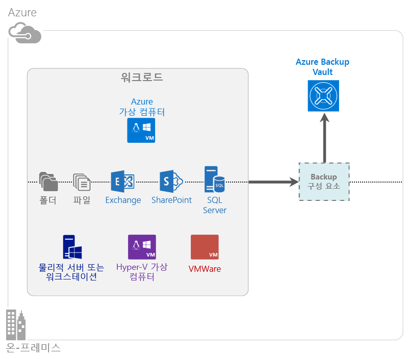

<properties
	pageTitle="Azure 백업이란? | Microsoft Azure"
	description="Azure 백업 및 복구 서비스를 사용하여 Windows Server, Windows 클라이언트 컴퓨터, System Center DPM 서버 및 Azure 가상 컴퓨터에서 데이터 및 응용 프로그램을 백업 및 복원할 수 있습니다."
	services="backup"
	documentationCenter=""
	authors="Jim-Parker"
	manager="jwhit"
	editor="tysonn"
	keywords="백업 및 복원; 복구 서비스; 백업 솔루션"/>

<tags
	ms.service="backup"
	ms.workload="storage-backup-recovery"
	ms.tgt_pltfrm="na"
	ms.devlang="na"
	ms.topic="get-started-article"
	ms.date="03/02/2016"
	ms.author="trinadhk;jimpark"/>

# Azure 백업이란?
Azure 백업은 Microsoft 클라우드에서 데이터를 백업 및 복원하는 데 사용하는 서비스입니다. 기존의 온-프레미스 또는 오프사이트 백업 솔루션을 신뢰할 수 있고 안전하며 가격 경쟁력이 있는 클라우드 기반 솔루션으로 대체합니다. 또한 클라우드에서 실행되는 자산을 보호하도록 도와줍니다. Azure 백업은 확장성, 내구성 및 가용성이 높은 최고 수준의 인프라를 기반으로 빌드된 복구 서비스를 제공합니다.

[Azure 백업의 비디오 개요 시청](https://azure.microsoft.com/documentation/videos/what-is-azure-backup/)

## Azure 백업을 사용하는 이유
기존의 백업 솔루션은 디스크 또는 테이프와 유사한 끝점으로 클라우드를 처리하도록 발전했습니다. 이 방법은 단순하지만 제한적입니다. 기본 클라우드 플랫폼을 완전히 활용하지 않습니다. 이는 비효율적이고, 비용이 많이 드는 솔루션을 의미합니다. 반면에 Azure 백업은 강력하고 경제적인 클라우드 백업 솔루션을 완전히 활용합니다. Azure 백업이 제공하는 주요 이점 중 일부는 다음과 같습니다.

| 기능 | 혜택 |
| ------- | ------- |
| 자동 저장소 관리 | 온-프레미스 저장소 장치에 대한 자본 지출이 필요하지 않습니다. Azure 백업은 백업 저장소를 자동으로 할당하고 관리하며 종량제 소비 모델을 사용합니다. |
| 무제한 확장 | 유지 관리 및 모니터링의 오버헤드 없이 높은 가용성을 활용하도록 보장합니다. Azure 백업은 지장을 주지 않는 자동 확장 기능을 통해 Azure 클라우드의 기본 능력 및 규모를 사용합니다. |
| 여러 저장소 옵션 | 필요에 따라 백업 저장소를 선택합니다. <li>로컬 중복 저장소 블록 Blob는 가격에 민감한 고객에 이상적이며 로컬 하드웨어 오류로부터 데이터를 보호하도록 도와줍니다. <li>지역에서 복제 저장소 블록 Blob는 쌍을 이룬 데이터 센터에 세 개의 추가 복사본을 제공합니다. 이렇게 하면 Azure 사이트 수준의 재해가 있는 경우에 백업 데이터를 항상 사용할 수 있습니다. |
| 무제한 데이터 전송 | 백업 자격 증명에서 복원 작업 중에 송신(아웃바운드) 데이터 전송을 청구하지 않습니다. 또한 Azure에 대한 데이터 인바운드는 무료입니다. |
| 중앙 관리 | Azure 포털은 단순성 및 친숙함을 제공합니다. 서비스가 발전함에 따라 중앙 관리와 같은 기능을 통해 단일 위치에서 백업 인프라를 관리할 수 있습니다. |
| 데이터 암호화. | 이렇게 하면 공용 클라우드에서 고객 데이터의 전송 및 저장을 보호합니다. 암호화 암호는 원본에 저장되며 전송되거나 Azure에 저장되지 않습니다. 데이터를 복원하려면 암호화 키가 필요하며, 해당 고객만 서비스의 데이터에 완전히 액세스할 수 있습니다. |  
| 응용 프로그램 일치 백업 | Windows에서 응용 프로그램이 일관된 백업은 복원 시 수정이 필요하지 않도록 합니다. 복구 시간 목표를 감소시키고 고객이 실행 상태를 빠르게 반환할 수 있도록 합니다. |
| 장기 보존 | 오프사이트 테이프 백업 솔루션에 대해 요금을 지불하는 대신 고객은 Azure에 백업할 수 있습니다. 저렴한 비용으로 테이프와 같은 의미 체계를 사용하여 유용한 솔루션을 제공합니다. |

## Azure 백업 구성 요소
백업은 하이브리드 백업 솔루션이기 때문에 종단 간 백업 사용 및 워크플로 복원하도록 함께 작동하는 여러 구성 요소로 구성됩니다.

## 배포 시나리오

| 구성 요소 | Azure에 배포할 수 있나요? | 온-프레미스로 배포할 수 있나요? | 지원되는 대상 저장소|
| --- | --- | --- | --- |
| Azure 백업 에이전트 | 
**예**
 
Azure 백업 에이전트는 Azure에서 실행하는 모든 Windows Server VM에 배포될 수 있습니다.
 | 
**예**
 
백업 에이전트는 모든 Windows Server VM 또는 물리적 컴퓨터에 배포될 수 있습니다.
 | 
Azure 자격 증명 모음
 |
| System Center Data Protection Manager(DPM) | 
**예**
 
[System Center DPM을 사용하여 Azure에서 워크로드를 보호하는 방법](http://blogs.technet.com/b/dpm/archive/2014/09/02/azure-iaas-workload-protection-using-data-protection-manager.aspx)에 대한 자세한 내용을 알아봅니다.
 | 
**Yes**
 
[데이터 센터에서 워크로드 및 VM를 보호하는 방법](https://technet.microsoft.com/library/hh758173.aspx)에 대해 자세히 알아봅니다.
 | 
로컬로 연결된 디스크,
 
Azure 백업 자격 증명 모음,
 
T테이프(온-프레미스만)
 |
| Azure 백업 서버 | 
**예**
 
[Azure 백업 서버를 사용하여 Azure에서 워크로드를 보호하는 방법](backup-azure-microsoft-azure-backup.md)에 대한 자세한 내용을 알아봅니다.
 | 
**예**
 
[Azure 백업 서버를 사용하여 Azure에서 워크로드를 보호하는 방법](backup-azure-microsoft-azure-backup.md)에 대한 자세한 내용을 알아봅니다.
 | 
Azure 자격 증명 모음
 |
| Azure 백업(VM 확장) | 
예
 
[Azure IaaS(infrastructure as a service) 가상 컴퓨터의 백업](backup-azure-vms-introduction.md)에 맞게 특별히 설정됩니다.
 | 
**아니요**
 
System Center DPM을 사용하여 데이터 센터의 가상 컴퓨터를 백업합니다.
 | 
Azure 자격 증명 모음
 |

## 어떤 응용 프로그램 및 워크로드를 백업할 수 있나요?

| 워크로드 | 원본 컴퓨터 | Azure 백업 솔루션 |
| --- | --- |---|
| 파일 및 폴더 | Windows Server | 
[Azure 백업 에이전트](backup-configure-vault.md),
 
[System Center DPM](backup-azure-dpm-introduction.md),
 
[Azure 백업 서버](backup-azure-microsoft-azure-backup.md)
 |
| 파일 및 폴더 | Windows 클라이언트 | 
[Azure 백업 에이전트](backup-configure-vault.md),
 
[System Center DPM](backup-azure-dpm-introduction.md),
 
[Azure 백업 서버](backup-azure-microsoft-azure-backup.md)
 |
| Hyper-V 가상 컴퓨터(Windows) | Windows Server | 
[System Center DPM](backup-azure-backup-sql.md),
 
[Azure 백업 서버](backup-azure-microsoft-azure-backup.md)
 |
| Hyper-V 가상 컴퓨터(Linux) | Windows Server | 
[System Center DPM](backup-azure-backup-sql.md),
 
[Azure 백업 서버](backup-azure-microsoft-azure-backup.md)
 |
| Microsoft SQL Server | Windows Server | 
[System Center DPM](backup-azure-backup-sql.md),
 
[Azure 백업 서버](backup-azure-microsoft-azure-backup.md)
 |
| Microsoft SharePoint | Windows Server | 
[System Center DPM](backup-azure-backup-sql.md),
 
[Azure 백업 서버](backup-azure-microsoft-azure-backup.md)
 |
| Microsoft Exchange | Windows Server | 
[System Center DPM](backup-azure-backup-sql.md),
 
[Azure 백업 서버](backup-azure-microsoft-azure-backup.md)
 |
| Azure IaaS VM(Windows)| - | [Azure 백업(VM 확장)](backup-azure-vms-introduction.md) | 
| Azure IaaS VM(Linux) | - | [Azure 백업(VM 확장)](backup-azure-vms-introduction.md) |

## 기능
이러한 다섯 개의 테이블은 각 구성 요소에 백업 기능이 처리되는 방법을 요약합니다.

### 저장소

| 기능 | Azure 백업 에이전트 | System Center DPM | Azure 백업 서버 | Azure 백업(VM 확장) |
| ------- | --- | --- | --- | ---- |
| Azure 자격 증명 모음 | ![예][green] | ![예][green] | ![예][green] | ![예][green] |
| 디스크 저장소 | | ![예][green] | ![예][green] | |
| 테이프 저장소 | | ![예][green] | | |
| 압축(백업 자격 증명 모음에서) | ![예][green] | ![예][green]| ![예][green] | |
| 증분 백업 | ![예][green] | ![예][green] | ![예][green] | ![예][green] |
| 디스크 중복 제거 | | ![부분적으로][yellow] | ![부분적으로][yellow]| | |

**키** &nbsp;&nbsp;&nbsp;&nbsp;&nbsp;&nbsp;![예][green]= 지원 &nbsp;&nbsp;&nbsp;&nbsp;&nbsp;&nbsp; ![부분적으로][yellow]= 부분적으로 지원 &nbsp;&nbsp;&nbsp;&nbsp;&nbsp;&nbsp; *&lt;blank&gt;* = 지원되지 않음

백업 자격 증명 모음은 모든 구성 요소에서 원하는 저장소 대상입니다. 또한 ystem Center DPM 및 백업 서버는 로컬 디스크 복사본을 가지도록 하는 옵션을 제공하지만 System Center DPM만이 테이프 저장 장치에 데이터를 기록하는 옵션을 제공합니다.

#### 증분 백업
대상 저장소에 관계 없이(예: 디스크, 테이프, 백업 자격 증명 모음) 모든 구성 요소는 증분 백업을 지원합니다. 이렇게 하면 백업은 마지막 백업 이후에 증분 변경만 수행하고 해당 변경 사항을 대상 저장소에 전송하여 저장소 및 시간을 효율적으로 사용하도록 할 수 있습니다. 또한 백업은 저장소 공간을 줄이도록 압축됩니다.

압축하지 않은 구성 요소는 VM을 확장합니다. 모든 백업 데이터는 압축하지 않고 고객 저장소 계정에서 동일한 지역의 백업 저장소로 복사됩니다. 사용된 저장소를 약간 늘리는 동안 압축하지 않고 데이터를 저장하면 복원 시간을 단축할 수 있습니다.

#### 중복 제거
중복 제거는 [Hyper-V 가상 컴퓨터 내에 배포된](http://blogs.technet.com/b/dpm/archive/2015/01/06/deduplication-of-dpm-storage-reduce-dpm-storage-consumption.aspx) 경우 System Center DPM 및 백업 서버에 대해 지원됩니다. 중복 제거는 가상 컴퓨터에 백업 저장소로 연결된 VHD(가상 하드 디스크)에서 Windows Server 중복 제거 기능을 활용하여 호스트 수준에서 수행됩니다.

>[AZURE.WARNING] 중복 제거는 Azure에서 백업 구성 요소에 사용할 수 없습니다. System Center DPM 및 백업 서버가 Azure에 배포될 경우 VM에 연결된 저장소 디스크는 중복을 제거할 수 없습니다.

### 보안

| 기능 | Azure 백업 에이전트 | System Center DPM | Azure 백업 서버 | Azure 백업(VM 확장) |
| ------- | --- | --- | --- | ---- |
| 네트워크 보안(Azure에) | ![예][green] |![예][green] | ![예][green] | ![부분적으로][yellow]|
| 데이터 보안(Azure에) | ![예][green] |![예][green] | ![예][green] | ![부분적으로][yellow]|

**키** &nbsp;&nbsp;&nbsp;&nbsp;&nbsp;&nbsp;![예][green]= 지원 &nbsp;&nbsp;&nbsp;&nbsp;&nbsp;&nbsp; ![부분적으로][yellow]= 부분적으로 지원 &nbsp;&nbsp;&nbsp;&nbsp;&nbsp;&nbsp; *&lt;blank&gt;* = 지원되지 않음

AES(Advanced Encryption Standard) 256을 사용하여 서버에서 백업 자격 증명 모음까지 모든 백업 트래픽이 암호화됩니다. 데이터는 안전한 HTTPS 연결을 통해 전송됩니다. 또한 백업 데이터는 암호화된 형태로 백업 자격 증명 모음에 저장됩니다. 고객만이 데이터를 잠금 해제하는 암호를 보유합니다. Microsoft는 어떠한 경우에도 백업 데이터를 암호 해독할 수 없습니다.

>[AZURE.WARNING] 백업 데이터를 암호화하는 데 사용되는 키는 고객을 통해서만 존재합니다. Microsoft는 Azure에 복사본을 유지하지 않으며 키에 대한 어떠한 액세스 권한도 없습니다. 키를 잃어버릴 경우 Microsoft는 백업 데이터를 복구할 수 없습니다.

Azure VM을 백업하는 경우 가상 컴퓨터 *내에서* 명시적으로 암호화를 설정해야 합니다. Windows 가상 컴퓨터의 BitLocker 및 Linux 가상 컴퓨터의 **dm-crypt**을 사용합니다. Azure 백업은 이 경로를 통해 제공되는 백업 데이터를 자동으로 암호화하지 않습니다.

### 지원되는 워크로드

| 기능 | Azure 백업 에이전트 | System Center DPM | Azure 백업 서버 | Azure 백업(VM 확장) |
| ------- | --- | --- | --- | ---- |
| Windows Server 컴퓨터--파일 및 폴더 | ![예][green] | ![예][green] | ![예][green] | |
| Windows 클라이언트 컴퓨터--파일 및 폴더 | ![예][green] | ![예][green] | ![예][green] | |
| Hyper-V 가상 컴퓨터(Windows) | | ![예][green] | ![예][green] | |
| Hyper-V 가상 컴퓨터(Linux) | | ![예][green] | ![예][green] | |
| Microsoft SQL Server | | ![예][green] | ![예][green] | |
| Microsoft SharePoint | | ![예][green] | ![예][green] | |
| Microsoft Exchange | | ![예][green] | ![예][green] | |
| Azure 가상 컴퓨터(Windows) | | | | ![예][green] |
| Azure 가상 컴퓨터(Linux) | | | | ![예][green] |

**키** &nbsp;&nbsp;&nbsp;&nbsp;&nbsp;&nbsp;![예][green]= 지원 &nbsp;&nbsp;&nbsp;&nbsp;&nbsp;&nbsp; *&lt;blank&gt;* = 지원되지 않음

### 네트워크

| 기능 | Azure 백업 에이전트 | System Center DPM | Azure 백업 서버 | Azure 백업(VM 확장) |
| ------- | --- | --- | --- | ---- |
| 네트워크 압축(백업 서버로) | | ![예][green] | ![예][green] | |
| 네트워크 압축(백업 자격 증명 모음으로) | ![예][green] | ![예][green] | ![예][green] | |
| 네트워크 프로토콜(백업 서버로) | | TCP | TCP | |
| 네트워크 프로토콜(백업 자격 증명 모음으로) | HTTPS | HTTPS | HTTPS | HTTPS |

**키** &nbsp;&nbsp;&nbsp;&nbsp;&nbsp;&nbsp;![예][green]= 지원 &nbsp;&nbsp;&nbsp;&nbsp;&nbsp;&nbsp; *&lt;blank&gt;* = 지원되지 않음

VM 확장이 저장소 네트워크를 통해 Azure 저장소 계정에서 직접 데이터를 읽기 때문에 이 트래픽을 최적화할 필요는 없습니다. 트래픽은 Azure 데이터 센터에서 로컬 저장소 네트워크를 통하므로 대역폭 고려 사항 때문에 발생하는 압축이 필요하지 않습니다.

백업 서버(System Center DPM 또는 Azure 백업 서버)에 대한 해당 데이터를 보호하는 고객의 경우 기본 서버에서 백업 서버로 이동하는 트래픽은 대역폭에 저장하기 위해 압축될 수 있습니다.

### 백업 및 보존

| | Azure 백업 에이전트 | System Center DPM 및 Azure 백업 서버 | Azure 백업(VM 확장) |
| --- | --- | --- | --- |
| 백업 빈도(백업 자격 증명 모음으로) | 하루에 세 번 백업 | 하루에 두 번 백업 | 하루에 한 번 백업 |
| 백업 주기(디스크로) | 해당 없음 | 
SQL Server에 대해 15분마다
 
다른 워크로드에 대해 1시간마다
 | 해당 없음 |
| 보존 옵션 | 매일, 매주, 매월, 매년 | 매일, 매주, 매월, 매년 | 매일, 매주, 매월, 매년 |
| 보존 기간 | 최대 99년 | 최대 99년 | 최대 99년 |
| 백업 자격 증명 모음의 복구 지점 | Unlimited | Unlimited | Unlimited |
| 로컬 디스크의 복구 지점 | 해당 없음 | 해당 없음 | 해당 없음 |
| 테이프의 복구 지점 | 해당 없음 | 해당 없음 | 해당 없음 |

## 자격 증명 모음 자격 증명 파일이란?

자격 증명 모음 자격 증명 파일은 포털에서 각 백업 자격 증명 모음에 대해 생성하는 인증서입니다. 그런 다음 포털은 액세스 제어 서비스(ACS)에 공개 키를 업로드합니다. 컴퓨터 등록 워크플로에서 입력으로 제공된 워크플로의 일부로 사용자에게 인증서의 개인 키가 제공됩니다. 이는 Azure 백업 서비스의 식별된 자격 증명 모음에 백업 데이터를 보내도록 컴퓨터를 인증합니다.

자격 증명 모음 자격 증명은 등록 워크플로 중에만 사용됩니다. 자격 증명 모음 자격 증명 파일이 손상되지 않도록 하는 것은 사용자의 책임입니다. 악의적인 사용자의 손에 들어갈 경우 자격 증명 모음 자격 증명 파일을 사용하여 동일한 자격 증명 모음에 다른 컴퓨터를 등록할 수 있습니다. 그러나 백업 데이터는 고객이 소유한 암호를 사용 하여 암호화되므로 기존 백업 데이터는 손상되지 않습니다. 이 문제를 완화하려면 보관 자격 증명을 48시간에 만료되도록 설정합니다. 백업 자격 증명 모음의 자격 증명 모음 자격 증명은 여러 번 다운로드할 수 있지만 등록 워크플로 중에는 최신 자격 증명 모음 자격 증명 파일만 적용할 수 있습니다.

## 백업은 Azure Site Recovery와 어떻게 다른가요?
많은 고객이 백업 복구 및 재해 복구를 혼동합니다. 둘 다 데이터를 캡처하고 복원 의미 체계를 제공하지만 핵심 가치 제안은 다릅니다.

Azure 백업은 데이터를 온-프레미스 및 클라우드에 백업합니다. Azure Site Recovery는 가상 컴퓨터 및 실제 서버의 복제, 장애 조치 및 복구를 조정합니다. 완벽한 재해 복구 솔루션에 이러한 둘 모두가 필요합니다. 재해 복구 전략이 데이터를 안전하게 유지하고 복구할 수 있어야 합니다(백업). *그리고* 중단 상태가 발생할 때 워크로드를 사용 가능하고 액세스 가능하도록 유지합니다(사이트 복구).

백업 및 재해 복구에 대해 결정하려면 다음의 중요한 개념을 이해해야 합니다.

| 개념 | 세부 정보 | 백업 | 재해 복구(DR) |
| ------- | ------- | ------ | ----------------- |
| 복구 지점 목표(RPO) | 복구 작업을 수행해야 하는 경우 적용할 수 있는 데이터 손실의 양입니다. | 백업 솔루션은 허용되는 RPO에 큰 변동성을 가집니다. 데이터베이스 백업은 최소 15분 정도의 RPO를 갖는 반면 가상 컴퓨터 백업은 대개 1일이라는 RPO를 가집니다. | 재해 복구 솔루션의 RPO는 매우 낮습니다. DR 복사본은 몇 초 또는 몇 분이 뒤쳐질 수 있습니다. |
| 복구 시간 목표(RTO) | 복구 또는 복원을 완료하는 데 걸리는 시간의 양입니다. | 더 큰 RPO로 인해 백업 솔루션이 처리해야 하는 데이터의 양이 일반적으로 훨씬 더 많습니다. 결과적으로 RTO가 더 길어집니다. 예를 들어 테이프에서 데이터를 복원하면 오프사이트 위치에서 테이프를 전송하는 데 걸리는 시간에 따라 몇 일이 걸릴 수 있습니다. | 재해 복구 솔루션에는 원본과 동기화하는 경우보다 RTO의 수가 적습니다. 처리해야 할 변경 사항이 적습니다. |
| 보존 | 데이터를 저장해야 하는 기간 | 
작업 복구(데이터 손상, 실수로 인한 파일 삭제, OS 오류)가 필요한 경우 백업 데이터는 일반적으로 최대 30일 동안 보존됩니다.
 
규정 준수 관점에서 데이터는 몇 개월이나 몇 년 동안 저장되어야 할 수 있습니다. 이러한 경우에 보관을 위해 백업 데이터가 이상적입니다.
 | 재해 복구는 작업 복구 데이터가 필요합니다. 일반적으로 몇 시간 또는 최대 하루가 걸립니다. DR 솔루션에서 사용되는 세분화된 데이터 캡처로 인해 DR 데이터를 사용하여 장기 보존하지 않는 것이 좋습니다. |

## 다음 단계

- [Azure 백업 시도](backup-try-azure-backup-in-10-mins.md)
- [Azure 백업 서비스에 대한 질문과 대답](backup-azure-backup-faq.md)
- [Azure 백업 포럼](http://go.microsoft.com/fwlink/p/?LinkId=290933)을 방문하세요.

[green]: ./media/backup-introduction-to-azure-backup/green.png
[yellow]: ./media/backup-introduction-to-azure-backup/yellow.png
[red]: ./media/backup-introduction-to-azure-backup/red.png

<!---HONumber=AcomDC_0302_2016-->