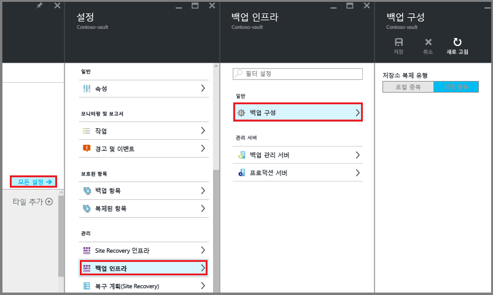

# <a name="install-azure-backup-server-on-azure-stack"></a>Azure Stack에 Azure Backup Server 설치

이 문서에서는 Azure Stack에 Azure Backup Server를 설치하는 방법을 설명합니다. Azure Backup Server를 사용하면 Azure Stack에서 실행 중인 가상 머신 같은 IaaS(Infrastructure as a Service) 워크로드를 보호할 수 있습니다. Azure Backup Server를 사용하여 워크로드를 보호하면 단일 콘솔에서 모든 워크로드 보호를 관리할 수 있다는 장점이 있습니다.

> [!NOTE]
> 보안 기능에 대한 자세한 내용은 [Azure Backup 보안 기능 설명서](backup-azure-security-feature.md)를 참조하세요.
>

## <a name="azure-backup-server-protection-matrix"></a>Azure Backup Server 보호 매트릭스
Azure Backup Server는 다음과 같은 Azure Stack 가상 머신 워크로드를 보호합니다.

| 보호된 데이터 원본 | 보호 및 복구 |
| --------------------- | ----------------------- |
| Windows Server 상하반기 채널 - Datacenter/Enterprise/Standard | 볼륨, 파일, 폴더 |
| Windows Server 2016 - Datacenter/Enterprise/Standard | 볼륨, 파일, 폴더 |
| Windows Server 2012 R2 - Datacenter/Enterprise/Standard | 볼륨, 파일, 폴더 |
| Windows Server 2012 - Datacenter/Enterprise/Standard | 볼륨, 파일, 폴더 |
| Windows Server 2008 R2 - Datacenter/Enterprise/Standard | 볼륨, 파일, 폴더 |
| SQL Server 2016 | 데이터베이스 |
| SQL Server 2014 | 데이터베이스 |
| SQL Server 2012 SP1 | 데이터베이스 |
| SharePoint 2016 | 팜, 데이터베이스, 프런트 엔드, 웹 서버 |
| SharePoint 2013 | 팜, 데이터베이스, 프런트 엔드, 웹 서버 |
| SharePoint 2010 | 팜, 데이터베이스, 프런트 엔드, 웹 서버 |

## <a name="prerequisites-for-the-azure-backup-server-environment"></a>Azure Backup Server 환경의 필수 구성 요소

Azure Stack 환경에서 Azure Backup Server를 설치하는 경우 이 섹션의 권장 사항을 고려해야 합니다. 환경에 필수 구성 요소가 있는지 Azure Backup Server 설치 관리자가 검사하지만, 설치하기 전에 미리 준비해 놓으면 시간을 절약할 수 있습니다.

### <a name="determining-size-of-virtual-machine"></a>가상 머신의 크기 결정
Azure Stack 가상 머신에서 Azure Backup Server를 실행하려면 A2 이상의 크기를 사용합니다. 가상 머신 크기를 선택하는 데 도움이 필요한 경우 [Azure Stack VM 크기 계산기](https://www.microsoft.com/download/details.aspx?id=56832)를 다운로드합니다.

### <a name="virtual-networks-on-azure-stack-virtual-machines"></a>Azure Stack 가상 머신의 가상 네트워크
Azure Stack 워크로드에서 사용되는 모든 가상 머신은 동일한 Azure 가상 네트워크 및 Azure 구독에 속해야 합니다.

### <a name="azure-backup-server-vm-performance"></a>Azure Backup Server VM 성능
다른 가상 머신과 공유하는 경우 저장소 계정 크기 및 IOPS 제한이 Azure Backup Server VM 성능에 영향을 줍니다. 이러한 이유로 Azure Backup Server 가상 머신에 대한 별도 저장소 계정을 사용해야 합니다. Azure Backup Server에서 실행되는 Azure Backup 에이전트에는 다음을 위한 임시 저장소가 필요합니다.
- 고유한 용도(캐시 위치)
- 클라우드(로컬 준비 영역)에서 복원된 데이터

### <a name="configuring-azure-backup-temporary-disk-storage"></a>Azure Backup 임시 디스크 저장소 구성
각 Azure Stack 가상 머신에는 `D:\` 볼륨으로 사용자에게 제공되는 임시 디스크 저장소가 제공됩니다. Azure Backup에 필요한 로컬 준비 영역은 `D:\`에 위치하도록 구성할 수 있습니다. 캐시 위치는 `C:\`에 배치할 수 있습니다. 이러한 방식으로 Azure Backup Server 가상 머신에 연결된 데이터 디스크에서 저장소가 떨어지지 않아도 됩니다.

### <a name="storing-backup-data-on-local-disk-and-in-azure"></a>로컬 디스크 및 Azure에 백업 데이터 저장
Azure Backup Server는 작업 복구를 위해 가상 머신에 연결된 Azure 디스크에 백업 데이터를 저장합니다. 디스크 및 저장소 공간이 가상 머신에 연결되면 Azure Backup Server에서는 저장소를 관리합니다. 백업 데이터 저장소의 크기는 [Azure Stack 가상 머신](/azure-stack/user/azure-stack-storage-overview) 각각에 연결된 디스크의 크기와 수에 따라 달라집니다. 각 Azure Stack VM 크기에는 가상 머신에 연결할 수 있는 디스크의 최대 수가 포함됩니다. 예를 들어 A2는 4개의 디스크입니다. A3은 8개의 디스크입니다. A4는 16개의 디스크입니다. 또한 디스크 크기와 수는 총 백업 저장소 풀을 결정합니다.

> [!IMPORTANT]
> 5일 넘게 Azure Backup Server에 연결된 디스크에서 작업 복구(백업) 데이터를 유지**하지** 않아야 합니다.
>

Azure에서 백업 데이터를 저장하면 Azure Stack에서 백업 인프라를 줄일 수 있습니다. 데이터가 5일이 넘으면 Azure에 저장되어야 합니다.

Azure에서 백업 데이터를 저장하려면 Recovery Services 자격 증명 모음을 만들거나 사용합니다. Azure Backup Server 워크로드를 백업하도록 준비할 때 [Recovery Services 자격 증명 모음을 구성](backup-azure-microsoft-azure-backup.md#create-a-recovery-services-vault)합니다. 구성되면 백업 작업이 실행될 때마다 자격 증명 모음에서 복구 지점이 생성됩니다. 각 Recovery Services 자격 증명 모음은 최대 9999개의 복구 지점을 유지합니다. 만든 복구 지점의 수 및 유지되는 기간에 따라 여러 해 동안 백업 데이터를 유지할 수 있습니다. 예를 들어 매월 복구 지점을 만들고 5년 동안 유지할 수 있습니다.
 
### <a name="scaling-deployment"></a>배포 크기 조정
배포의 크기를 조정하려는 경우 다음 옵션을 사용할 수 있습니다.
  - 강화 - A 시리즈부터 D 시리즈까지 Azure Backup Server 가상 머신의 크기를 늘리고, [Azure Stack 가상 머신 지침당](/azure-stack/user/azure-stack-manage-vm-disks) 로컬 저장소를 늘립니다.
  - 데이터 오프로드 - Azure에 이전 데이터를 전송하고, Azure Backup Server에 연결된 저장소에 최신 데이터만 유지합니다.
  - 규모 확장 - Azure Backup Server를 더 추가하여 워크로드를 보호합니다.

### <a name="net-framework"></a>.NET Framework

.NET Framework 3.5 SP1 이상이 가상 머신에 설치되어야 합니다.

### <a name="joining-a-domain"></a>장치 조인

Azure Backup Server 가상 머신을 도메인에 조인해야 합니다. 관리자 권한이 있는 도메인 사용자는 가상 머신에 Azure Backup Server를 설치해야 합니다.

## <a name="using-an-iaas-vm-in-azure-stack"></a>Azure Stack에 IaaS VM 사용

Azure Backup Server에 사용할 서버를 선택할 때 Windows Server 2012 R2 Datacenter 또는 Windows Server 2016 Datacenter 갤러리 이미지로 시작하는 것이 좋습니다. [Azure Portal에서 첫 번째 Windows 가상 머신 만들기](../virtual-machines/virtual-machines-windows-hero-tutorial.md?toc=%2fazure%2fvirtual-machines%2fwindows%2ftoc.json) 문서는 권장 가상 머신을 시작하는 방법에 대한 자습서를 제공합니다. 서버 VM(가상 머신)에 대한 권장 최소 요구 사항은 2코어 및 3.5GB RAM의 A2 Standard입니다.

Azure Backup 서버를 사용하여 워크로드를 보호하는 데는 미묘한 많은 차이가 있습니다. [Azure 가상 머신으로 DPM 설치](https://technet.microsoft.com/library/jj852163.aspx)문서는 이러한 미묘한 차이를 설명하는 데 도움이 됩니다. 컴퓨터를 배포하기 전에 이 문서를 완전히 읽어보세요.

> [!NOTE]
> Azure Backup Server는 단일 용도의 전용 가상 머신에서 실행되도록 설계되었습니다. Azure Backup Server를 다음 항목에 설치할 수 없습니다.
> - 도메인 컨트롤러로 실행하는 컴퓨터
> - 애플리케이션 서버 역할이 설치된 컴퓨터
> - Exchange Server를 실행하는 컴퓨터
> - 클러스터의 한 노드인 컴퓨터

항상 Azure Backup Server를 도메인에 가입시킵니다. Azure Backup Server를 다른 도메인으로 이동해야 하는 경우 먼저 Azure Backup Server를 설치한 다음, 새 도메인에 조인합니다. Azure Backup Server를 배포한 후에는 새 도메인으로 이동할 수 없습니다.

[!INCLUDE [backup-create-rs-vault.md](../../includes/backup-create-rs-vault.md)]

### <a name="set-storage-replication"></a>저장소 복제 설정

Recovery Services 자격 증명 모음 저장소 복제를 사용하면 지역 중복 저장소와 로컬 중복 저장소 중에서 선택할 수 있습니다. 기본적으로 Recovery Services 자격 증명 모음은 지역 중복 저장소를 사용합니다. 이 자격 증명 모음이 기본 자격 증명 모음인 경우 저장소 옵션을 지역 중복 저장소 상태로 둡니다. 오래 지속되지 않는 저렴한 옵션을 원하는 경우에는 로컬 중복 저장소를 선택합니다. [지역 중복](../storage/common/storage-redundancy-grs.md) 및 [로컬 중복](../storage/common/storage-redundancy-lrs.md) 스토리지 옵션에 대한 자세한 내용은 [Azure Storage 복제 개요](../storage/common/storage-redundancy.md)를 참조하세요.

저장소 복제 설정을 편집하려면

1. 자격 증명 모음 대시보드 및 설정 메뉴를 열 자격 증명 모음을 선택합니다. **설정** 메뉴가 열리지 않을 경우 자격 증명 모음 대시보드에서 **모든 설정**을 클릭합니다.
2. **설정** 메뉴에서 **Backup 인프라** > **Backup 구성**을 클릭하여 **Backup 구성** 메뉴를 엽니다. **백업 구성** 메뉴에서 자격 증명 모음에 대한 저장소 복제 옵션을 선택합니다.

    

## <a name="download-azure-backup-server-installer"></a>Azure Backup Server 설치 관리자 다운로드

Azure Backup Server 설치 관리자를 다운로드하는 두 가지 방법이 있습니다. [Microsoft 다운로드 센터](https://www.microsoft.com/en-us/download/details.aspx?id=55269)에서 Azure Backup Server 설치 관리자를 다운로드할 수 있습니다. Recovery Services 자격 증명 모음을 구성할 때 Azure Backup Server 설치 관리자를 다운로드할 수도 있습니다. 다음은 Recovery Services 자격 증명 모음을 구성하는 동안 Azure Portal에서 설치 관리자를 다운로드하는 단계입니다.

1. Azure Stack 가상 머신에서, [Azure Portal에서 Azure 구독에 로그인](https://portal.azure.com/)합니다.
2. 왼쪽 메뉴에서 **모든 서비스**를 선택합니다.

    ![주 메뉴에서 [모든 서비스] 옵션을 선택합니다.](./media/backup-mabs-install-azure-stack/click-all-services.png)

3. **모든 서비스** 대화 상자에서 *Recovery Services*를 입력합니다. 입력하기 시작하면 입력은 리소스 목록을 필터링합니다. **Recovery Services 자격 증명 모음**이 보이면 선택합니다.

    

    구독에 Recovery Services 자격 증명 모음 목록이 표시됩니다.

4. Recovery Services 자격 증명 모음 목록에서 해당 자격 증명 모음을 선택하여 대시보드를 엽니다.

    ![[모든 서비스] 대화 상자에서 Recovery Services 입력](./media/backup-mabs-install-azure-stack/rs-vault-dashboard.png)

5. 자격 증명 모음의 [시작] 메뉴에서 **백업**을 클릭하여 [시작] 마법사를 엽니다.

    

    백업 메뉴가 열립니다.

    

6. 백업 메뉴의 **워크로드가 실행되는 위치** 메뉴에서 **온-프레미스**를 선택합니다. **무엇을 백업하시겠습니까?** 드롭다운 메뉴에서 Azure Backup Server를 사용하여 보호할 워크로드를 선택합니다. 어떤 워크로드를 선택해야 하는지 확실하지 않은 경우 **Hyper-V 가상 머신**을 선택하고 **인프라 준비**를 클릭합니다.

    

    **인프라 준비** 메뉴가 열립니다.

7. **인프라 준비** 메뉴에서 **다운로드**를 클릭하여 Azure Backup Server 설치 파일을 다운로드하는 웹 페이지를 엽니다.

    

    Azure Backup Server의 다운로드 가능 파일을 호스팅하는 Microsoft 웹 페이지가 열립니다.

8. Microsoft Azure Backup Server 다운로드 페이지에서 언어를 선택하고 **다운로드**를 클릭합니다.

    

9. Azure Backup Server 설치 관리자는 8개 파일(설치 관리자 하나와 .bin 파일 7개)로 구성됩니다. **파일 이름**을 선택하여 필요한 파일을 모두 선택하고 **다음**을 클릭합니다. 모든 파일을 같은 폴더에 다운로드합니다.

    

    모든 설치 파일의 다운로드 크기는 3GB보다 큽니다. 10Mbps 다운로드 링크에서 모든 설치 파일을 다운로드하는 데 최대 60분이 걸릴 수 있습니다. 지정한 다운로드 위치에 파일이 다운로드됩니다.

## <a name="extract-azure-backup-server-install-files"></a>Azure Backup Server 설치 파일 추출

Azure Stack 가상 머신에 모든 파일을 다운로드한 후에는 다운로드 위치로 이동합니다. Azure Backup Server 설치의 첫 번째 단계는 파일을 추출하는 것입니다.


1. 설치를 시작하려면 다운로드한 파일 목록에서 **MicrosoftAzureBackupserverInstaller.exe**를 클릭합니다.

    > [!WARNING]
    > 설치 파일을 추출하려면 4GB 이상의 사용 가능한 공간이 필요합니다.
    >

2. Azure Backup Server 마법사에서 **다음**을 클릭하여 계속 진행합니다.

    

3. Azure Backup Server 파일의 경로를 선택하고 **다음**을 클릭합니다.

   

4. 추출 위치를 확인하고 **추출**을 클릭합니다.

   

5. 마법사가 파일을 추출하고 설치 프로세스를 준비합니다.

   

6. 추출 프로세스가 완료되면 **마침**을 클릭합니다. 기본적으로 **Execute setup.exe**가 선택됩니다. **마침**을 클릭하면 Setup.exe가 지정된 위치에 Microsoft Azure Backup Server를 설치합니다.

   

## <a name="install-the-software-package"></a>소프트웨어 패키지 설치

이전 단계에서 **마침**을 클릭하여 추출 단계를 종료하고, Azure Backup Server 설치 마법사를 시작했습니다.


Azure Backup Server는 Data Protection Manager과 코드를 공유합니다. Azure Backup Server 설치 관리자에서 Data Protection Manager 및 DPM의 모든 참조를 볼 수 있습니다. Azure Backup Server 및 Data Protection Manager는 별도의 제품이지만 밀접하게 관련되어 있습니다.

1. 설치 마법사를 시작하려면 **Microsoft Azure Backup Server**를 클릭합니다.

   

2. **시작** 화면에서 **다음**을 클릭합니다.

    

3. **필수 구성 요소 확인** 화면에서 **확인**을 클릭하여 Azure Back Server에 대한 하드웨어 및 소프트웨어 필수 구성 요소가 충족되었는지 확인합니다.

    

    환경에 필요한 구성 요소가 모두 준비되면 컴퓨터가 요구 사항을 만족한다는 것을 나타내는 메시지가 표시됩니다. **다음**을 클릭합니다.  

    

    환경이 필수 조건을 충족하지 않으면 문제가 발생합니다. 또한 충족되지 않은 필수 구성 요소가 DpmSetup.log에 나열됩니다. 필수 구성 요소 오류를 해결한 후 **다시 확인**을 실행해야 합니다. 모든 필수 조건이 충족될 때까지 설치를 진행할 수 없습니다.

    

4. Microsoft Azure Backup Server에는 SQL Server가 필요합니다. Azure Backup Server 설치 패키지는 적절한 SQL Server 이진 파일이 번들로 함께 제공됩니다. 원한다면 사용자 고유의 SQL 설치를 사용해도 됩니다. 그러나 설치 관리자가 새 SQL Server 인스턴스를 추가하게 하는 것이 좋습니다. 사용자가 선택한 방법이 환경에서 정상적으로 작동하도록 **확인 후 설치**를 클릭합니다.

   > [!NOTE]
   > Azure Backup 서버는 원격 SQL Server 인스턴스에서 작동하지 않습니다. Azure Backup Server에서 사용하는 인스턴스는 로컬이어야 합니다.
   >

    

    확인 결과, Azure Backup Server를 설치하는 데 필요한 필수 구성 요소가 모두 가상 머신에 있으면 **다음**을 클릭합니다.

    

    컴퓨터를 다시 시작하라는 권장 사항과 함께 오류가 발생하면 컴퓨터를 다시 시작합니다. 컴퓨터를 다시 시작한 후에는 설치 관리자를 다시 시작하고, **SQL 설정** 화면에서 **다시 확인**을 클릭합니다.

5. **설치 설정**에서, Microsoft Azure Backup 서버 파일을 설치할 위치를 입력하고 **다음**을 클릭합니다.

    

    스크래치 위치는 Azure에 백업하는 데 필요합니다. 스크래치 위치의 크기는 Azure에 백업하기로 계획된 데이터의 5% 이상이어야 합니다. 디스크 보호를 위해 별도 디스크가 설치를 완료하면 구성되어야 합니다. 저장소 풀에 관련된 자세한 내용은 [저장소 풀 및 디스크 저장소 구성](https://technet.microsoft.com/library/hh758075.aspx)을 참조하세요.

6. **보안 설정** 화면에서, 제한된 로컬 사용자 계정에 강력한 암호를 제공하고 **다음**을 클릭합니다.

    

7. **Microsoft 업데이트 옵트인** 화면에서, 업데이트 확인에 *Microsoft 업데이트*를 사용할 것인지 선택하고 **다음**을 클릭합니다.

   > [!NOTE]
   > Windows 업데이트에 Microsoft 업데이트를 리디렉션하는 것이 좋으며 이는 Windows 및 Microsoft Azure Backup 서버와 같은 다른 제품에 대한 보안 및 중요 업데이트를 제공합니다.
   >

    

8. *설정 요약* 을 검토하고 **설치**를 클릭합니다.

    

    Azure Backup Server가 설치를 완료하면 설치 관리자는 그 즉시 Microsoft Azure Recovery Services 에이전트 설치 관리자를 시작합니다.

9. Microsoft Azure Recovery Services 에이전트 설치 관리자가 열리고 인터넷 연결을 확인합니다. 인터넷이 연결되어 있는 경우 설치가 진행됩니다. 연결되지 않은 경우 인터넷에 연결하는 데 필요한 프록시 정보를 제공합니다. 프록시 설정을 지정한 후에는 **다음**을 클릭합니다.

    

10. Microsoft Azure Recovery Services 에이전트를 설치하려면 **설치**를 클릭합니다.

    

    Azure Backup 에이전트라고도 하는 Microsoft Azure Recovery Services 에이전트는 Recovery Services 자격 증명 모음에 Azure Backup Server를 구성합니다. 구성이 완료되면 Azure Backup Server는 항상 같은 Recovery Services 자격 증명 모음에 데이터를 백업합니다.

11. Microsoft Azure Recovery Services 에이전트가 설치를 마치면 **다음**을 클릭하여 그 다음 단계인 Recovery Services 자격 증명 모음에 Azure Backup Server 등록을 시작합니다.

    

    설치 관리자가 **서버 등록 마법사**를 실행합니다.

12. Azure 구독 및 Recovery Services 자격 증명 모음으로 전환 합니다. **인프라 준비** 메뉴에서 **다운로드**를 클릭하여 자격 증명 모음 자격 증명을 다운로드합니다. 2단계의 **다운로드** 단추가 활성화되지 않은 경우 **이미 다운로드했거나 최신 Azure Backup Server 설치 사용**을 선택하여 단추를 활성화합니다. 다운로드 파일이 저장되는 위치에 자격 증명 모음 자격 증명이 다운로드됩니다. 그 다음 단계에서 이 위치가 필요하므로 잘 기억해 두어야 합니다.

    

13. **자격 증명 모음 ID** 메뉴에서 **찾아보기**를 클릭하여 Recovery Services 자격 증명 모음 자격 증명을 찾습니다.

    

    **자격 증명 모음 자격 증명 선택** 대화 상자에서 다운로드 위치로 이동하고, 자격 증명 모음 자격 증명을 선택하고, **열기**를 클릭합니다.

    자격 증명 경로가 자격 증명 모음 ID 메뉴에 표시됩니다. **다음**을 클릭하여 암호화 설정으로 이동합니다.

14. **암호화 설정** 대화 상자에서 백업 암호화의 암호를 입력하고, 암호를 저장할 위치를 입력하고, **다음**을 클릭합니다.

    

    사용자 고유의 암호를 입력해도 되고 암호 생성기를 사용하여 만들어도 됩니다. 암호는 사용자의 것이며, Microsoft는 이 암호를 저장하거나 관리하지 않습니다. 재해에 대비할 수 있도록, 액세스 가능한 위치에 암호를 저장합니다.

    **다음**을 클릭하면 Recovery Services 자격 증명 모음에 Azure Backup Server가 등록됩니다. 설치 관리자가 SQL Server 및 Azure Backup Server 설치를 계속 진행합니다.

    

15. 설치 관리자가 완료되면 모든 소프트웨어가 성공적으로 설치되었음을 알리는 상태가 표시됩니다.

    

    설치가 완료되면 서버 데스크톱에 Azure Backup Server 콘솔 및 Azure Backup Server PowerShell 아이콘이 생성됩니다.

## <a name="add-backup-storage"></a>백업 저장소 추가

첫 번째 백업 복사본은 Azure Backup 서버 컴퓨터에 연결된 저장소에 보관됩니다. 디스크 추가에 대한 자세한 내용은 [최신 백업 저장소 추가](https://docs.microsoft.com/system-center/dpm/add-storage?view=sc-dpm-1801)를 참조합니다.

> [!NOTE]
> 데이터를 Azure에 전송하려는 경우에도 백업 저장소를 추가해야 합니다. Azure Backup Server 아키텍처에서, Recovery Services 자격 증명 모음에는 데이터의 *두 번째* 복사본이 보관되고 로컬 저장소에는 첫 번째(및 필수) 백업 복사본이 보관됩니다.
>
>

## <a name="network-connectivity"></a>네트워크 연결

Azure Backup 서버가 Azure Backup 서비스에 연결되어야 제품이 제대로 작동합니다. 컴퓨터가 Azure에 연결되어 있는지 여부를 확인하려면 Azure Backup 서버 PowerShell 콘솔에서 ```Get-DPMCloudConnection``` cmdlet을 사용합니다. cmdlet의 출력이 TRUE인 경우 연결되어 있고 그렇지 않으면 연결되지 않은 것입니다.

이와 동시에 Azure 구독은 정상 상태여야 합니다. 구독 상태를 확인하고 관리하려면 [구독 포털](https://ms.portal.azure.com/#blade/Microsoft_Azure_Billing/SubscriptionsBlade)에 로그인합니다.

Azure 연결 및 Azure 구독 상태를 알고 있다면 아래 표를 사용하여 제공된 백업/복원 기능에 미치는 영향을 알아볼 수 있습니다.

| 연결 상태 | Azure 구독 | Azure에 백업 | 디스크에 백업 | Azure에서 복구 | 디스크에서 복구 |
| --- | --- | --- | --- | --- | --- |
| 연결됨 |Active |허용됨 |허용됨 |허용됨 |허용됨 |
| 연결됨 |만료됨 |중지됨 |중지됨 |허용됨 |허용됨 |
| 연결됨 |프로비전 해제됨 |중지됨 |중지됨 |중지되고 Azure 복구 지점 삭제됨 |중지됨 |
| 손실된 연결 > 15일 |Active |중지됨 |중지됨 |허용됨 |허용됨 |
| 손실된 연결 > 15일 |만료됨 |중지됨 |중지됨 |허용됨 |허용됨 |
| 손실된 연결 > 15일 |프로비전 해제됨 |중지됨 |중지됨 |중지되고 Azure 복구 지점 삭제됨 |중지됨 |

### <a name="recovering-from-loss-of-connectivity"></a>연결 끊김 복구

방화벽 또는 프록시가 Azure에 대한 액세스를 차단하고 있는 경우 방화벽/프록시 프로필에서 다음 도메인 주소를 허용 목록에 추가해야 합니다.

- `http://www.msftncsi.com/ncsi.txt`
- \*.Microsoft.com
- \*.WindowsAzure.com
- \*.microsoftonline.com
- \*.windows.net

Azure에 대한 연결이 Azure Backup Server로 복원되면 Azure 구독 상태에 따라 수행 가능한 작업이 결정됩니다. 서버가 **연결되면** [네트워크 연결](backup-mabs-install-azure-stack.md#network-connectivity)의 테이블을 사용하여 사용 가능한 작업을 볼 수 있습니다.

### <a name="handling-subscription-states"></a>구독 상태 처리

Azure 구독을 *만료됨* 또는 *프로비전 해제됨* 상태에서 *활성* 상태로 변경할 수 있습니다. 구독 상태가 *활성*이 아닌 경우:

- 구독이 *프로비전 해제됨* 상태이면 기능이 작동하지 않습니다. 구독을 *활성* 상태로 복원하면 백업/복원 기능이 다시 작동합니다. 로컬 디스크의 백업 데이터가 충분히 오랫동안 보관된 경우 백업 데이터를 검색할 수 있습니다. 그러나 구독이 *프로비전 해제됨* 상태로 전환되면 Azure의 백업 데이터가 영구적으로 손실됩니다.
- 구독이 *만료됨* 상태이면 기능이 작동하지 않습니다. 구독이 *만료됨* 상태이면 예약된 백업이 실행되지 않습니다.

## <a name="troubleshooting"></a>문제 해결

설치(또는 백업 또는 복원) 단계에서 오류와 함께 Microsoft Azure Backup 서버가 실패하는 경우 [오류 코드 문서](https://support.microsoft.com/kb/3041338)를 참조하세요.
[Azure Backup 관련 FAQ](backup-azure-backup-faq.md)

## <a name="next-steps"></a>다음 단계

[DPM을 위한 환경 준비](https://docs.microsoft.com/system-center/dpm/prepare-environment-for-dpm?view=sc-dpm-1801) 문서에는 지원되는 Azure Backup Server 구성에 대한 정보가 포함되어 있습니다.

다음 문서를 통해 Microsoft Azure Backup Server를 사용한 워크로드 보호에 대해 좀 더 자세히 알아볼 수 있습니다.

- [SQL Server 백업](https://docs.microsoft.com/azure/backup/backup-mabs-sql-azure-stack)
- [SharePoint 서버 백업](https://docs.microsoft.com/azure/backup/backup-mabs-sharepoint-azure-stack)
- [대체 서버 백업](backup-azure-alternate-dpm-server.md)
