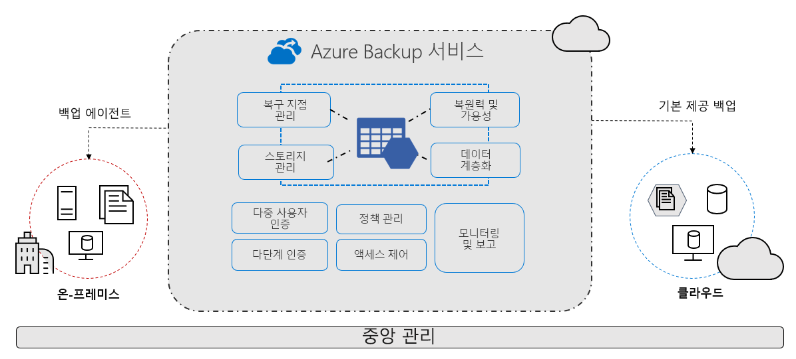

# Azure Backup 서비스란?

Azure Backup 서비스는 데이터를 백업하고 Microsoft Azure 클라우드에서 복구할 수 있는 간단하고, 안전하며, 비용 효율적인 솔루션을 제공합니다.

> [!VIDEO https://www.youtube.com/embed/elODShatt-c]

## 어떤 것을 백업할 수 있나요?

- **온-프레미스** - [MARS(Microsoft Azure Recovery Services) 에이전트](backup-support-matrix-mars-agent.md)를 사용하여 파일, 폴더 및 시스템 상태를 백업합니다. 또는 DPM 또는 Azure Backup Server(MABS) 에이전트를 사용하여 온-프레미스 VM([Hyper-V](back-up-hyper-v-virtual-machines-mabs.md) 및 [VMWare](backup-azure-backup-server-vmware.md))과 기타 [온-프레미스 워크로드](backup-mabs-protection-matrix.md)를 보호합니다.
- **Azure VM** - [전체 Windows/Linux VM](backup-azure-vms-introduction.md)을 백업하거나(백업 확장 사용), [MARS 에이전트](backup-azure-manage-mars.md)를 사용하여 파일, 폴더 및 시스템 상태를 백업합니다.
- **Azure Files 공유** - [Azure 파일 공유를 스토리지 계정에 백업 및 복원합니다](backup-azure-files.md).
- **Azure VM의 SQL Server** -  [Azure VM에서 실행되는 SQL Server 데이터베이스를 백업합니다](backup-azure-sql-database.md).
- **Azure VM의 SAP HANA 데이터베이스** - [Azure VM에서 실행되는 SAP HANA 데이터베이스를 백업합니다](backup-azure-sap-hana-database.md).

## Azure Backup을 사용하는 이유

Azure Backup에서 제공하는 주요 이점은 다음과 같습니다.

- **온-프레미스 백업 오프로드**: Azure Backup은 온-프레미스 리소스를 클라우드에 백업할 수 있는 간단한 솔루션을 제공합니다. 복잡한 온-프레미스 백업 솔루션을 배포할 필요 없이 장단기 백업을 수행합니다.
- **Azure IaaS VM 백업**: Azure Backup은 실수로 데이터가 삭제되지 않도록 방지하기 위해 독립적이고 격리된 백업을 제공합니다. 백업은 복구 지점에 대한 기본 제공 관리를 사용하여 Recovery Services 자격 증명 모음에 저장됩니다. 구성 및 확장성이 간단하고, 백업이 최적화되어 있으며, 필요에 따라 쉽게 복원할 수 있습니다.
- **손쉬운 크기 조정** - Azure Backup은 유지 관리 또는 모니터링 오버헤드 없이 기본 성능과 Azure 클라우드의 무제한 크기 조정을 사용하여 고가용성을 제공합니다.
- **무제한 데이터 전송**: Azure Backup은 전송하는 인바운드 또는 아웃바운드 데이터의 양을 제한하지 않거나, 전송되는 데이터에 대한 요금을 부과하지 않습니다.
  - 아웃바운드 데이터는 복원 작업 중에 Recovery Services 자격 증명 모음에서 전송된 데이터입니다.
  - Azure Import/Export 서비스를 사용하여 대량의 데이터를 가져오는 오프라인 초기 백업을 수행하는 경우 인바운드 데이터와 관련된 비용이 있습니다.  [자세히 알아보기](backup-azure-backup-import-export.md).
- **안전한 데이터 유지**: Azure Backup은 [전송 중](backup-azure-security-feature.md) 및 [저장](backup-azure-security-feature-cloud.md) 데이터를 보호하기 위한 솔루션을 제공합니다.
- **중앙 집중식 모니터링 및 관리**: Azure Backup은 [기본 제공 모니터링 및 경고 기능](backup-azure-monitoring-built-in-monitor.md)을 Recovery Services 자격 증명 모음에 제공합니다. 이러한 기능은 추가 관리 인프라 없이 사용할 수 있습니다. 또한 [Azure Monitor를 사용](backup-azure-monitoring-use-azuremonitor.md)하여 모니터링 및 보고의 규모를 늘릴 수도 있습니다.
- **애플리케이션 일치 백업 가져오기**: 애플리케이션 일치 백업은 백업 복사본을 복원하는 데 필요한 모든 데이터가 복구 지점에 있음을 의미합니다. Azure Backup은 애플리케이션 일치 백업을 제공하므로 데이터를 복원하기 위한 추가 수정 프로그램이 필요하지 않습니다. 애플리케이션 일치 데이터를 복원하면 실행 상태로 빠르게 돌아갈 수 있으므로 복원 시간을 줄여줍니다.
- **단기 및 장기 데이터 보존**: 단기 및 장기 데이터를 보존하기 위해 [Recovery Services 자격 증명 모음](backup-azure-recovery-services-vault-overview.md)을 사용할 수 있습니다.
- **자동 스토리지 관리** - 일부는 온-프레미스, 일부는 클라우드인 하이브리드 환경에는 종종 다른 유형의 스토리지가 필요합니다. Azure Backup을 사용하면 온-프레미스 스토리지 디바이스를 사용하는 데 드는 비용이 없습니다. Azure Backup은 백업 스토리지를 자동으로 할당하고 관리하며 사용한 만큼 지불(pay-as-you-use) 모델을 사용합니다. 따라서 사용한 스토리지에 대해서만 비용을 지불합니다. 가격 책정에 대해 [자세히 알아보세요](https://azure.microsoft.com/pricing/details/backup).
- **여러 스토리지 옵션** - Azure Backup은 스토리지/데이터의 고가용성을 유지하는 두 가지 종류의 복제를 제공합니다.
  - [LRS(로컬 중복 스토리지)](../storage/common/storage-redundancy-lrs.md)는 데이터 센터의 스토리지 배율 단위로 데이터를 세 번 복제합니다(세 개의 데이터 복사본 생성). 모든 데이터 복사본은 동일한 지역 내에 있습니다. LRS는 로컬 하드웨어 오류로부터 데이터를 보호하기 위한 저비용 옵션입니다.
  - [GRS(지역 중복 스토리지)](../storage/common/storage-redundancy-grs.md)는 기본값이며 권장하는 복제 옵션입니다. GRS는 데이터 원본의 기본 위치에서 수백 마일 떨어진 보조 지역으로 데이터를 복제합니다. GRS는 LRS보다 더 많은 비용이 들지만, 지역 가동 중단이 발생하는 경우에도 높은 수준의 데이터 내구성을 제공합니다.

## 다음 단계

- 다양한 백업 시나리오에 대한 아키텍처와 구성 요소를 [검토](backup-architecture.md)합니다.
- 백업 및 [Azure VM 백업](backup-support-matrix-iaas.md)에 대한 지원 요구 사항 및 제한 사항을 [확인](backup-support-matrix.md)합니다.
