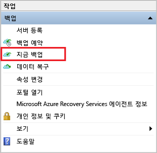

<properties
   pageTitle="Windows에서 Azure로 파일 및 폴더 백업하는 방법 알아보기 | Microsoft Azure"
   description="자격 증명 모음을 만들고, 백업 에이전트를 설치하고, 파일 및 폴더를 Azure에 백업하여 Windows Server 데이터를 백업하는 방법을 알아봅니다."
   services="backup"
   documentationCenter=""
   authors="Jim-Parker"
   manager="jwhit"
   editor=""
   keywords="백업 방법, 백업하는 방법"/>

<tags
   ms.service="backup"
   ms.workload="storage-backup-recovery"
   ms.tgt_pltfrm="na"
   ms.devlang="na"
   ms.topic="hero-article"
   ms.date="04/14/2016"
   ms.author="jimpark;"/>

# 소개: Windows Server 또는 클라이언트에서 Azure로 파일 및 폴더 백업

이 문서는 Azure 백업을 사용하여 Azure에 Windows 서버 (또는 Windows 클라이언트) 파일 및 폴더를 백업하는 방법을 설명합니다. 기본 사항을 안내하기 위해 마련된 자습서입니다. Azure 백업을 시작하려는 분들은 여기서 시작하시면 됩니다.

Azure 백업에 대해 자세히 알아보려면 이 [개요](backup-introduction-to-azure-backup.md)를 읽어보세요.

Azure에 파일 및 폴더를 백업하려면 다음과 같은 작업이 필요합니다.

 아직 Azure 구독이 없는 경우 새로 하나 만듭니다.   백업 자격 증명 모음을 만들고 필요한 항목을 다운로드합니다.   백업 에이전트를 설치 및 등록합니다.   파일 및 폴더를 백업합니다.

## 1단계: Azure 구독하기

Azure 구독이 없는 경우 모든 Azure 서비스에 액세스할 수 있게 해주는 [무료 계정](https://azure.microsoft.com/free/)을 만듭니다.

## 2단계: 백업 자격 증명 모음을 만들고 필요한 항목을 다운로드합니다.

파일과 폴더를 백업하려면 데이터를 저장하려는 지역에 백업 자격 증명 모음을 만들어야 합니다. 또한 저장소를 복제하는 방법을 결정하고 자격 증명 및 백업 에이전트를 다운로드합니다.

### 백업 자격 증명 모음을 만들려면

1. 아직 로그인하지 않은 경우 Azure 구독을 사용하여 [Azure 포털](https://portal.azure.com/)에 로그인합니다.

2. **새로 만들기 > 하이브리드 통합 > 백업**을 클릭합니다.

    

3. **이름**에 백업 저장소를 식별할 이름을 입력합니다.

4. **지역**의 경우 파일을 빠르게 전송할 수 있도록 현재 위치와 가장 가까운 지역을 선택합니다.

5. **자격 증명 모음 만들기**를 클릭합니다.

    

    백업 자격 증명 모음이 준비되면 복구 서비스의 리소스에 **활성**으로 나열됩니다.

    

자격 증명 모음을 만든 후에는 저장소를 복제하는 방법을 선택합니다.

>[AZURE.NOTE] 자격 증명 모음을 만든 직후 자격 증명 모음에 컴퓨터를 등록하기 전에 저장소를 복제하는 방법을 선택해야 합니다. 항목이 자격 증명 모음에 등록되고 나면 저장소 복제가 잠기고 수정할 수 없습니다.

### 저장소를 복제하는 방법을 선택하려면

1. 만든 자격 증명 모음을 클릭합니다.
2. 빠른 시작 페이지에서 **구성**을 선택합니다.

    

3. 적절한 저장소 옵션을 선택합니다.

    기본 백업으로 Azure를 사용하는 경우 [지역 중복 저장소](../storage/storage-redundancy.md#geo-redundant-storage)를 선택합니다. 3차 백업으로 Azure를 사용하는 경우 [로컬 중복 저장소](../storage/storage-redundancy.md#locally-redundant-storage)를 선택합니다.

    

4. **지역 중복**이 기본값이기 때문에 **로컬 중복**을 선택한 경우 **저장**을 클릭합니다.

자격 증명 모음 자격 증명을 사용하여 백업 자격 증명 모음에 컴퓨터를 인증합니다. 이러한 자격 증명을 다운로드하는 방법은 다음과 같습니다.

### 자격 증명 모음 자격 증명을 다운로드하려면
자격 증명 모음 자격 증명 파일은 등록 프로세스 중에만 사용되며 48시간 후에 만료됩니다.

1. 자격 증명 모음에 대한 **빠른 시작** 페이지로 돌아가려면  아이콘을 클릭합니다.

2. **자격 증명 모음 자격 증명 다운로드 > 저장**을 클릭합니다.

다음으로 백업 에이전트를 다운로드합니다.

### 백업 에이전트를 다운로드하려면

**Windows Server 또는 System Center Data Protection Manager 또는 Windows 클라이언트용 에이전트 > 저장**을 클릭합니다.

자격 증명 모음을 만들고 모든 것을 다운로드했으니, 이제 백업 에이전트를 설치 및 등록합니다.

## 3단계: 백업 에이전트를 설치 및 등록합니다.

1. 저장된 위치에서 **MARSagentinstaller.exe**를 두 번 클릭합니다.
2. Microsoft Azure 복구 서비스 에이전트 설치 마법사를 완료합니다. 마법사를 완료하려면 다음 작업을 수행해야 합니다.
    - 설치 및 캐시 폴더의 위치를 선택합니다.
    - 프록시 서버를 사용하여 인터넷에 연결하는 경우에는 프록시 서버 정보를 입력합니다.
    - 인증된 프록시를 사용하는 경우에는 사용자 이름 및 암호 세부 정보를 입력합니다.
    - 암호화 암호를 안전한 위치에 저장합니다.

    >[AZURE.NOTE] 암호를 분실하거나 잊어버린 경우 Microsoft에서 백업 데이터의 복구를 도와드릴 수 없습니다. 파일을 안전한 위치에 저장하세요. 백업을 복원할 때 필요합니다.

이제 에이전트가 설치되었고 컴퓨터가 자격 증명 모음에 등록되었습니다. 백업을 구성하고 일정을 예약할 준비가 완료되었습니다.

## 4단계: 파일 및 폴더 백업
아직 백업 에이전트를 열지 않았으면 Microsoft Azure 백업에 대한 컴퓨터를 검색하여 찾을 수 있습니다.

1. **백업 에이전트**에서 **백업 예약**을 클릭합니다.

    

2. 백업 예약 마법사를 완료합니다. 마법사를 완료하는 동안 다음 작업을 수행합니다.

    - 백업할 파일 및 폴더를 선택합니다.
    - 백업 일정(매일 또는 매주)을 지정합니다.
    - 보존 정책을 결정합니다.
    - 초기 백업을 완료하려는 방법(네트워크를 통해 또는 오프라인으로)을 선택합니다.

    [초기 백업을 오프라인으로 완료](backup-azure-backup-import-export.md)하는 방법에 대해 자세히 알아보세요.   

3. 마법사가 완료되면 **백업 에이전트**로 돌아가서 **지금 백업**을 클릭하여 네트워크를 통해 초기 백업을 완료합니다.

    

4. **확인** 화면에서 **백업**을 클릭합니다. 백업 프로세스가 완료되기 전에 마법사를 닫으면 마법사가 백그라운드에서 계속 실행됩니다.

    초기 백업이 완료되면 콘솔의 **작업** 보기에 해당 작업이 완료된 것으로 표시됩니다.

    

축하합니다. 파일 및 폴더를 Azure 백업에 성공적으로 백업했습니다.

## 다음 단계
- [Windows 컴퓨터 백업](backup-configure-vault.md)에 대해 자세히 알아보세요.
- 파일과 폴더를 백업했으니, [자격 증명 모음 및 서버](backup-azure-manage-windows-server.md)를 관리할 수 있습니다.
- 백업을 복원해야 할 경우 이 문서를 참조하여 [Windows 컴퓨터에 파일을 복원](backup-azure-restore-windows-server.md)할 수 있습니다.

<!---HONumber=AcomDC_0420_2016-->