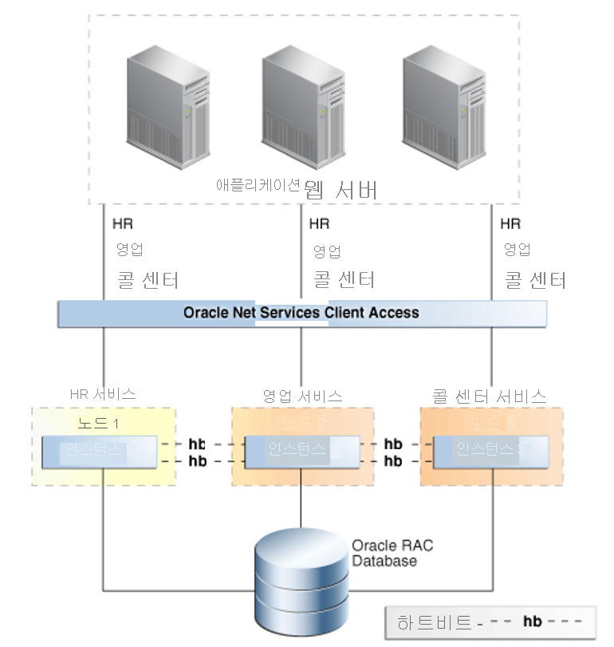

# Azure BareMetal의 Oracle용 고가용성 기능

이 문서에서는 Oracle의 주요 고가용성 및 재해 복구 기능을 살펴보겠습니다.

Oracle은 Oracle 데이터베이스를 실행하기 위한 탄력적인 플랫폼을 빌드하기 위한 많은 기능을 제공합니다. 단일 기능이 모든 유형의 장애를 포괄하지는 않지만, 계층화된 방식으로 기술을 결합하면 고가용성 시스템이 만들어집니다. 가용성을 유지하기 위해 모든 기능이 필요한 것은 아닙니다. 그러나 전략을 결합하면 발생하는 다양한 오류로부터 최선의 보호를 받을 수 있습니다. 

## Flashback Database

[Flashback Database](https://docs.oracle.com/en/database/oracle/oracle-database/21/rcmrf/FLASHBACK-DATABASE.html#GUID-584AC79A-40C5-45CA-8C63-DED3BE3A4511) 기능은 Oracle Database Enterprise Edition에 제공됩니다. Flashback Database는 데이터베이스를 특정 시점으로 되감습니다. 이 기능은 [RMAN(Recovery Manager)](https://docs.oracle.com/en/cloud/paas/db-backup-cloud/csdbb/performing-general-restore-and-recovery-operations.html) 특정 시점 복구와 다릅니다. 복원 후 정방향 감기가 아닌 현재 시간부터 되감습니다. 결과적으로 Flashback Database는 훨씬 더 빠르게 완료합니다.
 
[Oracle Data Guard](https://docs.oracle.com/en/database/oracle/oracle-database/19/sbydb/preface.html#GUID-B6209E95-9DA8-4D37-9BAD-3F000C7E3590)와 함께 이 기능을 사용할 수 있습니다. Flashback Database를 통해 데이터베이스 관리자는 전체 RMAN 복원 및 복구 없이 장애가 발생한 데이터베이스를 Data Guard 구성으로 인스턴스화할 수 있습니다. 이 기능을 사용하면 재해 복구 기능(및 Active Data Guard를 통해 오프로드된 보고 및 백업 이점 포함)을 훨씬 빠르게 복원할 수 있습니다.
 
대기 데이터베이스에서 시간 지연 다시 실행 대신 이 기능을 사용할 수 있습니다. 대기 데이터베이스는 문제가 발생하기 전의 시점으로 플래시백할 수 있습니다.
 
Oracle Database은 FRA(빠른 복구 영역)에 플래시백 로그를 보관합니다. 이러한 로그는 다시 실행 로그와 분리되며 FRA 내에 더 많은 공간을 필요로 합니다. 기본적으로, 24시간의 플래시백 로그가 보관되지만, 요구 사항에 따라 이 설정을 변경할 수 있습니다.

## Oracle Real Application Clusters

[RAC(Oracle Real Application Clusters)](https://docs.oracle.com/en/database/oracle/oracle-database/19/racad/introduction-to-oracle-rac.html#GUID-5A1B02A2-A327-42DD-A1AD-20610B2A9D92)를 사용하면 상호 연결된 여러 서버가 최종 사용자 및 애플리케이션에 하나의 데이터베이스 서비스로 나타날 수 있습니다. 이 기능은 많은 장애 지점을 제거하며 Oracle 데이터베이스를 위한 인정받는 고가용성 활성/활성 솔루션입니다.

Oracle의 [고가용성 개요 및 모범 사례](https://docs.oracle.com/en/database/oracle/oracle-database/19/haovw/ha-features.html)의 다음 그림에 표시된 것처럼 단일 RAC 데이터베이스가 애플리케이션 계층에 표시됩니다. 애플리케이션은 특정 데이터베이스 인스턴스로 트래픽을 보내는 SCAN 수신기에 연결합니다. RAC는 여러 인스턴스의 액세스를 제어하여 개별 컴퓨팅 노드에서 데이터 일관성을 유지합니다.

한 인스턴스가 실패하더라도 서비스는 나머지 모든 인스턴스에서 계속됩니다. 솔루션에 배포된 각 데이터베이스는 n+1의 RAC 구성으로 되어 있으며, 여기서 n은 서비스를 지원하는 데 필요한 최소 처리 능력입니다.

Oracle Database 서비스는 인스턴스가 투명하게 실패할 때 노드 간의 연결을 장애 조치(failover)하는 데 사용됩니다. 이러한 장애는 계획되거나 계획되지 않을 수 있습니다. 애플리케이션(빠른 애플리케이션 알림 이벤트)을 사용하여 인스턴스를 사용할 수 없게 되면 서비스는 생존 노드로 이동됩니다. 서비스가 기본 설정 또는 사용 가능한 서비스 구성에서 지정된 노드로 이동합니다.

Oracle Database 서비스의 또 다른 주요 기능은 해당 역할에 따라 서비스를 시작하는 것입니다. 이 기능은 Data Guard 장애 조치(failover)가 있을 때 사용됩니다. 데이터베이스 서비스를 Data Guard 역할에 연결하려면 Data Guard를 사용하여 배포된 모든 패턴이 필요합니다.

예를 들어, MY\_DB\_APP과 MY\_DB\_AS의 두 가지 서비스를 만들 수 있습니다. MY\_DB\_APP 서비스는 데이터베이스 인스턴스가 PRIMARY의 Data Guard 역할로 시작될 때만 시작됩니다. MY\_DB\_AS는 Data Guard 역할이 PHYSICAL\_STANDBY인 경우에만 시작됩니다. 이 구성을 사용하면 애플리케이션이 \_ APP 서비스를 가리키고, 보고할 수 있도록 하며, 활성 대기로 오프로드되도록 할 수 있고 \_ AS 서비스를 가리킬 수 있습니다.

## Oracle Data Guard

Data Guard를 사용하면 별도의 물리적 하드웨어에 동일한 데이터베이스 복사본을 유지할 수 있습니다. 해당 하드웨어는 주 데이터베이스에서 거리상 멀리 두는 것이 이상적입니다. Data Guard는 거리에 제한이 없지만 거리는 보호 모드와 관련이 있습니다. 거리가 증가하면 사이트 간 대기 시간이 증가하여 일부 옵션(예: 동기식 복제)이 더 이상 실행되지 않을 수 있습니다.

Data Guard는 스토리지 수준 복제보다 다음과 같은 이점을 제공합니다.

- 복제는 데이터베이스를 인식하므로 관련 트래픽만 복제됩니다.
- 특정 워크로드는 임시 테이블 스페이스에서 높은 입력/출력을 생성할 수 있으며, 이는 대기 상태에서 필요하지 않기 때문에 복제되지 않습니다.
- 복제된 블록에 대한 유효성 검사는 대기 데이터베이스에서 이루어지므로 주 데이터베이스의 물리적 손상은 대기 데이터베이스에 복제되지 않습니다.
- 논리적 블록 내 손상 및 쓰기 손실 손상을 방지합니다. 또한 스토리지 관리자가 실수로 대기 데이터베이스로 복제할 위험을 제거합니다.
다시 실행은 미리 정해진 기간 동안 지연될 수 있으므로, 사용자 오류가 대기 데이터베이스로 즉시 복제되지 않습니다.

## Azure NetApp Files 스냅샷

BareMetal에서 사용되는 NetApp Files 스토리지 솔루션을 사용하면 볼륨의 스냅샷을 만들 수 있습니다. 스냅샷을 사용하면 파일 시스템을 특정 시점으로 빠르게 되돌릴 수 있습니다. 스냅샷 기술은 데이터베이스 백업을 복원하는 데 필요한 시간의 일부인 RTO(복구 시간 목표) 시간을 허용합니다.

Oracle 데이터베이스의 스냅샷 기능은 Azure NetApp SnapCenter를 통해 사용할 수 있습니다. SnapCenter는 백업용 스냅샷을 지원하고, SnapVault는 오프라인 저장을 제공하며, Snap Clone은 셀프 서비스 복원 및 기타 작업을 지원합니다. 자세한 내용은 [Baremetal Infrastructure의 Oracle용 SnapCenter 통합](netapp-snapcenter-integration-oracle-baremetal.md)을 참조하세요.

## Recovery Manager

RMAN(Recovery Manager)은 물리적 데이터베이스 백업을 수행하는 데 선호되는 유틸리티입니다. RMAN은 데이터베이스 제어 파일(또는 중앙 집중식 복구 카탈로그)과 상호 작용하여 다음과 같은 데이터베이스의 다양한 핵심 구성 요소를 보호합니다.

- 데이터베이스 데이터 파일
- 보관된 다시 실행 로그
- 데이터베이스 제어 파일
- 데이터베이스 초기화 파일(spfile)

RMAN을 사용하면 핫 또는 콜드 데이터베이스 백업을 수행할 수 있습니다. 이러한 백업을 사용하여 대기 데이터베이스를 만들거나 데이터베이스를 복제 환경에 중복 구성할 수 있습니다. RMAN에도 복원 유효성 검사 함수가 있습니다. 이 기능은 백업 세트를 읽고 이를 사용하여 데이터베이스를 특정 시점으로 복구할 수 있는지를 결정합니다.

RMAN은 Oracle에서 제공하는 유틸리티이므로 데이터베이스 파일의 내부 구조를 읽습니다. 이를 통해 백업 및 복원 작업 중에 물리적 및 논리적 손상 검사를 실행할 수 있습니다. 또한 데이터베이스 데이터 파일을 복구하고 개별 데이터 파일 및 테이블스페이스를 특정 시점으로 복원할 수 있습니다. 이것이 RMAN이 스토리지 스냅샷보다 나은 장점입니다. RMAN 백업은 스냅샷을 사용할 수 없을 때 전체 데이터 손실에 대한 최후의 방어선이 됩니다.

## 다음 단계

BareMetal Infrastructure에서 Oracle을 실행하는 보호 및 성능을 최적화하기 위한 옵션 및 권장 사항에 대해 알아봅니다.

> [!div class="nextstepaction"]
> [Oracle BareMetal Infrastructure 서버에 대한 옵션](options-considerations-high-availability.md)
