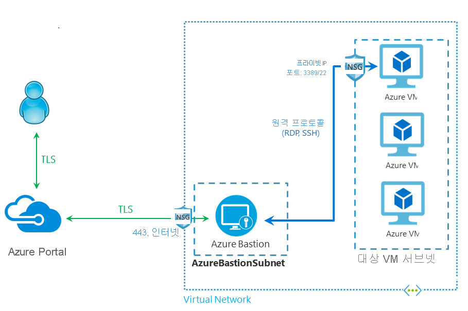

# Azure Bastion 정보 (미리 보기)

Azure Bastion 서비스는 가상 네트워크 내에서 프로비저닝하는 새로운 완전 플랫폼 관리형 PaaS 서비스입니다. SSL을 통해 Azure Portal에서 직접 가상 머신에 안전하고 원활한 RDP/SSH 연결을 제공합니다. Azure Bastion을 통해 연결하는 경우에는 가상 머신에 공용 IP 주소가 필요하지 않습니다.

 Bastion은 프로비저닝된 가상 네트워크의 모든 VM에 대한 안전한 RDP 및 SSH 연결을 제공합니다. Azure Bastion을 사용하면 가상 머신에서 RDP/SSH를 사용하여 안전한 액세스 권한을 계속 제공하며 RDP/SSH 포트가 외부 환경에 노출되는 상황으로부터 보호합니다. Azure Bastion을 통해 Azure Portal에서 직접 가상 머신에 연결합니다. 다른 클라이언트, 에이전트 또는 소프트웨어가 필요하지 않습니다.

> [!IMPORTANT]
> 이 공개 미리 보기는 Service Level Agreement(서비스 수준 약정)없이 제공되므로 프로덕션 워크로드에 사용하지 말아야 합니다. 특정 기능은 지원되지 않을 수 있거나, 기능이 제한될 수 있거나 모든 Azure 위치에서 사용하지는 못할 수 있습니다. 자세한 내용은 [Microsoft Azure 미리 보기에 대한 보충 사용 약관](https://azure.microsoft.com/support/legal/preview-supplemental-terms/)을 참조하세요.
>

## 아키텍처

Azure Bastion은 가상 네트워크에 배포되며, 배포된 후에는 가상 네트워크의 모든 가상 머신에 대해 안전한 RDP/SSH 환경을 제공합니다. 가상 네트워크에서 Azure Bastion 서비스를 프로비저닝한 후에는 같은 가상 네트워크의 모든 VM에서 RDP/SSH 환경을 사용할 수 있습니다. 배포의 단위는 구독/계정 또는 가상 머신이 아니라 가상 네트워크입니다.

RDP 및 SSH는 Azure에서 실행 중인 워크로드에 연결하는 데 사용할 수 있는 기본 수단 중 일부입니다. 인터넷을 통해 RDP/SSH 포트를 노출하는 것은 바람직하지 않으며 중요한 위협 요소로 간주됩니다. 이는 프로토콜 취약성으로 인해 종종 발생합니다. 이 위협 요소를 포함하기 위해 경계 네트워크의 공용 측에 요새 호스트(점프 서버라고도 함)를 배포할 수 있습니다. Bastion 호스트 서버는 공격에 대응하도록 설계 및 구성됩니다. 또한 Bastion 서버는 요새 뒤와 네트워크 내부에 있는 워크로드 모두에 대한 RDP 및 SSH 연결을 제공합니다.

이 그림은 Azure Bastion 배포 아키텍처를 보여줍니다. 이 다이어그램에서

* Bastion 호스트는 가상 네트워크에 배포되어 있습니다.
* 사용자는 HTML5 브라우저를 사용하여 Azure Portal에 연결합니다.
* 사용자가 연결할 가상 머신을 선택합니다.
* 한 번의 클릭으로 RDP/SSH 세션이 브라우저에서 열립니다.
* Azure VM에 공용 IP가 필요하지 않습니다.

## 주요 기능

공개 미리 보기 중에는 다음 기능을 테스트해 볼 수 있습니다.

* **Azure Portal에서 직접 RDP 및 SSH:** 단 한 번의 클릭으로 원활한 환경을 사용하여 Azure Portal에서 직접 RDP 및 SSH 세션을 가져올 수 있습니다.
* **RDP/SSH를 위한 SSL 및 방화벽 통과를 통한 원격 세션:** Azure Bastion은 로컬 디바이스에 자동으로 스트리밍하는 HTML5 기반 웹 클라이언트를 사용하므로, 포트 443의 SSL을 통해 RDP/SSH 세션을 가져와 안전하게 회사 방화벽을 통과할 수 있습니다.
* **Azure VM에 공용 IP가 필요하지 않음:** Azure Bastion은 VM에서 개인 IP를 사용하여 Azure VM(가상 머신)에 대한 RDP/SSH 연결을 엽니다. 가상 머신에서 공용 IP가 필요하지 않습니다.
* **NSG 간편 관리**: Azure Bastion은 안전한 RDP/SSH 연결을 제공하기 위해 내부적으로 강화된 Azure의 완전 관리형 플랫폼 PaaS 서비스입니다. Azure Bastion 서브넷에 NSG를 적용할 필요가 없습니다. Azure Bastion은 개인 IP를 통해 가상 머신에 연결하므로 Azure Bastion의 RDP/SSH만 허용하도록 NSG를 구성할 수 있습니다. 이렇게 하면 가상 머신에 안전하게 연결하기 위해 매번 NSG를 관리하는 번거로움이 사라집니다.
* **포트 검색으로부터 보호:** 가상 머신을 공용 인터넷에 노출하지 않으므로 가상 네트워크 외부에 있는 악의적인 사용자에 의한 포트 검색으로부터 VM을 보호합니다.
* **제로 데이 공격으로부터 보호 단일 지점에서 강화:** Azure Bastion은 완전 플랫폼 관리형 PaaS 서비스입니다. 가상 네트워크의 경계에 위치하므로 가상 네트워크의 각 가상 머신을 강화할 필요가 없습니다. Azure 플랫폼은 Azure Bastion을 강화하고 항상 최신 상태로 유지함으로써 제로 데이 공격으로부터 보호합니다.

## FAQ

[!INCLUDE [Bastion FAQ](../../includes/bastion-faq-include.md)]

## 다음 단계

* [Azure Bastion 호스트 리소스를 만듭니다](bastion-create-host-portal.md).
* Azure의 몇 가지 다른 주요 [네트워킹 기능](../networking/networking-overview.md)을 알아봅니다.
