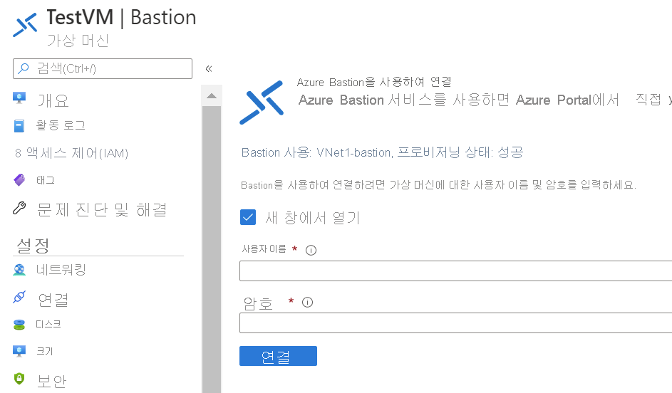

# 빠른 시작: 개인 IP 주소 및 Azure Bastion을 사용하여 가상 머신에 연결

이 빠른 시작 문서에서는 개인 IP 주소를 사용하여 가상 머신에 연결하는 방법을 보여 줍니다. Azure Bastion을 통해 연결하는 경우에는 가상 머신에 공용 IP 주소가 필요하지 않습니다. 이 문서의 단계는 포털에서 가상 머신을 통해 가상 네트워크에 Bastion을 배포하는 데 도움이 됩니다. 서비스가 프로비저닝되면 동일한 가상 네트워크의 모든 가상 머신에서 RDP/SSH 환경을 사용할 수 있습니다.

## 필수 조건

* Azure 가상 네트워크
* 3389 포트가 열려 있는 가상 네트워크에 있는 Azure 가상 머신.

### 예제 값

|**이름** | **값** |
| --- | --- |
| Name |  VNet1Bastion |
| 지역 | eastus |
| 가상 네트워크 |  VNet1 |
| + 서브넷 이름 | AzureBastionSubnet |
| AzureBastionSubnet 주소 |  10.1.254.0/27 |
| 공용 IP 주소 |  새로 만들기 |
| 공용 IP 주소 이름 | VNet1BastionPIP  |
| 공용 IP 주소 SKU |  Standard  |
| 할당  | 정적 |

## Bastion 호스트 만들기

기존 가상 머신을 사용하여 포털에서 Bastion 호스트를 만들 때 다양한 설정은 자동으로 가상 머신 및/또는 가상 네트워크에 해당하는 기본 설정으로 설정됩니다.

1. [Azure Portal](https://portal.azure.com)을 엽니다. 가상 머신으로 이동한 다음, **연결**을 클릭합니다.

   
1. 드롭다운에서 **Bastion**을 선택합니다.
1. 연결 페이지에서 **Bastion 사용**을 선택합니다.

   

1. Bastion 페이지에서 다음 설정 필드에 정보를 입력합니다.

   * **Name**: Bastion 호스트의 이름을 지정합니다.
   * **서브넷**: Bastion 리소스가 배포될 가상 네트워크의 서브넷입니다. **AzureBastionSubnet**이름을 사용하여 서브넷을 만들어야 합니다. 이 이름을 통해 Azure에서 Bastion 리소스를 배포할 서브넷을 인식할 수 있습니다. 이는 게이트웨이 서브넷과는 다릅니다. 최소 /27 이상(/27, /26, /25 등)의 서브넷을 사용합니다.
   
      * **서브넷 구성 관리**를 선택한 다음, **+ 서브넷**을 선택합니다.
      * 서브넷 추가 페이지에서 **AzureBastionSubnet**을 입력합니다.
      * CIDR 표기법의 주소 범위를 지정합니다. 예: 10.1.254.0/27
      * **확인**을 선택하여 서브넷을 만듭니다. 페이지 맨 위에 있는 Bastion으로 다시 이동하여 나머지 설정을 완료합니다.

         
   * **공용 IP 주소**: 이는 포트 443을 통해 RDP/SSH를 액세스할 수 있는 Bastion 리소스의 공용 IP입니다. 새 공용 IP를 만들거나 기존 항목을 사용합니다. 공용 IP 주소는 만들려는 Bastion 리소스와 동일한 지역에 있어야 합니다.
   * **공용 IP 주소 이름**: 공용 IP 주소 리소스의 이름입니다.
1. 유효성 검사 화면에서 **만들기**를 클릭합니다. Bastion 리소스를 만들고 배포하기까지 약 5분 정도 기다립니다.

   

## 연결

Bastion이 가상 네트워크에 배포되면 화면이 연결 페이지로 바뀝니다.

1. 가상 머신의 사용자 이름과 암호를 입력합니다. 그런 다음, **연결**을 선택합니다.

   
1. 이 가상 머신에 대한 RDP 연결은 포트 443 및 Bastion 서비스를 사용하여 Azure Portal에서 직접 열립니다(HTML5를 통해).

   

## 리소스 정리

가상 네트워크 및 가상 머신 사용을 마쳤으면 리소스 그룹과 리소스 그룹에 포함된 모든 리소스를 삭제합니다.

1. 포털 맨 위에 있는 **검색** 상자에 *TestRG1*을 입력하고 검색 결과에서 **TestRG1**을 선택합니다.

2. **리소스 그룹 삭제**를 선택합니다.

3. **리소스 그룹 이름 입력**에 *TestRG1*을 입력하고 **삭제**를 선택합니다.

## 다음 단계

이 빠른 시작에서는 가상 네트워크에 대한 Bastion 호스트를 만든 다음, Bastion 호스트를 통해 안전하게 가상 머신에 연결했습니다.

* Azure Bastion에 대해 자세히 알아보려면 [Bastion 개요](bastion-overview.md) 및 [Bastion FAQ](bastion-faq.md)를 확인하세요.
* Azure Bastion 서브넷에서 네트워크 보안 그룹을 사용하려면 [NSG 사용](bastion-nsg.md)을 참조하세요.
* Azure Bastion 호스트 설정에 대한 설명이 포함된 지침은 [자습서](bastion-create-host-portal.md)를 참조하세요.
* 가상 머신 확장 집합에 연결하려면 [Azure Bastion을 사용한 가상 머신 확장 집합에 연결](bastion-connect-vm-scale-set.md)을 참조하세요.