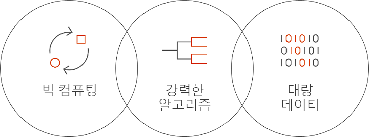

# Azure Batch AI란?
Batch AI는 데이터 과학자 및 AI 연구원이 GPU를 지원하는 VM을 포함하여 Azure 가상 머신 클러스터에서 AI 및 기타 기계 학습 모델을 교육할 수 있게 해주는 관리 서비스입니다. 사용자가 작업의 요구 사항, 입력을 찾고 출력을 저장하는 위치를 설명하면 나머지는 Batch AI가 처리합니다.  
 
## Batch AI를 사용하는 이유 
강력한 AI 알고리즘 개발은 계산 집약적이고 반복적인 프로세스입니다. 데이터 과학자와 AI 연구원이 작업하는 데이터 집합의 크기가 점점 커집니다. 이들은 더 많은 레이어를 사용하여 모델을 개발하고, 그 과정에서 하이퍼 매개 변수 튜닝을 위한 네트워크 디자인에 대해 더 많은 실험을 합니다. 이 작업을 효율적으로 수행하려면 모델마다 여러 CPU 또는 GPU가 필요하고, 실험을 병렬로 실행해야 하며, 교육 데이터, 로그 및 모델 출력에 대한 공유 저장소가 있어야 합니다.   
 

데이터 과학자 및 AI 연구원은 해당 분야의 전문가이긴 하지만, 대규모 인프라 관리에는 방해가 될 수 있습니다. AI를 대규모로 개발하려면 VM 클러스터를 프로비전하고, 소프트웨어 및 컨테이너를 설치하고, 작업을 큐에 추가하고, 작업의 우선 순위를 지정하고 작업을 예약하고, 오류를 처리하고, 데이터 배포하고, 결과를 공유하고, 비용 관리를 위해 리소스 크기를 조정하고, 도구 및 워크플로와 통합하는 등의 다양한 인프라 작업이 필요합니다. Batch AI는 이러한 작업을 처리합니다. 
 
## Batch AI이란? 

Batch AI는 AI 교육 및 테스트에 특화된 리소스 관리 및 작업 예약 기능을 제공합니다. 주요 기능은 다음과 같습니다. 

* 실행 중인 장기 일괄 작업, 반복 실험 및 대화형 교육 
* GPU 또는 CPU를 사용하여 VM 클러스터를 자동 또는 수동으로 크기 조정 
* VM 간 및 원격 액세스에 대한 SSH 통신 구성 
* [Microsoft CNTK(Cognitive Toolkit)](https://github.com/Microsoft/CNTK), [TensorFlow](https://www.tensorflow.org/) 및 [Chainer](https://chainer.org/) 같은 인기 있는 도구 키트에 최적화된 구성을 사용하여 심층 학습 또는 기계 학습 프레임워크 지원 
* 클러스터를 공유하고 우선 순위가 낮은 VM 및 예약된 인스턴스를 활용하는 우선 순위 기반 작업 큐  
* Azure 파일 및 관리 NFS 서버를 포함한 유연한 저장소 옵션 
* 원격 파일 공유를 VM 및 선택적 컨테이너에 탑재 
* 작업 상태를 제공하고 VM 오류 시 다시 시작 
* Azure Storage에서 스트리밍을 포함하여 출력 로그, stdout, stderr 및 모델에 액세스 
* Azure [CLI(명령줄 인터페이스)](/cli/azure), [Python](https://github.com/Azure/azure-sdk-for-python)/[C#](https://www.nuget.org/packages/Microsoft.Azure.Management.BatchAI/1.0.0-preview)/Java/용 SDK, Azure Portal에서 모니터링, Microsoft AI 도구와 통합 

Batch AI SDK는 교육 파이프라인을 관리하고 도구와 통합되는 응용 프로그램 작성을 지원합니다. SDK는 현재 Python, C#, Java 및 REST API를 제공합니다.  
 

Batch AI는 제어 평면 작업(만들기, 나열, 가져오기, 삭제)에 Azure Resource Manager를 사용합니다. Azure Active Directory는 인증 및 역할 기반 액세스 제어에 사용됩니다.  
 
## Batch AI 사용 방법 

Batch AI를 사용하려면 *클러스터* 및 *작업*을 정의하고 관리해야 합니다. 

 
**클러스터**는 다음과 같은 계산 요구 사항을 설명합니다. 
* 실행하려는 Azure 지역 
* 사용할 VM 제품군 및 크기 - 예: NVIDIA K80 GPU 4개를 포함하는 NC24 VM 
* VM 수 또는 자동 크기 조정의 최소 및 최대 수 
* VM 이미지 - 예: Ubuntu 16.04 LTS 또는 [Microsoft 심화 학습 가상 머신](https://azuremarketplace.microsoft.com/marketplace/apps/microsoft-ads.dsvm-deep-learning)
* 탑재할 원격 파일 공유 볼륨 - 예: Batch AI가 관리하는 Azure 파일 또는 NFS 서버의 원격 파일 공유 볼륨 
* 디버깅에 대화형 로그인을 사용하도록 VM에서 구성할 사용자 이름과 SSH 키 또는 암호  
 

**작업**은 다음에 대해 설명합니다. 
* 사용할 클러스터 및 지역 
* 작업에 사용할 VM 수 
* 시작할 때 작업에 전달할 입력 및 출력 디렉터리. 일반적으로 클러스터를 설치하는 동안 탑재된 공유 파일 시스템이 사용됩니다. 
* 소프트웨어 또는 설치 스크립트를 실행할 선택적 컨테이너 
* AI 프레임워크 관련 구성 또는 명령줄과 작업을 시작할 매개 변수 
 

[Azure CLI](/cli/azure)와 클러스터 및 작업에 대한 구성 파일에 Batch AI 사용을 시작합니다. 필요할 때 신속하게 클러스터를 만들고 네트워크 디자인 또는 하이퍼 매개 변수를 실험하는 작업을 실행하려면 이 방법을 사용합니다.  
 

Batch AI는 여러 GPU를 사용하여 간편하게 병렬로 작업할 수 있습니다. 여러 GPU에서 작업을 확장해야 하는 경우 Batch AI는 VM 간에 보안 네트워크 연결을 설정합니다. InfiniBand가 사용되는 경우 Batch AI는 드라이버를 구성하고 작업의 노드에서 MPI를 시작합니다.  

## 데이터 관리
Batch AI는 교육 스크립트, 데이터 및 출력에 대한 유연한 옵션을 제공합니다.
  
* 초기 실험 및 소규모 데이터 집합에는 **로컬 디스크**를 사용하세요. 이 시나리오에서는 SSH를 통해 가상 머신을 연결하여 스크립트를 편집하고 로그를 읽어보겠습니다. 

* **Azure 파일**을 사용하여 여러 작업에서 교육 데이터를 공유하고, 출력 로그 및 모델을 한 위치에 저장합니다. 

* 교육에 대규모 데이터 및 VM을 지원하도록 **NFS 서버**를 설정합니다. Batch AI는 NFS 서버를 디스크가 Azure Storage에 백업되는 특수 클러스터 형식으로 설정할 수 있습니다. 
 
* **병렬 파일 시스템**은 데이터 및 병렬 교육에 대한 추가 확장성을 제공합니다. Batch AI는 병렬 파일 시스템을 관리하지 않지만 Lustre, Gluster 및 BeeGFS에서 예제 배포 템플릿을 사용할 수 있습니다.  

## 다음 단계

* [Azure CLI](quickstart-cli.md) 또는 [Python](quickstart-python.md)을 사용하여 첫 번째 Batch AI 교육 작업 만들기를 시작합니다.
* 다양한 프레임워크에 대한 샘플 [교육 레시피](https://github.com/Azure/BatchAI)를 살펴봅니다.

