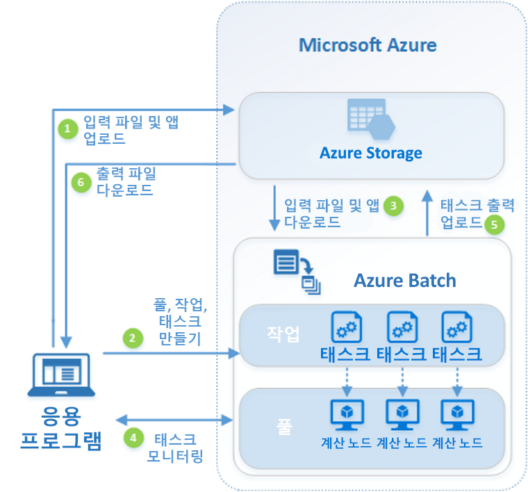

# Azure Batch란?

클라우드에서 Azure Batch를 사용하여 대규모 병렬 및 HPC(고성능 컴퓨팅) 일괄 작업을 Azure에서 효율적으로 실행합니다. Azure Batch는 컴퓨팅 노드(가상 머신) 풀을 만들고 관리하며, 사용자가 실행하려는 응용 프로그램을 설치하며, 노드에서 실행할 작업을 예약합니다. 설치, 관리하거나 비율 크기를 조정해야 하는 작업 스케줄러나 클러스터가 없습니다. 대신 [Batch API 및 도구](batch-apis-tools.md), 명령줄 스크립트 또는 Azure Portal을 사용하여 작업을 구성, 관리 및 모니터링할 수 있습니다. 

개발자는 Batch를 플랫폼 서비스로 사용하여 대규모 실행이 필요한 SaaS 응용 프로그램 또는 클라이언트 앱을 빌드할 수 있습니다. 예를 들어 Batch를 사용하여 금융 서비스 회사에 대한 몬테카를로 위험 시뮬레이션을 실행하는 서비스나 여러 이미지를 처리하는 서비스를 빌드할 수 있습니다.

Batch 사용에 대한 추가 비용은 없습니다. 가상 머신, 저장소 및 네트워킹과 같은 기본 사용 리소스에 대해서만 비용을 지불합니다.

Azure에서 배치 및 다른 HPC 솔루션 간의 비교는 [HPC, 배치 및 큰 계산 솔루션](../virtual-machines/linux/high-performance-computing.md)을 참조하세요.

## 병렬 워크로드 실행
Batch치는 본질적으로 병렬("처치 곤란 병렬"이라고도 함) 워크로드에서 잘 작동합니다. 기본적으로 병렬 워크로드에서는 응용 프로그램이 독립적으로 실행될 수 있으며, 각 인스턴스는 작업의 일부를 완료합니다. 응용 프로그램은 실행 중에 몇 가지 공통 데이터에 액세스할 수 있지만 응용 프로그램의 다른 인스턴스와 통신하지 않습니다. 따라서 본질적 병렬 워크로드는 응용 프로그램을 동시에 실행하는 데 사용할 수 있는 계산 리소스의 양에 따라 대규모로 실행될 수 있습니다.

Batch로 가져올 수 있는 본질적 병렬 워크로드의 예는 다음과 같습니다.

* 몬테카를로 시뮬레이션을 사용한 재무 위험 모델링
* VFX 및 3D 이미지 렌더링
* 이미지 분석 및 처리
* 미디어 코드 변환
* 유전자 서열 분석
* OCR(광학 문자 인식)
* 데이터 수집, 처리 및 ETL 작업
* 소프트웨어 테스트 실행

Batch를 사용하여 [긴밀하게 결합된 워크로드를 실행](batch-mpi.md)할 수도 있습니다. 이는 실행하는 응용 프로그램이 독립적으로 실행되지 않고 서로 통신해야 하는 워크로드입니다. 긴밀하게 결합된 응용 프로그램은 일반적으로 Message Passing Interface(MPI) API를 사용합니다. Batch를 통해 [Microsoft MPI](https://msdn.microsoft.com/library/bb524831(v=vs.85).aspx) 또는 Intel MPI를 사용하는 긴밀하게 결합된 워크로드를 실행할 수 있습니다. 특수화된 [HPC](../virtual-machines/linux/sizes-hpc.md) 및 [GPU에 최적화된](../virtual-machines/linux/sizes-gpu.md) VM 크기로 응용 프로그램 성능을 개선할 수 있습니다.

긴밀하게 결합된 워크로드의 몇 가지 예:
* 유한 요소 분석
* 유체 역학
* 다중 노드 AI 학습

Batch를 사용하여 긴밀하게 결합된 워크로드 여러 개를 병렬로 실행할 수 있습니다. 예를 들어 가변 파이프 폭을 사용하여 파이프를 통해 흐르는 유체의 여러 시뮬레이션을 수행합니다.

## 추가 Batch 기능

Azure Batch에서 상위 수준의 워크로드 관련 기능도 사용할 수 있습니다.
* Batch는 Autodesk Maya, 3ds Max, Arnold 및 V-Ray를 비롯한 렌더링 도구를 사용하여 대규모의 [렌더링 워크로드](batch-rendering-service.md)를 지원합니다. 
* R 사용자는 [doAzureParallel R 패키지](https://github.com/Azure/doAzureParallel)를 설치하여 Batch 풀에 대한 R 알고리즘 실행을 손쉽게 확장할 수 있습니다.

또한 [Azure Data Factory](../data-factory/v1/data-factory-data-processing-using-batch.md)와 같은 도구에서 관리하는 대규모 데이터 변환 Azure 워크플로의 일부로 Batch 작업을 실행할 수도 있습니다.

## 작동 방법
Batch의 일반적인 시나리오에는 본질적으로 계산 노드 풀에서 병렬 작업(예: 3D 장면을 위한 이미지 렌더링)의 규모를 확장하는 것이 포함됩니다. 이 계산 노드 풀은 작업을 렌더링하기 위해 수십, 수백 또는 수천 개의 코어를 제공하는 "렌더 팜"일 수 있습니다.

다음 다이어그램에서는 병렬 워크로드를 실행하기 위해 Batch를 사용하는 클라이언트 응용 프로그램 또는 호스티드 서비스가 있는 일반적인 Batch 워크플로의 단계를 보여 줍니다.

|단계  |설명  |
|---------|---------|
|1.  이러한 파일을 처리할 **입력 파일** 및 **응용 프로그램**을 Azure Storage 계정에 업로드합니다.     |입력 파일은 응용 프로그램이 처리할 모든 데이터가 될 수 있습니다(예: 금융 모델링 데이터 또는 트랜스코딩할 비디오 파일). 응용 프로그램 파일에는 미디어 트랜스코더처럼 데이터를 처리하는 스크립트 또는 응용 프로그램이 포함될 수 있습니다.|
|2.  Batch 계정에 계산 노드의 Batch **풀**을 만들고, 풀에 워크로드를 실행하는 **작업**을 만들고, 작업에 **태스크**를 만듭니다.     | 풀 노드는 태스크를 실행하는 VM입니다. 노드의 개수 및 크기와 같은 속성, Windows 또는 Linux VM 이미지, 그리고 노드가 풀에 조인할 때 설치할 응용 프로그램을 지정할 수 있습니다. Manage the cost and size of the pool by using [우선 순위가 낮은 VM](batch-low-pri-vms.md)을 사용하거나 워크로드가 변경될 때 노드 수를 [자동으로 조정](batch-automatic-scaling.md)하여 풀의 비용과 크기를 관리할 수 있습니다.   작업에 태스크를 추가하는 경우 Batch 서비스는 풀의 계산 노드에서 실행할 태스크를 자동으로 예약합니다. 각 태스크는 입력 파일을 처리하기 위해 업로드한 응용 프로그램을 사용합니다. |
|3.  Batch에 **입력 파일** 및 **응용 프로그램**을 다운로드합니다.     |각 태스크가 실행되기 전에 처리할 입력 데이터를 할당된 계산 노드에 다운로드할 수 있습니다. 풀 노드에 응용 프로그램이 아직 설치되지 않은 경우 여기서 대신 다운로드할 수 있습니다. Azure Storage에서 다운로드를 완료하면 할당된 노드에서 태스크가 실행됩니다.|
|4.  **태스크 실행**을 모니터링합니다.     |태스크가 실행됨에 따라 Batch를 쿼리하여 작업 및 태스크의 진행 상태를 모니터링합니다. 클라이언트 응용 프로그램 또는 서비스는 HTTPS를 통해 Batch 서비스와 통신합니다. 수천 개의 계산 노드에서 실행되는 수천 개의 태스크를 모니터링할 수 있으므로 [Batch 서비스를 효율적으로 쿼리](batch-efficient-list-queries.md)합니다.|
|5.  **태스크 출력**을 업로드합니다.     |태스크가 완료되면 결과 데이터를 Azure Storage에 업로드할 수 있습니다. 또한 계산 노드의 파일 시스템에서 파일을 직접 검색할 수도 있습니다.|
|6.  **출력 파일**을 다운로드합니다.     |모니터링을 통해 작업의 태스크가 완료되었음을 감지하면 클라이언트 응용 프로그램 또는 서비스는 추가 처리를 위해 출력 데이터를 다운로드할 수 있습니다.|

이 방법은 Batch를 사용하는 한 가지 방법일 뿐이며 이 시나리오에서는 일부 기능만 설명합니다. 예를 들어 각 계산 노드에서 [여러 태스크를 병렬로](batch-parallel-node-tasks.md) 실행할 수 있습니다. 또한 [작업 준비 및 완료 태스크](batch-job-prep-release.md)를 사용하여 작업용 노드를 준비한 후 정리할 수 있습니다. 

Batch 응용 프로그램을 빌드하는 동안 사용할 수 있는 풀, 노드, 작업 및 태스크 및 여러 API 기능에 대한 자세한 내용은 [개발자를 위한 Batch 기능 개요](batch-api-basics.md)를 참조하세요. 또한 최신 [Batch 서비스 업데이트](https://azure.microsoft.com/updates/?product=batch)를 참조하세요.

## 다음 단계

다음 요약 설명서를 통해 Azure Batch를 시작해 보세요.
* [Azure CLI를 사용하여 첫 번째 Batch 작업 실행](quick-create-cli.md)
* [Azure Portal을 사용하여 첫 번째 Batch 작업 실행](quick-create-portal.md)
* [.NET API를 사용하여 첫 번째 Batch 작업 실행](quick-run-dotnet.md)
* [Python API를 사용하여 첫 번째 Batch 작업 실행](quick-run-python.md)

