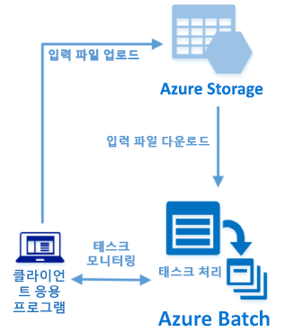

# <a name="quickstart-run-your-first-azure-batch-job-with-the-net-api"></a>빠른 시작: .NET API를 사용하여 첫 번째 Azure Batch 작업 실행

이 빠른 시작에서는 Azure Batch .NET API를 기반으로 하여 빌드된 C# 애플리케이션에서 Azure Batch 작업을 실행합니다. 앱은 여러 개의 입력 데이터 파일을 Azure 스토리지에 업로드한 다음, Batch 계산 노드(가상 머신)의 *풀*을 만듭니다. 그런 다음 *태스크*를 실행하는 샘플 *작업*을 만들어 기본 명령을 사용하여 풀에서 각 입력 파일을 처리합니다. 이 빠른 시작을 완료하면, Batch 서비스의 주요 개념을 이해하고 더 큰 규모의 더 실제적인 작업으로 Batch를 시도할 준비가 됩니다.



[!INCLUDE [quickstarts-free-trial-note.md](../../includes/quickstarts-free-trial-note.md)]

## <a name="prerequisites"></a>필수 조건

* Linux, macOS 또는 Windows의 경우 [Visual Studio 2017 이상](https://www.visualstudio.com/vs) 또는 [.NET Core 2.1](https://www.microsoft.com/net/download/dotnet-core/2.1). 

* Batch 계정 및 연결된 Azure Storage 계정. 이러한 계정을 만들려면 [Azure Portal](quick-create-portal.md) 또는 [Azure CLI](quick-create-cli.md)를 사용하는 Batch 빠른 시작을 참조하세요. 

## <a name="sign-in-to-azure"></a>Azure에 로그인

[https://portal.azure.com](https://portal.azure.com)에서 Azure Portal에 로그인합니다.

[!INCLUDE [batch-common-credentials](../../includes/batch-common-credentials.md)]

## <a name="download-the-sample"></a>샘플 다운로드

GitHub에서 [샘플 앱을 다운로드 또는 복제](https://github.com/Azure-Samples/batch-dotnet-quickstart)합니다. Git 클라이언트를 사용하여 샘플 앱 리포지토리를 복제하려면 다음 명령을 사용합니다.

```
git clone https://github.com/Azure-Samples/batch-dotnet-quickstart.git
```

`BatchDotNetQuickstart.sln`(Visual Studio 솔루션 파일)이 있는 디렉터리로 이동합니다.

Visual Studio에서 솔루션 파일을 열고 `Program.cs`의 자격 증명 문자열을 계정에 대해 가져온 값으로 업데이트합니다. 예: 

```csharp
// Batch account credentials
private const string BatchAccountName = "mybatchaccount";
private const string BatchAccountKey  = "xxxxxxxxxxxxxxxxE+yXrRvJAqT9BlXwwo1CwF+SwAYOxxxxxxxxxxxxxxxx43pXi/gdiATkvbpLRl3x14pcEQ==";
private const string BatchAccountUrl  = "https://mybatchaccount.mybatchregion.batch.azure.com";

// Storage account credentials
private const string StorageAccountName = "mystorageaccount";
private const string StorageAccountKey  = "xxxxxxxxxxxxxxxxy4/xxxxxxxxxxxxxxxxfwpbIC5aAWA8wDu+AFXZB827Mt9lybZB1nUcQbQiUrkPtilK5BQ==";
```

[!INCLUDE [batch-credentials-include](../../includes/batch-credentials-include.md)]

## <a name="build-and-run-the-app"></a>앱 빌드 및 실행

작동 중인 Batch 워크플로를 보려면 Visual Studio 또는 명령줄에서 `dotnet build` 및 `dotnet run` 명령을 사용하여 애플리케이션을 빌드 및 실행합니다. 애플리케이션이 실행되면 코드를 검토하여 애플리케이션의 각 부분에서 수행하는 작업을 알아봅니다. 예를 들어 Visual Studio의 경우 다음과 같습니다.

* [솔루션 탐색기]에서 솔루션을 마우스 오른쪽 단추로 클릭하고 **솔루션 빌드**를 클릭합니다. 

* 메시지가 표시되면 모든 NuGet 패키지 복원을 확인합니다. 누락된 패키지를 다운로드해야 하는 경우 [NuGet 패키지 관리자](https://docs.nuget.org/consume/installing-nuget)가 설치되어 있는지 확인합니다.

그런 다음 실행합니다. 샘플 애플리케이션을 실행하는 경우 콘솔 출력은 다음과 유사합니다. 실행 중에 풀의 계산 노드가 시작되는 동안 `Monitoring all tasks for 'Completed' state, timeout in 00:30:00...`에서 일시 중지가 발생합니다. 첫 번째 계산 노드가 실행되는 즉시 실행되도록 태스크를 큐에 넣습니다. [Azure Portal](https://portal.azure.com)에서 Batch 계정으로 이동하여 풀, 계산 노드, 작업 및 태스크를 모니터링합니다.

```
Sample start: 11/16/2018 4:02:54 PM

Container [input] created.
Uploading file taskdata0.txt to container [input]...
Uploading file taskdata1.txt to container [input]...
Uploading file taskdata2.txt to container [input]...
Creating pool [DotNetQuickstartPool]...
Creating job [DotNetQuickstartJob]...
Adding 3 tasks to job [DotNetQuickstartJob]...
Monitoring all tasks for 'Completed' state, timeout in 00:30:00...
```

태스크가 완료되면 각 태스크에 대해 다음과 비슷한 출력이 표시됩니다.

```
Printing task output.
Task: Task0
Node: tvm-2850684224_3-20171205t000401z
Standard out:
Batch processing began with mainframe computers and punch cards. Today it still plays a central role in business, engineering, science, and other pursuits that require running lots of automated tasks....
stderr:
...
```

기본 구성에서 애플리케이션을 실행하는 경우 일반적인 실행 시간은 약 5분입니다. 초기 풀 설정에 가장 많은 시간이 걸립니다. 작업을 다시 실행하려면 이전 실행의 작업은 삭제하는 대신 풀은 삭제하지 않습니다. 미리 구성된 풀에서 작업은 몇 초 내에 완료됩니다.


## <a name="review-the-code"></a>코드 검토

이 빠른 시작의 .NET 앱은 다음을 수행합니다.

* 세 개의 작은 텍스트 파일을 Azure 저장소 계정의 Blob 컨테이너에 업로드합니다. 이러한 파일은 Batch에서 처리하기 위한 입력입니다.
* Windows Server를 실행하는 계산 노드 풀을 만듭니다.
* 노드에서 실행할 하나의 작업과 세 개의 태스크를 만듭니다. 각 태스크는 Windows 명령줄을 사용하여 입력 파일 중 하나를 처리합니다. 
* 태스크에서 반환된 파일을 표시합니다.

자세한 내용은 `Program.cs` 파일 및 다음 섹션을 참조하세요. 

### <a name="preliminaries"></a>준비 단계

스토리지 계정과 상호 작용하기 위해 앱에서 .NET용 Azure Storage 클라이언트 라이브러리를 사용합니다. [CloudStorageAccount](/dotnet/api/microsoft.azure.cosmos.table.cloudstorageaccount)를 사용하여 계정에 대한 참조를 만들고, 이 참조로부터 [CloudBlobClient](/dotnet/api/microsoft.azure.storage.blob.cloudblobclient)를 만듭니다.

```csharp
CloudBlobClient blobClient = storageAccount.CreateCloudBlobClient();
```

앱은 `blobClient` 참조를 사용하여 저장소 계정에 컨테이너를 만들고, 데이터 파일을 이 컨테이너에 업로드합니다. 스토리지의 파일은 Batch가 나중에 계산 노드에 다운로드할 수 있는 Batch [ResourceFile](/dotnet/api/microsoft.azure.batch.resourcefile) 개체로 정의됩니다.

```csharp
List<string> inputFilePaths = new List<string>
{
    "taskdata0.txt",
    "taskdata1.txt",
    "taskdata2.txt"
};

List<ResourceFile> inputFiles = new List<ResourceFile>();

foreach (string filePath in inputFilePaths)
{
    inputFiles.Add(UploadFileToContainer(blobClient, inputContainerName, filePath));
}
```

이 앱은 Batch 서비스에서 풀, 작업 및 태스크를 만들고 관리하는 [BatchClient](/dotnet/api/microsoft.azure.batch.batchclient) 개체를 만듭니다. 샘플의 Batch 클라이언트는 공유 키 인증을 사용합니다. (Batch는 Azure Active Directory 인증도 지원합니다.)

```csharp
BatchSharedKeyCredentials cred = new BatchSharedKeyCredentials(BatchAccountUrl, BatchAccountName, BatchAccountKey);

using (BatchClient batchClient = BatchClient.Open(cred))
...
```

### <a name="create-a-pool-of-compute-nodes"></a>계산 노드 풀 만들기

Batch 풀을 만들려면 앱에서 [BatchClient.PoolOperations.CreatePool](/dotnet/api/microsoft.azure.batch.pooloperations.createpool) 메서드를 사용하여 노드 수, VM 크기 및 풀 구성을 설정합니다. 여기서 [VirtualMachineConfiguration](/dotnet/api/microsoft.azure.batch.virtualmachineconfiguration) 개체는 Azure Marketplace에 게시된 Windows Server 이미지에 대한 [ImageReference](/dotnet/api/microsoft.azure.batch.imagereference)를 지정합니다. Batch는 Azure Marketplace의 다양한 Linux 및 Windows Server 이미지와 사용자 지정 VM 이미지를 지원합니다.

노드 수(`PoolNodeCount`)와 VM 크기(`PoolVMSize`)는 상수로 정의됩니다. 샘플은 기본적으로 *Standard_A1_v2* 크기인 2개 노드로 구성되는 풀을 만듭니다. 제안된 크기는 이 빠른 예제의 성능과 비용에 대한 적절한 균형을 제공합니다.

[Commit](/dotnet/api/microsoft.azure.batch.cloudpool.commit) 메서드는 풀을 Batch 서비스에 제출합니다.

```csharp

private static VirtualMachineConfiguration CreateVirtualMachineConfiguration(ImageReference imageReference)
{
    return new VirtualMachineConfiguration(
        imageReference: imageReference,
        nodeAgentSkuId: "batch.node.windows amd64");
}

private static ImageReference CreateImageReference()
{
    return new ImageReference(
        publisher: "MicrosoftWindowsServer",
        offer: "WindowsServer",
        sku: "2016-datacenter-smalldisk",
        version: "latest");
}

private static void CreateBatchPool(BatchClient batchClient, VirtualMachineConfiguration vmConfiguration)
{
    try
    {
        CloudPool pool = batchClient.PoolOperations.CreatePool(
            poolId: PoolId,
            targetDedicatedComputeNodes: PoolNodeCount,
            virtualMachineSize: PoolVMSize,
            virtualMachineConfiguration: vmConfiguration);

        pool.Commit();
    }
...

```

### <a name="create-a-batch-job"></a>Batch 작업 만들기

Batch 작업은 하나 이상의 태스크에 대한 논리적 그룹입니다. 작업에는 우선 순위 및 태스크를 실행할 풀과 같은 태스크에 공통적으로 적용되는 설정이 포함됩니다. 앱은 [BatchClient.JobOperations.CreateJob](/dotnet/api/microsoft.azure.batch.joboperations.createjob) 메서드를 사용하여 풀에 작업을 만듭니다.

[Commit](/dotnet/api/microsoft.azure.batch.cloudjob.commit) 메서드는 작업을 Batch 서비스에 제출합니다. 처음에는 작업에 태스크가 없습니다.

```csharp
try
{
    CloudJob job = batchClient.JobOperations.CreateJob();
    job.Id = JobId;
    job.PoolInformation = new PoolInformation { PoolId = PoolId };

    job.Commit();
}
...
```

### <a name="create-tasks"></a>태스크 만들기

앱에서 [CloudTask](/dotnet/api/microsoft.azure.batch.cloudtask) 개체의 목록을 만듭니다. 각 태스크는 [CommandLine](/dotnet/api/microsoft.azure.batch.cloudtask.commandline) 속성을 사용하여 `ResourceFile` 입력 개체를 처리합니다. 이 샘플에서는 명령줄에서 `type` Windows 명령을 실행하여 입력 파일을 표시합니다. 이 명령은 간단한 데모용 예제입니다. Batch를 사용하면 명령줄에서 앱 또는 스크립트를 지정합니다. Batch는 계산 노드에 앱과 스크립트를 배포하는 여러 가지 방법을 제공합니다.

그런 다음, 앱은 계산 노드에서 실행되도록 큐에 넣는 [AddTask](/dotnet/api/microsoft.azure.batch.joboperations.addtask) 메서드를 사용하여 작업에 태스크를 추가합니다.

```csharp
for (int i = 0; i < inputFiles.Count; i++)
{
    string taskId = String.Format("Task{0}", i);
    string inputFilename = inputFiles[i].FilePath;
    string taskCommandLine = String.Format("cmd /c type {0}", inputFilename);

    CloudTask task = new CloudTask(taskId, taskCommandLine);
    task.ResourceFiles = new List<ResourceFile> { inputFiles[i] };
    tasks.Add(task);
}

batchClient.JobOperations.AddTask(JobId, tasks);
```

### <a name="view-task-output"></a>태스크 출력 보기

앱에서 태스크를 모니터링하는 [TaskStateMonitor](/dotnet/api/microsoft.azure.batch.taskstatemonitor)를 만들어 해당 태스크가 완료되었는지 확인합니다. 그런 다음 앱에서 [CloudTask.ComputeNodeInformation](/dotnet/api/microsoft.azure.batch.cloudtask.computenodeinformation) 속성을 사용하여 완료된 각 태스크에서 생성된 `stdout.txt` 파일을 표시합니다. 태스크가 성공적으로 실행되면 태스크 명령의 출력이 `stdout.txt`에 기록됩니다.

```csharp
foreach (CloudTask task in completedtasks)
{
    string nodeId = String.Format(task.ComputeNodeInformation.ComputeNodeId);
    Console.WriteLine("Task: {0}", task.Id);
    Console.WriteLine("Node: {0}", nodeId);
    Console.WriteLine("Standard out:");
    Console.WriteLine(task.GetNodeFile(Constants.StandardOutFileName).ReadAsString());
}
```

## <a name="clean-up-resources"></a>리소스 정리

앱은 만든 저장소 컨테이너를 자동으로 삭제하고 Batch 풀과 작업을 삭제할 수 있는 옵션을 제공합니다. 작업이 예약되지 않은 경우에도 노드가 실행되는 동안은 풀에 대한 요금이 부과됩니다. 풀이 더 이상 필요하지 않으면 삭제합니다. 풀을 삭제하면 노드의 모든 태스크 출력이 삭제됩니다.

더 이상 필요하지 않으면 리소스 그룹, 배치 계정 및 저장소 계정을 삭제합니다. Azure Portal에서 이렇게 하려면 배치 계정에 대한 리소스 그룹을 선택하고 **리소스 그룹 삭제**를 클릭합니다.

## <a name="next-steps"></a>다음 단계

이 빠른 시작에서는 Batch .NET API를 통해 빌드된 작은 앱을 실행하여 Batch 풀과 Batch 작업을 만들었습니다. 작업에서 샘플 태스크를 실행했고, 노드에서 만들어진 출력을 다운로드했습니다. 이제 Batch 서비스의 핵심 개념을 이해 했으므로 더 큰 규모의 더 실제적인 작업 부하로 Batch를 시도할 준비가 되었습니다. Azure Batch에 대해 자세히 알아보고 실제 애플리케이션으로 병렬 작업을 단계별로 진행하려면 Batch .NET 자습서로 계속 진행하세요.


> [!div class="nextstepaction"]
> [.NET을 사용하여 병렬 작업 처리](tutorial-parallel-dotnet.md)
