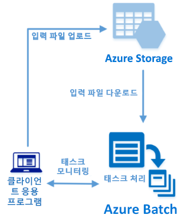

# <a name="quickstart-run-your-first-batch-job-with-the-python-api"></a>빠른 시작: Python API를 사용하여 첫 번째 Batch 작업 실행

이 빠른 시작에서는 Azure Batch Python API를 기반으로 하여 빌드된 애플리케이션에서 Azure Batch 작업을 실행합니다. 응용 프로그램은 여러 개의 입력 데이터 파일을 Azure 저장소에 업로드한 다음, Batch 계산 노드(가상 머신)의 *풀*을 만듭니다. 그런 다음 *태스크*를 실행하는 샘플 *작업*을 만들어 기본 명령을 사용하여 풀에서 각 입력 파일을 처리합니다. 이 빠른 시작을 완료하면, Batch 서비스의 주요 개념을 이해하고 더 큰 규모의 더 실제적인 작업으로 Batch를 시도할 준비가 됩니다.
 


[!INCLUDE [quickstarts-free-trial-note.md](../../includes/quickstarts-free-trial-note.md)]

## <a name="prerequisites"></a>필수 조건

* [Python 버전 2.7 또는 3.3 이상](https://www.python.org/downloads/)

* [pip](https://pip.pypa.io/en/stable/installing/) 패키지 관리자

* Azure Batch 계정 및 연결된 Azure Storage 계정. 이러한 계정을 만들려면 [Azure Portal](quick-create-portal.md) 또는 [Azure CLI](quick-create-cli.md)를 사용하는 Batch 빠른 시작을 참조하세요. 

## <a name="sign-in-to-azure"></a>Azure에 로그인

[https://portal.azure.com](https://portal.azure.com)에서 Azure Portal에 로그인합니다.

[!INCLUDE [batch-common-credentials](../../includes/batch-common-credentials.md)]

## <a name="download-the-sample"></a>샘플 다운로드

GitHub에서 [샘플 앱을 다운로드 또는 복제](https://github.com/Azure-Samples/batch-python-quickstart)합니다. Git 클라이언트를 사용하여 샘플 앱 리포지토리를 복제하려면 다음 명령을 사용합니다.

```
git clone https://github.com/Azure-Samples/batch-python-quickstart.git
```

`python_quickstart_client.py` Python 스크립트가 있는 디렉터리로 이동합니다.

Python 개발 환경에서 `pip`를 사용하여 필요한 패키지를 설치합니다.

```bash
pip install -r requirements.txt
```

`config.py`파일을 엽니다. Batch 및 저장소 계정 자격 증명 문자열을 계정에 대해 가져온 값으로 업데이트합니다. 예: 

```Python
_BATCH_ACCOUNT_NAME = 'mybatchaccount'
_BATCH_ACCOUNT_KEY = 'xxxxxxxxxxxxxxxxE+yXrRvJAqT9BlXwwo1CwF+SwAYOxxxxxxxxxxxxxxxx43pXi/gdiATkvbpLRl3x14pcEQ=='
_BATCH_ACCOUNT_URL = 'https://mybatchaccount.mybatchregion.batch.azure.com'
_STORAGE_ACCOUNT_NAME = 'mystorageaccount'
_STORAGE_ACCOUNT_KEY = 'xxxxxxxxxxxxxxxxy4/xxxxxxxxxxxxxxxxfwpbIC5aAWA8wDu+AFXZB827Mt9lybZB1nUcQbQiUrkPtilK5BQ=='
```

## <a name="run-the-app"></a>앱 실행

작업에서 Batch 워크플로를 보려면 다음 스크립트를 실행합니다.

```
python python_quickstart_client.py
```

스크립트가 실행되면 코드를 검토하여 애플리케이션의 각 부분에서 수행하는 작업을 알아봅니다. 

샘플 애플리케이션을 실행하는 경우 콘솔 출력은 다음과 유사합니다. 실행 중에 풀의 계산 노드가 시작되는 동안 `Monitoring all tasks for 'Completed' state, timeout in 00:30:00...`에서 일시 중지가 발생합니다. 첫 번째 계산 노드가 실행되는 즉시 실행되도록 태스크를 큐에 넣습니다. [Azure Portal](https://portal.azure.com)에서 배치 계정으로 이동하여 배치 계정의 풀, 노드, 작업 및 태스크를 모니터링합니다.

```
Sample start: 11/26/2018 4:02:54 PM

Container [input] created.
Uploading file taskdata0.txt to container [input]...
Uploading file taskdata1.txt to container [input]...
Uploading file taskdata2.txt to container [input]...
Creating pool [PythonQuickstartPool]...
Creating job [PythonQuickstartJob]...
Adding 3 tasks to job [PythonQuickstartJob]...
Monitoring all tasks for 'Completed' state, timeout in 00:30:00...
```

태스크가 완료되면 각 태스크에 대해 다음과 비슷한 출력이 표시됩니다.

```
Printing task output...
Task: Task0
Node: tvm-2850684224_3-20171205t000401z
Standard out:
Batch processing began with mainframe computers and punch cards. Today it still plays a central role in business, engineering, science, and other pursuits that require running lots of automated tasks....
...
```

기본 구성에서 애플리케이션을 실행하는 경우 일반적인 실행 시간은 약 3분입니다. 초기 풀 설정에 가장 많은 시간이 걸립니다.

## <a name="review-the-code"></a>코드 검토

이 빠른 시작의 Python 앱은 다음을 수행합니다.

* 세 개의 작은 텍스트 파일을 Azure 저장소 계정의 Blob 컨테이너에 업로드합니다. 이러한 파일은 Batch 태스크에서 처리하기 위한 입력입니다.
* Ubuntu 18.04 LTS를 실행하는 두 개의 컴퓨팅 노드로 구성된 풀을 만듭니다.
* 노드에서 실행할 하나의 작업과 세 개의 태스크를 만듭니다. 각 태스크는 Bash 셸 명령줄을 사용하여 입력 파일 중 하나를 처리합니다.
* 태스크에서 반환된 파일을 표시합니다.

자세한 내용은 `python_quickstart_client.py` 파일 및 다음 섹션을 참조하세요.

### <a name="preliminaries"></a>준비 단계

스토리지 계정과 상호 작용하기 위해 앱에서 [azure-storage-blob](https://pypi.python.org/pypi/azure-storage-blob) 패키지를 사용하여 [BlockBlobService](/python/api/azure.storage.blob.blockblobservice.blockblobservice) 개체를 만듭니다.

```python
blob_client = azureblob.BlockBlobService(
    account_name=config._STORAGE_ACCOUNT_NAME,
    account_key=config._STORAGE_ACCOUNT_KEY)
```

앱은 `blob_client` 참조를 사용하여 저장소 계정에 컨테이너를 만들고, 데이터 파일을 이 컨테이너에 업로드합니다. 저장소의 파일은 나중에 Batch에서 계산 노드에 다운로드할 수 있는 [ResourceFile](/python/api/azure.batch.models.resourcefile) Batch 개체로 정의됩니다.

```python
input_file_paths =  [os.path.join(sys.path[0], 'taskdata0.txt'),
                     os.path.join(sys.path[0], 'taskdata1.txt'),
                     os.path.join(sys.path[0], 'taskdata2.txt')]

input_files = [
    upload_file_to_container(blob_client, input_container_name, file_path)
    for file_path in input_file_paths]
```

이 앱은 Batch 서비스에서 풀, 작업 및 태스크를 만들고 관리하는 [BatchServiceClient](/python/api/azure.batch.batchserviceclient) 개체를 만듭니다. 샘플의 Batch 클라이언트는 공유 키 인증을 사용합니다. 또한 Batch는 Azure Active Directory 인증도 지원합니다.

```python
credentials = batch_auth.SharedKeyCredentials(config._BATCH_ACCOUNT_NAME,
    config._BATCH_ACCOUNT_KEY)

batch_client = batch.BatchServiceClient(
    credentials,
    base_url=config._BATCH_ACCOUNT_URL)
```

### <a name="create-a-pool-of-compute-nodes"></a>계산 노드 풀 만들기

Batch 풀을 만들려면 앱에서 [PoolAddParameter](/python/api/azure.batch.models.pooladdparameter) 클래스를 사용하여 노드 수, VM 크기 및 풀 구성을 설정합니다. 여기서 [VirtualMachineConfiguration](/python/api/azure.batch.models.virtualmachineconfiguration) 개체는 Azure Marketplace에 게시된 Ubuntu Server 18.04 LTS 이미지에 대한 [ImageReference](/python/api/azure.batch.models.imagereference)를 지정합니다. Batch는 Azure Marketplace의 다양한 Linux 및 Windows Server 이미지와 사용자 지정 VM 이미지를 지원합니다.

노드 수(`_POOL_NODE_COUNT`)와 VM 크기(`_POOL_VM_SIZE`)는 상수로 정의됩니다. 샘플은 기본적으로 *Standard_A1_v2* 크기인 2개 노드로 구성되는 풀을 만듭니다. 제안된 크기는 이 빠른 예제의 성능과 비용에 대한 적절한 균형을 제공합니다.

[pool.add](/python/api/azure.batch.operations.pooloperations#azure_batch_operations_PoolOperations_add) 메서드는 풀을 Batch 서비스에 제출합니다.

```python
new_pool = batch.models.PoolAddParameter(
    id=pool_id,
    virtual_machine_configuration=batchmodels.VirtualMachineConfiguration(
        image_reference=batchmodels.ImageReference(
            publisher="Canonical",
            offer="UbuntuServer",
            sku="18.04-LTS",
            version="latest"
            ),
        node_agent_sku_id="batch.node.ubuntu 18.04"),
    vm_size=config._POOL_VM_SIZE,
    target_dedicated_nodes=config._POOL_NODE_COUNT
)
batch_service_client.pool.add(new_pool)
```

### <a name="create-a-batch-job"></a>Batch 작업 만들기

Batch 작업은 하나 이상의 태스크에 대한 논리적 그룹입니다. 작업에는 우선 순위 및 태스크를 실행할 풀과 같은 태스크에 공통적으로 적용되는 설정이 포함됩니다. 앱에서 [JobAddParameter](/python/api/azure.batch.models.jobaddparameter) 클래스를 사용하여 풀에 작업을 만듭니다. [job.add](/python/api/azure.batch.operations.joboperations) 메서드는 풀을 Batch 서비스에 제출합니다. 처음에는 작업에 태스크가 없습니다.

```python
job = batch.models.JobAddParameter(
    id=job_id,
    pool_info=batch.models.PoolInformation(pool_id=pool_id))
batch_service_client.job.add(job)
```

### <a name="create-tasks"></a>태스크 만들기

앱에서 [TaskAddParameter](/python/api/azure.batch.models.taskaddparameter) 클래스를 사용하여 태스크 개체의 목록을 만듭니다. 각 태스크는 `command_line` 매개 변수를 사용하여 `resource_files` 입력 개체를 처리합니다. 이 샘플에서는 명령줄에서 `cat` Bash 셸 명령을 실행하여 텍스트 파일을 표시합니다. 이 명령은 간단한 데모용 예제입니다. Batch를 사용하면 명령줄에서 앱 또는 스크립트를 지정합니다. Batch는 계산 노드에 앱과 스크립트를 배포하는 여러 가지 방법을 제공합니다.

그런 다음 앱은 계산 노드에서 실행되도록 큐에 넣는 [task.add_collection](/python/api/azure.batch.operations.taskoperations#azure_batch_operations_TaskOperations_add_collection) 메서드를 사용하여 작업에 태스크를 추가합니다. 

```python
tasks = list()

for idx, input_file in enumerate(input_files): 
    command = "/bin/bash -c \"cat {}\"".format(input_file.file_path)
    tasks.append(batch.models.TaskAddParameter(
        id='Task{}'.format(idx),
        command_line=command,
        resource_files=[input_file]
    )
)
batch_service_client.task.add_collection(job_id, tasks)
```

### <a name="view-task-output"></a>태스크 출력 보기

앱에서 태스크 상태를 모니터링하여 태스크가 완료되었는지 확인합니다. 그런 다음 앱은 완료된 각 태스크에서 생성된 `stdout.txt` 파일을 표시합니다. 태스크가 성공적으로 실행되면 태스크 명령의 출력이 `stdout.txt`에 기록됩니다.

```python
tasks = batch_service_client.task.list(job_id)

for task in tasks:
    
    node_id = batch_service_client.task.get(job_id, task.id).node_info.node_id
    print("Task: {}".format(task.id))
    print("Node: {}".format(node_id))

    stream = batch_service_client.file.get_from_task(job_id, task.id, config._STANDARD_OUT_FILE_NAME)

    file_text = _read_stream_as_string(
        stream,
        encoding)
    print("Standard output:")
    print(file_text)
```

## <a name="clean-up-resources"></a>리소스 정리

앱은 만든 저장소 컨테이너를 자동으로 삭제하고 Batch 풀과 작업을 삭제할 수 있는 옵션을 제공합니다. 작업이 예약되지 않은 경우에도 노드가 실행되는 동안은 풀에 대한 요금이 부과됩니다. 풀이 더 이상 필요하지 않으면 삭제합니다. 풀을 삭제하면 노드의 모든 태스크 출력이 삭제됩니다. 

더 이상 필요하지 않으면 리소스 그룹, 배치 계정 및 저장소 계정을 삭제합니다. Azure Portal에서 이렇게 하려면 배치 계정에 대한 리소스 그룹을 선택하고 **리소스 그룹 삭제**를 클릭합니다.

## <a name="next-steps"></a>다음 단계

이 빠른 시작에서는 Batch Python API를 통해 빌드된 작은 앱을 실행하여 Batch 풀과 Batch 작업을 만들었습니다. 작업에서 샘플 태스크를 실행했고, 노드에서 만들어진 출력을 다운로드했습니다. 이제 Batch 서비스의 핵심 개념을 이해 했으므로 더 큰 규모의 더 실제적인 작업 부하로 Batch를 시도할 준비가 되었습니다. Azure Batch에 대해 자세히 알아보고 실제 애플리케이션으로 병렬 작업을 단계별로 진행하려면 Batch Python 자습서로 계속 진행하세요.

> [!div class="nextstepaction"]
> [Python을 사용하여 병렬 작업 처리](tutorial-parallel-python.md)
