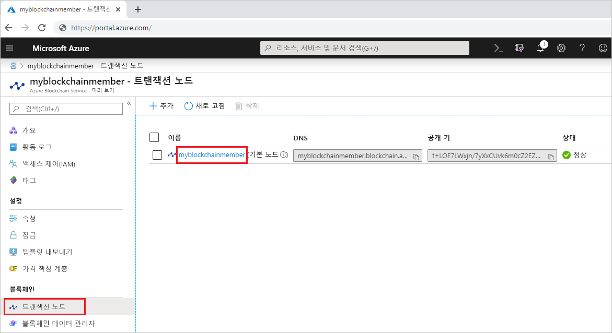
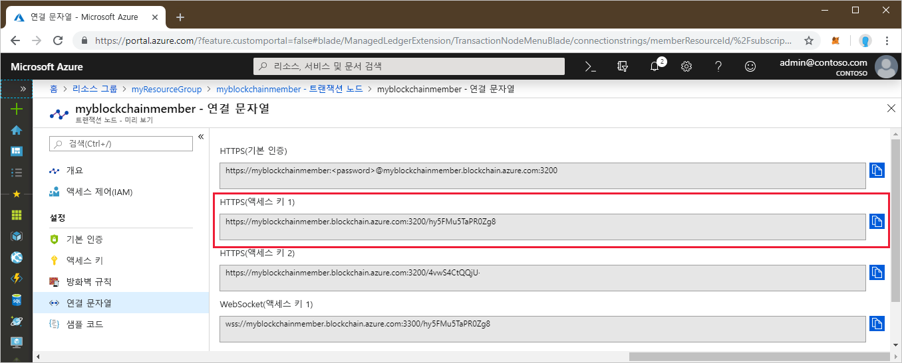

# <a name="quickstart-use-geth-to-connect-to-a-transaction-node"></a>빠른 시작: Geth를 사용하여 트랜잭션 노드에 연결

Geth는 Azure Blockchain Service 트랜잭션 노드의 Geth 인스턴스에 연결할 때 사용할 수 있는 Go Ethereum 클라이언트입니다.

[!INCLUDE [quickstarts-free-trial-note](../../../includes/quickstarts-free-trial-note.md)]

## <a name="prerequisites"></a>필수 조건

* [Geth](https://github.com/ethereum/go-ethereum/wiki/geth) 설치
* [Azure Blockchain 멤버 만들기](create-member.md)

## <a name="get-the-geth-connection-string"></a>Geth 연결 문자열 가져오기

Geth 연결 문자열은 Azure Portal에서 찾을 수 있습니다.

1. [Azure Portal](https://portal.azure.com)에 로그인합니다.
1. Azure Blockchain Service 멤버로 이동합니다. **트랜잭션 노드**와 기본 트랜잭션 노드 링크를 선택합니다.

    

1. **연결 문자열**을 선택합니다.
1. **HTTPS(액세스 키 1)** 에서 연결 문자열을 복사합니다. 다음 섹션에 대한 명령이 필요합니다.

    

## <a name="connect-to-geth"></a>Geth에 연결

1. 명령 프롬프트 또는 셸을 엽니다.
1. Geth attach 하위 명령을 사용하여 트랜잭션 노드에서 실행 중인 Geth 인스턴스에 연결합니다. 연결 문자열을 attach 하위 명령의 인수로 붙여넣습니다. 예를 들면 다음과 같습니다.

    ```
    geth attach <connection string>
    ```

1. 트랜잭션 노드의 Ethereum 콘솔에 연결되면 web3 JavaScript Dapp API 또는 관리 API를 호출할 수 있습니다.

    예를 들어 chainId를 찾으려면 다음 API를 사용합니다.

    ```bash
    admin.nodeInfo.protocols.istanbul.config.chainId
    ```

    이 예제의 chainId는 297입니다.

    

1. 콘솔에서 연결을 끊으려면 `exit`를 입력합니다.

## <a name="next-steps"></a>다음 단계

이 빠른 시작에서는 Geth 클라이언트를 사용하여 Azure Blockchain Service 트랜잭션 노드의 Geth 인스턴스에 연결했습니다. 다음 자습서로 넘어가서 Truffle을 사용하여 트랜잭션을 배포하고 전송하세요.

> [!div class="nextstepaction"]
> [트랜잭션 보내기](send-transaction.md)