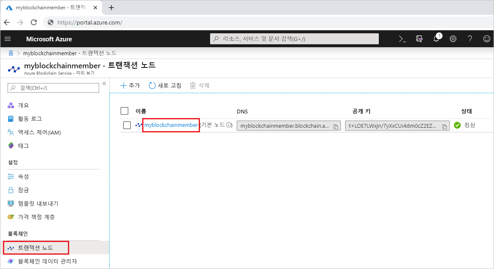

# <a name="quickstart-use-truffle-to-connect-to-a-an-azure-blockchain-service-network"></a>빠른 시작: Truffle을 사용하여 Azure Blockchain Service 네트워크에 연결

Truffle은 Azure Blockchain Service 노드에 연결할 때 사용할 수 있는 블록체인 개발 환경입니다.

[!INCLUDE [quickstarts-free-trial-note](../../../includes/quickstarts-free-trial-note.md)]

## <a name="prerequisites"></a>필수 조건

* [Azure Blockchain 멤버 만들기](create-member.md)
* Truffle을 사용하려면 [Node.js](https://nodejs.org), [Git](https://git-scm.com/book/en/v2/Getting-Started-Installing-Git) 및 [Truffle](https://github.com/trufflesuite/truffle)을 포함한 여러 도구를 설치해야 합니다.

    Windows 10에 빠르게 설치하려면 Unix Bash 셸 터미널용 [Ubuntu on Windows](https://www.microsoft.com/p/ubuntu/9nblggh4msv6)를 설치한 다음, [Truffle](https://github.com/trufflesuite/truffle)을 설치합니다. Ubuntu on Windows 배포판에는 Node.js 및 Git이 포함되어 있습니다.

## <a name="create-truffle-project"></a>Truffle 프로젝트 만들기

1. Bash 셸 터미널을 엽니다.
1. Truffle 프로젝트 디렉터리를 만들려는 위치로 디렉터리를 변경합니다. 예를 들면 다음과 같습니다.

    ``` bash
    cd /mnt/c
    ```

1. 프로젝트에 대한 디렉터리를 만들고 경로를 새 디렉터리로 변경합니다. 예를 들면 다음과 같습니다.

    ``` bash
    mkdir truffledemo
    cd truffledemo
    ```

1. 프로젝트 폴더에 Ethereum JavaScript API web3를 설치합니다. 현재는 web3 버전 1.0.0-beta.37이 필요합니다.

    ``` bash
    npm install web3@1.0.0-beta.37
    ```

    설치하는 동안 npm 경고가 표시될 수 있습니다.

1. Truffle 프로젝트를 초기화합니다.

    ``` bash
    truffle init
    ```

1. Truffle의 대화형 개발 콘솔을 시작합니다.

    ``` bash
    truffle develop
    ```

    Truffle이 로컬 개발 블록체인을 만들고 대화형 콘솔을 제공합니다.

## <a name="connect-to-transaction-node"></a>트랜잭션 노드에 연결

Web3를 사용하여 트랜잭션 노드에 연결하겠습니다. Web3 연결 문자열은 Azure Portal에서 가져올 수 있습니다.

1. [Azure Portal](https://portal.azure.com)에 로그인합니다.
1. Azure Blockchain Service 멤버로 이동합니다. **트랜잭션 노드**와 기본 트랜잭션 노드 링크를 선택합니다.

    

1. **샘플 코드 > Web3**를 선택합니다.
1. **HTTPS(액세스 키 1)** 에서 JavaScript를 복사합니다. Truffle의 대화형 개발 콘솔에 대한 코드가 필요합니다.

    

1. 이전 단계의 JavaScript 코드를 Truffle 대화형 개발 콘솔에 붙여넣습니다. 이 코드는 Azure Blockchain Service 트랜잭션 노드에 연결되는 web3 개체를 만듭니다.

    예제 출력:

    ```bash
    truffle(develop)> var Web3 = require("Web3");
    truffle(develop)> var provider = new Web3.providers.HttpProvider("https://myblockchainmember.blockchain.azure.com:3200/hy5FMu5TaPR0Zg8GxiPwned");
    truffle(develop)> var web3 = new Web3(provider);
    truffle(develop)>
     ```

    **web3** 개체에서 메서드를 호출하여 트랜잭션 노드와 상호 작용할 수 있습니다.

1. 현재 블록 수를 반환하려면 **getBlockNumber** 메서드를 호출합니다.

    ```bash
    web3.eth.getBlockNumber();
    ```

    예제 출력:

    ```bash
    truffle(develop)> web3.eth.getBlockNumber();
    18567
    ```
1. Truffle 개발 콘솔을 종료합니다.

    ```bash
    .exit
    ```

## <a name="next-steps"></a>다음 단계

이 빠른 시작에서는 Azure Blockchain Service 기본 트랜잭션 노드에 연결하는 Truffle 프로젝트를 만들었습니다.

다음 자습서로 넘어가서 Truffle을 사용하여 컨소시엄 블록체인 네트워크에 트랜잭션을 전송하세요.

> [!div class="nextstepaction"]
> [트랜잭션 보내기](send-transaction.md)