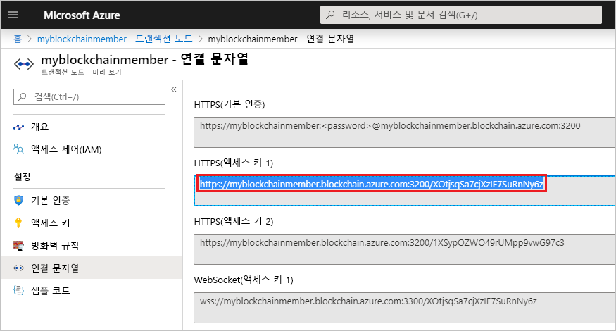

# <a name="quickstart-use-truffle-to-connect-to-azure-blockchain-service"></a>빠른 시작: Truffle을 사용하여 Azure Blockchain Service에 연결

이 빠른 시작에서는 Truffle을 사용하여 Azure Blockchain Service 트랜잭션 노드에 연결합니다. 그런 다음, Truffle 대화형 콘솔을 사용하여 **web3** 메서드를 호출하여 blockchain 네트워크와 상호 작용합니다.

[!INCLUDE [quickstarts-free-trial-note](../../../includes/quickstarts-free-trial-note.md)]

## <a name="prerequisites"></a>필수 조건

* [빠른 시작: Azure Portal을 사용하여 블록체인 멤버 만들기](create-member.md) 또는 [빠른 시작: Azure CLI를 사용하여 Azure Blockchain Service 블록체인 멤버 만들기](create-member-cli.md)를 완료합니다.
* [Truffle](https://github.com/trufflesuite/truffle)을 설치합니다. Truffle을 사용하려면 [Node.js](https://nodejs.org), [Git](https://git-scm.com/book/en/v2/Getting-Started-Installing-Git)를 포함한 여러 도구를 설치해야 합니다.
* [Python 2.7.15](https://www.python.org/downloads/release/python-2715/)를 설치합니다. Python은 Web3에 필요합니다.

## <a name="create-truffle-project"></a>Truffle 프로젝트 만들기

1. Node.js 명령 프롬프트 또는 셸을 엽니다.
1. Truffle 프로젝트 디렉터리를 만들려는 위치로 디렉터리를 변경합니다.
1. 프로젝트에 대한 디렉터리를 만들고 경로를 새 디렉터리로 변경합니다. 예를 들면 다음과 같습니다.

    ``` bash
    mkdir truffledemo
    cd truffledemo
    ```

1. Truffle 프로젝트를 초기화합니다.

    ``` bash
    truffle init
    ```

1. 프로젝트 폴더에 Ethereum JavaScript API web3를 설치합니다. 현재는 web3 버전 1.0.0-beta.37이 필요합니다.

    ``` bash
    npm install web3@1.0.0-beta.37
    ```

    설치하는 동안 npm 경고가 표시될 수 있습니다.
    
## <a name="configure-truffle-project"></a>Truffle 프로젝트 구성

Truffle 프로젝트를 구성하려면 Azure Portal의 일부 트랜잭션 노드 정보가 필요합니다.

1. [Azure Portal](https://portal.azure.com)에 로그인합니다.
1. Azure Blockchain Service 멤버로 이동합니다. **트랜잭션 노드**와 기본 트랜잭션 노드 링크를 선택합니다.

    

1. **연결 문자열**을 선택합니다.
1. **HTTPS(액세스 키 1)** 에서 연결 문자열을 복사합니다. 다음 섹션에는 문자열이 필요합니다.

    

### <a name="edit-configuration-file"></a>구성 파일 편집

그런 다음, Truffle 구성 파일을 트랜잭션 노드 엔드포인트로 업데이트해야 합니다.

1. **truffledemo** 프로젝트 폴더에서 Truffle 구성 파일 `truffle-config.js`를 편집기에서 엽니다.
1. 파일의 내용을 다음 구성 정보로 바꿉니다. 엔드포인트 주소를 포함하는 변수를 추가합니다. 꺾쇠 괄호를 이전 섹션에서 수집한 값으로 바꿉니다.

    ``` javascript
    var defaultnode = "<default transaction node connection string>";   
    var Web3 = require("web3");
    
    module.exports = {
      networks: {
        defaultnode: {
          provider: new Web3.providers.HttpProvider(defaultnode),
          network_id: "*"
        }
      }
    }
    ```

1. `truffle-config.js`에 변경 내용을 저장합니다.

## <a name="connect-to-transaction-node"></a>트랜잭션 노드에 연결

*Web3*을 사용하여 트랜잭션 노드에 연결합니다.

1. Truffle 콘솔을 사용하여 기본 트랜잭션 노드에 연결합니다. 명령 프롬프트 또는 셸에서 다음 명령을 실행합니다.

    ``` bash
    truffle console --network defaultnode
    ```

    Truffle은 기본 트랜잭션 노드에 연결되고 대화형 콘솔을 제공합니다.

    **web3** 개체에서 메서드를 호출하여 블록체인 네트워크와 상호 작용할 수 있습니다.

1. 현재 블록 수를 반환하려면 **getBlockNumber** 메서드를 호출합니다.

    ```bash
    web3.eth.getBlockNumber();
    ```

    예제 출력:

    ```bash
    truffle(defaultnode)> web3.eth.getBlockNumber();
    18567
    ```
1. Truffle 콘솔을 종료합니다.

    ```bash
    .exit
    ```

## <a name="next-steps"></a>다음 단계

이 빠른 시작에서는 Truffle을 사용하여 Azure Blockchain Service 기본 트랜잭션 노드에 연결하고 대화형 콘솔을 사용하여 현재 블록체인 블록 번호를 반환했습니다.

다음 자습서에서 Etherum용 Azure Blockchain Development Kit를 사용하여 트랜잭션을 통해 스마트 계약 함수를 만들고, 빌드하고, 배포하고, 실행해 보세요.

> [!div class="nextstepaction"]
> [Azure Blockchain Service에서 스마트 계약 생성, 빌드 및 배포](send-transaction.md)
