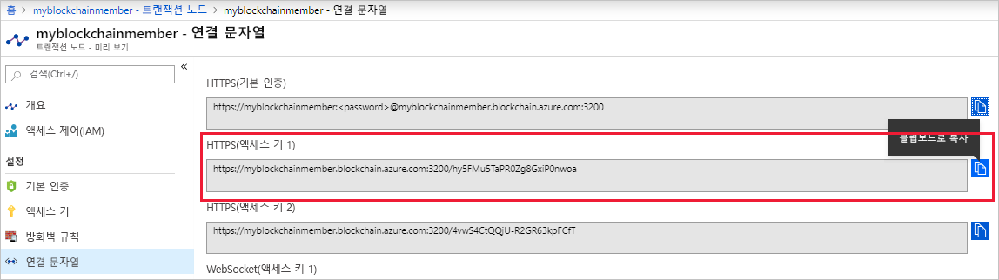

# <a name="quickstart-use-truffle-to-connect-to-a-transaction-node"></a>빠른 시작: Truffle을 사용하여 트랜잭션 노드에 연결

Truffle은 Azure Blockchain Service 트랜잭션 노드에 연결하는 데 사용할 수 있는 블록체인 개발 환경입니다.

[!INCLUDE [quickstarts-free-trial-note](../../../includes/quickstarts-free-trial-note.md)]

## <a name="prerequisites"></a>필수 조건

* [Azure Blockchain 멤버 만들기](create-member.md)
* [Truffle](https://github.com/trufflesuite/truffle)을 설치합니다. Truffle을 사용하려면 [Node.js](https://nodejs.org), [Git](https://git-scm.com/book/en/v2/Getting-Started-Installing-Git)를 포함한 여러 도구를 설치해야 합니다.
* [Python 2.7.15](https://www.python.org/downloads/release/python-2715/)를 설치합니다. Python은 Web3에 필요합니다.

## <a name="create-truffle-project"></a>Truffle 프로젝트 만들기

1. Node.js 명령 프롬프트 또는 셸을 엽니다.
1. Truffle 프로젝트 디렉터리를 만들려는 위치로 디렉터리를 변경합니다.
1. 프로젝트에 대한 디렉터리를 만들고 경로를 새 디렉터리로 변경합니다. 예를 들면 다음과 같습니다.

    ``` bash
    mkdir truffledemo
    cd truffledemo
    ```

1. Truffle 프로젝트를 초기화합니다.

    ``` bash
    truffle init
    ```

1. 프로젝트 폴더에 Ethereum JavaScript API web3를 설치합니다. 현재는 web3 버전 1.0.0-beta.37이 필요합니다.

    ``` bash
    npm install web3@1.0.0-beta.37
    ```

    설치하는 동안 npm 경고가 표시될 수 있습니다.
    
## <a name="configure-truffle-project"></a>Truffle 프로젝트 구성

Truffle 프로젝트를 구성하려면 Azure Portal의 일부 트랜잭션 노드 정보가 필요합니다.

### <a name="transaction-node-endpoint-addresses"></a>트랜잭션 노드 엔드포인트 주소

1. Azure Portal에서 기본 트랜잭션 노드로 이동하여 **트랜잭션 노드 > 연결 문자열**을 선택합니다.
1. **HTTPS(액세스 키 1)** 에서 엔드포인트 URL을 복사하여 저장합니다. 자습서의 뒷부분에 있는 스마트 계약 구성 파일에 대한 엔드포인트 주소가 필요합니다.

    

### <a name="edit-configuration-file"></a>구성 파일 편집

그런 다음, Truffle 구성 파일을 트랜잭션 노드 엔드포인트로 업데이트해야 합니다.

1. **truffledemo** 프로젝트 폴더에서 Truffle 구성 파일 `truffle-config.js`를 편집기에서 엽니다.
1. 파일의 내용을 다음 구성 정보로 바꿉니다. 엔드포인트 주소를 포함하는 변수를 추가합니다. 꺾쇠 괄호를 이전 섹션에서 수집한 값으로 바꿉니다.

    ``` javascript
    var defaultnode = "<default transaction node connection string>";   
    var Web3 = require("web3");
    
    module.exports = {
      networks: {
        defaultnode: {
          provider: new Web3.providers.HttpProvider(defaultnode),
          network_id: "*"
        }
      }
    }
    ```

1. `truffle-config.js`에 변경 내용을 저장합니다.

## <a name="connect-to-transaction-node"></a>트랜잭션 노드에 연결

*Web3*을 사용하여 트랜잭션 노드에 연결합니다.

1. Truffle 콘솔을 사용하여 기본 트랜잭션 노드에 연결합니다. 명령 프롬프트 또는 셸에서 다음 명령을 실행합니다.

    ``` bash
    truffle console --network defaultnode
    ```

    Truffle은 기본 트랜잭션 노드에 연결되고 대화형 콘솔을 제공합니다.

    **web3** 개체에서 메서드를 호출하여 트랜잭션 노드와 상호 작용할 수 있습니다.

1. 현재 블록 수를 반환하려면 **getBlockNumber** 메서드를 호출합니다.

    ```bash
    web3.eth.getBlockNumber();
    ```

    예제 출력:

    ```bash
    truffle(defaultnode)> web3.eth.getBlockNumber();
    18567
    ```
1. Truffle 콘솔을 종료합니다.

    ```bash
    .exit
    ```

## <a name="next-steps"></a>다음 단계

이 빠른 시작에서는 Azure Blockchain Service 기본 트랜잭션 노드에 연결하는 Truffle 프로젝트를 만들었습니다.

다음 자습서에서는 Etherum 및 Truffle용 Azure Blockchain Development Kit를 사용하여 컨소시엄 블록체인 네트워크에서 트랜잭션을 통해 스마트 계약 함수를 실행합니다.

> [!div class="nextstepaction"]
> [Azure Blockchain Service에서 스마트 계약 사용](send-transaction.md)
