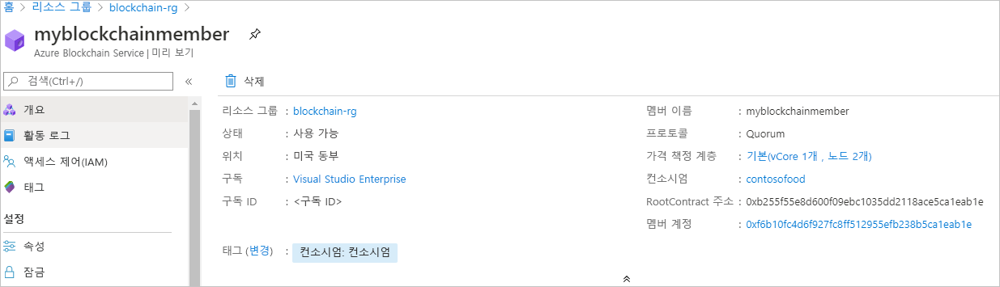

# 빠른 시작: ARM 템플릿을 사용하여 Azure Blockchain Service 멤버 만들기

이 빠른 시작에서는 ARM 템플릿(Azure Resource Manager 템플릿)을 사용하여 Azure Blockchain Service에 새 블록체인 멤버 및 컨소시엄을 배포합니다. Azure Blockchain Service 멤버는 프라이빗 컨소시엄 블록체인 네트워크의 블록체인 노드입니다. 멤버를 프로비저닝할 때 컨소시엄 네트워크를 만들거나 조인할 수 있습니다. 컨소시엄 네트워크에 멤버가 하나 이상이 필요합니다. 참가자가 필요로 하는 블록체인 멤버 수는 시나리오에 따라 달라집니다. 컨소시엄 참가자는 하나 이상의 블록체인 멤버를 보유하거나 다른 참가자와 멤버를 공유할 수 있습니다. 컨소시엄에 대한 자세한 내용은 [Azure Blockchain Service 컨소시엄](consortium.md)을 참조하세요.

[!INCLUDE [About Azure Resource Manager](../../../includes/resource-manager-quickstart-introduction.md)]

환경이 필수 구성 요소를 충족하고 ARM 템플릿 사용에 익숙한 경우 **Azure에 배포** 단추를 선택합니다. 그러면 Azure Portal에서 템플릿이 열립니다.

## 필수 구성 요소

Azure 구독이 아직 없는 경우 시작하기 전에 [체험](https://azure.microsoft.com/free/) 계정을 만듭니다.

## 템플릿 검토

이 빠른 시작에서 사용되는 템플릿은 [Azure 빠른 시작 템플릿](https://azure.microsoft.com/resources/templates/201-blockchain-asaservice/)에서 나온 것입니다.

:::code language="json" source="~/quickstart-templates/201-blockchain-asaservice/azuredeploy.json":::

템플릿에 정의된 Azure 리소스:

* [**Microsoft.Blockchain/blockchainMembers**](/azure/templates/microsoft.blockchain/blockchainmembers)

## 템플릿 배포

1. 다음 링크를 선택하여 Azure에 로그인하고 템플릿을 엽니다.

    

1. Azure Blockchain Service 멤버에 대한 설정을 지정합니다.

    설정 | Description
    --------|------------
    Subscription | 서비스에 사용할 Azure 구독을 선택합니다. 구독이 여러 개인 경우, 리소스에 대해 요금이 청구되는 구독을 선택합니다.
    Resource group | 새 리소스 그룹 이름을 만들거나, 구독에서 기존 이름을 선택합니다.
    지역 | 리소스 그룹을 만들 지역을 선택합니다. 컨소시엄의 모든 멤버가 같은 위치에 있어야 합니다. 배포에 사용할 수 있는 위치는 *westeurope, eastus, southeastasia, westeurope, northeurope, westus2* 및 *japaneast*입니다. 기능은 일부 지역에서 사용하지 못할 수도 있습니다. Azure Blockchain Data Manager는 다음 Azure 지역에서 사용할 수 있습니다. 즉 미국 동부 및 서유럽에서 실행되는 기본 웹 사이트의 두 인스턴스
    Bc 멤버 이름 | Azure Blockchain Service 멤버의 고유한 이름을 선택합니다. 블록체인 멤버 이름에는 소문자와 숫자만 사용할 수 있습니다. 첫 번째 자리는 반드시 문자여야 합니다. 이름의 길이는 2-20자 사이여야 합니다.
    컨소시엄 이름 | 고유한 이름을 입력합니다. 컨소시엄에 대한 자세한 내용은 [Azure Blockchain Service 컨소시엄](consortium.md)을 참조하세요.
    멤버 암호 | 멤버의 기본 트랜잭션 노드에 대한 암호입니다. 블록체인 멤버의 기본 트랜잭션 노드 공용 엔드포인트에 연결할 때 기본 인증용 암호를 사용합니다.
    컨소시엄 관리 계정 암호 | 컨소시엄 계정 암호는 멤버용으로 생성된 Ethereum 계정의 프라이빗 키를 암호화하는 데 사용됩니다. 이는 컨소시엄 관리에 사용됩니다.
    SKU 계층 | 새 서비스의 가격 책정 계층입니다. **표준** 계층과 **기본** 계층 중에 선택합니다. 개발, 테스트 및 개념 증명에 *기본* 계층을 사용합니다. 프로덕션 등급 배포에 *표준* 계층을 사용합니다. Blockchain Data Manager를 사용하거나 대량의 프라이빗 트랜잭션을 전송하는 경우 *표준* 계층도 사용합니다. 멤버를 만든 후 기본과 표준 간의 가격 책정 계층 변경은 지원되지 않습니다.
    SKU 이름 | 새 서비스의 노드 구성 및 비용입니다. 기본에는 **B0**를 사용하고, 표준에는 **S0**를 사용합니다.
    위치 | 멤버를 만들 위치를 선택합니다. 기본적으로 리소스 그룹 위치는 `[resourceGroup().location]`으로 사용됩니다. 컨소시엄의 모든 멤버가 같은 위치에 있어야 합니다. 배포에 사용할 수 있는 위치는 *westeurope, eastus, southeastasia, westeurope, northeurope, westus2* 및 *japaneast*입니다. 기능은 일부 지역에서 사용하지 못할 수도 있습니다. Azure Blockchain Data Manager는 다음 Azure 지역에서 사용할 수 있습니다. 즉 미국 동부 및 서유럽에서 실행되는 기본 웹 사이트의 두 인스턴스

1. **검토 + 만들기**를 선택하여 템플릿을 확인하고 배포합니다.

  여기에서 Azure Portal은 템플릿을 배포하는데 사용됩니다. Azure PowerShell, Azure CLI 및 REST API를 사용할 수도 있습니다. 다른 배포 방법을 알아보려면 [템플릿 배포](../../azure-resource-manager/templates/deploy-powershell.md)를 참조하세요.

## 배포된 리소스 검토

Azure Portal을 사용하여 배포된 Azure Blockchain 서비스 멤버의 세부 정보를 볼 수 있습니다. 포털에서 Azure Blockchain 서비스 멤버를 포함하는 리소스 그룹으로 이동합니다. 만든 블록체인 멤버를 선택합니다.

## 리소스 정리

앞에서 만든 블록체인 멤버를 다음 빠른 시작 또는 자습서에 사용할 수 있습니다. 더 이상 필요 없는 경우 빠른 시작을 위해 만든 리소스 그룹을 삭제하여 리소스를 삭제할 수 있습니다.

리소스 그룹을 삭제하려면 다음을 수행합니다.

1. Azure Portal의 왼쪽 탐색 창에서 **리소스 그룹**으로 이동하고 삭제하려는 리소스 그룹을 선택합니다.
2. **리소스 그룹 삭제**를 선택합니다. 리소스 그룹 이름을 입력하여 삭제를 확인하고 **삭제**를 선택합니다.

## 다음 단계

이 빠른 시작에서는 Azure Blockchain Service 멤버 및 새로운 컨소시엄을 배포했습니다. 다음 빠른 시작을 통해 Ethereum용 Azure Blockchain Development Kit를 사용하여 Azure Blockchain Service 멤버에 연결합니다.

> [!div class="nextstepaction"]
> [Visual Studio Code를 사용하여 Azure Blockchain Service에 연결](connect-vscode.md)