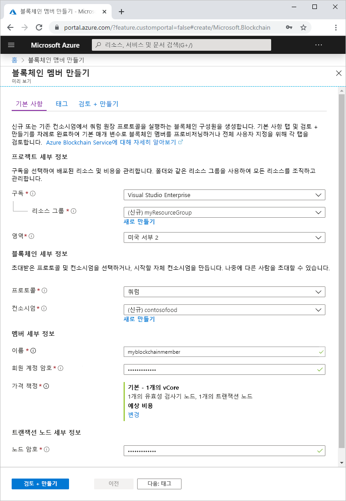

# 빠른 시작: Azure Portal을 사용하여 Azure Blockchain Service 만들기

Azure Blockchain Service는 스마트 계약 내에서 비즈니스 논리를 실행할 수 있는 블록체인 플랫폼입니다. 이 빠른 시작에서는 Azure Portal을 통해 관리 원장을 만들어서 시작하는 방법을 보여줍니다.

[!INCLUDE [quickstarts-free-trial-note](../../../includes/quickstarts-free-trial-note.md)]

## 관리 원장 만들기

Azure Blockchain Service는 정의된 컴퓨팅 및 스토리지 리소스 세트를 사용하여 만들어집니다.

1. [Azure Portal](https://portal.azure.com)에 로그인합니다.
1. Azure Portal의 왼쪽 위 모서리에서 **리소스 만들기**를 선택합니다.
1. **블록체인** > **Azure Blockchain Service**를 선택합니다.
1. 템플릿을 완료합니다.

    

    설정 | 설명
    --------|------------
    블록체인 멤버 | Azure Blockchain Service 멤버를 식별하는 고유한 이름을 선택합니다. 블록체인 멤버 이름에는 소문자와 숫자만 사용할 수 있습니다. 첫 번째 자리는 반드시 문자여야 합니다. 이름의 길이는 2-20자 사이여야 합니다.
    구독 | 서비스에 사용할 Azure 구독을 선택합니다. 구독이 여러 개인 경우, 리소스에 대해 요금이 청구되는 구독을 선택합니다.
    리소스 그룹 | 새 리소스 그룹 이름 또는 구독의 기존 이름입니다.
    지역 | 위치는 컨소시엄의 모든 멤버에 대해 동일해야 합니다.
    멤버 계정 암호 | 멤버 계정 암호는 멤버용으로 생성된 Ethereum 계정의 프라이빗 키를 암호화하는 데 사용됩니다. 컨소시엄 관리용 멤버 계정과 멤버 계정 암호를 사용합니다.
    컨소시엄 이름 | 새 컨소시엄인 경우 고유한 이름을 입력합니다. 초대를 통해 컨소시엄에 참가하는 경우 이 값은 참가하는 컨소시엄입니다.
    설명 | 컨소시엄에 대한 설명입니다.
    프로토콜 |  미리 보기는 Quorum 프로토콜을 지원합니다.
    가격 | 새 서비스의 노드 구성입니다. **표준**을 선택합니다. 유효성 검사기 노드 2개와 트랜잭션 노드 1개가 기본 설정입니다.
    트랜잭션 노드 암호 | 멤버의 기본 트랜잭션 노드에 대한 암호입니다. 블록체인 멤버의 기본 트랜잭션 노드 공용 엔드포인트에 연결할 때 기본 인증용 암호를 사용합니다.

1. **만들기**를 선택하여 서버를 프로비저닝합니다. 프로비저닝에는 약 10분이 걸립니다.
1. 배포 프로세스를 모니터링하려면 도구 모음에서 **알림**을 선택합니다.
1. 배포 후에는 블록체인 멤버로 이동합니다.

**개요**를 선택하면 RootContract 주소 및 멤버 계정을 포함하여 서비스에 대한 기본 정보를 볼 수 있습니다.

## 리소스 정리

앞에서 만든 멤버를 다음 빠른 시작 또는 자습서에 사용할 수 있습니다. 더 이상 필요 없으면 Azure Blockchain Service에서 만든 `myResourceGroup` 리소스 그룹을 삭제하여 리소스를 삭제할 수 있습니다.

리소스 그룹을 삭제하려면 다음을 수행합니다.

1. Azure Portal의 왼쪽 탐색 창에서 **리소스 그룹**으로 이동하고 삭제하려는 리소스 그룹을 선택합니다.
2. **리소스 그룹 삭제**를 선택합니다. 리소스 그룹 이름을 입력하여 삭제를 확인하고 **삭제**를 선택합니다.

## 다음 단계

> [!div class="nextstepaction"]
> [MetaMask를 사용하여 스마트 계약 연결 및 배포](connect-metamask.md)