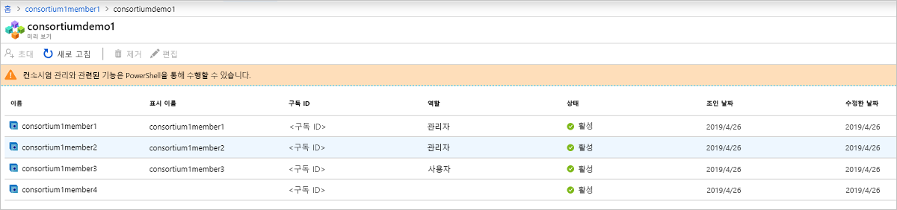

# Azure Blockchain Service 란?

Azure Blockchain 서비스는 성장 하 고 Azure에서 대규모로 블록 체인 네트워크를 작동할 수 있도록 해 주는 완전히 관리 되는 원장 서비스. 인프라 관리 뿐만 아니라 블록 체인 네트워크 거 버 넌 스에 대 한 통합된 제어를 제공 함으로써 Azure Blockchain 서비스 제공 합니다.

* 간단한 네트워크 배포 및 운영
* 기본 제공 컨소시엄 관리
* 스마트 계약을 친숙 한 개발 도구를 사용 하 여 개발

Azure Blockchain 서비스는 여러 원장 프로토콜을 지원 하도록 설계 되었습니다. 현재 Ethereum 지원 제공 [쿼럼](https://www.jpmorgan.com/Quorum) 원장을 사용 하는 [IBFT](https://github.com/jpmorganchase/quorum/wiki/Quorum-Consensus) 합의 메커니즘입니다.

이러한 기능에는 인증이 필요하지 않고 추가 비용 없이 제공됩니다. 앱 개발 및 비즈니스 논리 보다는 시간과 가상 머신과 인프라를 관리 하는 리소스 할당에 집중할 수 있습니다. 또한 원하는 플랫폼에 새로운 기술을 배울 필요 없이 솔루션을 제공 하 고 오픈 소스 도구를 사용 하 여 응용 프로그램 개발을 계속 수 있습니다.

## 네트워크 배포 및 운영

Azure Blockchain 확장을 사용 하 여 Visual Studio code를 통해 서 뿐만 아니라 Azure portal, Azure CLI를 통해 Azure Blockchain 서비스 배포를 수행할 수 있습니다.  트랜잭션 및 유효성 검사기 노드, 서비스 관리 저장소 뿐만 아니라 보안 격리에 대 한 Azure Virtual Network를 프로 비전을 포함 하 여 배포 간소화 됩니다.  또한 새 블록 체인 멤버를 배포할 때 사용자도 만들거나 컨소시엄에 참여 합니다.  컨소시엄 공유 블록 체인에서 서로 안전 하 게 통신 하려면 다른 Azure 구독에 여러 당사자를 사용 합니다.  이 간소화 된 배포 분 일에서 블록 체인 네트워크 배포를 줄일 수 있습니다.

### 성능 및 서비스 계층

Azure Blockchain 서비스는 두 가지 서비스 계층을 제공합니다. *기본적인* 하 고 *표준*합니다. 각 계층은 다양 한 성능 및 간단한 개발 지원 및 대규모 워크 로드를 최대 테스트 기능을 프로덕션 blockchain 배포 확장을 제공 합니다. 두 계층은 하나 이상의 트랜잭션 노드 및 하나의 유효성 검사기 노드 (기본) 또는 두 유효성 검사기 노드의 (표준)을 포함 합니다.

2 개의 유효성 검사 노드를 제공 하는 것 외에도 합니다 *표준* 계층 2를 제공 *Vcore* 각 트랜잭션 및 유효성 검사기 노드에 대 한 기본 계층 1 vCore 구성을 제공 하는 반면.  블록 체인 워크 로드 프로덕션에 맞는 최적의 성능을 보장 다른 인프라 관련 서비스에 사용할 수 있지만 나머지 1 vCore 1 vCore 트랜잭션 노드와 유효성 검사기에 대 한 2 개 Vcore를 제공 하 여 쿼럼 원장에 전용 수 있습니다. 가격 책정 세부 정보에 대 한 자세한 내용은 참조 하세요. [Azure Blockchain Service 가격 책정](https://azure.microsoft.com/pricing/details/blockchain-service)합니다.

### 보안 및 유지 관리

첫 번째 블록 체인 멤버를 프로 비전 한 후에 멤버 추가 트랜잭션 노드를 추가할 수가 있습니다.  기본적으로 트랜잭션 노드는 방화벽 규칙을 통해 보안이 유지 되 고 액세스용으로 구성 해야 합니다.  또한 모든 트랜잭션 노드에 TLS 통해 동작 중인 데이터를 암호화합니다.  Azure Active Directory 통합 뿐만 아니라 방화벽 규칙, 기본 인증, 액세스 키를 포함 하 여 트랜잭션 노드 액세스를 보호 하기 위한 여러 옵션이 있습니다. 자세한 내용은 [트랜잭션 노드를 구성](configure-transaction-nodes.md) 하 고 [Azure Active Directory 액세스를 구성](configure-aad.md)합니다.

Azure Blockchain 서비스 관리 되는 서비스로 blockchain 멤버의 노드가 최신 호스트 운영 체제 및 원장 소프트웨어 스택 업데이트, 고가용성 (표준 계층에만 해당)에 대 한 구성, DevOps의 대부분을 제거를 사용 하 여 패치를 보장 일반적인 IaaS 블록 체인 노드에 필요합니다.  패치 적용 및 업데이트에 대 한 자세한 내용은 참조 하세요. [지원 되는 Azure Blockchain Service 원장 버전](ledger-versions.md)합니다.

### 모니터링 및 로깅

또한 Azure Blockchain Service 다양 한 메트릭을 제공 Azure 모니터링 서비스를 통해 노드의 CPU, 메모리 및 저장소 사용량에 대 한 정보 뿐만 아니라 트랜잭션 및 찾은 요소와 같은 블록 체인 네트워크 활동에 대 한 유용한 정보를 제공 합니다. 트랜잭션 큐 깊이 뿐만 아니라 활성 연결.  메트릭 보기는 블록 체인 응용 프로그램에 중요 한 정보를 제공 하 여 사용자 지정할 수 있습니다.  또한 임계값은 사용자가 전자 메일 또는 문자 메시지 보내기, 논리 앱, Azure Function을 실행 또는 정의 된 사용자 지정 웹 후크 보내기 같은 작업을 트리거할 수 있도록 하는 경고를 통해 정의할 수 있습니다.

Azure Log Analytics를 통해 사용자는 쿼럼 원장에 나 트랜잭션 노드에 다른 시도 같은 중요 한 정보 연결에 관련 된 로그를 볼 수 있습니다.

## 기본 제공 컨소시엄 관리

첫 번째 블록 체인 멤버를 배포 하는 경우 조인 하거나 새 컨소시엄을 만듭니다.  컨소시엄은 거 버 넌 스 및 다자간 프로세스에서 거래 blockchain 구성원 간의 연결을 관리 하는 데는 논리적 그룹입니다.  Azure Blockchain 서비스 들 컨소시엄에서 작업 멤버를 결정 하는 미리 정의 된 스마트 계약을 통해 기본 제공 관리 제어를 제공 합니다.  이러한 거 버 넌 스 컨트롤 컨소시엄의 관리자가 필요에 따라 사용자 지정할 수 있습니다. 새 컨소시엄을 만들면 blockchain 멤버 사용자 컨소시엄을 조인할 다른 당사자를 초대 하는 기능을 사용 하도록 설정 된 컨소시엄의 기본 관리자입니다.  이전에 초대 받은 경우에 컨소시엄을 조인할 수 있습니다.  컨소시엄을 조인할 경우 blockchain 멤버 컨소시엄의 관리자가 작성해 거 버 넌 스 제어 하기 쉽습니다.

멤버 추가 및 제거 하면 컨소시엄에서 같은 관리 작업 컨소시엄 PowerShell 및 REST API를 통해 액세스할 수 있습니다. 공용 인터페이스를 사용 하 여 보다는 수정 및 스마트 계약 solidity 기반 제출 컨소시엄을 프로그래밍 방식으로 관리할 수 있습니다. 자세한 내용은 [컨소시엄 관리](consortium.md)합니다.

## 친숙 한 개발 도구를 사용 하 여 개발

오픈 소스 쿼럼 Ethereum 원장에 따라 개발할 수 있습니다 Azure Blockchain 서비스에 대 한 응용 프로그램 같은 방식으로 기존 Ethereum 응용 프로그램으로. 주요 업계 파트너와 작업을 Azure Blockchain 개발 키트 Visual Studio Code 확장 수 개발자가 smart contracts를 빌드하 Truffle Suite와 같은 친숙 한 도구를 활용할 수 있습니다. Azure Blockchain 개발 키트 확장을 사용 개발자를 만들려면 하거나 연결할 수 있습니다 및 기존 컨소시엄 빌드하고 스마트를 배포할 수 있도록 계약 모두 하나의 IDE에서. Azure Blockchain Visual Studio Code 확장을 사용 만들기 또는 빌드하고 하나의 IDE에서 하 여 smart contracts를 배포할 수 있도록 기존 컨소시엄을 연결할 수 있습니다. 자세한 내용은 [VS Code marketplace에서 Azure Blockchain 개발 키트](https://aka.ms/vscodebcextension) 하며 [Azure Blockchain 개발 키트 사용자 가이드](https://aka.ms/vscodebcextensionwiki )합니다.

## 지원 및 피드백

도움이 필요 하거나 의견이 있으십니까?

* 방문 합니다 [Azure 블록 체인 블로그](https://azure.microsoft.com/blog/topics/blockchain/)를 [Microsoft 기술 커뮤니티](https://techcommunity.microsoft.com/t5/Blockchain/bd-p/AzureBlockchain), 및 [Azure Blockchain 포럼](https://social.msdn.microsoft.com/Forums/home?forum=azureblockchain)합니다.
* 피드백을 제공하거나 새 기능을 요청하려면 [UserVoice](https://feedback.azure.com/forums/921130-azure-blockchain-service)를 통해 항목을 만드세요.

## 다음 단계

시작 하려면 빠른 시작을 시도 하거나 이러한 리소스에서 자세한 내용을 확인 합니다.
* [Azure portal을 사용 하 여 블록 체인 멤버를 만들려면](create-member.md) 또는 [Azure CLI를 사용 하 여 블록 체인 멤버를 만들려면]()
* 비용 비교 및 계산기에 대 한 참조를 [가격 책정 페이지](https://azure.microsoft.com/pricing/details/blockchain-service)합니다.
* 사용 하 여 첫 번째 앱 빌드를 [Azure Blockchain 개발 키트](https://github.com/Azure-Samples/blockchain-devkit)
* Azure Blockchain VSCode 확장 [사용자 가이드](https://github.com/Microsoft/vscode-azure-blockchain-ethereum/wiki)
