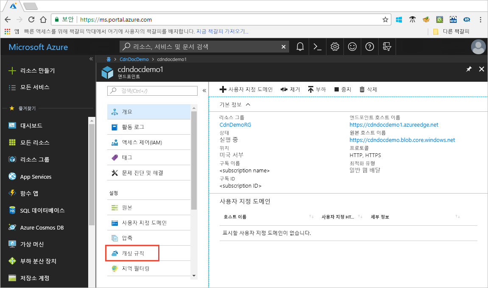

# 캐싱 규칙을 사용하여 Azure CDN 캐싱 동작 제어

> [!NOTE] 
> 캐싱 규칙은 **Verizon의 Azure CDN 표준** 및 **Akamai의 Azure CDN 표준** 프로필에만 사용할 수 있습니다. **Verizon의 Azure CDN 프리미엄** 프로필은 유사한 기능을 위해 **관리** 포털에서 [Azure CDN 규칙 엔진](cdn-rules-engine.md)을 사용해야 합니다.
 
Azure CDN(콘텐츠 전송 네트워크)에는 파일을 캐시하는 방법을 제어하는 방법이 두 가지입니다. 

- 캐싱 규칙: 이 문서에서는 콘텐츠 배달 네트워크 (CDN) 캐싱 규칙을 사용 하 여 전역적으로 그리고 URL 경로 및 파일 확장명 등 사용자 지정 조건을 사용 하 여 기본 캐시 만료 동작을 수정 하는 방법을 설명 합니다. Azure CDN에는 두 가지 유형의 캐싱 규칙이 제공됩니다.

   - 전역 캐싱 규칙: 끝점에 대 한 모든 요청에 영향을 주는 프로필에서 각 끝점에 대해 하나의 전역 캐싱 규칙을 설정할 수 있습니다. 전역 캐싱 규칙은 설정된 경우 모든 HTTP 캐시 지시문 헤더를 재정의합니다.

   - 사용자 지정 캐싱 규칙: 하나 이상의 사용자 지정 캐싱 규칙 각 끝점에 대 한 프로필에서 설정할 수 있습니다. 사용자 지정 캐싱 규칙은 설정되면 특정 경로 및 파일 확장명과 일치하고, 순서대로 처리되며, 전역 캐싱 규칙을 재정의합니다. 

- 쿼리 문자열 캐싱: Azure CDN 쿼리 문자열을 사용 하 여 요청에 대 한 캐싱을 처리 하는 방법을 조정할 수 있습니다. 자세한 내용은 [쿼리 문자열을 사용하여 Azure CDN 캐싱 동작 제어](cdn-query-string.md)를 참조하세요. 파일을 캐시할 수 없는 경우 쿼리 문자열 캐싱 설정은 캐싱 규칙 및 CDN 기본 동작을 기반으로 적용되지 않습니다.

기본 캐싱 동작 및 캐싱 지시문 헤더에 대한 자세한 내용은 [캐싱 동작 방식](cdn-how-caching-works.md)을 참조하세요. 

## Azure CDN 캐싱 규칙에 액세스

1. Azure Portal을 열고 CDN 프로필을 선택한 다음 엔드포인트를 선택합니다.

2. 설정 아래의 왼쪽 창에서 **캐싱 규칙**을 선택합니다.

   

   **캐싱 규칙** 페이지가 나타납니다.

   

## 캐싱 동작 설정
전역 및 사용자 지정 캐싱 규칙의 경우 다음 **캐싱 동작** 설정을 지정할 수 있습니다.

- **캐시 무시**: 캐시 하 고 원본 제공 캐시 지시문 헤더를 무시 하지 않습니다.

- **재정의**: 무시 된 원본 제공 캐시 기간입니다. 제공된 된 캐시 기간을 대신 사용 합니다. 이 캐시 제어를 재정의 하지 것입니다: 캐시 없음.

- **누락 된 경우 설정**: 존재 하는 경우 원본 제공 캐시 지시문 헤더를 인식 그렇지 않은 경우 제공된 된 캐시 기간을 사용 합니다.

## 캐시 만료 기간
전역 및 사용자 지정 캐싱 규칙의 경우, 캐시 만료 기간을 일, 시, 분 및 초 단위로 지정할 수 있습니다.

- **재정의** 및 **누락된 경우 설정** **캐싱 동작** 설정에 대해 유효한 캐시 기간 범위는 0초와 366일 사이입니다. 값이 0초인 경우 CDN이 콘텐츠를 캐시하지만 원본 서버를 통해 각 요청을 다시 확인해야 합니다.

- **캐시 무시** 설정은 캐시 기간이 자동으로 0초로 설정되며 변경할 수 없습니다.

## 사용자 지정 캐싱 규칙 일치 조건

사용자 지정 캐시 규칙의 경우 두 가지 일치 조건을 사용할 수 있습니다.
 
- **경로**: 이 조건은 도메인 이름을 제외한 URL의 경로 일치 하 고 와일드 카드 기호를 지원 (\*). 예를 들어 _/myfile.html_, _/my/folder/*_ 및 _/my/images/*.jpg_입니다. 최대 길이는 260자입니다.

- **확장**: 요청된 된 파일의 파일 확장명과 일치 하는이 조건입니다. 일치시킬 파일 확장명을 쉼표로 구분된 목록으로 제공할 수 있습니다. 예를 들어 _.jpg_, _.mp3_ 또는 _.png_입니다. 최대 확장명 수는 50이고 확장명당 최대 문자 수는 16입니다. 

## 전역 및 사용자 지정 규칙 처리 순서
전역 및 사용자 지정 캐싱 규칙은 다음 순서로 처리됩니다.

- 전역 캐싱 규칙이 기본 CDN 캐싱 동작(HTTP 캐시 지시문 헤더 설정)보다 우선합니다. 

- 사용자 지정 캐싱 규칙은 적용되는 위치에서 전역 캐싱 규칙보다 우선합니다. 사용자 지정 캐싱 규칙은 위에서 아래로 순서로 처리됩니다. 즉, 요청이 두 조건과 일치하면 목록 맨 아래에 있는 규칙이 목록 맨 위에 있는 규칙보다 우선합니다. 따라서, 보다 구체적인 규칙을 목록의 아래쪽에 넣어야 합니다.

**예제**:
- 전역 캐싱 규칙: 
   - 캐싱 동작: **재정**
   - 캐시 만료 기간: 1일

- 사용자 지정 캐싱 규칙 #1:
   - 일치 조건: **Path**
   - 일치 값: _/home/*_
   - 캐싱 동작: **재정**
   - 캐시 만료 기간: 2일

- 사용자 지정 캐싱 규칙 #2:
   - 일치 조건: **확장**
   - 일치 값: _.html_
   - 캐싱 동작: **누락 된 경우 설정**
   - 캐시 만료 기간: 3일

이러한 규칙이 설정 되 면,에 대 한 요청  _&lt;엔드포인트&gt;_ 사용자 지정 캐싱 규칙 # 2로 설정 되어 있는.azureedge.net/home/index.html 트리거: **누락 된 경우 설정** 3 일입니다. 따라서 *index.html* 파일에 `Cache-Control` 또는 `Expires` HTTP 헤더가 있으면 해당 헤더가 사용되고 그렇지 않고 이러한 헤더가 설정되어 있지 않으면 파일은 3일간 캐시됩니다.

> [!NOTE] 
> 규칙을 변경하기 전에 캐시된 파일은 원본 캐시 기간 설정을 유지합니다. 캐시 기간을 다시 설정하려면 [파일을 제거](cdn-purge-endpoint.md)해야 합니다. 
>
> Azure CDN 구성 변경이 네트워크 통해 전파되려면 다소 시간이 걸릴 수 있습니다. 
> - **Akamai의 Azure CDN Standard** 프로필의 경우, 일반적으로 1분 이내에 전파가 완료됩니다. 
> - **Verizon의 Azure CDN Standard** 프로필의 경우 일반적으로 10분 후 전파가 완료됩니다.  
>

## 참고 항목

- [캐싱 동작 방식](cdn-how-caching-works.md)
- [자습서: Azure CDN 캐싱 규칙 설정](cdn-caching-rules-tutorial.md)
