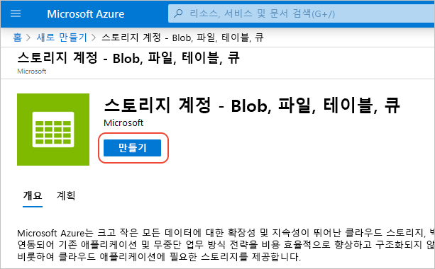
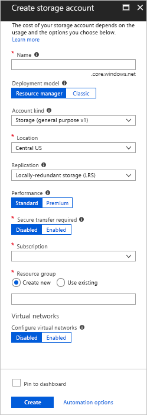
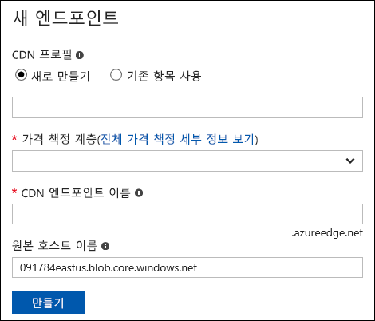
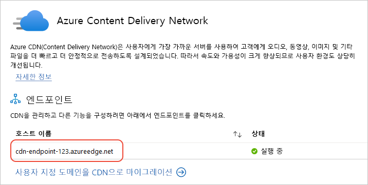
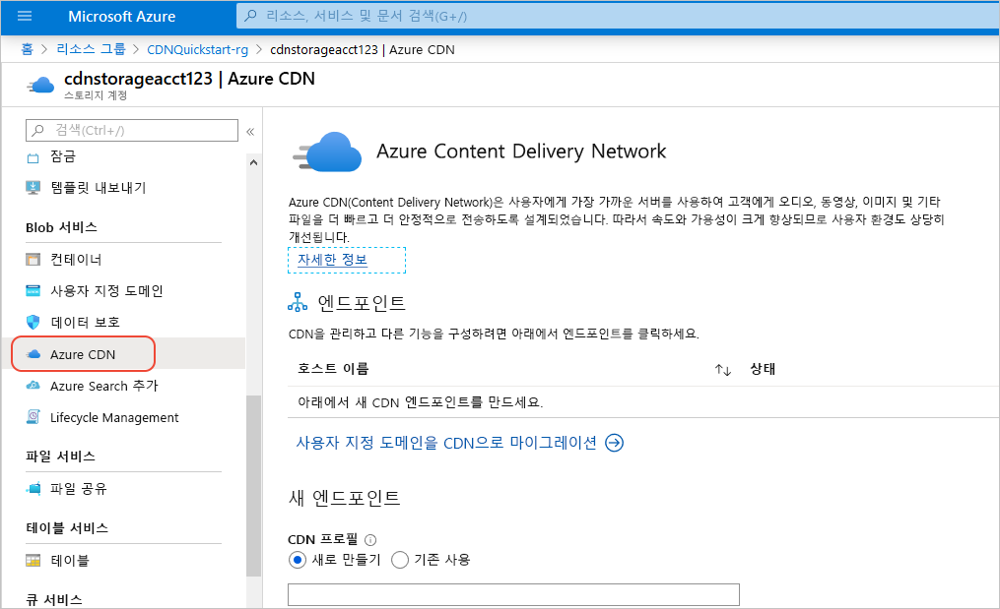

# 빠른 시작: Azure CDN과 Azure Storage 계정 통합
이 빠른 시작에서는 [Azure CDN(콘텐츠 배달 네트워크)](cdn-overview.md)이 Azure 저장소에서 콘텐츠를 캐시하도록 활성화합니다. Azure CDN은 개발자에게 고대역폭 콘텐츠를 배달하기 위한 전역 솔루션을 제공합니다. 미국, 유럽, 아시아, 오스트레일리아 및 남아메리카의 물리적 노드에 컴퓨팅 인스턴스의 Blob 및 정적 콘텐츠를 캐시할 수 있습니다.

[!INCLUDE [quickstarts-free-trial-note](../../includes/quickstarts-free-trial-note.md)]

## Azure Portal에 로그인
Azure 계정을 사용하여 [Azure Portal](https://portal.azure.com)에 로그인합니다.

## 저장소 계정 만들기
다음 절차에 따라 Azure 구독에 대한 새 저장소 계정을 만듭니다. 스토리지 계정을 통해 Azure Storage 서비스에 액세스할 수 있습니다. 스토리지 계정은 Azure Blob, Queue Storage, Table Storage와 같은 각 Azure Storage 서비스 구성 요소에 액세스하기 위한 가장 높은 수준의 네임스페이스를 나타냅니다. 자세한 내용은 [Microsoft Azure Storage 소개](../storage/common/storage-introduction.md) 를 참조하세요.

저장소 계정을 만들려면 관련 구독에 대한 서비스 관리자 또는 공동 관리자여야 합니다.

Azure Portal 및 Powershell을 포함하는 여러 가지 방법을 사용하여 저장소 계정을 만들 수 있습니다. 이 빠른 시작에서는 Azure Portal을 사용하는 방법을 설명합니다.   

**Azure 구독에 대한 저장소 계정을 만들려면**

1. Azure Portal의 왼쪽 위에서 **리소스 만들기**를 선택합니다. 

    **새로 만들기** 창이 나타납니다.

2. **저장소**를 선택한 다음, **저장소 계정 - Blob, 파일, 테이블, 큐**를 선택합니다.
    
    

    **저장소 계정 만들기** 창이 나타납니다.   

    

3. **이름** 상자에 하위 도메인 이름을 입력합니다. 이 입력에는 3-24자의 소문자와 숫자를 사용할 수 있습니다.
   
    이 값은 구독에 대한 Blob, 큐 또는 테이블 리소스의 주소를 지정하는 데 사용되는 URI 내의 호스트 이름이 됩니다. Blob Storage의 컨테이너 리소스 주소를 지정하려면 다음 형식의 URI를 사용합니다.
   
    http:// *&lt;StorageAcountLabel&gt;* .blob.core.windows.net/ *&lt;mycontainer&gt;*

    여기서 *&lt;StorageAccountLabel&gt;* 은 **이름** 상자에 입력한 값을 나타냅니다.
   
    > [!IMPORTANT]    
    > URL 레이블은 저장소 계정 URI의 하위 도메인을 구성하며, Azure에서 호스트된 모든 서비스에서 고유해야 합니다.
   
    이 값은 프로그래밍 방식으로 이 계정에 액세스할 때 또는 포털에서 이 저장소 계정의 이름으로도 사용됩니다.
    
4. 나머지 설정의 경우 다음 표에 지정된 값을 사용합니다.

    | 설정  | 값 |
    | -------- | ----- |
    | **배포 모델** | 기본값을 사용합니다. |
    | **계정 종류** | 기본값을 사용합니다. |
    | **위치**:    | 드롭다운 목록에서 **미국 중부**를 선택합니다. |
    | **복제** | 기본값을 사용합니다. |
    | **성능** | 기본값을 사용합니다. |
    | **보안 전송 필요** | 기본값을 사용합니다. |
    | **구독** | 드롭다운 목록에서 Azure 구독을 선택합니다. |
    | **리소스 그룹** | **새로 만들기**를 선택하고, 리소스 그룹 이름에 *my-resource-group-123*을 입력합니다. 이 이름은 전역적으로 고유해야 합니다. 이미 사용 중인 경우 다른 이름을 입력하거나 **기존 항목 사용**을 선택하고 드롭다운 목록에서 **my-resource-group-123**을 선택할 수 있습니다.  리소스 그룹에 대한 자세한 내용은 [Azure Resource Manager 개요](../azure-resource-manager/resource-group-overview.md#resource-groups)를 참조하세요.| 
    | **가상 네트워크 구성** | 기본값을 사용합니다. |  
    
5. **대시보드에 고정**을 선택하여 저장소 계정을 만든 후 대시보드에 저장합니다.
    
6. **만들기**를 선택합니다. 저장소 계정 만들기를 완료하려면 몇 분 정도 걸릴 수 있습니다.

## 저장소 계정에 대해 Azure CDN 활성화

저장소 계정에서 직접 저장소 계정에 대해 Azure CDN을 사용하도록 설정할 수 있습니다. [대형 파일 다운로드 최적화](cdn-optimization-overview.md#large-file-download)처럼 CDN 엔드포인트에 대한 고급 구성 설정을 지정하려면 [Azure CDN 확장](cdn-create-new-endpoint.md)을 대신 사용하여 CDN 프로필 및 엔드포인트를 만들면 됩니다.

1. 대시보드에서 저장소 계정을 선택하고 왼쪽 창에서 **Azure CDN**을 선택합니다. **Azure CDN** 단추가 바로 표시되지 않으면 왼쪽 창의 **검색** 상자에 찾을 CDN을 입력할 수 있습니다.
    
    **Azure CDN** 페이지가 나타납니다.

    
    
2. 다음 표에 지정된 필요한 정보를 입력하여 새 엔드포인트를 만듭니다.

    | 설정  | 값 |
    | -------- | ----- |
    | **CDN 프로필** | **새로 만들기**를 선택하고 프로필 이름에 *my-cdn-profile-123*을 입력합니다. 이 이름은 전역적으로 고유해야 합니다.  |
    | **가격 책정 계층** | 드롭다운 목록에서 **Standard Verizon**을 선택합니다. |
    | **CDN 엔드포인트 이름** | 엔드포인트 호스트 이름(예: *my-endpoint-123*)을 입력합니다. 이 이름은 전역적으로 고유해야 합니다. 이 이름은 _&lt;엔드포인트 이름&gt;_ .azureedge.net 도메인의 캐시된 리소스에 액세스하기 위해 사용됩니다. |
    | **원본 호스트 이름** | 기본적으로 새 CDN 엔드포인트는 저장소 계정의 호스트 이름을 원본 서버로 사용합니다. |

3. **만들기**를 선택합니다. 만든 엔드포인트는 엔드포인트 목록에 나타납니다.

    

## 추가 CDN 기능 사용
저장소 계정의 **Azure CDN** 페이지에서 목록에 있는 CDN 엔드포인트를 선택하여 CDN 엔드포인트 구성 창을 엽니다. 이 페이지에서 전송에 대해 [압축](cdn-improve-performance.md), [쿼리 문자열 캐싱](cdn-query-string.md) 및 [지역 필터링](cdn-restrict-access-by-country.md) 등과 같은 추가 CDN 기능을 사용하도록 설정할 수 있습니다. 
    

## SAS 사용
프라이빗 스토리지 컨테이너에 제한된 액세스를 부여하려는 경우 Azure 스토리지 계정의 SAS(공유 액세스 서명) 기능을 사용할 수 있습니다. SAS는 계정 키를 노출하지 않고 Azure Storage 리소스에 대한 제한된 액세스 권한을 부여하는 URI입니다. 자세한 내용은 [SAS에 Azure CDN 사용](cdn-sas-storage-support.md)을 참조하세요.

## CDN 콘텐츠 액세스
CDN에 캐시된 콘텐츠에 액세스하려면 포털에 제공된 CDN URL을 사용합니다. 캐시된 Blob에 대한 주소는 다음 형식을 갖습니다.

http://<*EndpointName*\>.azureedge.net/<*myPublicContainer*\>/<*BlobName*\>

> [!NOTE]
> 저장소 계정에 대한 Azure CDN 액세스를 사용하도록 설정하면 공개적으로 사용 가능한 모든 개체가 CDN POP 캐싱에 적합합니다. 현재 CDN에 캐시된 개체를 수정하는 경우 캐시된 콘텐츠 TTL(Time-to-Live) 기간이 만료된 후에 Azure CDN에서 해당 콘텐츠를 새로 고쳐야 Azure CDN을 통해 새 콘텐츠를 사용할 수 있습니다.

## Azure CDN에서 콘텐츠 제거
더 이상 Azure CDN에 개체를 캐시하지 않으려면 다음 단계 중 하나를 수행할 수 있습니다.

* 컨테이너를 공용 대신 프라이빗으로 설정합니다. 자세한 내용은 [컨테이너 및 Blob에 대한 익명 읽기 권한 관리](../storage/blobs/storage-manage-access-to-resources.md)를 참조하세요.
* Azure Portal을 사용하여 CDN 엔드포인트를 사용하지 않도록 설정하거나 삭제합니다.
* 더 이상 개체 요청에 응답하지 않도록 호스티드 서비스를 수정합니다.

Azure CDN에 이미 캐시된 개체는 개체의 TTL(Time-to-Live) 기간이 만료되거나 엔드포인트가 [삭제](cdn-purge-endpoint.md)될 때까지 캐시된 상태로 유지됩니다. TTL(Time-to-Live)이 만료되면 Azure CDN에서 CDN 엔드포인트가 여전히 유효하며 개체에 익명으로 액세스할 수 있는지 확인합니다. 그렇지 않으면 개체가 더 이상 캐시되지 않습니다.

## 리소스 정리
이전 단계에서 리소스 그룹에 CDN 프로필 및 엔드포인트를 만들었습니다. [다음 단계](#next-steps)로 이동하려는 경우 이러한 리소스를 저장하고, 엔드포인트에 사용자 지정 도메인을 추가하는 방법에 대해 알아봅니다. 하지만 이러한 리소스를 나중에 사용하지 않을 경우 리소스 그룹을 삭제한 다음, 추가 요금을 방치하여 해당 리소스를 삭제할 수 있습니다.

1. Azure Portal의 왼쪽 메뉴에서 **리소스 그룹**을 선택한 다음, **my-resource-group-123**을 선택합니다.

2. **리소스 그룹** 페이지에서 **리소스 그룹 삭제**를 선택하고, 텍스트 상자에 *my-resource-group-123*을 입력한 다음, **삭제**를 선택합니다.

    그러면 이 빠른 시작에서 만든 리소스 그룹, 프로필 및 엔드포인트를 삭제합니다.

3. 저장소 계정을 삭제하려면 대시보드에서 선택한 다음, 상단 메뉴에서 **삭제**를 선택합니다.

## 다음 단계
사용자 지정 도메인을 추가하고 CDN 엔드포인트에서 HTTPS를 사용하도록 설정하는 방법은 다음 자습서를 참조하세요.

> [!div class="nextstepaction"]
> [자습서: HTTPS를 통해 Azure CDN 사용자 지정 도메인을 사용하여 스토리지 Blob에 액세스](cdn-storage-custom-domain-https.md)

