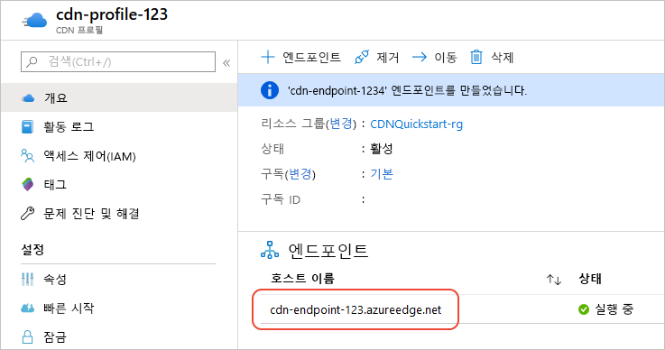

# Azure CDN 엔드포인트 만들기
이 문서에서는 기존 CDN 프로필에서 [Azure CDN(Content Delivery Network)](cdn-overview.md) 엔드포인트를 만드는 모든 설정에 대해 설명합니다. 프로필과 엔드포인트를 만든 후에는 고객에게 콘텐츠를 제공할 수 있습니다. 프로필 및 끝점을 만드는 빠른 시작을 참조 하세요. [빠른 시작: Azure CDN 프로필 및 엔드포인트 만들기](cdn-create-new-endpoint.md)를 참조하세요.

## 필수 조건
CDN 엔드포인트를 만들려면 먼저 하나 이상의 CDN 엔드포인트를 포함할 수 있는 CDN 프로필을 하나 이상 만들어야 합니다. 인터넷 도메인, 웹 애플리케이션 또는 일부 기타 조건으로 CDN 엔드포인트를 구성하려면 여러 프로필을 사용하면 됩니다. CDN 가격은 CDN 프로필 수준에서 적용되기 때문에 다양한 Azure CDN 가격 책정 계층을 사용하려면 여러 CDN 프로필을 만들어야 합니다. CDN 프로필을 만들려면 [새 CDN 프로필 만들기](cdn-create-new-endpoint.md#create-a-new-cdn-profile)를 참조하세요.

## Azure Portal에 로그인
Azure 계정을 사용하여 [Azure Portal](https://portal.azure.com)에 로그인합니다.

## 새 CDN 엔드포인트 만들기

1. [Azure Portal](https://portal.azure.com)에서 CDN 프로필로 이동합니다. 이전 단계에서 대시보드에 고정해 놓았을 수 있습니다. 그러지 않은 경우 **모든 서비스**, **CDN 프로필**을 차례로 선택하여 찾을 수 있습니다. **CDN 프로필** 창에서 엔드포인트에 추가하려는 프로필을 선택합니다. 
   
    CDN 프로필 창이 나타납니다.

2. **엔드포인트**를 선택합니다.
   
    
   
    **엔드포인트 추가** 페이지가 나타납니다.
   
    ![[엔드포인트 추가] 페이지](./media/cdn-create-endpoint-how-to/cdn-add-endpoint-page.png)

3. **이름**에 새 CDN 엔드포인트의 고유한 이름을 입력합니다. 이 이름은 도메인의 캐시 된 리소스에 액세스 하는 데 사용 됩니다  _\<endpointname >_. azureedge.net 합니다.

4. **원본 형식**으로는 다음 원본 형식 중 하나를 선택합니다. 
   - Azure Storage용 **스토리지**
   - Azure Cloud Services용 **클라우드 서비스**
   - Azure Web Apps용 **웹앱**
   - 그 외에 공개적으로 액세스 가능한 (Azure 또는 다른 곳에 호스트된) 원본 웹 서버용 **사용자 지정 원본**

5. **원본 호스트 이름**으로는 원본 서버 도메인을 선택하거나 입력합니다. 4단계에서 지정한 모든 유형의 사용 가능한 원본 서버가 드롭다운에 나열됩니다. 원본 형식으로 **사용자 지정 원본**을 선택한 경우 사용자 지정 원본 서버의 도메인을 입력합니다.
    
6. **원본 경로**에는 캐시하려는 리소스의 경로를 입력합니다. 5단계에서 지정한 도메인의 아무 리소스나 캐시할 수 있도록 허용하려면 이 설정을 비워 둡니다.
    
7. **원래 호스트 헤더**에 Azure CDN에서 각 요청과 함께 보낼 호스트 헤더를 입력하거나 기본값을 유지합니다.
   
   > [!NOTE]
   > Azure Storage 및 Web Apps 등 일부 유형의 원본은 해당 원본의 도메인과 일치하는 호스트 헤더가 필요합니다. 해당 도메인과 다른 호스트 헤더를 필요로 하는 원본이 아니면 기본값을 유지해야 합니다.
   > 
    
8. **프로토콜** 및 **원본 포트**에서는 원본 서버의 리소스에 액세스하는 데 사용되는 프로토콜과 포트를 지정합니다. 프로토콜을 적어도 하나는(HTTP 또는 HTTPS) 선택해야 합니다. CDN 제공 도메인을 사용 하 여 (_\<endpointname >_. azureedge.net) HTTPS 콘텐츠에 액세스 합니다. 
   
   > [!NOTE]
   > **원본 포트** 값은 엔드포인트가 원본 서버에서 정보를 검색하는 데 사용하는 포트에만 영향을 줍니다. 엔드포인트 자체는 **원본 포트** 값에 관계없이 기본 HTTP 및 HTTPS 포트(80 및 443)의 최종 클라이언트에만 사용할 수 있습니다.  
   > 
   > **Akamai의 Azure CDN** 프로필의 엔드포인트에서는 원본 포트에 전체 TCP 포트 범위를 허용하지 않습니다. 허용되지 않는 원본 포트 목록을 보려면 [Akamai 허용된 원본 포트의 Azure CDN](/previous-versions/azure/mt757337(v=azure.100))를 참조하세요.  
   > 
   > Azure CDN 사용자 지정 도메인에 대한 HTTPS 지원은 **Akamai의 Azure CDN** 제품에서 제공되지 않습니다. 자세한 내용은 [Azure CDN 사용자 지정 도메인에서 HTTPS 구성](cdn-custom-ssl.md)을 참조하세요.
    
9. **최적화 기준**에서는 엔드포인트를 제공하려는 시나리오 및 콘텐츠 형식과 가장 잘 맞는 최적화 형식을 선택합니다. 자세한 내용은 [콘텐츠 전송 형식에 맞게 Azure CDN 최적화](cdn-optimization-overview.md)를 참조하세요.

    프로필 형식에 따라 다음과 같은 최적화 형식 설정이 지원됩니다.
    - **Microsoft의 Azure CDN 표준** 프로필:
       - [**일반 웹 전송**](cdn-optimization-overview.md#general-web-delivery)

    - **Verizon의 Azure CDN 표준** 및 **Verizon의 Azure CDN 프리미엄** 프로필:
       - [**일반 웹 전송**](cdn-optimization-overview.md#general-web-delivery)
       - [**동적 사이트 가속**](cdn-optimization-overview.md#dynamic-site-acceleration)

    - **Akamai의 Azure CDN 표준** 프로필:
       - [**일반 웹 전송**](cdn-optimization-overview.md#general-web-delivery)
       - [**일반 미디어 스트리밍**](cdn-optimization-overview.md#general-media-streaming)
       - [**주문형 비디오 미디어 스트리밍**](cdn-optimization-overview.md#video-on-demand-media-streaming)
       - [**대용량 파일 다운로드**](cdn-optimization-overview.md#large-file-download)
       - [**동적 사이트 가속**](cdn-optimization-overview.md#dynamic-site-acceleration)

10. 새 엔드포인트를 만들려면 **추가**를 선택합니다.
   
    엔드포인트가 만들어진 후 프로필에 대한 엔드포인트 목록에 표시됩니다.
    
    
    
    등록이 전파되는 등록에 시간이 걸리기 때문에, 엔드포인트를 즉시 사용할 수는 없습니다. 
    - **Microsoft의 Azure CDN 표준** 프로필의 경우 일반적으로 10분 이내에 전파가 완료됩니다. 
    - **Akamai의 Azure CDN Standard** 프로필의 경우, 일반적으로 1분 이내에 전파가 완료됩니다. 
    - **Verizon의 Azure CDN 표준** 및 **Verizon의 Azure CDN 프리미엄** 프로필의 경우 일반적으로 90분 이내에 전파가 완료됩니다. 
   
    엔드포인트 구성이 POP(point-of-presence) 서버에 전파되기 전에 CDN 도메인 이름을 사용하려고 시도하면 HTTP 404 응답 상태가 수신될 수 있습니다. 엔드포인트를 만든 후 몇 시간이 지난 후에도 404 응답 상태가 계속 수신되는 경우 [404 상태 코드를 반환하는 Azure CDN 엔드포인트 문제 해결](cdn-troubleshoot-endpoint.md)을 참조하세요.

## 리소스 정리
더 이상 필요 없는 엔드포인트를 삭제하려면 엔드포인트를 선택하고 **삭제**를 선택합니다. 

## 다음 단계
사용자 지정 도메인에 대해 자세히 알아보려면 CDN 엔드포인트에 사용자 지정 도메인을 추가하는 방법에 대한 자습서를 계속 진행하세요.

> [!div class="nextstepaction"]
> [사용자 지정 도메인 추가](cdn-map-content-to-custom-domain.md)

