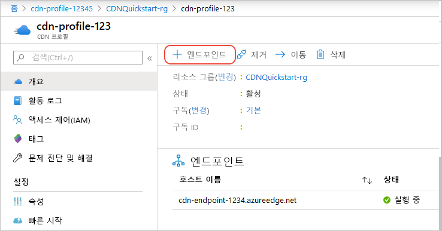
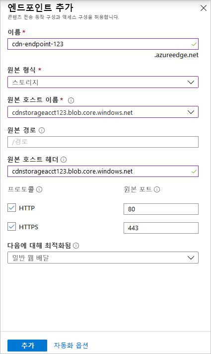

# 빠른 시작: Azure CDN 프로필 및 엔드포인트 만들기
이 빠른 시작에서는 새로운 CDN 프로필 및 CDN 엔드포인트를 만들어서 Azure CDN(Content Delivery Network)을 사용하도록 설정합니다. 프로필과 엔드포인트를 만든 후에 고객에게 콘텐츠를 제공하기 시작할 수 있습니다.

[!INCLUDE [quickstarts-free-trial-note](../../includes/quickstarts-free-trial-note.md)]

## 필수 조건
이 빠른 시작의 목적상 원본 호스트 이름에 사용한 *mystorageacct123*이라는 저장소 계정을 만들었어야 합니다. 자세한 내용은 [Azure CDN과 Azure 저장소 계정 통합](cdn-create-a-storage-account-with-cdn.md)을 참조하세요.

## Azure Portal에 로그인
Azure 계정을 사용하여 [Azure Portal](https://portal.azure.com)에 로그인합니다.

[!INCLUDE [cdn-create-profile](../../includes/cdn-create-profile.md)]

## 새 CDN 엔드포인트 만들기

CDN 프로필을 만든 후에 엔드포인트를 만드는 데 사용할 수 있습니다.

1. Azure Portal에서 만든 대시보드에서 CDN 프로필을 선택합니다. 찾을 수 없는 경우 **모든 서비스**를 선택한 다음, **CDN 프로필**을 선택합니다. **CDN 프로필** 페이지에서 사용하려는 프로필을 선택합니다. 
   
    CDN 프로필 페이지가 나타납니다.

2. **엔드포인트**를 선택합니다.
   
    
   
    **엔드포인트 추가** 창이 나타납니다.

3. 엔드포인트 설정의 경우 다음 표에 지정된 값을 사용합니다.

    | 설정 | 값 |
    | ------- | ----- |
    | **Name** | 엔드포인트 호스트 이름에 *my-endpoint-123*을 입력합니다. 이 이름은 전역적으로 고유해야 합니다. 이미 사용 중인 경우 다른 이름을 입력할 수 있습니다. 이 이름은 _&lt;엔드포인트 이름&gt;_.azureedge.net 도메인의 캐시된 리소스에 액세스하기 위해 사용됩니다.|
    | **원본 형식** | **저장소**를 선택합니다. | 
    | **원본 호스트 이름** | 호스트 이름에 *mystorageacct123.blob.core.windows.net*을 입력합니다. 이 이름은 전역적으로 고유해야 합니다. 이미 사용 중인 경우 다른 이름을 입력할 수 있습니다. |
    | **원본 경로** | 비워 둡니다. |
    | **원본 호스트 헤더** | 생성된 기본값을 그대로 둡니다. |  
    | **프로토콜** | 기본값 **HTTP** 및 **HTTPS** 옵션을 선택해 둡니다. |
    | **원본 포트** | 포트 기본값을 그대로 둡니다. | 
    | **최적화 기준** | 기본 선택 영역 **일반 웹 배달**을 그대로 둡니다. |

    

3. 새 엔드포인트를 만들려면 **추가**를 선택합니다.
   
   엔드포인트가 만들어진 후 프로필에 대한 엔드포인트 목록에 표시됩니다.
    
   
    
   등록이 전파되는 등록에 시간이 걸리기 때문에, 엔드포인트를 즉시 사용할 수는 없습니다. 
   - **Microsoft의 Azure CDN 표준** 프로필의 경우 일반적으로 10분 이내에 전파가 완료됩니다. 
   - **Akamai의 Azure CDN Standard** 프로필의 경우, 일반적으로 1분 이내에 전파가 완료됩니다. 
   - **Verizon의 Azure CDN 표준** 및 **Verizon의 Azure CDN 프리미엄** 프로필의 경우 일반적으로 90분 이내에 전파가 완료됩니다. 

## 리소스 정리
이전 단계에서 리소스 그룹에 CDN 프로필 및 엔드포인트를 만들었습니다. [다음 단계](#next-steps)로 이동하려는 경우 이러한 리소스를 저장하고, 엔드포인트에 사용자 지정 도메인을 추가하는 방법에 대해 알아봅니다. 하지만 이러한 리소스를 나중에 사용하지 않을 경우 리소스 그룹을 삭제한 다음, 추가 요금을 방치하여 해당 리소스를 삭제할 수 있습니다.

1. Azure Portal의 왼쪽 메뉴에서 **리소스 그룹**을 선택한 다음, **my-resource-group-123**을 선택합니다.

2. **리소스 그룹** 페이지에서 **리소스 그룹 삭제**를 선택하고, 텍스트 상자에 *my-resource-group-123*을 입력한 다음, **삭제**를 선택합니다.

    그러면 이 빠른 시작에서 만든 리소스 그룹, 프로필 및 엔드포인트를 삭제합니다.

## 다음 단계
사용자 지정 도메인을 CDN 엔드포인트에 추가하는 방법에 대해 알아보려면 다음 자습서를 참조하세요.

> [!div class="nextstepaction"]
> [자습서: Azure CDN 엔드포인트에 사용자 지정 도메인 추가](cdn-map-content-to-custom-domain.md)

