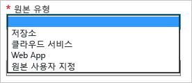

<properties
	 pageTitle="Azure CDN 사용"
	 description="이 항목에서는 Azure에 대해 CDN(콘텐츠 배달 네트워크)을 사용하도록 설정하는 방법을 설명합니다. 이 자습서는 새로운 CDN 프로필 및 끝점 생성을 안내합니다."
	 services="cdn"
	 documentationCenter=""
	 authors="camsoper"
	 manager="erikre"
	 editor=""/>
<tags
	 ms.service="cdn"
	 ms.workload="media"
	 ms.tgt_pltfrm="na"
	 ms.devlang="na"
	 ms.topic="get-started-article"
	 ms.date="04/26/2016" 
	 ms.author="casoper"/>

# Azure CDN 사용  

이 항목에서는 새로운 CDN 프로필 및 끝점을 만들어서 Azure CDN을 활성화하는 단계를 살펴봅니다.

>[AZURE.IMPORTANT] CDN 작동 방법 및 기능 목록에 대한 소개는 [CDN 개요](./cdn-overview.md)를 참조하세요.

## 새 CDN 프로필 만들기

CDN 프로필은 CDN 끝점의 컬렉션입니다. 각 프로필에는 CDN 끝점이 하나 이상 있습니다. 여러 프로필을 사용하여 인터넷 도메인, 웹 응용 프로그램 또는 일부 기타 조건에서 CDN 끝점을 구성할 수도 있습니다.

> [AZURE.NOTE] 기본적으로 단일 Azure 구독은 CDN 프로필이 네 개로 제한됩니다. 각 CDN 프로필은 CDN 끝점이 열 개로 제한됩니다.
>
> CDN 가격 책정은 CDN 프로필 수준에서 적용됩니다. 다양한 표준 및 프리미엄 CDN 기능을 사용하려는 경우 여러 CDN 프로필이 필요합니다.

**새 CDN 프로필을 만들려면**

1. [Azure 포털](https://portal.azure.com)의 왼쪽 위에서 **새로 만들기**를 클릭합니다. **새로 만들기** 블레이드에서 **미디어 + CDN**, **CDN**을 차례로 선택합니다.

    새 CDN 프로필 블레이드가 나타납니다.

    ![새 CDN 프로필][new-cdn-profile]

2. CDN 프로필에 대한 이름을 입력합니다.

3. **가격 책정 계층**을 선택하거나 기본값을 사용합니다.

4. **리소스 그룹**을 선택하거나 만듭니다. 리소스 그룹에 대한 자세한 내용은 [Azure 리소스 관리자 개요](resource-group-overview/#resource-groups)를 참조하세요.

5. 이 CDN 프로필에 대한 **구독**을 선택합니다.

6. **위치**를 선택합니다. CDN 프로필 정보가 저장될 Azure 위치입니다. CDN 끝점 위치에는 영향을 주지 않습니다. 저장소 계정과 동일한 위치일 필요는 없습니다.

7. **만들기** 단추를 클릭하여 새 프로필을 만듭니다.

## 새 CDN 끝점 만들기

**저장소 계정에 대한 새 CDN 끝점을 만들려면**

1. [Azure 포털](https://portal.azure.com)에서 CDN 프로필로 이동합니다. 이전 단계에서 대시보드에 고정해 놓았을 수 있습니다. 그렇지 않은 경우 **찾아보기**, **CDN 프로필**을 차례로 클릭한 다음 끝점을 추가하려는 프로필을 클릭하면 찾을 수 있습니다.

    CDN 프로필 블레이드가 나타납니다.

    ![CDN 프로필][cdn-profile-settings]

2. **끝점 추가** 단추를 클릭합니다.

    ![끝점 추가 단추][cdn-new-endpoint-button]

    **끝점 추가** 블레이드가 나타납니다.

    ![끝점 추가 블레이드][cdn-add-endpoint]

3. 이 CDN 끝점에 대한 **이름**을 입력합니다. 이 이름은 `<endpointname>.azureedge.net` 도메인의 캐시된 리소스에 액세스하기 위해 사용됩니다.

4. **원본 형식** 드롭다운에서 원본 형식을 선택합니다. Azure 저장소 계정에 대해 **저장소**, Azure 클라우드 서비스에 대해 **클라우드 서비스**, Azure 웹앱에 대해 **웹앱**, 또는 기타 공개적으로 액세스할 수 있는 웹 서버 원본(Azure 또는 다른 곳에 호스팅되는)에 대해 **사용자 지정 원본**을 선택합니다.

	
		
5. **원본 호스트 이름** 드롭다운에서 원본 도메인을 선택하거나 입력합니다. 4단계에서 지정한 사용할 수 있는 모든 원본 형식이 드롭다운에 나열됩니다. *사용자 지정 원본*을 **원본 형식**으로 선택한 경우에는 사용자 지정 원본의 도메인을 입력합니다.

6. **원본 경로** 텍스트 상자에 캐시하려는 리소스의 경로를 입력하거나, 5단계에서 지정한 도메인의 모든 리소스를 캐시하도록 허용하려면 텍스트 상자를 비워둡니다.

7. **원래 호스트 헤더**에 CDN에서 각 요청과 함께 보낼 호스트 헤더를 입력하거나 기본값을 유지합니다.

8. **프로토콜** 및 **원본 포트**에 원본의 리소스에 액세스하는 데 사용되는 프로토콜과 포트를 지정합니다. 클라이언트가 CDN에서 리소스에 액세스하는 경우 동일한 프로토콜 및 포트를 계속 사용하게 됩니다. 프로토콜을 적어도 하나는(HTTP 또는 HTTPS) 선택해야 합니다.
	
	> [AZURE.TIP] HTTPS를 사용하여 CDN 콘텐츠에 액세스하는 경우 다음과 같은 제약 조건이 있습니다.
	> 
	> - CDN에서 제공된 인증서 즉, SSL을 사용해야 합니다. 타사 인증서는 지원되지 않습니다.
	> - CDN 제공 도메인(`<endpointname>.azureedge.net`)을 사용하여 HTTPS 콘텐츠에 액세스해야 합니다. 현재 CDN이 사용자 지정 인증서를 지원하지 않으므로 CNAME(사용자 지정 도메인 이름)에는 HTTPS 지원을 사용할 수 없습니다.

9. **추가** 단추를 클릭하여 새 끝점을 만듭니다.

10. 끝점이 만들어지면 프로필에 대한 끝점 목록에 표시됩니다. 목록 보기에는 캐시된 콘텐츠에 액세스하는 데 사용할 URL과 원본 도메인이 표시됩니다.

    ![CDN 끝점][cdn-endpoint-success]

    > [AZURE.IMPORTANT] 등록이 CDN 네트워크 전체에 전파되는 데 시간이 걸리기 때문에, 끝점을 즉시 사용할 수는 없습니다. 일반적으로 90분 내에 사용이 가능해 지지만 일부 경우에는 시간이 더 길어질 수 있습니다.
	>	 
	> 끝점 구성이 POP에 전파되기 전에 CDN 도메인 이름을 사용하려고 하면 HTTP 404 응답 코드가 반환됩니다.

##참고 항목
- [쿼리 문자열이 포함된 요청의 캐싱 동작 제어](cdn-query-string.md)
- [CDN 콘텐츠를 사용자 지정 도메인에 매핑하는 방법](cdn-map-content-to-custom-domain.md)
- [Azure CDN 끝점에 자산 미리 로드](cdn-preload-endpoint.md)
- [Azure CDN 끝점 삭제](cdn-purge-endpoint.md)

[new-cdn-profile]: ./media/cdn-create-new-endpoint/cdn-new-profile.png
[cdn-profile-settings]: ./media/cdn-create-new-endpoint/cdn-profile-settings.png
[cdn-new-endpoint-button]: ./media/cdn-create-new-endpoint/cdn-new-endpoint-button.png
[cdn-add-endpoint]: ./media/cdn-create-new-endpoint/cdn-add-endpoint.png
[cdn-endpoint-success]: ./media/cdn-create-new-endpoint/cdn-endpoint-success.png

<!---HONumber=AcomDC_0427_2016-->