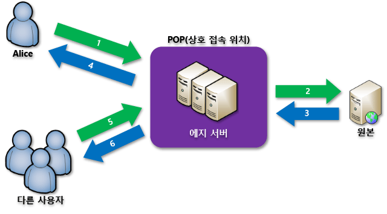

# Azure의 콘텐츠 배달 네트워크란?
CDN(콘텐츠 배달 네트워크)은 사용자에게 웹 콘텐츠를 효율적으로 제공할 수 있는 서버의 분산 네트워크입니다. CDN은 최종 사용자와 가까운 POP(point-of-presence) 위치의 Edge 서버에 캐시된 콘텐츠를 저장하여 대기 시간을 최소화합니다. 

Azure CDN(콘텐츠 전송 네트워크)은 전 세계에 전략적으로 배치된 물리적 노드에서 콘텐츠를 캐싱하여 사용자에게 고대역폭 콘텐츠를 신속하게 전송할 수 있는 글로벌 솔루션을 개발자에게 제공합니다. Azure CDN은 캐싱할 수 없는 동적 콘텐츠를 CDN POP를 사용하는 다양한 네트워크 최적화를 활용하여 가속화할 수 있습니다. 예를 들면 BGP(Border Gateway Protocol)를 우회하는 경로 최적화가 있습니다.

Azure CDN을 사용하여 웹 사이트 자산을 배달하면 다음과 같은 이점이 있습니다.

* 특히 콘텐츠를 로드하기 위해 많은 왕복이 필요한 응용 프로그램을 사용 중인 최종 사용자의 성능 및 사용자 환경 향상.
* 제품 런칭 이벤트 시작 시와 같이 순간적인 높은 부하를 더 효율적으로 처리하기 위한 대규모 크기 조정.
* 사용자 요청을 분산하고 에지 서버에서 바로 콘텐츠를 제공하므로 원본 서버로 전송되는 트래픽 양이 감소.

현재 CDN 노드 위치 목록은 [Azure CDN POP 위치](cdn-pop-locations.md)를 참조하세요.

## 작동 방법

1. 사용자(Alice)가 특수 도메인 이름(예: _&lt;endpoint name&gt;_.azureedge.net)이 있는 URL을 사용하여 파일(자산이라고도 함)을 요청합니다. 이 이름은 엔드포인트 호스트 이름 또는 사용자 지정 도메인이 될 수 있습니다. DNS는 가장 성능이 좋은 POP 위치로 요청을 라우팅합니다. 이 위치는 대개 사용자와 지리적으로 가장 가까운 POP입니다.
    
2. POP의 에지 서버의 캐시에 파일이 없으면, POP는 원본 서버에서 파일을 요청합니다. 원본 서버는 Azure Web App, Azure Cloud Service, Azure Storage 계정 또는 공개적으로 액세스할 수 있는 웹 서버입니다.
   
3. 원본 서버는 파일을 POP의 에지 서버로 반환합니다.
    
4. POP의 에지 서버는 파일을 캐싱하고 원래 요청자(Alice)에게 파일을 반환합니다. 파일은 HTTP 헤더로 지정된 TTL(Time-To-Live)이 만료될 때까지 POP의 에지 서버에 캐시된 상태로 유지됩니다. 원본 서버가 TTL을 지정하지 않은 경우, 기본 TTL은 7일입니다.
    
5. 그런 다음, 추가 사용자는 Alice가 사용한 것과 동일한 URL을 사용하여 동일한 파일을 요청할 수 있으며 동일한 POP로 이동할 수도 있습니다.
    
6. 파일의 TTL이 만료되지 않았으면, POP 에지 서버는 캐시로부터 직접 파일을 반환합니다. 이러한 프로세스를 통해 보다 신속하고 응답성이 뛰어난 사용자 환경이 가능해집니다.

## 요구 사항
Azure CDN을 사용하려면 Azure 구독을 하나 이상 소유해야 합니다. CDN 엔드포인트의 컬렉션인 CDN 프로필도 하나 이상 만들어야 합니다. 모든 CDN 엔드포인트는 콘텐츠 배달 동작 및 액세스에 대한 특정 구성을 나타냅니다. 인터넷 도메인, 웹 응용 프로그램 또는 일부 기타 조건으로 CDN 엔드포인트를 구성하려면 여러 프로필을 사용하면 됩니다. [Azure CDN 가격](https://azure.microsoft.com/pricing/details/cdn/)은 CDN 프로필 수준에서 적용되기 때문에 다양한 가격 책정 계층을 사용하려면 여러 CDN 프로필을 만들어야 합니다. Azure CDN 청구 구조에 대한 내용은 [Azure CDN 청구 이해](cdn-billing.md)를 참조하세요.

### 제한 사항
Azure 구독마다 다음 리소스에 대한 기본 제한이 있습니다.
 - 만들 수 있는 CDN 프로필의 수
 - CDN 프로필에서 만들 수 있는 엔드포인트의 수 
 - 엔드포인트에 매핑할 수 있는 사용자 지정 도메인의 수

CDN 구독 제한에 대한 자세한 정보는 [CDN 제한](https://docs.microsoft.com/azure/azure-subscription-service-limits#cdn-limits)을 참조하세요.
    
## Azure CDN 기능
Azure CDN은 다음과 같은 주요 기능을 제공합니다.

- [동적 사이트 가속](cdn-dynamic-site-acceleration.md)
- [CDN 캐싱 규칙](cdn-caching-rules.md)
- [HTTPS 사용자 지정 도메인 지원](cdn-custom-ssl.md)
- [Azure 진단 로그](cdn-azure-diagnostic-logs.md)
- [파일 압축](cdn-improve-performance.md)
- [지역 필터링](cdn-restrict-access-by-country.md)

각 Azure CDN 제품이 지원하는 기능의 전체 목록은 [Azure CDN 제품 기능 비교](cdn-features.md)를 참조하세요.

## 다음 단계
- CDN을 시작하려면 [Azure CDN 프로필 및 엔드포인트 만들기](cdn-create-new-endpoint.md)를 참조하세요.
- [Microsoft Azure Portal](https://portal.azure.com) 또는 [PowerShell](cdn-manage-powershell.md)을 통해 CDN 엔드포인트를 관리합니다.
- [.NET](cdn-app-dev-net.md) 또는 [Node.js](cdn-app-dev-node.md)를 사용하여 Azure CDN을 자동화하는 방법을 알아봅니다.
- 작업 중인 Azure CDN을 보려면 [Azure CDN 비디오](https://azure.microsoft.com/resources/videos/index/?services=cdn&sort=newest)를 시청하세요.
- 최신 Azure CDN 기능에 대한 내용은 [Azure CDN 블로그](https://azure.microsoft.com/blog/tag/azure-cdn/)를 참조하세요.

