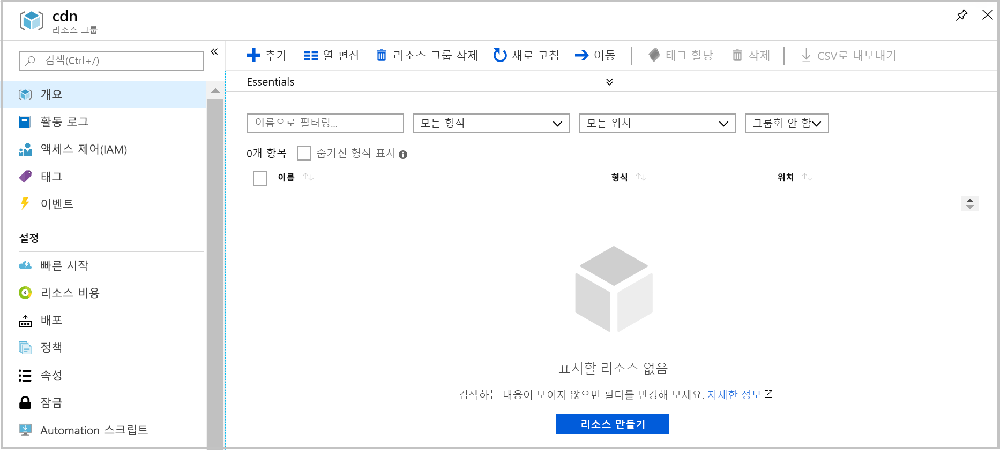

# <a name="quickstart-create-an-azure-cdn-profile-and-endpoint-using-resource-manager-template"></a>빠른 시작: Resource Manager 템플릿을 사용하여 Azure CDN 프로필 및 엔드포인트 만들기

빠른 시작에서 CLI를 사용하여 Azure Resource Manager 템플릿을 배포합니다. 사용자가 만든 템플릿은 CDN 프로필 및 CDN 엔드포인트를 웹 애플리케이션의 프론트에 배포합니다.
이 단계를 완료하려면 약 10분이 걸립니다.

[!INCLUDE [quickstarts-free-trial-note](../../includes/quickstarts-free-trial-note.md)]

## <a name="prequisites"></a>필수 조건

이 빠른 시작의 목적상 Origin으로 사용할 웹 애플리케이션이 있어야 합니다. 이 빠른 시작에서 사용한 예제 웹 애플리케이션은 https://cdndemo.azurewebsites.net 에 배포되었습니다.

자세한 내용은 [Azure에서 정적 HTML 웹앱 만들기](https://docs.microsoft.com/azure/app-service/app-service-web-get-started-html)를 참조하세요.

## <a name="create-a-resource-group"></a>리소스 그룹 만들기

모든 리소스는 같은 리소스 그룹에 배포되어야 합니다.

선택한 위치에서 리소스 그룹을 만듭니다. 이 예제에서는 미국 동부 지역에서 cdn이라는 이름의 리소스 그룹을 만드는 과정을 보여 줍니다.

```bash
az group create --name cdn --location eastus
```



## <a name="create-the-resource-manager-template"></a>리소스 관리자 템플릿 만들기

이 단계에서는 리소스를 배포하는 템플릿 파일을 만듭니다.

이 예제에서는 일반 웹 사이트 가속 시나리오를 안내하고 있지만, 구성 가능한 많은 기타 설정이 있습니다. 이러한 설정은 Azure Resource Manager 템플릿 참조에서 사용 가능합니다. [CDN 프로필](https://docs.microsoft.com/azure/templates/microsoft.cdn/2017-10-12/profiles) 및 [CDN 프로필 엔드포인트](https://docs.microsoft.com/azure/templates/microsoft.cdn/2017-10-12/profiles/endpoints)에 대한 참조를 참고하세요.

Microsoft CDN은 콘텐츠 형식 목록 수정을 지원하지 않습니다.

탬플릿을 **resource-manager-cdn.json**으로 저장합니다.

```json
{
    "$schema": "https://schema.management.azure.com/schemas/2015-01-01/deploymentTemplate.json#",
    "contentVersion": "1.0.0.0",
    "parameters": {
        "cdnProfileSku": {
            "type": "string",
            "allowedValues": [
                "Standard_Microsoft",
                "Standard_Akamai",
                "Standard_Verizon",
                "Premium_Verizon"
            ]
        },
        "endpointOriginHostName": {
            "type": "string"
        }
    },
    "variables": {
        "profile": {
            "name": "[replace(toLower(parameters('cdnProfileSku')), '_', '-')]"
        },
        "endpoint": {
            "name": "[replace(toLower(parameters('endpointOriginHostName')), '.', '-')]",
            "originHostName": "[parameters('endpointOriginHostName')]"
        }
    },
    "resources": [
        {
            "type": "Microsoft.Cdn/profiles",
            "apiVersion": "2017-10-12",
            "location": "[resourceGroup().location]",
            "name": "[variables('profile').name]",
            "sku": {
                "name": "[parameters('cdnProfileSku')]"
            }
        },
        {
            "dependsOn": [
                "[resourceId('Microsoft.Cdn/profiles', variables('profile').name)]"
            ],
            "type": "Microsoft.Cdn/profiles/endpoints",
            "apiVersion": "2017-10-12",
            "location": "[resourceGroup().location]",
            "name": "[concat(variables('profile').name, '/', variables('endpoint').name)]",
            "properties": {
                "hostName": "[concat(variables('endpoint').name, '.azureedge.net')]",
                "originHostHeader": "[variables('endpoint').originHostName]",
                "isHttpAllowed": true,
                "isHttpsAllowed": true,
                "queryStringCachingBehavior": "IgnoreQueryString",
                "origins": [
                    {
                        "name": "[replace(variables('endpoint').originHostName, '.', '-')]",
                        "properties": {
                            "hostName": "[variables('endpoint').originHostName]",
                            "httpPort": 80,
                            "httpsPort": 443
                        }
                    }
                ],
                "contentTypesToCompress": [
                    "application/eot",
                    "application/font",
                    "application/font-sfnt",
                    "application/javascript",
                    "application/json",
                    "application/opentype",
                    "application/otf",
                    "application/pkcs7-mime",
                    "application/truetype",
                    "application/ttf",
                    "application/vnd.ms-fontobject",
                    "application/xhtml+xml",
                    "application/xml",
                    "application/xml+rss",
                    "application/x-font-opentype",
                    "application/x-font-truetype",
                    "application/x-font-ttf",
                    "application/x-httpd-cgi",
                    "application/x-javascript",
                    "application/x-mpegurl",
                    "application/x-opentype",
                    "application/x-otf",
                    "application/x-perl",
                    "application/x-ttf",
                    "font/eot",
                    "font/ttf",
                    "font/otf",
                    "font/opentype",
                    "image/svg+xml",
                    "text/css",
                    "text/csv",
                    "text/html",
                    "text/javascript",
                    "text/js",
                    "text/plain",
                    "text/richtext",
                    "text/tab-separated-values",
                    "text/xml",
                    "text/x-script",
                    "text/x-component",
                    "text/x-java-source"
                ],
                "isCompressionEnabled": true,
                "optimizationType": "GeneralWebDelivery"
            }
        }
    ],
    "outputs": {
        "cdnUrl": {
            "type": "string",
            "value": "[concat('https://', variables('endpoint').name, '.azureedge.net')]"
        }
    }
}
```

## <a name="create-the-resources"></a>리소스 만들기

Azure CLI를 사용하여 템플릿 배포 두 개 항목을 입력하라는 메시지가 표시됩니다.

**cdnProfileSku** - 사용하려는 CDN 공급자입니다. 옵션은 다음과 같습니다.

* Standard_Microsoft
* Standard_Akamai
* Standard_Verizon
* Premium_Verizon

**endpointOriginHostName** - CDN을 통해 제공되는 엔드포인트(cdndemo.azurewebsites.net)입니다.

```bash
az group deployment create --resource-group cdn --template-file arm-cdn.json
```


## <a name="view-the-cdn-profile"></a>CDN 프로필 보기

```bash
az cdn profile list --resource-group cdn -o table
```


## <a name="view-the-cdn-endpoint-for-the-profile-standard-microsoft"></a>프로필 표준 microsoft의 CDN 엔드포인트 보기

```bash
az cdn endpoint list --profile-name standard-microsoft --resource-group cdn -o table
```


콘텐츠를 보려면 HostName을 사용합니다. 예를 들어, 브라우저를 사용하여 https://cdndemo-azurewebsites-net.azureedge.net 에 액세스합니다.

## <a name="clean-up"></a>정리

리소스 그룹을 삭제하면 해당 리소스 그룹에 배포된 모든 리소스가 자동으로 제거됩니다.

```bash
az group delete --name cdn
```


## <a name="references"></a>참조

* CDN 프로필 - [Azure Resource Manager 템플릿 참조](https://docs.microsoft.com/azure/templates/microsoft.cdn/2017-10-12/profiles)
* CDN 엔드포인트 - [Azure Resource Manager 템플릿 참조 설명서](https://docs.microsoft.com/azure/templates/microsoft.cdn/2017-10-12/profiles/endpoints)

## <a name="next-steps"></a>다음 단계

사용자 지정 도메인을 CDN 엔드포인트에 추가하는 방법에 대해 알아보려면 다음 자습서를 참조하세요.

> [!div class="nextstepaction"]
> [자습서: Azure CDN 엔드포인트에 사용자 지정 도메인 추가](cdn-map-content-to-custom-domain.md)
