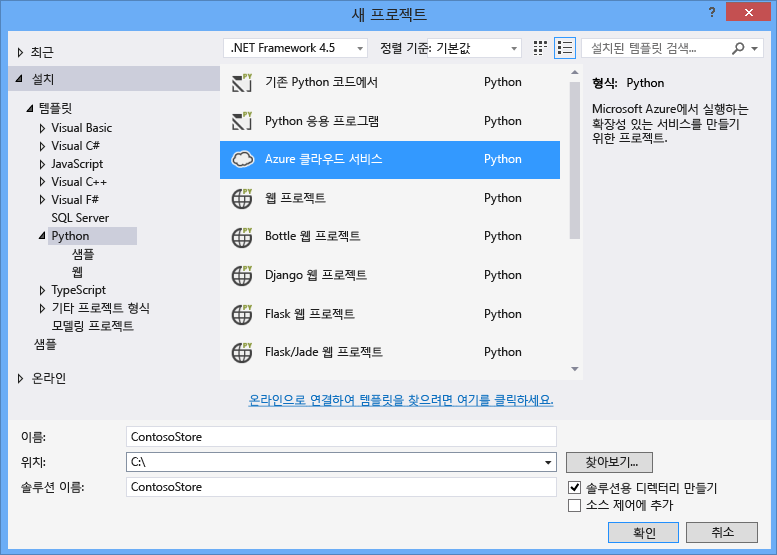
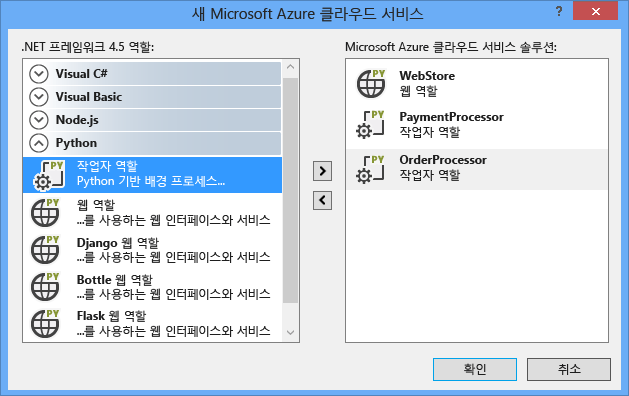
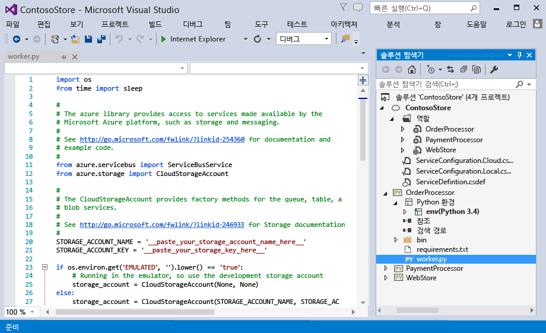
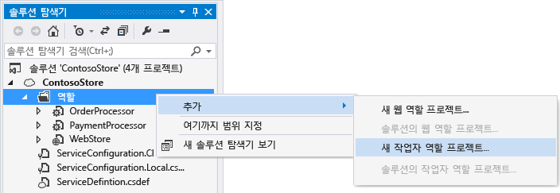
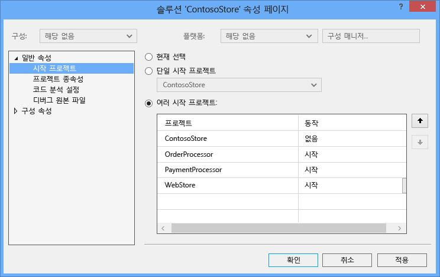
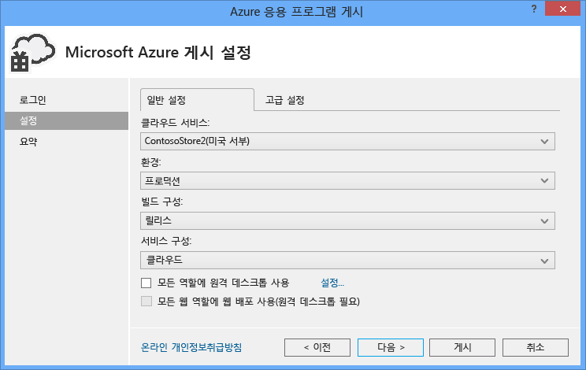
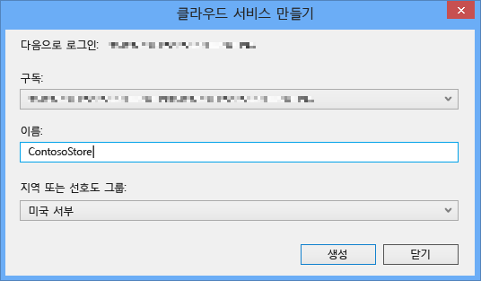
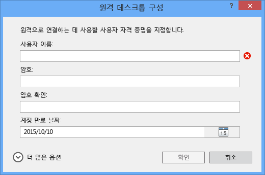
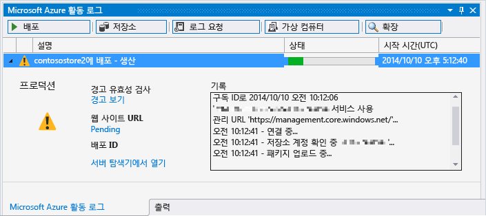

<properties
	pageTitle="Python Tools 2.2 for Visual Studio의 Python 웹 및 작업자 역할 | Microsoft Azure"
	description="Python Tools for Visual Studio를 사용하여 웹 역할과 작업자 역할을 포함한 Azure 클라우드 서비스를 만드는 방법을 간략하게 설명합니다."
	services=""
	documentationCenter="python"
	authors="huguesv"
	manager="wpickett"
	editor=""/>

<tags
	ms.service="cloud-services"
	ms.workload="tbd"
	ms.tgt_pltfrm="na"
	ms.devlang="python"
	ms.topic="hero-article"
	ms.date="08/30/2015"
	ms.author="huvalo"/>

# Python Tools 2.2 for Visual Studio의 Python 웹 및 작업자 역할

이 문서에서는 [Python Tools for Visual Studio][]를 통해 Python 웹 및 작업자 역할을 사용하는 방법을 간략하게 설명합니다.

## 필수 조건

 - Visual Studio 2013 또는 2015
 - [Python Tools 2.2 for Visual Studio]
 - [Azure SDK Tools for VS 2013][] 또는 [Azure SDK Tools for VS 2015][]
 - [Python 2.7 32비트][] 또는 [Python 3.4 32비트][]

[AZURE.INCLUDE [create-account-and-websites-note](../includes/create-account-and-websites-note.md)]

## Python 웹 및 작업자 역할 정의

Azure는 응용 프로그램을 실행하기 위한 세 가지 컴퓨팅 모델인 [Azure 앱 서비스의 웹앱 기능][execution model-web sites], [Azure 가상 컴퓨터][execution model-vms] 및 [Azure 클라우드 서비스][execution model-cloud services]를 제공합니다. 이 세 모델은 모두 Python을 지원합니다. 웹 및 작업자 역할을 포함하는 클라우드 서비스는 *PaaS(Platform as a Service)*를 제공합니다. 클라우드 서비스 내에서 웹 역할은 프런트 엔드 웹 응용 프로그램을 호스트하기 위해 전용 IIS(인터넷 정보 서비스) 웹 서버를 제공하고, 작업자 역할은 사용자 조작 또는 입력과 관계없이 비동기, 장기 실행 또는 영구 작업을 실행할 수 있습니다.

자세한 내용은 [클라우드 서비스란?]을 참조하세요.

> [AZURE.NOTE]*간단한 웹 사이트를 빌드하려는 경우* 시나리오에 간단한 웹 사이트 프런트 엔드만 포함된 경우 Azure 웹 서비스의 간단한 웹앱의 사용을 고려합니다. 그러면 웹 사이트가 커지고 요구 사항이 변경될 때 클라우드 서비스로 쉽게 업그레이드할 수 있습니다. Azure 앱 서비스의 웹앱 기능 개발을 설명하는 문서는 <a href="/develop/python/">Python 개발자 센터</a>를 참조하세요.  

## 프로젝트 만들기

Visual Studio의 **새 프로젝트** 대화 상자에서 **Python** 아래 **Azure 클라우드 서비스**를 선택하면 됩니다.

Azure 클라우드 서비스 마법사에서 새 웹 및 작업자 역할 만들기를 선택할 수 있습니다.

작업자 역할 템플릿에는 Azure 저장소 계정 또는 Azure 서비스 버스에 연결하기 위한 상용구 코드가 제공됩니다.

언제든지 기존 클라우드 서비스에 웹 또는 작업자 역할을 추가할 수 있습니다. 솔루션에 기존 프로젝트를 추가하거나 새 프로젝트를 만들도록 선택할 수 있습니다.

클라우드 서비스는 여러 언어로 구현된 역할을 포함할 수 있습니다. 예를 들어 Django로 구현된 Python 웹 역할과 Python 또는 C# 작업자 역할이 포함될 수 있습니다. 서비스 버스 큐 또는 저장소 큐를 사용하면 역할 간에 쉽게 통신할 수 있습니다.

## 로컬 실행

클라우드 서비스 프로젝트를 시작 프로젝트로 설정하고 F5 키를 누르면 클라우드 서비스가 로컬 Azure 에뮬레이터에서 실행됩니다.

PTVS를 에뮬레이터에서 시작할 수는 있지만 중단점 등의 디버깅 기능은 작동하지 않습니다.

웹 및 작업자 역할을 디버그하려는 경우 역할 프로젝트를 시작 프로젝트로 설정하고 해당 프로젝트를 대신 디버그하면 됩니다. 여러 시작 프로젝트를 설정할 수도 있습니다. 이렇게 하려면 솔루션을 마우스 오른쪽 단추로 클릭하고 **시작 프로젝트 설정**을 선택합니다.

## Azure에 게시

게시하려면 솔루션의 클라우드 서비스 프로젝트를 마우스 오른쪽 단추로 클릭하고 **게시**를 선택합니다.

설정 페이지에서 게시할 클라우드 서비스를 선택합니다.

사용 가능한 클라우드 서비스가 없으면 새로 만들 수 있습니다.

또한 디버깅 오류에 대비하여 컴퓨터에 대해 원격 데스크톱 연결을 사용하도록 설정하는 것도 유용합니다.

설정 구성을 완료한 후 **게시**를 클릭합니다.

출력 창에 진행률이 어느 정도 표시된 다음 Microsoft Azure 활동 로그 창이 표시됩니다.

몇 분 후에 배포가 완료되고 웹 및/또는 작업자 역할이 Azure에서 실행됩니다.

## 다음 단계

Python Tools for Visual Studio에서 웹 및 작업자 역할을 사용하는 방법에 대한 자세한 내용은 PTVS 설명서를 참조하세요.

- [클라우드 서비스 프로젝트][]

Azure 저장소 또는 서비스 버스를 사용하는 등 웹 및 작업자 역할에서 Azure 서비스를 사용하는 방법에 대한 자세한 내용은 다음 문서를 참조하세요.

- [Blob 서비스][]
- [테이블 서비스][]
- [큐 서비스][]
- [서비스 버스 큐][]
- [서비스 버스 토픽][]

<!--Link references-->

[클라우드 서비스란?]: /manage/services/cloud-services/what-is-a-cloud-service/
[execution model-web sites]: fundamentals-application-models.md#WebSites
[execution model-vms]: fundamentals-application-models.md#VMachine
[execution model-cloud services]: fundamentals-application-models.md#CloudServices
[Python Developer Center]: /develop/python/

[Blob 서비스]: storage-python-how-to-use-blob-storage.md
[큐 서비스]: storage-python-how-to-use-queue-storage.md
[테이블 서비스]: storage-python-how-to-use-table-storage.md
[서비스 버스 큐]: service-bus-python-how-to-use-queues.md
[서비스 버스 토픽]: service-bus-python-how-to-use-topics-subscriptions.md

<!--External Link references-->

[Python Tools for Visual Studio]: http://aka.ms/ptvs
[Python Tools for Visual Studio Documentation]: http://aka.ms/ptvsdocs
[클라우드 서비스 프로젝트]: http://go.microsoft.com/fwlink/?LinkId=624028
[Python Tools 2.2 for Visual Studio]: http://go.microsoft.com/fwlink/?LinkID=624025
[Azure SDK Tools for VS 2013]: http://go.microsoft.com/fwlink/?LinkId=323510
[Azure SDK Tools for VS 2015]: http://go.microsoft.com/fwlink/?LinkId=518003
[Python 2.7 32비트]: http://go.microsoft.com/fwlink/?LinkId=517190
[Python 3.4 32비트]: http://go.microsoft.com/fwlink/?LinkId=517191

<!---HONumber=September15_HO1-->