# <a name="get-started-with-azure-cloud-services-and-aspnet"></a>Azure Cloud Services 및 ASP.NET 시작

## <a name="overview"></a>개요
이 자습서에서는 ASP.NET MVC 프런트 엔드를 사용하여 다중 계층 .NET 응용 프로그램을 만들어 [Azure 클라우드 서비스](cloud-services-choose-me.md)에 배포하는 방법을 보여 줍니다. 이 응용 프로그램은 [Azure SQL Database](http://msdn.microsoft.com/library/azure/ee336279), [Azure Blob service](http://www.asp.net/aspnet/overview/developing-apps-with-windows-azure/building-real-world-cloud-apps-with-windows-azure/unstructured-blob-storage)(영문) 및 [Azure 큐 서비스](http://www.asp.net/aspnet/overview/developing-apps-with-windows-azure/building-real-world-cloud-apps-with-windows-azure/queue-centric-work-pattern)를 사용합니다. MSDN 코드 갤러리에서 [Visual Studio 프로젝트를 다운로드](http://code.msdn.microsoft.com/Simple-Azure-Cloud-Service-e01df2e4) 할 수 있습니다.

이 자습서에서는 응용 프로그램을 구축하고 로컬에서 실행하는 방법, 응용 프로그램을 Azure에 배포하고 클라우드에서 실행하는 방법, 그리고 응용 프로그램을 처음부터 구축하는 방법을 보여 줍니다. 처음부터 구축하는 방법으로 시작한 다음 원하는 경우 나중에 테스트 및 배포 단계를 수행할 수 있습니다.

## <a name="contoso-ads-application"></a>Contoso Ads 응용 프로그램
응용 프로그램은 광고 게시판입니다. 사용자는 텍스트를 입력하고 이미지를 업로드하여 광고를 만듭니다. 사용자는 썸네일 이미지로 광고 목록을 볼 수 있으며 자세한 내용을 확인하기 위해 광고를 선택하면 전체 크기 이미지를 볼 수 있습니다.

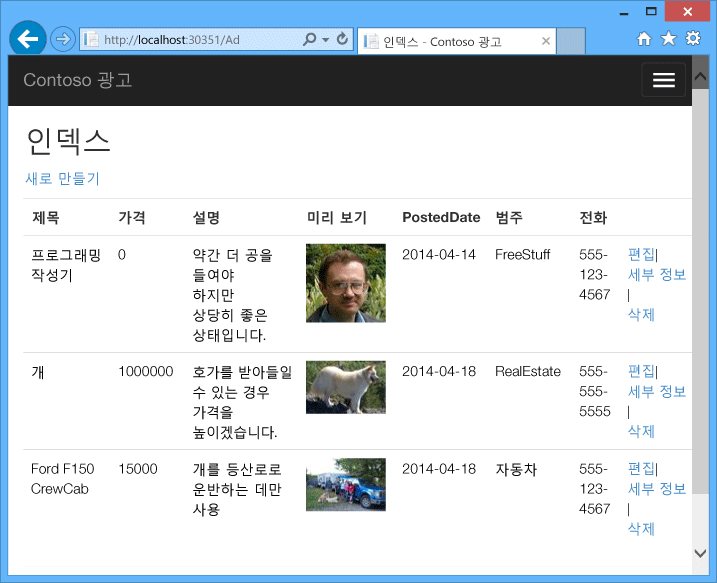

이 응용 프로그램에서는 [큐 중심 작업 패턴](http://www.asp.net/aspnet/overview/developing-apps-with-windows-azure/building-real-world-cloud-apps-with-windows-azure/queue-centric-work-pattern) 을 사용하여 미리 보기를 만드는 CPU 사용량이 많은 작업을 백 엔드 프로세스에 오프로드합니다.

## <a name="alternative-architecture-web-apps-and-webjobs"></a>대체 아키텍처: Web Apps 및 WebJobs
이 자습서에서는 Azure 클라우드 서비스에서 프런트 엔드 및 백 엔드를 실행하는 방법을 보여 줍니다. 대안은 [Azure Web Apps](/azure/app-service/)에서 프런트 엔드를 실행하고 백 엔드에 [WebJobs](http://go.microsoft.com/fwlink/?LinkId=390226) 기능을 사용하는 것입니다. WebJobs를 사용하는 자습서는 [Azure WebJobs SDK 시작](https://github.com/Azure/azure-webjobs-sdk/wiki)(영문)을 참조하세요. 시나리오에 가장 적합한 서비스를 선택하는 방법에 대한 자세한 내용은 [Azure Websites, Cloud Services 및 가상 머신 비교](../app-service/choose-web-site-cloud-service-vm.md)(영문)를 참조하세요.

## <a name="what-youll-learn"></a>학습할 내용
* Azure SDK를 설치하여 사용자 컴퓨터에서 Azure를 개발할 수 있도록 하는 방법
* ASP.NET MVC 웹 역할 및 두 개의 작업자 역할을 사용하여 Visual Studio 클라우드 서비스 프로젝트를 만드는 방법
* Azure 저장소 에뮬레이터를 사용하여 클라우드 서비스 프로젝트를 로컬에서 테스트하는 방법
* Azure 클라우드 서비스에 클라우드 프로젝트를 게시하고 Azure 저장소 계정을 사용하여 테스트하는 방법
* 파일을 업로드하고 Azure Blob service에 저장하는 방법
* 계층 간 통신에 Azure 큐 서비스를 사용하는 방법

## <a name="prerequisites"></a>필수 조건
이 자습서에서는 *웹 역할* 및 *작업자 역할* 용어와 같이 [Azure Cloud Services에 대한 기본 개념](cloud-services-choose-me.md)을 알고 있다고 가정합니다.  또한 Visual Studio에서 [ASP.NET MVC](http://www.asp.net/mvc/tutorials/mvc-5/introduction/getting-started)(영문) 또는 [웹 양식](http://www.asp.net/web-forms/tutorials/aspnet-45/getting-started-with-aspnet-45-web-forms/introduction-and-overview)(영문) 프로젝트를 작업하는 방법도 알고 있다고 가정합니다. 응용 프로그램 예제는 MVC를 사용하지만, 자습서 내용의 대부분은 Web Forms에도 적용됩니다.

Azure 구독 없이도 로컬에서 앱을 실행할 수 있지만 응용 프로그램을 클라우드에 배포하려면 구독이 필요합니다. 계정이 없는 경우 [MSDN 구독자 혜택을 활성화](https://azure.microsoft.com/pricing/member-offers/msdn-benefits-details/?WT.mc_id=A55E3C668)하거나 [무료 평가판을 등록](https://azure.microsoft.com/pricing/free-trial/?WT.mc_id=A55E3C668)할 수 있습니다.

자습서의 지침은 다음 제품 중 하나에 적용됩니다.

* Visual Studio 2013
* Visual Studio 2015
* Visual Studio 2017

위 제품 중 하나도 없는 경우 Azure SDK를 설치하면 Visual Studio가 자동으로 설치될 수 있습니다.

## <a name="application-architecture"></a>응용 프로그램 아키텍처
앱은 Entity Framework Code First를 사용해 SQL 데이터베이스에 광고를 저장하여 테이블을 만들고 데이터에 액세스합니다. 광고별로 데이터베이스는 전체 크기 이미지용과 썸네일용으로 두 개의 URL을 저장합니다.

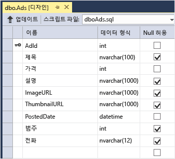

사용자가 이미지를 업로드하면 웹 역할로 실행 중인 프런트 엔드가 [Azure Blob](http://www.asp.net/aspnet/overview/developing-apps-with-windows-azure/building-real-world-cloud-apps-with-windows-azure/unstructured-blob-storage)(영문)에 이미지를 저장하며 Blob을 가리키는 URL을 사용하여 데이터베이스에 광고 정보를 저장합니다. 이와 동시에 Azure 큐에 메시지를 기록합니다. 작업자 역할로 실행되는 백 엔드 프로세스는 정기적으로 큐를 폴링하여 새 메시지를 확인합니다. 새 메시지가 나타나면 작업자 역할은 해당 이미지의 미리 보기를 만들고 광고에 대한 미리 보기 URL 데이터베이스 필드를 업데이트합니다. 다음은 응용 프로그램의 여러 부분이 상호 작용하는 방법을 보여 주는 다이어그램입니다.

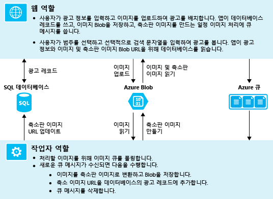

[!INCLUDE [install-sdk](../../includes/install-sdk-2017-2015-2013.md)]

## <a name="download-and-run-the-completed-solution"></a>완료된 솔루션 다운로드 및 실행
1. [완료된 솔루션](http://code.msdn.microsoft.com/Simple-Azure-Cloud-Service-e01df2e4)을 다운로드하고 압축 해제합니다.
2. Visual Studio를 시작합니다.
3. **파일** 메뉴에서 **프로젝트 열기**를 선택하고 솔루션을 다운로드한 위치로 이동한 후 솔루션 파일을 엽니다.
4. Ctrl+Shift+B를 눌러 솔루션을 빌드합니다.

    기본적으로 Visual Studio는 *.zip* 파일에 포함되지 않은 NuGet 패키지 콘텐츠를 자동으로 복원합니다. 패키지가 복원되지 않는 경우 **솔루션의 NuGet 패키지 관리** 대화 상자로 이동하고 오른쪽 위에서 **복원** 단추를 클릭하여 수동으로 설치합니다.
5. **솔루션 탐색기**에서 시작 프로젝트로 **ContosoAdsCloudService**가 선택되었는지 확인합니다.
6. Visual Studio 2015 이상을 사용하는 경우 ContosoAdsWeb 프로젝트의 응용 프로그램 *Web.config* 파일 및 ContosoAdsCloudService 프로젝트의 *ServiceConfiguration.Local.cscfg* 파일에서 SQL Server 연결 문자열을 변경합니다. 각각의 경우에서 "(localdb)\v11.0"을 "(localdb)\MSSQLLocalDB"로 변경합니다.
7. Ctrl+F5를 눌러 응용 프로그램을 실행합니다.

    클라우드 서비스 프로젝트를 로컬에서 실행하면 Visual Studio는 Azure *계산 에뮬레이터* 및 Azure *저장소 에뮬레이터*를 자동으로 호출합니다. 계산 에뮬레이터는 컴퓨터의 리소스를 사용하여 웹 역할 및 작업자 역할 환경을 시뮬레이션합니다. 저장소 에뮬레이터는 [SQL Server Express LocalDB](http://msdn.microsoft.com/library/hh510202.aspx) 데이터베이스를 사용하여 Azure 클라우드 저장소를 시뮬레이션합니다.

    클라우드 서비스 프로젝트를 처음 실행하면 에뮬레이터가 시작되는 데 1분 정도 걸립니다. 에뮬레이터 시작이 완료되면 기본 브라우저가 열려 응용 프로그램 홈페이지가 표시됩니다.

    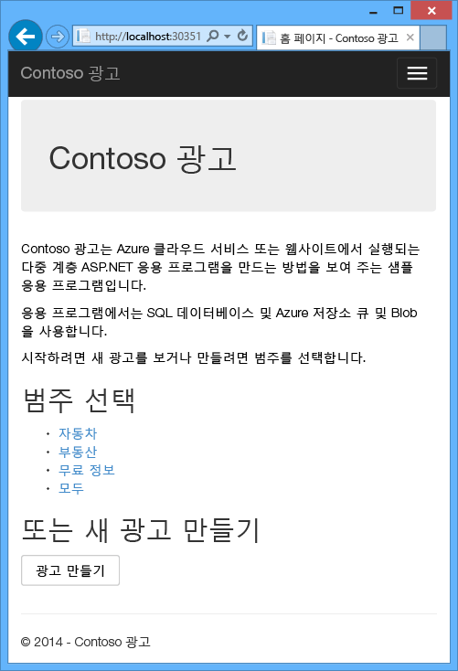
8. **광고 만들기**를 클릭합니다.
9. 일부 테스트 데이터를 입력하고 업로드할 *.jpg* 이미지를 선택한 다음 **만들기**를 클릭합니다.

    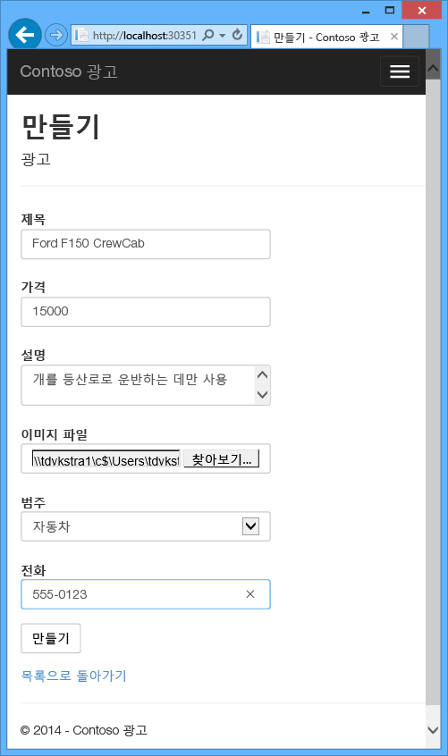

    앱이 인덱스 페이지로 이동하지만 아직 처리가 이루어지지 않았기 때문에 새 광고에 대한 미리 보기를 표시하지는 않습니다.
10. 잠깐 기다렸다가 인덱스 페이지를 새로 고쳐 미리 보기를 표시합니다.

     
11. 광고에 해당하는 **자세히** 를 클릭하여 전체 크기 이미지를 표시합니다.

     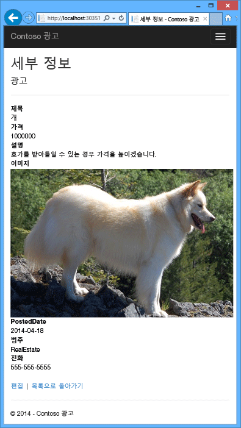

클라우드 연결 없이 응용 프로그램을 전적으로 로컬 컴퓨터에서 실행했습니다. 저장소 에뮬레이터는 큐 및 Blob 데이터를 SQL Server Express LocalDB 데이터베이스에 저장하고, 응용 프로그램은 다른 LocalDB 데이터베이스에 광고 데이터를 저장합니다. 웹 앱이 처음으로 액세스하려고 시도했을 때 Entity Framework Code First는 자동으로 광고 데이터베이스를 만들었습니다.

다음 섹션에서는 솔루션이 클라우드에서 실행될 때 큐, Blob 및 응용 프로그램 데이터베이스에 대해 Azure 클라우드 리소스를 사용하도록 솔루션을 구성합니다. 로컬에서 계속 실행하고 클라우드 저장소 및 데이터베이스 리소스를 사용하려면 그렇게 할 수 있습니다. 어떻게 할지는 연결 문자열을 설정하기에 달려 있습니다.

## <a name="deploy-the-application-to-azure"></a>Azure에 응용 프로그램 배포
클라우드에서 응용 프로그램을 실행하려면 다음 단계를 수행합니다.

* Azure 클라우드 서비스를 만듭니다.
* Azure SQL 데이터베이스를 만듭니다.
* Azure 저장소 계정 만들기
* Azure에서 실행될 때 Azure SQL 데이터베이스를 사용하도록 솔루션을 구성합니다.
* Azure에서 실행될 때 Azure 저장소 계정을 사용하도록 솔루션을 구성합니다.
* Azure 클라우드 서비스에 프로젝트를 배포합니다.

### <a name="create-an-azure-cloud-service"></a>Azure 클라우드 서비스 만들기
Azure 클라우드 서비스는 응용 프로그램이 실행되는 환경입니다.

1. 브라우저에서 [Azure Portal](https://portal.azure.com)을 엽니다.
2. **리소스 만들기 > Compute > 클라우드 서비스**를 클릭합니다.

3. DNS 이름 입력 상자에 클라우드 서비스의 URL 접두사를 입력합니다.

    이 URL은 고유해야 합니다.  선택한 접두사를 이미 사용 중이면 오류 메시지가 나타납니다.
4. 서비스에 대한 새 리소스 그룹을 지정합니다. **새로 만들기**를 클릭한 다음 리소스 그룹 입력 상자에 이름(예: CS_contososadsRG)을 입력합니다.

5. 응용 프로그램을 배포할 지역을 선택합니다.

    이 필드는 클라우드 서비스가 호스팅될 데이터센터를 지정합니다. 프로덕션 응용 프로그램의 경우 고객에게 가장 가까운 지역을 선택합니다. 이 자습서에서는 자신에게 가장 가까운 지역을 선택합니다.
5. **만들기**를 클릭합니다.

    다음 이미지에서는 CSvccontosoads.cloudapp.net이라는 URL로 클라우드 서비스가 생성되었습니다.

    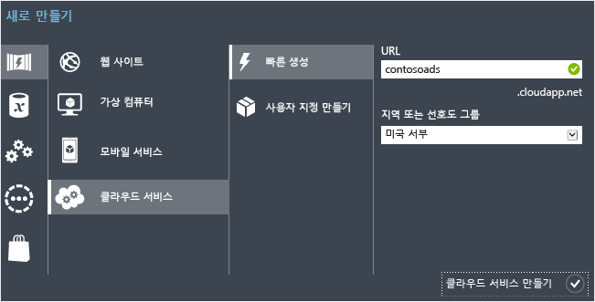

### <a name="create-an-azure-sql-database"></a>Azure SQL 데이터베이스 만들기
앱이 클라우드에서 실행될 때는 클라우드 기반 데이터베이스를 사용합니다.

1. [Azure Portal](https://portal.azure.com)에서 **리소스 만들기 > 데이터베이스 > SQL Database**를 클릭합니다.
2. **데이터베이스 이름** 상자에 *contosoads*를 입력합니다.
3. **리소스 그룹**에서 **기존 그룹 사용**을 클릭하고 클라우드 서비스에 사용된 리소스 그룹을 선택합니다.
4. 다음 이미지에서 **서버 - 필수 설정 구성** 및 **새 서버 만들기**를 클릭합니다.

    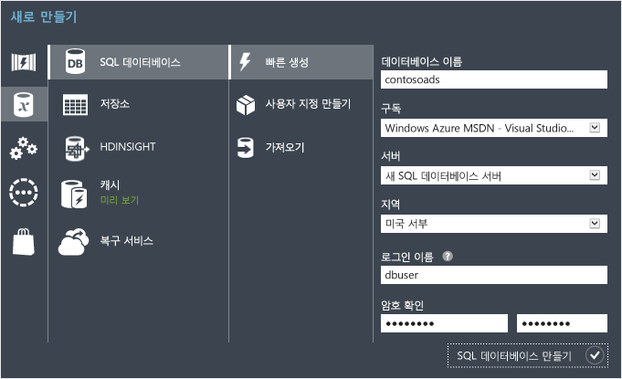

    또는 이미 구독에 서버가 있는 경우에는 드롭다운 목록에서 해당 서버를 선택할 수 있습니다.
5. **서버 이름** 상자에 *csvccontosodbserver*를 입력합니다.

6. 관리자 **로그인 이름** 및 **암호**를 입력합니다.

    **새 서버 만들기**를 선택한 경우 여기에 기존 이름 및 암호를 입력하면 안됩니다. 나중에 데이터베이스에 액세스할 때 사용할 새 이름과 암호를 입력해야 합니다. 이전에 만든 서버를 선택한 경우 이미 만든 관리자 계정에 대한 암호를 입력하라는 메시지가 나타납니다.
7. 클라우드 서비스에 선택한 것과 동일한 **위치**를 선택합니다.

    클라우드 서비스와 데이터베이스가 서로 다른 데이터 센터, 즉 서로 다른 지역에 있는 경우 대기 시간이 길어지고 데이터 센터 외부 대역폭에 대한 요금이 발생합니다. 데이터 센터 내부 대역폭은 무료입니다.
8. **Azure 서비스의 서버 액세스 허용**을 선택합니다.
9. 새 서버에 대해 **선택**을 클릭합니다.

    
10. **만들기**를 클릭합니다.

### <a name="create-an-azure-storage-account"></a>Azure 저장소 계정 만들기
Azure 저장소 계정은 큐 및 Blob 데이터를 클라우드에 저장하기 위한 리소스를 제공합니다.

실제 응용 프로그램에서는 일반적으로 응용 프로그램 데이터와 로깅 데이터를 위한 별도의 계정 및 테스트 데이터와 프로덕션 데이터를 위한 별도의 계정을 만듭니다. 이 자습서에서는 하나의 계정만 사용합니다.

1. [Azure Portal](https://portal.azure.com)에서 **리소스 만들기 > Storage > Storage 계정 - BLOB, 파일, 테이블, 큐**를 클릭합니다.
2. **이름** 상자에 URL 접두사를 입력합니다.

    이 접두사와 상자 아래에 표시되는 텍스트가 저장소 계정의 고유 URL이 됩니다. 입력한 접두사를 이미 다른 사람이 사용하는 경우 다른 접두사를 선택해야 합니다.
3. **배포 모델**을 *클래식*으로 설정합니다.

4. **복제** 드롭다운 목록을 **로컬 중복 저장소**로 설정합니다.

    저장소 계정에 대해 지역에서 복제를 사용하는 경우 저장된 콘텐츠가 보조 데이터 센터에 복제되어 기본 위치에서 대규모 재해가 발생하면 장애 조치(Failover)가 가능해집니다. 지역에서 복제는 추가 비용을 발생시킬 수 있습니다. 테스트 및 개발 계정의 경우 일반적으로 지역에서 복제 비용을 지불하지 않는 것이 좋습니다. 자세한 내용은 [저장소 계정 만들기, 관리 또는 삭제](../storage/common/storage-create-storage-account.md)를 참조하세요

5. **리소스 그룹**에서 **기존 그룹 사용**을 클릭하고 클라우드 서비스에 사용된 리소스 그룹을 선택합니다.
6. **위치** 드롭다운 목록을 클라우드 서비스에 선택한 것과 동일한 지역으로 설정합니다.

    클라우드 서비스와 저장소 계정이 서로 다른 데이터 센터, 즉 서로 다른 지역에 있는 경우 대기 시간이 길어지고 데이터 센터 외부 대역폭에 대한 요금이 발생합니다. 데이터 센터 내부 대역폭은 무료입니다.

    Azure 선호도 그룹은 데이터 센터 리소스 사이의 거리를 최소화하는 메커니즘을 제공하며, 이로 인해 대기 시간이 줄어들 수 있습니다. 이 자습서는 선호도 그룹을 사용하지 않습니다. 자세한 내용은 [Azure에서 선호도 그룹을 만드는 방법](https://msdn.microsoft.com/library/azure/gg715317.aspx)을 참조하세요.
7. **만들기**를 클릭합니다.

    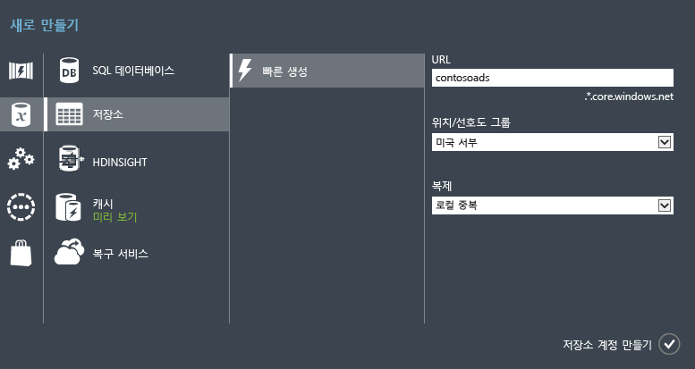

    이미지에서 다음 URL을 사용하여 저장소 계정이 생성됩니다. `csvccontosoads.core.windows.net`

### <a name="configure-the-solution-to-use-your-azure-sql-database-when-it-runs-in-azure"></a>Azure에서 실행될 때 Azure SQL 데이터베이스를 사용하도록 솔루션 구성
웹 프로젝트 및 작업자 역할 프로젝트는 각각 고유한 데이터베이스 연결 문자열을 가지며 앱이 Azure에서 실행될 때 Azure SQL 데이터베이스를 가리켜야 합니다.

웹 역할에 대해 [Web.config 변환](http://www.asp.net/mvc/tutorials/deployment/visual-studio-web-deployment/web-config-transformations) (영문)을 사용하고 작업자 역할에 대해 클라우드 서비스 환경 설정을 사용합니다.

> [!NOTE]
> 이 섹션 및 다음 섹션에서는 프로젝트 파일에 자격 증명을 저장합니다. [중요한 데이터를 공개 소스 코드 리포지토리에 저장하지 마세요](http://www.asp.net/aspnet/overview/developing-apps-with-windows-azure/building-real-world-cloud-apps-with-windows-azure/source-control#secrets)(영문).
>
>

1. ContosoAdsWeb 프로젝트에서 응용 프로그램 *Web.config* 파일에 대한 *Web.Release.config* 변환 파일을 열고 `<connectionStrings>` 요소가 포함된 주석 블록을 삭제한 후 그 자리에 다음 코드를 붙여 넣습니다.

    ```xml
    <connectionStrings>
        <add name="ContosoAdsContext" connectionString="{connectionstring}"
        providerName="System.Data.SqlClient" xdt:Transform="SetAttributes" xdt:Locator="Match(name)"/>
    </connectionStrings>
    ```

    편집용으로 파일을 열어 둡니다.
2. [Azure Portal](https://portal.azure.com)에서 왼쪽 창의 **SQL Database**를 클릭하고 이 자습서에 대해 만든 데이터베이스를 클릭한 후 **연결 문자열 표시**를 클릭합니다.

    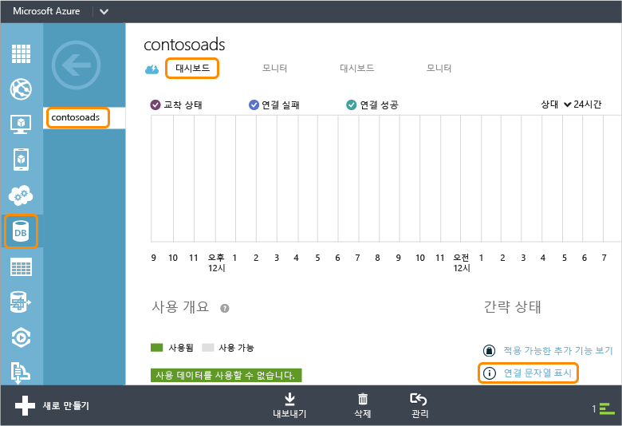

    포털은 암호 자리 표시자가 포함된 연결 문자열을 표시합니다.

    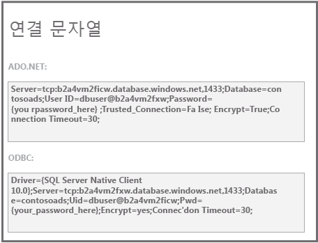
3. *Web.Release.config* 변환 파일에서 `{connectionstring}`을 삭제한 후 그 자리에 Azure Portal에서 가져온 ADO.NET 연결 문자열을 붙여 넣습니다.
4. *Web.Release.config* 변환 파일에 붙여 넣은 연결 문자열에서 `{your_password_here}` 대신 새 SQL 데이터베이스에 대해 만든 암호로 바꿉니다.
5. 파일을 저장합니다.  
6. 작업자 역할 프로젝트를 구성하는 다음 단계에서 사용할 수 있도록 연결 문자열을 선택하고 복사합니다(둘러싼 따옴표 미포함).
7. **솔루션 탐색기**에서, 클라우드 서비스 프로젝트의 **역할** 아래에서 **ContosoAdsWorker**를 마우스 오른쪽 단추로 클릭하고 **속성**을 선택합니다.

    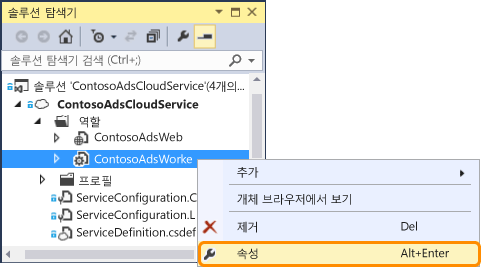
8. **설정** 탭을 클릭합니다.
9. **서비스 구성**을 **클라우드**로 변경합니다.
10. `ContosoAdsDbConnectionString` 설정에서 **값** 필드를 선택한 다음 자습서의 이전 섹션에서 복사한 연결 문자열을 붙여넣습니다.

     
11. 변경 내용을 저장합니다.  

### <a name="configure-the-solution-to-use-your-azure-storage-account-when-it-runs-in-azure"></a>Azure에서 실행될 때 Azure 저장소 계정을 사용하도록 솔루션 구성
웹 역할 프로젝트 및 작업자 역할 프로젝트에 대한 Azure 저장소 계정 연결 문자열은 클라우드 서비스 프로젝트의 환경 설정에 저장됩니다. 각 프로젝트에는 응용 프로그램이 로컬에서 실행될 때와 클라우드에서 실행될 때 사용되는 별도의 설정 집합이 있습니다. 웹 역할 및 작업자 역할 프로젝트의 클라우드 환경 설정을 업데이트합니다.

1. **솔루션 탐색기**에서 **ContosoAdsCloudService** 프로젝트의 **역할** 아래에 있는 **ContosoAdsWeb**을 마우스 오른쪽 단추로 클릭하고 **속성**을 클릭합니다.

    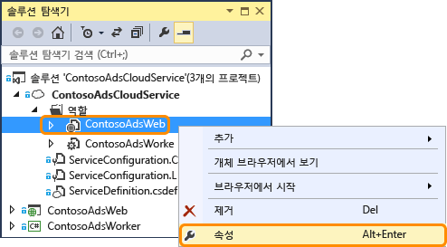
2. **설정** 탭을 클릭합니다. **서비스 구성** 드롭다운 상자에서 **클라우드**를 선택합니다.

    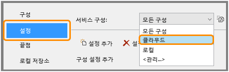
3. **StorageConnectionString** 항목을 선택하면 줄 오른쪽 끝에 줄임표(**...**) 단추가 표시됩니다. 줄임표 단추를 클릭하여 **Storage 계정 연결 문자열 만들기** 대화 상자를 엽니다.

    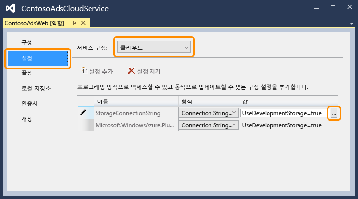
4. **저장소 연결 문자열 만들기** 대화 상자에서 **내 구독**을 클릭하고, 앞에서 만든 Storage 계정을 선택한 다음 **확인**을 클릭합니다. 아직 로그인하지 않은 경우 Azure 계정 자격 증명을 요구하는 메시지가 나타납니다.

    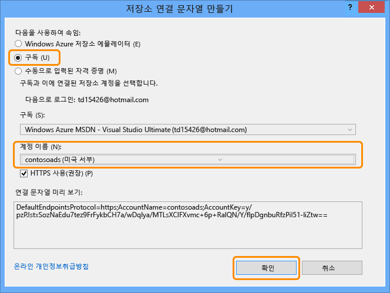
5. 변경 내용을 저장합니다.
6. `StorageConnectionString` 연결 문자열에 사용한 것과 동일한 절차에 따라 `Microsoft.WindowsAzure.Plugins.Diagnostics.ConnectionString` 연결 문자열을 설정합니다.

    이 연결 문자열은 로깅에 사용됩니다.
7. **ContosoAdsWeb** 역할에 사용한 것과 동일한 절차에 따라 **ContosoAdsWorker** 역할에 대한 연결 문자열을 모두 설정합니다. **서비스 구성**을 **클라우드**로 설정해야 합니다.

Visual Studio UI를 사용하여 구성한 역할 환경 설정은 ContosoAdsCloudService 프로젝트에서 다음 파일에 저장됩니다.

* *ServiceDefinition.csdef* - 설정 이름을 정의합니다.
* *ServiceConfiguration.Cloud.cscfg* - 앱이 클라우드에서 실행되는 경우에 대한 값을 제공합니다.
* *ServiceConfiguration.Local.cscfg* - 앱이 로컬에서 실행되는 경우에 대한 값을 제공합니다.

예를 들어 ServiceDefinition.csdef에는 다음 정의가 포함됩니다.

```xml
<ConfigurationSettings>
    <Setting name="StorageConnectionString" />
    <Setting name="ContosoAdsDbConnectionString" />
</ConfigurationSettings>
```

그리고 *ServiceConfiguration.Cloud.cscfg* 파일에는 Visual Studio에서 해당 설정에 입력한 값이 포함됩니다.

```xml
<Role name="ContosoAdsWorker">
    <Instances count="1" />
    <ConfigurationSettings>
        <Setting name="StorageConnectionString" value="{yourconnectionstring}" />
        <Setting name="ContosoAdsDbConnectionString" value="{yourconnectionstring}" />
        <!-- other settings not shown -->

    </ConfigurationSettings>
    <!-- other settings not shown -->

</Role>
```

`<Instances>`설정은 Azure가 작업자 역할 코드를 실행할 가상 컴퓨터의 수를 지정합니다. [다음 단계](#next-steps) 섹션에는 클라우드 서비스 규모 확장에 대한 자세한 정보로 연결되는 링크가 있습니다.

### <a name="deploy-the-project-to-azure"></a>Azure에 프로젝트 배포
1. **솔루션 탐색기**에서 **ContosoAdsCloudService** 클라우드 프로젝트를 마우스 오른쪽 단추로 클릭한 후 **게시**를 선택합니다.

   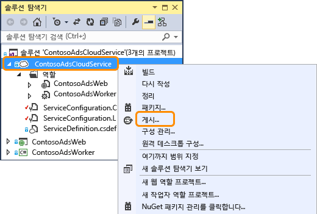
2. **Azure 응용 프로그램 게시** 마법사의 **로그인** 단계에서 **다음**을 클릭합니다.

    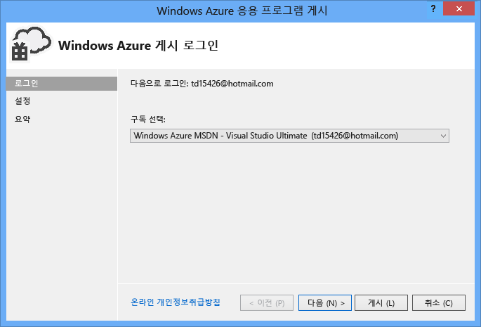
3. 마법사의 **설정** 단계에서 **다음**을 클릭합니다.

    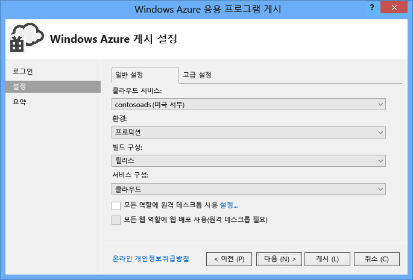

    **고급** 탭의 기본 설정은 이 자습서 내용에 적합합니다. 고급 탭에 대한 자세한 내용은 [Azure 응용 프로그램 게시 마법사](https://docs.microsoft.com/azure/vs-azure-tools-publish-azure-application-wizard)를 참조하세요.
4. **요약** 단계에서 **게시**를 클릭합니다.

    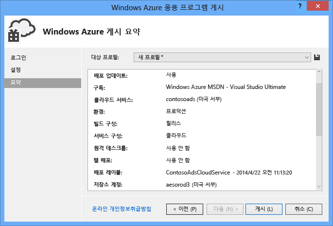

   Visual Studio에서 **Azure 활동 로그** 창이 열립니다.
5. 오른쪽 화살표 아이콘을 클릭하여 배포 세부 정보를 확장합니다.

    배포가 완료되는 데 약 5분 이상 걸릴 수 있습니다.

    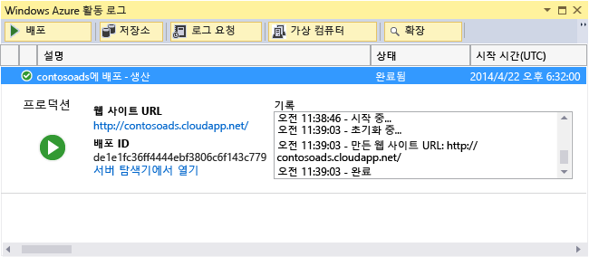
6. 배포 상태가 완료되면 **웹 앱 URL** 을 클릭하여 응용 프로그램을 시작합니다.
7. 이제 응용 프로그램을 로컬에서 실행할 때처럼 일부 광고를 만들고, 보고, 편집하는 방법으로 앱을 테스트할 수 있습니다.

> [!NOTE]
> 테스트를 완료하면 클라우드 서비스를 삭제하거나 중지하세요. 클라우드 서비스를 사용하지 않더라도 가상 머신 리소스가 예약되어 있기 때문에 요금이 발생합니다. 또한 실행 중인 채로 두는 경우에는 누군가가 URL을 발견하면 광고를 만들고 볼 수 있습니다. [Azure Portal](https://portal.azure.com)에서 클라우드 서비스의 **개요** 탭으로 이동한 다음 페이지 맨 위에 있는 **삭제** 단추를 클릭합니다. 임시로 다른 사람이 사이트에 액세스하지 못하도록 만들려면 대신 **중지** 를 클릭합니다. 이 경우에는 요금이 계속해서 발생합니다. 더 이상 필요 없는 경우 비슷한 절차에 따라 SQL 데이터베이스 및 저장소 계정을 삭제할 수 있습니다.
>
>

## <a name="create-the-application-from-scratch"></a>처음부터 응용 프로그램 만들기
아직 [완료된 응용 프로그램](http://code.msdn.microsoft.com/Simple-Azure-Cloud-Service-e01df2e4)(영문)을 다운로드하지 않았다면 다운로드하세요. 다운로드한 프로젝트에서 새 프로젝트로 파일을 복사합니다.

Contoso Ads 응용 프로그램을 만드는 데는 다음 단계가 필요합니다.

* 클라우드 서비스 Visual Studio 솔루션을 만듭니다.
* NuGet 패키지를 업데이트 및 추가합니다.
* 프로젝트 참조를 설정합니다.
* 연결 문자열을 구성합니다.
* 코드 파일을 추가합니다.

솔루션이 만들어진 후에는 클라우드 서비스 프로젝트에 고유한 코드와 Azure Blob 및 큐를 검토합니다.

### <a name="create-a-cloud-service-visual-studio-solution"></a>클라우드 서비스 Visual Studio 솔루션 만들기
1. Visual Studio의 **새 프로젝트** from the **새 프로젝트** 를 선택합니다.
2. **새 프로젝트** 대화 상자의 왼쪽 창에서 **Visual C#** 을 확장하고 **클라우드** 템플릿을 선택한 후 **Azure 클라우드 서비스** 템플릿을 선택합니다.
3. 프로젝트 및 솔루션의 이름을 ContosoAdsCloudService로 지정한 다음 **확인**을 클릭합니다.

    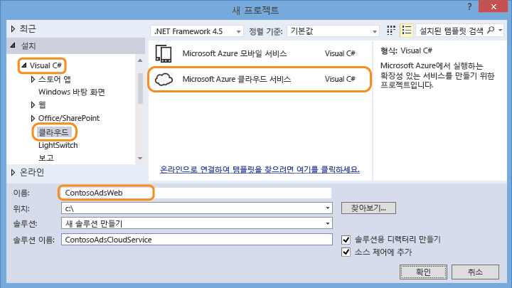
4. **새 Azure 클라우드 서비스** 대화 상자에서 웹 역할 및 작업자 역할을 추가합니다. 웹 역할의 이름을 ContosoAdsWeb으로 지정하고 작업자 역할의 이름을 ContosoAdsWorker로 지정합니다. (역할의 기본 이름을 변경하려면 오른쪽 창에 있는 연필 아이콘을 사용합니다.)

    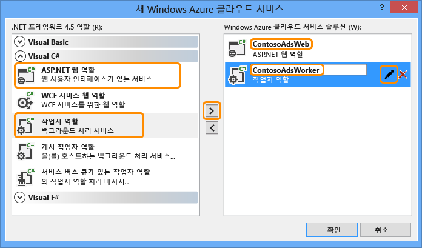
5. 웹 역할에 대한 **새 ASP.NET 프로젝트** 대화 상자가 표시되면 MVC 템플릿을 선택하고 **인증 변경**을 클릭합니다.

    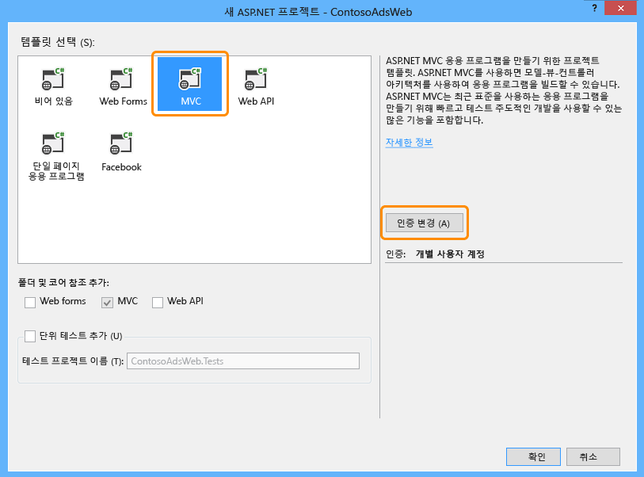
6. **인증 변경** 대화 상자에서 **인증 없음**을 선택한 다음 **확인**을 클릭합니다.

    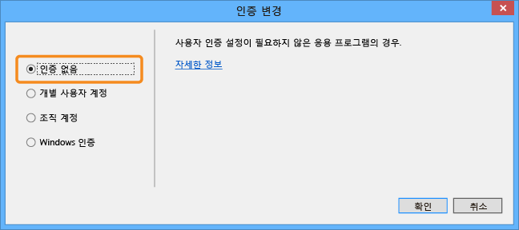
7. **새 ASP.NET 프로젝트** 대화 상자에서 **확인**을 클릭합니다.
8. **솔루션 탐색기**에서 솔루션(프로젝트 중 하나가 아님)을 마우스 오른쪽 단추로 클릭하고 **추가 - 새 프로젝트**를 선택합니다.
9. **새 프로젝트 추가** 대화 상자의 왼쪽 창에서 **Visual C#** 에 있는 **Windows**을 선택한 다음 **클래스 라이브러리** 템플릿을 클릭합니다.  
10. 프로젝트의 이름을 *ContosoAdsCommon*으로 지정한 다음 **확인**을 클릭합니다.

    Entity Framework 컨텍스트 및 웹 역할 프로젝트와 작업자 역할 프로젝트의 데이터 모델을 참조해야 합니다. 또는 웹 역할 프로젝트에서 EF 관련 클래스를 정의하고 작업자 역할 프로젝트에서 이 프로젝트를 참조할 수 있습니다. 하지만 대안에서는 작업자 역할 프로젝트에는 필요 없는 웹 어셈블리 참조가 포함됩니다.

### <a name="update-and-add-nuget-packages"></a>NuGet 패키지 업데이트 및 추가
1. 솔루션에 대한 **NuGet 패키지 관리** 대화 상자를 엽니다.
2. 창 맨 위에서 **업데이트**를 선택합니다.
3. *WindowsAzure.Storage* 패키지를 찾고 목록에 있는 경우 선택합니다. 업데이트하려면 웹 및 작업자 프로젝트를 선택한 다음 **업데이트**를 클릭합니다.

    저장소 클라이언트 라이브러리는 Visual Studio 프로젝트 템플릿보다 자주 업데이트됩니다. 따라서 새로 생성된 프로젝트에서 버전을 업데이트해야 하는 경우가 많습니다.
4. 창 맨 위에서 **찾아보기**를 선택합니다.
5. *EntityFramework* NuGet 패키지를 찾아 세 개의 프로젝트 모두에서 설치합니다.
6. *Microsoft.WindowsAzure.ConfigurationManager* NuGet 패키지를 찾은 후 작업자 역할 프로젝트에 설치합니다.

### <a name="set-project-references"></a>프로젝트 참조 설정
1. ContosoAdsWeb 프로젝트에서 ContosoAdsCommon 프로젝트에 대한 참조를 설정합니다. ContosoAdsWeb 프로젝트를 마우스 오른쪽 단추로 클릭한 다음 **참조** - **참조 추가**를 클릭합니다. **참조 관리자** 대화 상자의 왼쪽 창에서 **솔루션 – 프로젝트**를 선택하고 **ContosoAdsCommon**을 선택한 다음 **확인**을 클릭합니다.
2. ContosoAdsWorker 프로젝트에서 ContosAdsCommon 프로젝트에 대한 참조를 설정합니다.

    ContosoAdsCommon에는 Entity Framework 데이터 모델 및 컨텍스트 클래스가 포함되며, 이는 프런트 엔드 및 백 엔드 모두에서 사용됩니다.
3. ContosoAdsWorker 프로젝트에서 `System.Drawing`에 대한 참조를 설정합니다.

    이 어셈블리는 백 엔드에서 이미지를 미리 보기로 변환하는 데 사용됩니다.

### <a name="configure-connection-strings"></a>연결 문자열 구성
이 섹션에서는 로컬 테스트를 위해 Azure Storage 및 SQL 연결 문자열을 구성합니다. 자습서 앞부분의 배포 지침에서는 앱이 클라우드에서 실행되는 경우를 위한 연결 문자열을 설정하는 방법을 설명합니다.

1. ContosoAdsWeb 프로젝트에서 응용 프로그램 Web.config 파일을 열고 다음 `connectionStrings` 요소를 `configSections` 요소 뒤에 삽입합니다.

    ```xml
    <connectionStrings>
        <add name="ContosoAdsContext" connectionString="Data Source=(localdb)\v11.0; Initial Catalog=ContosoAds; Integrated Security=True; MultipleActiveResultSets=True;" providerName="System.Data.SqlClient" />
    </connectionStrings>
    ```

    Visual Studio 2015 이상을 사용하는 경우 "v11.0"을 "MSSQLLocalDB"로 바꿉니다.
2. 변경 내용을 저장합니다.
3. ContosoAdsCloudService 프로젝트에서 **역할**아래의 ContosoAdsWeb을 마우스 오른쪽 단추로 클릭한 다음 **속성**을 클릭합니다.

    
4. **ContosAdsWeb [Role]** 속성 창에서 **설정** 탭을 클릭한 다음 **설정 추가**를 클릭합니다.

    **서비스 구성**을 **모든 구성**으로 설정해 둡니다.
5. 이름이 *StorageConnectionString*인 설정을 추가합니다. **형식**을 *ConnectionString*으로 설정하고 **값**을 *UseDevelopmentStorage=true*로 설정합니다.

    
6. 변경 내용을 저장합니다.
7. 동일한 절차에 따라 ContosoAdsWorker 역할 속성에서 저장소 연결 문자열을 추가합니다.
8. 계속 **ContosoAdsWorker [Role]** 속성 창에서 다른 연결 문자열을 추가합니다.

   * 이름: ContosoAdsDbConnectionString
   * 형식: String
   * 값: 웹 역할 프로젝트에 사용한 것과 동일한 연결 문자열을 붙여 넣습니다. (다음은 Visual Studio 2013용 예제입니다. 이 예제를 복사하고 Visual Studio 2015 이상을 사용하는 경우 데이터 원본을 반드시 변경해야 합니다.)

       ```
       Data Source=(localdb)\v11.0; Initial Catalog=ContosoAds; Integrated Security=True; MultipleActiveResultSets=True;
       ```

### <a name="add-code-files"></a>코드 파일 추가
이 섹션에서는 다운로드한 솔루션에서 새 솔루션으로 코드 파일을 복사합니다. 다음 섹션에서는 이 코드의 주요 부분을 보여 주고 설명합니다.

프로젝트나 폴더에 파일을 추가하려면 프로젝트나 폴더를 마우스 오른쪽 단추로 클릭하고 **추가** - **기존 항목**에 배포하는 방법을 보여 줍니다. 원하는 파일을 선택하고 **추가**를 클릭합니다. 기존 파일을 바꿀지 여부를 묻는 메시지가 나타나면 **예**를 클릭합니다.

1. ContosoAdsCommon 프로젝트에서 *Class1.cs* 파일을 삭제하고 그 자리에 다운로드한 프로젝트에서 가져온 *Ad.cs* 및 *ContosoAdscontext.cs* 파일을 추가합니다.
2. ContosoAdsWeb 프로젝트에 다운로드한 프로젝트에서 가져온 다음 파일을 추가합니다.

   * *Global.asax.cs*  
   * *Views\Shared* 폴더: *\__Layout.cshtml*
   * *Views\Home* 폴더: *Index.cshtml*
   * *Controllers* 폴더: *AdController.cs*
   * *Views\Ad* 폴더(먼저 폴더 만들기): 5개의 *.cshtml* 파일
3. ContosoAdsWorker 프로젝트에서 다운로드한 프로젝트에서 가져온 *WorkerRole.cs* 를 추가합니다.

이제 자습서 앞부분의 지침에 따라 응용 프로그램을 구축하고 실행할 수 있습니다. 앱은 로컬 데이터베이스 및 저장소 에뮬레이터 리소스를 사용합니다.

다음 섹션에서는 Azure 환경, Blob 및 큐 작업과 관련된 코드에 대해 설명합니다. 이 자습서에 스캐폴딩을 사용하여 MVC 컨트롤러 및 보기를 만드는 방법(영문), SQL Server 데이터베이스를 사용하는 Entity Framework 코드를 작성하는 방법(영문) 또는 ASP.NET 4.5의 비동기 프로그래밍에 대한 기본 사항(영문)은 나와 있지 않습니다. 이러한 항목에 대한 내용은 다음 리소스를 참조하세요.

* [MVC 5 시작](http://www.asp.net/mvc/tutorials/mvc-5/introduction/getting-started)
* [EF 6 및 MVC 5 시작](http://www.asp.net/mvc/tutorials/getting-started-with-ef-using-mvc)
* [.NET 4.5의 비동기 프로그래밍 소개](http://www.asp.net/aspnet/overview/developing-apps-with-windows-azure/building-real-world-cloud-apps-with-windows-azure/web-development-best-practices#async).

### <a name="contosoadscommon---adcs"></a>ContosoAdsCommon - Ad.cs
Ad.cs 파일은 광고 범주의 열거형 및 광고 정보에 대한 POCO 엔터티 클래스를 정의합니다.

```csharp
public enum Category
{
    Cars,
    [Display(Name="Real Estate")]
    RealEstate,
    [Display(Name = "Free Stuff")]
    FreeStuff
}

public class Ad
{
    public int AdId { get; set; }

    [StringLength(100)]
    public string Title { get; set; }

    public int Price { get; set; }

    [StringLength(1000)]
    [DataType(DataType.MultilineText)]
    public string Description { get; set; }

    [StringLength(1000)]
    [DisplayName("Full-size Image")]
    public string ImageURL { get; set; }

    [StringLength(1000)]
    [DisplayName("Thumbnail")]
    public string ThumbnailURL { get; set; }

    [DataType(DataType.Date)]
    [DisplayFormat(DataFormatString = "{0:yyyy-MM-dd}", ApplyFormatInEditMode = true)]
    public DateTime PostedDate { get; set; }

    public Category? Category { get; set; }
    [StringLength(12)]
    public string Phone { get; set; }
}
```

### <a name="contosoadscommon---contosoadscontextcs"></a>ContosoAdsCommon - ContosoAdsContext.cs
ContosoAdsContext 클래스는 DbSet 컬렉션에서 Ad 클래스가 사용된다는 것을 지정하며, Entity Framework는 이를 SQL 데이터베이스에 저장합니다.

```csharp
public class ContosoAdsContext : DbContext
{
    public ContosoAdsContext() : base("name=ContosoAdsContext")
    {
    }
    public ContosoAdsContext(string connString)
        : base(connString)
    {
    }
    public System.Data.Entity.DbSet<Ad> Ads { get; set; }
}
```

이 클래스에는 두 개의 생성자가 있습니다. 첫 번째 생성자는 웹 프로젝트에서 사용되며 Web.config 파일에 저장되는 연결 문자열의 이름을 지정합니다. 두 번째 생성자를 사용하면 Web.config 파일이 없으므로 작업자 역할 프로젝트에서 사용된 실제 연결 문자열을 전달할 수 있습니다. 앞에서 이 연결 문자열이 저장된 위치를 확인했으며, 이후에 코드가 DbContext 클래스를 인스턴스화할 때 연결 문자열을 검색하는 방법을 확인하게 될 것입니다.

### <a name="contosoadsweb---globalasaxcs"></a>ContosoAdsWeb - Global.asax.cs
`Application_Start` 메서드에서 호출되는 코드는 *images* Blob 컨테이너 및 *images* 큐를 만듭니다(아직 없는 경우). 따라서 새 저장소 계정을 사용하기 시작하거나 새 컴퓨터에서 저장소 에뮬레이터를 사용하기 시작할 때마다 필수 Blob 컨테이너와 큐가 자동으로 만들어집니다.

이 코드는 *.cscfg* 파일의 저장소 연결 문자열을 사용하여 저장소 계정에 액세스합니다.

```csharp
var storageAccount = CloudStorageAccount.Parse
    (RoleEnvironment.GetConfigurationSettingValue("StorageConnectionString"));
```

그런 다음, *images* Blob 컨테이너에 대한 참조를 가져오고 컨테이너를 만들고(아직 없는 경우) 새 컨테이너에 대한 액세스 권한을 설정합니다. 기본적으로 새 컨테이너는 저장소 계정 자격 증명이 있는 클라이언트만 Blob에 액세스할 수 있게 허용합니다. 이미지 Blob을 가리키는 URL을 사용하여 이미지를 표시할 수 있도록 웹 사이트는 Blob을 공개로 설정해야 합니다.

```csharp
var blobClient = storageAccount.CreateCloudBlobClient();
var imagesBlobContainer = blobClient.GetContainerReference("images");
if (imagesBlobContainer.CreateIfNotExists())
{
    imagesBlobContainer.SetPermissions(
        new BlobContainerPermissions
        {
            PublicAccess =BlobContainerPublicAccessType.Blob
        });
}
```

비슷한 코드가 *images* 큐에 대한 참조를 가져오고 새 큐를 만듭니다. 이런 경우 권한을 변경할 필요가 없습니다.

```csharp
CloudQueueClient queueClient = storageAccount.CreateCloudQueueClient();
var imagesQueue = queueClient.GetQueueReference("images");
imagesQueue.CreateIfNotExists();
```

### <a name="contosoadsweb---layoutcshtml"></a>ContosoAdsWeb - \_Layout.cshtml
*_Layout.cshtml* 파일은 머리글과 바닥글에서 앱 이름을 설정하고 "Ads" 메뉴 항목을 만듭니다.

### <a name="contosoadsweb---viewshomeindexcshtml"></a>ContosoAdsWeb - Views\Home\Index.cshtml
*Views\Home\Index.cshtml* 파일은 홈페이지에 범주 링크를 표시합니다. 이 링크는 쿼리 문자열 변수의 `Category` 열거형 정수 값을 광고 인덱스 페이지에 전달합니다.

```razor
<li>@Html.ActionLink("Cars", "Index", "Ad", new { category = (int)Category.Cars }, null)</li>
<li>@Html.ActionLink("Real estate", "Index", "Ad", new { category = (int)Category.RealEstate }, null)</li>
<li>@Html.ActionLink("Free stuff", "Index", "Ad", new { category = (int)Category.FreeStuff }, null)</li>
<li>@Html.ActionLink("All", "Index", "Ad", null, null)</li>
```

### <a name="contosoadsweb---adcontrollercs"></a>ContosoAdsWeb - AdController.cs
*AdController.cs* 파일에서 생성자는 `InitializeStorage` 메서드를 호출하여 Blob 및 큐 작업을 위한 API를 제공하는 Azure Storage 클라이언트 라이브러리 개체를 만듭니다.

그런 다음 이 코드는 앞서 *Global.asax.cs*에서 확인한 *images* Blob 컨테이너에 대한 참조를 가져옵니다. 그 과정에서 웹앱에 해당하는 기본 [재시도 정책](http://www.asp.net/aspnet/overview/developing-apps-with-windows-azure/building-real-world-cloud-apps-with-windows-azure/transient-fault-handling) (영문)을 설정합니다. 기본 지수 백오프 재시도 정책은 일시적 오류에 대해 반복적으로 재시도하는 경우 1분 넘게 웹앱을 중지시킬 수 있습니다. 여기에 지정된 재시도 정책은 각 시도 후 3초 동안 최대 3회까지 대기합니다.

```csharp
var blobClient = storageAccount.CreateCloudBlobClient();
blobClient.DefaultRequestOptions.RetryPolicy = new LinearRetry(TimeSpan.FromSeconds(3), 3);
imagesBlobContainer = blobClient.GetContainerReference("images");
```

비슷한 코드가 *images* 큐에 대한 참조를 가져옵니다.

```csharp
CloudQueueClient queueClient = storageAccount.CreateCloudQueueClient();
queueClient.DefaultRequestOptions.RetryPolicy = new LinearRetry(TimeSpan.FromSeconds(3), 3);
imagesQueue = queueClient.GetQueueReference("images");
```

대부분의 컨트롤러 코드는 DbContext 클래스를 사용한 Entity Framework 데이터 모델 작업에 일반적입니다. 예외는 HttpPost `Create` 서드이며, 이 메서드는 파일을 업로드하고 Blob 저장소에 저장합니다. 모델 바인더는 메서드에 [HttpPostedFileBase](http://msdn.microsoft.com/library/system.web.httppostedfilebase.aspx) 개체를 제공합니다.

```csharp
[HttpPost]
[ValidateAntiForgeryToken]
public async Task<ActionResult> Create(
    [Bind(Include = "Title,Price,Description,Category,Phone")] Ad ad,
    HttpPostedFileBase imageFile)
```

사용자가 업로드할 파일을 선택한 경우 코드는 파일을 업로드하고 Blob에 저장하며 광고 데이터베이스 레코드를 Blob을 가리키는 URL로 업데이트합니다.

```csharp
if (imageFile != null && imageFile.ContentLength != 0)
{
    blob = await UploadAndSaveBlobAsync(imageFile);
    ad.ImageURL = blob.Uri.ToString();
}
```

업로드를 수행하는 코드는 `UploadAndSaveBlobAsync` 메서드에 있습니다. Blob에 대한 GUID 이름을 만들고, 파일을 업로드 및 저장하며, 저장된 Blob에 대한 참조를 반환합니다.

```csharp
private async Task<CloudBlockBlob> UploadAndSaveBlobAsync(HttpPostedFileBase imageFile)
{
    string blobName = Guid.NewGuid().ToString() + Path.GetExtension(imageFile.FileName);
    CloudBlockBlob imageBlob = imagesBlobContainer.GetBlockBlobReference(blobName);
    using (var fileStream = imageFile.InputStream)
    {
        await imageBlob.UploadFromStreamAsync(fileStream);
    }
    return imageBlob;
}
```

HttpPost `Create` 메서드가 Blob을 업로드하고 데이터베이스를 업데이트한 후에는 이미지를 미리 보기로 변환할 수 있는 백 엔드 프로세스에 대해 알리는 큐 메시지를 만듭니다.

```csharp
string queueMessageString = ad.AdId.ToString();
var queueMessage = new CloudQueueMessage(queueMessageString);
await queue.AddMessageAsync(queueMessage);
```

HttpPost `Edit` 메서드의 코드도 비슷하지만, 사용자가 새 이미지 파일을 선택하면 이미 존재하는 Blob를 삭제해야 한다는 점은 다릅니다.

```csharp
if (imageFile != null && imageFile.ContentLength != 0)
{
    await DeleteAdBlobsAsync(ad);
    imageBlob = await UploadAndSaveBlobAsync(imageFile);
    ad.ImageURL = imageBlob.Uri.ToString();
}
```

다음 예에서는 광고를 삭제하면 Blob을 삭제하는 코드를 보여줍니다.

```csharp
private async Task DeleteAdBlobsAsync(Ad ad)
{
    if (!string.IsNullOrWhiteSpace(ad.ImageURL))
    {
        Uri blobUri = new Uri(ad.ImageURL);
        await DeleteAdBlobAsync(blobUri);
    }
    if (!string.IsNullOrWhiteSpace(ad.ThumbnailURL))
    {
        Uri blobUri = new Uri(ad.ThumbnailURL);
        await DeleteAdBlobAsync(blobUri);
    }
}
private static async Task DeleteAdBlobAsync(Uri blobUri)
{
    string blobName = blobUri.Segments[blobUri.Segments.Length - 1];
    CloudBlockBlob blobToDelete = imagesBlobContainer.GetBlockBlobReference(blobName);
    await blobToDelete.DeleteAsync();
}
```

### <a name="contosoadsweb---viewsadindexcshtml-and-detailscshtml"></a>ContosoAdsWeb - Views\Ad\Index.cshtml 및 Details.cshtml
*Index.cshtml* 파일은 다른 광고 데이터가 포함된 미리 보기를 표시합니다.

```razor

```

*Details.cshtml* 파일은 전체 크기 이미지를 표시합니다.

```razor

```

### <a name="contosoadsweb---viewsadcreatecshtml-and-editcshtml"></a>ContosoAdsWeb - Views\Ad\Create.cshtml 및 Edit.cshtml
*Create.cshtml* 및 *Edit.cshtml* 파일은 컨트롤러가 `HttpPostedFileBase` 개체를 가져올 수 있게 하는 양식 인코딩을 지정합니다.

```razor
@using (Html.BeginForm("Create", "Ad", FormMethod.Post, new { enctype = "multipart/form-data" }))
```

`<input>` 요소는 파일 선택 대화 상자를 제공하도록 브라우저에 지시합니다.

```razor
<input type="file" name="imageFile" accept="image/*" class="form-control fileupload" />
```

### <a name="contosoadsworker---workerrolecs---onstart-method"></a>ContosoAdsWorker - WorkerRole.cs - OnStart 메서드
Azure 작업자 역할 환경은 작업자 역할이 시작될 때 `OnStart` 메서드(`WorkerRole` 클래스에 있음)를 호출하고 `Run` 메서드를 호출합니다(`OnStart` 메서드가 완료되는 경우).

`OnStart` 메서드는 *.cscfg* 파일에서 데이터베이스 연결 문자열을 가져와 Entity Framework DbContext 클래스에 전달합니다. SQLClient 공급자는 기본적으로 사용되므로, 이 공급자를 지정할 필요가 없습니다.

```csharp
var dbConnString = CloudConfigurationManager.GetSetting("ContosoAdsDbConnectionString");
db = new ContosoAdsContext(dbConnString);
```

그런 다음, 이 메서드는 저장소 계정에 대한 참조를 가져오고 Blob 컨테이너 및 큐를 만듭니다(없는 경우). 이에 대한 코드는 웹 역할 `Application_Start` 메서드에서 이미 확인한 코드와 비슷합니다.

### <a name="contosoadsworker---workerrolecs---run-method"></a>ContosoAdsWorker - WorkerRole.cs - Run 메서드
`Run` 메서드는 `OnStart` 메서드가 초기화 작업을 마치면 호출됩니다. 이 메서드는 새 큐 메시지를 찾고 해당 메시지가 도달하면 이를 처리하는 무한 루프를 실행합니다.

```csharp
public override void Run()
{
    CloudQueueMessage msg = null;

    while (true)
    {
        try
        {
            msg = this.imagesQueue.GetMessage();
            if (msg != null)
            {
                ProcessQueueMessage(msg);
            }
            else
            {
                System.Threading.Thread.Sleep(1000);
            }
        }
        catch (StorageException e)
        {
            if (msg != null && msg.DequeueCount > 5)
            {
                this.imagesQueue.DeleteMessage(msg);
            }
            System.Threading.Thread.Sleep(5000);
        }
    }
}
```

각 루프 반복 이후에 큐 메시지를 찾을 수 없는 경우 프로그램은 1초 동안 유휴 상태가 됩니다. 그러면 작업자 역할이 과도한 CPU 시간 및 저장소 트랜잭션 비용을 발생시키지 않습니다. Microsoft 고객 자문 팀이 말하는 사례에 따르면 개발자가 이를 포함하는 것을 잊고 프로덕션에 배포한 후 휴가를 떠났다가 돌아온 후에 개발자가 감독하는 데 든 비용이 휴가 비용보다 더 들었다고 합니다.

일부 경우 큐 메시지의 내용으로 인해 처리 오류가 발생하기도 합니다. 이를 *포이즌 메시지*라고 하며, 단순히 오류를 로깅한 후 루프를 다시 시작하는 경우에는 끊임없이 메시지 처리를 시도할 수도 있습니다.  그러므로 catch 블록은 앱이 현재 메시지를 처리하려고 시도한 횟수를 확인한 후 횟수가 5번이 넘는 경우 큐에서 메시지가 삭제되는 if 문을 포함합니다. 큐 메시지가 발견되는 경우

큐 메시지가 발견되는 경우 `ProcessQueueMessage`이(가) 호출됩니다.

```csharp
private void ProcessQueueMessage(CloudQueueMessage msg)
{
    var adId = int.Parse(msg.AsString);
    Ad ad = db.Ads.Find(adId);
    if (ad == null)
    {
        throw new Exception(String.Format("AdId {0} not found, can't create thumbnail", adId.ToString()));
    }

    CloudBlockBlob inputBlob = this.imagesBlobContainer.GetBlockBlobReference(ad.ImageURL);

    string thumbnailName = Path.GetFileNameWithoutExtension(inputBlob.Name) + "thumb.jpg";
    CloudBlockBlob outputBlob = this.imagesBlobContainer.GetBlockBlobReference(thumbnailName);

    using (Stream input = inputBlob.OpenRead())
    using (Stream output = outputBlob.OpenWrite())
    {
        ConvertImageToThumbnailJPG(input, output);
        outputBlob.Properties.ContentType = "image/jpeg";
    }

    ad.ThumbnailURL = outputBlob.Uri.ToString();
    db.SaveChanges();

    this.imagesQueue.DeleteMessage(msg);
}
```

이 코드는 데이터베이스를 읽어 이미지 URL을 가져오고, 이미지를 미리 보기로 변환하고, 미리 보기를 Blob에 저장하고, 데이터베이스를 미리 보기 Blob URL로 업데이트하고, 큐 메시지를 삭제합니다.

> [!NOTE]
> `ConvertImageToThumbnailJPG` 메서드의 코드는 간소화를 위해 System.Drawing 네임스페이스의 클래스를 사용합니다. 하지만 이 네임스페이스의 클래스는 Windows Forms에서 사용하도록 설계되었습니다. Windows 또는 ASP.NET 서비스에서 사용할 수 있도록 지원되지 않습니다. 이미지 처리 옵션에 대한 자세한 내용은 [동적 이미지 생성](http://www.hanselman.com/blog/BackToBasicsDynamicImageGenerationASPNETControllersRoutingIHttpHandlersAndRunAllManagedModulesForAllRequests.aspx) 및 [이미지 크기 조정 세부 정보](http://www.hanselminutes.com/313/deep-inside-image-resizing-and-scaling-with-aspnet-and-iis-with-imageresizingnet-author-na)를 참조하세요.
>
>

## <a name="troubleshooting"></a>문제 해결
이 자습서의 지침을 따르는 동안 무언가가 작동하지 않는 경우 일반적인 오류 및 이를 해결하는 방법은 다음과 같습니다.

### <a name="serviceruntimeroleenvironmentexception"></a>ServiceRuntime.RoleEnvironmentException
Azure에서 응용 프로그램을 실행하거나 Azure 계산 에뮬레이터를 사용하여 로컬에서 실행하면 `RoleEnvironment` 개체가 Azure에서 제공됩니다.  로컬에서 실행할 때 이 오류가 나타나는 경우 ContosoAdsCloudService 프로젝트를 시작 프로젝트로 설정해야 합니다. 그러면 Azure 계산 에뮬레이터를 사용하여 실행되도록 프로젝트가 설정됩니다.

응용 프로그램이 Azure RoleEnvironment를 사용하는 이유 중 하나는 *.cscfg* 파일에 저장된 연결 문자열 값을 가져오는 것이므로, 이 예외를 일으키는 또 다른 원인은 누락된 연결 문자열입니다. ContosoAdsWeb 프로젝트에서 클라우드 및 로컬 구성으로 StorageConnectionString 설정을 만들어야 하며, ContosoAdsWorker 프로젝트에서 두 구성 모두에 대해 두 연결 문자열을 만들어야 합니다. 전체 솔루션에서 StorageConnectionString에 대해 **모두 찾기** 로 검색하는 경우 6개 파일에서 9번 표시됩니다.

### <a name="cannot-override-to-port-xxx-new-port-below-minimum-allowed-value-8080-for-protocol-http"></a>xxx 포트로 재정할 수 없음. 프로토콜 http에 대한 최소 허용 값 8080 미만의 새 포트
웹 프로젝트에서 사용되는 포트 번호를 변경해 봅니다. ContosoAdsWeb 프로젝트를 마우스 오른쪽 단추로 클릭한 다음 **속성**을 클릭합니다. **웹** 탭을 클릭한 다음 **프로젝트 Url** 설정에서 포트 번호를 변경합니다.

문제를 해결할 수 있는 다른 대안은 다음 섹션을 참조하세요.

### <a name="other-errors-when-running-locally"></a>로컬 실행 중 다른 오류
기본적으로 새 클라우드 서비스 프로젝트는 Azure 빠른 계산 에뮬레이터를 사용하여 Azure 환경을 시뮬레이션합니다. 이는 전체 계산 에뮬레이터의 경량 버전이며, 일부 상황에서 Express 버전이 작동하지 않지만 전체 에뮬레이터는 작동합니다.  

전체 에뮬레이터를 사용하도록 프로젝트를 변경하려면 ContosoAdsCloudService 프로젝트를 마우스 오른쪽 단추를 클릭한 다음 **속성**을 클릭합니다. **속성** 창에서 **웹** 탭을 클릭한 다음 **전체 에뮬레이터 사용** 라디오 단추를 클릭합니다.

전체 에뮬레이터를 사용하여 응용 프로그램을 실행하려면 관리자 권한으로 Visual Studio를 열어야 합니다.

## <a name="next-steps"></a>다음 단계
Contoso Ads 응용 프로그램은 시작 자습서용으로 의도적으로 단순하게 유지되었습니다. 예를 들어 이 응용 프로그램은 [종속성 주입](http://www.asp.net/mvc/tutorials/hands-on-labs/aspnet-mvc-4-dependency-injection)(영문) 또는 [리포지토리 및 작업 단위 패턴](http://www.asp.net/mvc/tutorials/getting-started-with-ef-using-mvc/advanced-entity-framework-scenarios-for-an-mvc-web-application#repo)(영문)을 구현하지 않고, [로깅용 인터페이스를 사용](http://www.asp.net/aspnet/overview/developing-apps-with-windows-azure/building-real-world-cloud-apps-with-windows-azure/monitoring-and-telemetry#log)(영문)하지 않으며, 데이터 모델 변경을 관리하는 데 [EF Code First 마이그레이션](http://www.asp.net/mvc/tutorials/getting-started-with-ef-using-mvc/migrations-and-deployment-with-the-entity-framework-in-an-asp-net-mvc-application)(영문)을 사용하지 않고, 일시적인 네트워크 오류를 관리하는 데 [EF 연결 복원](http://www.asp.net/mvc/tutorials/getting-started-with-ef-using-mvc/connection-resiliency-and-command-interception-with-the-entity-framework-in-an-asp-net-mvc-application)(영문)을 사용하지 않습니다.

다음은 더 실질적인 코딩 방식을 보여 주는 몇 가지 클라우드 서비스 샘플 응용 프로그램입니다. 복잡성이 낮은 것부터 높은 것 순서로 나열되었습니다.

* [PhluffyFotos](http://code.msdn.microsoft.com/PhluffyFotos-Sample-7ecffd31)(영문). 개념이 Contoso Ads와 비슷하지만, 더 많은 기능과 더 실질적인 코딩 방식을 구현합니다.
* [테이블, 큐 및 Blob이 포함된 Azure 클라우드 서비스 다중 계층 응용 프로그램](http://code.msdn.microsoft.com/windowsazure/Windows-Azure-Multi-Tier-eadceb36)(영문). Azure Storage 테이블 뿐만 아니라 Blob 및 큐를 소개합니다. .NET용 Azure SDK의 이전 버전에 기반하여 현재 버전으로 작업하려면 약간 수정해야 합니다.

클라우드용 개발 관련 일반 정보는 [Azure에서 실제 클라우드 앱 빌드(영문)](http://www.asp.net/aspnet/overview/developing-apps-with-windows-azure/building-real-world-cloud-apps-with-windows-azure/introduction)를 참조하세요.

Azure Storage 모범 사례 및 패턴에 대한 비디오 소개는 [Microsoft Azure Storage – 새로운 기능, 모범 사례 및 패턴](http://channel9.msdn.com/Events/Build/2014/3-628)(영문)을 참조하세요.

자세한 내용은 다음 리소스를 참조하세요.

* [Azure Cloud Services 1부: 소개](http://justazure.com/microsoft-azure-cloud-services-part-1-introduction/)
* [Cloud Services를 관리하는 방법](cloud-services-how-to-manage-portal.md)
* [Azure Storage](https://docs.microsoft.com/azure/storage/)
* [클라우드 서비스 공급자 선택 방법](https://azure.microsoft.com/overview/choosing-a-cloud-service-provider/)
