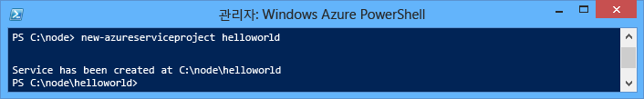
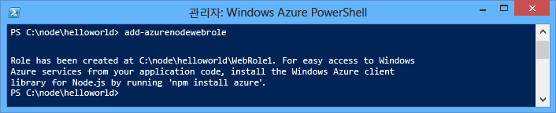
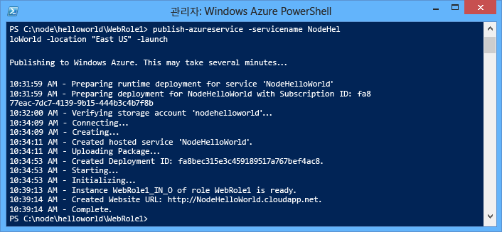
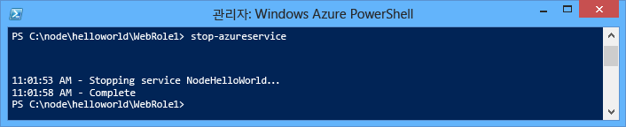
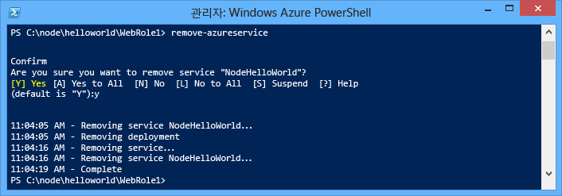

<properties 
	pageTitle="Node.js 시작 가이드 - Azure 자습서" 
	description="간단한 Node.js 웹 응용 프로그램을 만들고 Azure 클라우드 서비스에 배포하는 방법에 대해 알아봅니다." 
	services="cloud-services" 
	documentationCenter="nodejs" 
	authors="MikeWasson" 
	manager="wpickett" 
	editor=""/>

<tags 
	ms.service="cloud-services" 
	ms.workload="tbd" 
	ms.tgt_pltfrm="na" 
	ms.devlang="nodejs" 
	ms.topic="hero-article" 
	ms.date="02/24/2015" 
	ms.author="mwasson"/>

# Azure 클라우드 서비스에서 Node.js 응용 프로그램 빌드 및 배포

> [AZURE.SELECTOR]
- [Node.js](cloud-services-nodejs-develop-deploy-app.md)
- [.NET](cloud-services-dotnet-get-started.md)

이 자습서에서는 Azure 클라우드 서비스에서 실행되는 간단한 Node.js 응용 프로그램을 만드는 방법을 보여줍니다. 클라우드 서비스는 Azure에서 확장 가능한 클라우드 응용 프로그램의 구성 요소입니다. 이 클라우드 서비스는 응용 프로그램의 프런트 엔드 및 백 엔드 구성 요소의 구분과 독립적인 관리 및 확장을 허용합니다.  클라우드 서비스는 각 역할을 안정적으로 호스팅할 수 있는 강력한 전용 가상 컴퓨터를 제공합니다.

클라우드 서비스에 대한 자세한 내용 및 Azure 웹 사이트와 가상 컴퓨터와의 비교에 대한 자세한 내용은 [Azure 웹 사이트, 클라우드 서비스 및 가상 컴퓨터 비교](http://azure.microsoft.com/documentation/articles/choose-web-site-cloud-service-vm/)를 참조하세요.

>[AZURE.TIP] 간단한 웹 사이트를 빌드하려는 경우 시나리오에 간단한 웹 사이트 프런트 엔드만 포함된 경우, <a href="/documentation/articles/web-sites-nodejs-develop-deploy-mac/">간단한 Azure 웹 사이트 사용을 고려합니다.</a> 그러면 웹 사이트가 커지고 요구 사항이 변경될 때 클라우드 서비스로 쉽게 업그레이드할 수 있습니다.

이 자습서를 수행하여 웹 역할 내에서 호스트되는 간단한 웹 응용 프로그램을 빌드합니다. 계산 에뮬레이터를 사용하여 로컬에서 응용 프로그램을 테스트한 다음 PowerShell 명령줄 도구를 사용하여 배포합니다.

응용 프로그램은 간단한 "hello world" 응용 프로그램입니다.

## 필수 조건

> [AZURE.NOTE] 이 자습서는 Azure PowerShell을 사용하며,

- Windows에서 Azure SDK for Node.js를 설치해야 합니다. <a href="http://go.microsoft.com/fwlink/?LinkId=254279">Windows installer</a> 

- [Azure Powershell](../install-configure-powershell.md) 을 설치 및 구성한.

## Azure 클라우드 서비스 프로젝트 만들기

기본 Node.js 스캐폴딩과 함께 새 Azure 클라우드 서비스 프로젝트를 만들려면 다음 작업을 수행하세요.

1. **Azure PowerShell** 관리자 권한으로 실행합니다. (**시작 메뉴** 또는 **시작 화면**에서 **Azure PowerShell**을 검색합니다.)

2.  프로젝트를 만들려면 다음 PowerShell cmdlet을 입력합니다.

        New-AzureServiceProject helloworld

	

	**New-AzureServiceProject** cmdlet은 클라우드 서비스에 Node.js 응용 프로그램을 게시하기 위한 기본 구조를 생성합니다. 여기에는 Azure에 게시하는 데 필요한 구성 파일이 포함됩니다. 또한 이 cmdlet은 작업 디렉터리를 서비스에 대한 디렉터리로 변경합니다.

	Cmdlet은 다음 파일을 만듭니다.

	-   **ServiceConfiguration.Cloud.cscfg**,
        **ServiceConfiguration.Local.cscfg** and **ServiceDefinition.csdef**: 
        응용 프로그램을 게시하는 데 필요한 Azure 특정 파일입니다.
 자세한 내용은 [Azure에 대한 호스티드 서비스 만들기 개요][]를 참조하세요.

	-   **deploymentSettings.json**: 에는 Azure PowerShell 배포 cmdlet에 사용되는 로컬 설정이 저장됩니다..

4.  다음 명령을 사용하여 새 웹 역할을 추가하려면

        Add-AzureNodeWebRole
	
	

	**Add-AzureNodeWebRole** cmdlet는 기본 Node.js 응용 프로그램을 만듭니다. 또한 **.csfg** 및 **.csdef** 파일을 수정하여 새 역할에 대한 구성 항목을 추가합니다.

	> [AZURE.NOTE] 역할 이름을 지정하지 않으면 기본 이름이 사용됩니다. 첫번째 cmdlet 매개변수로 이름을 제공할 수 있습니다. `Add-AzureNodeWebRole MyRole`

Node.js 앱은 웹 역할에 대한 디렉터리에 있는 **server.js** 파일에 정의됩니다(기본적으로 **WebRole1**). 코드는 다음과 같습니다.

	var http = require('http');
	var port = process.env.port || 1337;
	http.createServer(function (req, res) {
	    res.writeHead(200, { 'Content-Type': 'text/plain' });
	    res.end('Hello World\n');
	}).listen(port);

이 코드는 클라우드 환경에서 지정된 포트 번호를 사용한다는 점을 제외하고 기본적으로 [nodejs.org][] 웹사이트의 "Hello World" 예제와 동일합니다.

## 에뮬레이터에서 응용 프로그램을 로컬로 실행

Azure SDK가 설치된 도구 중 하나인 Azure 계산 에뮬레이터는
응용 프로그램을 로컬로 테스트할 수 있습니다. 리소스
배포할 때 계산 에뮬레이터는 응용 프로그램이 실행되는 환경을
시뮬레이션합니다 

1.  다음 Azure PowerShell cmdlet을 입력하여 에뮬레이터에서 서비스를 실행합니다.

        Start-AzureEmulator -Launch

	웹 역할이 에뮬레이터에서 실행되면 **-시작** 매개 변수를 사용하여 브라우저 창이 자동으로 열립니다. 아래 스크린샷에 표시된 것처럼 브라우저 창에 "Hello World"를 표시해야 합니다. 

	

2.  계산 에뮬레이터를 중지하려면 **Stop-AzureEmulator** cmdlet를 사용합니다.
	
		Stop-AzureEmulator

## Azure에 응용 프로그램 배포

	[AZURE.INCLUDE [create-account-note](../../includes/create-account-note.md)]

### Azure 게시 설정 다운로드

응용 프로그램을 Azure에 배포하려면 먼저 Azure 구독에 대한 게시 설정을 다운로드해야 합니다. 

1.  다음 Azure PowerShell cmdlet를 실행합니다.

        Get-AzurePublishSettingsFile

	그러면 브라우저를 사용하여 게시 설정 다운로드 페이지로 이동합니다. Microsoft 계정으로 로그인하라는 메시지가 표시될 수 있습니다. 그럴 경우 Azure 구독과 연결된 계정을 사용합니다.

	다운로드한 프로필을 쉽게 액세스할 수 있는 파일 위치에 저장합니다.

2.  다음 Cmdlet를 실행하여 다운로드한 게시 프로필을 가져옵니다.

        Import-AzurePublishSettingsFile [파일에 대한 경로]

	> [AZURE.NOTE] 게시 설정을 가져온 후, 다른 사용자가 계정에 액세스할 수 있는 정보가 포함되어 있으므로 다운로드한 .publishSettings 파일 삭제를 고려합니다.
    

### 응용 프로그램 게시

게시하려면, 다음과 같이 **Publish-AzureServiceProject** cmdlet를 실행합니다.

    Publish-AzureServiceProject -ServiceName NodeHelloWorld -Location "East US" -Launch

- **-ServiceName**은 배포에 대한 이름을 지정합니다. 이 이름은 고유해야 합니다. 그렇지 않으면 게시 프로세스가 실패합니다.

- **-Location**은 응용 프로그램이 호스트될 데이터 센터를 지정합니다. 사용 가능한 데이터 센터 목록을 표시하려면 **Get-AzureLocation** cmdlet를 사용합니다.

- **-Launch**은 브라우저 창을 열고 배포가 완료 된 후 호스팅된 서비스를 탐색합니다.

게시가 성공하면 다음과 같은 응답이 표시됩니다.

> [AZURE.NOTE]
> 응용 프로그램이 배포되고 처음 게시된 후 사용할 수 있으려면 5 - 7분 정도 걸릴 수 있습니다.

배포가 완료되면 브라우저 창이 열리고 클라우드 서비스로 이동합니다.

이제 응용 프로그램이 Azure에서 실행되고 있습니다.

**Publish-AzureServiceProject** cmdlet은 다음 단계를 수행합니다.

1.  배포할 패키지를 만듭니다. 이 패키지에는 응용 프로그램 폴더의 모든 파일이 포함됩니다.

2.  **저장소 계정**이 없는 경우 새로 만듭니다. Azure 저장소 계정은 배포 중 응용 프로그램 패키지를 저장하는 데 사용됩니다. 배포가 완료된 후에는 저장소 계정을 삭제해도 안전합니다.

3.  **클라우드 서비스**가 아직 없는 경우 새로 만듭니다. **클라우드 서비스**는 응용 프로그램이 Azure에 배포될 때 호스트되는 컨테이너입니다. 자세한 내용은 [Azure에 대한 호스티드 서비스 만들기 개요][]를 참조하세요.

4.  배포 패키지를 Azure에 게시합니다.

## 응용 프로그램 중지 및 삭제

응용 프로그램을 배포한 후 사용하지 않도록 설정하여 추가 비용을 방지할 수 있습니다. Azure는 사용된 서버 시간의 시간당 웹 역할 인스턴스 요금을 청구합니다. 서버 시간은 응용 프로그램이 배포된 다음에 사용되며 인스턴스가 실행되지 않고 중지된 상태인 경우에도 사용됩니다.

1.  Windows PowerShell 창에서, 이전 섹션에서 만든 서비스 배포를 다음 cmdlet을 사용하여 중지합니다.

        Stop-AzureService

	서비스를 중지하려면 몇 분 정도 걸릴 수 있습니다. 서비스가 중지되면 서비스가 중지되었다는 메시지가 표시됩니다.

	

2.  서비스를 삭제하려면 다음 cmdlet을 호출합니다.

        Remove-AzureService

	메시지가 표시되면 **Y**를 입력하여 서비스를 삭제합니다.

	서비스를 삭제하려면 몇 분 정도 걸릴 수 있습니다. 서비스가 삭제되면 서비스가 삭제되었다는 메시지가 표시됩니다.

	

	> [AZURE.NOTE] 서비스를 삭제해도 서비스가 처음 게시될 때 만들어진 저장소 계정은 삭제되지 않으므로 사용된 저장소에 대해 계속 요금이 청구됩니다. 저장소 계정 삭제에 대한 자세한 내용은 [Azure 구독에서 저장소 계정을 삭제하는 방법](http://msdn.microsoft.com/library/windowsazure/hh531562.aspx)(영문)을 참조하세요.

[Azure SDK Node.js 항목이 확장된 상태의 Windows 시작 메뉴]: ./media/cloud-services-nodejs-develop-deploy-app/azure-powershell-menu.png
[mkdir]: ./media/cloud-services-nodejs-develop-deploy-app/getting-started-6.png
[nodejs.org]: http://nodejs.org/
[helloworld 폴더의 디렉터리 목록입니다.]: ./media/cloud-services-nodejs-develop-deploy-app/getting-started-7.png
[Azure에 대한 호스티드 서비스 만들기 개요]: http://msdn.microsoft.com/library/windowsazure/jj155995.aspx
[WebRole1 폴더의 디렉터리 목록]: ./media/cloud-services-nodejs-develop-deploy-app/getting-started-8.png
[작업 표시줄에서 Azure 에뮬레이터를 마우스 오른쪽 단추로 클릭하면 표시되는 메뉴입니다.]: ./media/cloud-services-nodejs-develop-deploy-app/getting-started-11.png
[무료 평가판 링크가 강조 표시된 http://www.windowsazure.com/이 표시된 브라우저 창]: ./media/cloud-services-nodejs-develop-deploy-app/getting-started-12.png
[LiveID 로그인 페이지가 표시된 브라우저 창]: ./media/cloud-services-nodejs-develop-deploy-app/getting-started-13.png
[publishSettings 파일에 대한 다른 이름으로 저장 대화 상자가 표시된 Internet Explorer]: ./media/cloud-services-nodejs-develop-deploy-app/getting-started-14.png

[Publish-AzureService 명령의 전체 상태 출력]: ./media/cloud-services-nodejs-develop-deploy-app/node20.png
[Azure 구독에서 저장소 계정을 삭제하는 방법]: https://www.windowsazure.com/manage/services/storage/how-to-manage-a-storage-account/
[powershell-menu]: ./media/cloud-services-nodejs-develop-deploy-app/azure-powershell-start.png

<!--HONumber=52--> 