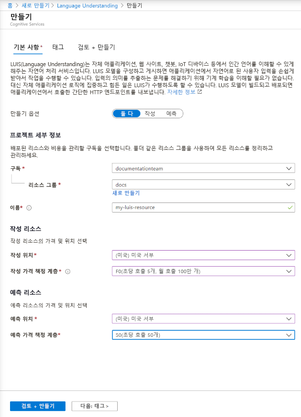

## Azure Portal에서 LUIS 리소스 만들기

1. [이 링크](https://ms.portal.azure.com/#create/Microsoft.CognitiveServicesLUISAllInOne)를 사용하여 Azure Portal에서 LUIS 리소스 만들기를 시작할 수 있습니다.

1. 필수 설정 모두 입력:

    |속성|목적|
    |--|--|
    |구독 이름| 리소스에 대해 청구되는 구독입니다.|
    |Resource group| 사용자가 선택하거나 만드는 사용자 지정 리소스 그룹 이름입니다. 리소스 그룹을 사용하면 액세스 및 관리를 위해 Azure 리소스를 그룹화할 수 있습니다.|
    |속성| 사용자가 선택한 사용자 지정 이름으로, 작성 및 예측 엔드포인트 쿼리에 대한 사용자 지정 하위 도메인으로 사용됩니다.|
    |작성 위치|모델과 연결된 지역입니다.|
    |작성 가격 책정 계층|가격 책정 계층은 초 및 월별 최대 트랜잭션 수를 결정합니다.|
    |런타임 위치|게시된 예측 엔드포인트 런타임과 연결된 지역입니다.|
    |런타임 가격 책정 계층|가격 책정 계층은 초 및 월별 최대 트랜잭션 수를 결정합니다.|

    > [!div class="mx-imgBorder"]
    > 

1. **리뷰 + 만들기**를 클릭하고 리소스가 생성될 때까지 기다립니다.
1. 두 리소스를 만든 후 Azure Portal에서 계속 새 작성 리소스를 선택하고 **빠른 시작**을 선택하여 프로그래밍 방식으로 작성하기 위한 작성 **엔드포인트 URL** 및 **키**를 가져옵니다.

> [!TIP]
> 리소스를 사용하려면 LUIS 포털에서 [리소스를 할당합니다](../luis-how-to-azure-subscription.md#assign-an-authoring-resource-in-the-luis-portal-for-all-apps).