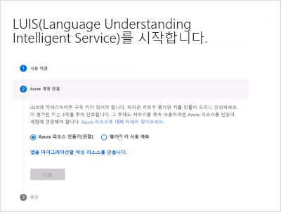

# <a name="create-luis-resources"></a>LUIS 리소스 만들기

작성 및 쿼리 예측 런타임 리소스는 LUIS 앱 및 예측 끝점에 대 한 인증을 제공 합니다.

<a name="programmatic-key" ></a>
<a name="endpoint-key"></a>
<a name="authoring-key"></a>

## <a name="luis-resources"></a>LUIS 리소스

LUIS는 세 가지 유형의 Azure 리소스와 Azure가 아닌 리소스 하나를 허용 합니다.

|키|목적|인식 서비스`kind`|인식 서비스`type`|
|--|--|--|--|
|작성 키|작성, 학습, 게시 및 테스트를 사용 하 여 응용 프로그램의 데이터에 액세스 하 고 관리 합니다. LUIS apps를 프로그래밍 방식으로 작성 하려는 경우 LUIS authoring key를 만듭니다.<br><br>키의 용도는 `LUIS.Authoring` 다음을 허용 하는 것입니다.<br>* 교육 및 게시를 포함 하 여 프로그래밍 방식으로 Language Understanding 앱 및 모델 관리<br> * [참가자 역할](#contributions-from-other-authors)에 사용자를 할당 하 여 제작 리소스에 대 한 사용 권한을 제어 합니다.|`LUIS.Authoring`|`Cognitive Services`|
|쿼리 예측 키| 예측 끝점 요청을 쿼리 합니다. 클라이언트 앱이 스타터 리소스에서 제공 하는 1000 요청 보다 많은 예측을 요청 하기 전에 LUIS 예측 키를 만듭니다. |`LUIS`|`Cognitive Services`|
|[인식 서비스 다중 서비스 리소스 키](../cognitive-services-apis-create-account-cli.md?tabs=windows#create-a-cognitive-services-resource)|LUIS 및 기타 지원 되는 Cognitive Services 공유 된 쿼리 예측 끝점 요청|`CognitiveServices`|`Cognitive Services`|
|Starter|LUIS 포털 또는 Api (Sdk 포함)를 통한 무료 제작 (역할 기반 액세스 제어 없음), 브라우저, API 또는 Sdk를 통해 매달 무료 1000 예측 끝점 요청|-|Azure 리소스가 아님|

Azure 리소스 만들기 프로세스가 완료 되 면 LUIS 포털에서 앱에 [키를 할당](#assign-a-resource-to-an-app) 합니다.

게시 하 고 쿼리 하려는 [지역](luis-reference-regions.md#publishing-regions) 에서 LUIS apps를 작성 하는 것이 중요 합니다.

## <a name="resource-ownership"></a>리소스 소유권

LUIS와 같은 Azure 리소스는 리소스를 포함 하는 구독이 소유 합니다.

리소스 소유권을 전송 하기 위해 ou는 다음 중 하나를 수행할 수 있습니다.
* 구독의 [소유권](../../cost-management-billing/manage/billing-subscription-transfer.md) 이전
* LUIS 앱을 파일로 내보낸 다음 다른 구독에서 앱을 가져옵니다. 내보내기는 LUIS 포털의 **내 앱** 페이지에서 사용할 수 있습니다.


## <a name="resource-limits"></a>리소스 한계

### <a name="authoring-key-creation-limits"></a>작성 키 생성 제한

구독 당 지역 당 최대 10 개의 제작 키를 만들 수 있습니다.

[키 제한](luis-limits.md#key-limits) 및 [Azure 지역](luis-reference-regions.md)을 참조 하세요.

게시 지역은 작성 지역과 다릅니다. 클라이언트 응용 프로그램을 배치할 게시 영역에 해당 하는 제작 지역에 앱을 만들어야 합니다.

### <a name="key-usage-limit-errors"></a>키 사용 제한 오류

사용 제한은 가격 책정 계층을 기반으로 합니다.

TPS (초당 트랜잭션 수) 할당량을 초과 하는 경우 HTTP 429 오류를 받게 됩니다. 월별 트랜잭션 (TPS) 할당량을 초과 하는 경우 HTTP 403 오류가 표시 됩니다.


### <a name="reset-authoring-key"></a>작성 키 다시 설정

[리소스 마이그레이션된 앱 제작](luis-migration-authoring.md) : 제작 키가 손상 되 면 해당 제작 리소스에 대 한 **키** 페이지의 Azure Portal에서 키를 다시 설정 합니다.

아직 마이그레이션하지 않은 앱의 경우: LUIS 포털의 모든 앱에서 키가 다시 설정 됩니다. Authoring Api를 통해 앱을 작성 하는 경우에는 Ocp-Apim-Subscription-Key 값을 새 키로 변경 해야 합니다.

### <a name="regenerate-azure-key"></a>Azure 키 다시 생성

**키** 페이지의 Azure Portal에서 Azure 키를 다시 생성 합니다.


## <a name="app-ownership-access-and-security"></a>앱 소유권, 액세스 및 보안

앱은 소유자의 구독에 의해 결정 되는 Azure 리소스에 의해 정의 됩니다.

LUIS 앱을 이동할 수 있습니다. Azure Portal 또는 Azure CLI에서 다음 설명서 리소스를 사용 합니다.

* [LUIS authoring resources 간에 앱 이동](https://westus.dev.cognitive.microsoft.com/docs/services/5890b47c39e2bb17b84a55ff/operations/apps-move-app-to-another-luis-authoring-azure-resource)
* [새 리소스 그룹 또는 구독으로 리소스 이동](../../azure-resource-manager/management/move-resource-group-and-subscription.md)
* [동일한 구독 내 또는 구독 간에 리소스 이동](../../azure-resource-manager/management/move-limitations/app-service-move-limitations.md)


### <a name="contributions-from-other-authors"></a>다른 작성자의 기여

[리소스 마이그레이션된 앱 제작](luis-migration-authoring.md) : _참가자_ 는 **액세스 제어 (IAM)** 페이지를 사용 하 여 제작 리소스에 대 한 Azure Portal에서 관리 됩니다. 협력자의 이메일 주소 및 _참가자_ 역할을 사용 하 여 [사용자를 추가 하는 방법을](luis-how-to-collaborate.md)알아봅니다.

아직 마이그레이션하지 않은 앱의 경우: 모든 _공동 작업자_ 는 LUIS 포털에서 관리 **-> 협력자** 페이지를 통해 관리 됩니다.

### <a name="query-prediction-access-for-private-and-public-apps"></a>개인 및 공용 앱에 대 한 쿼리 예측 액세스

**개인** 앱의 경우 소유자 및 참가자에 대해 쿼리 예측 런타임 액세스를 사용할 수 있습니다. **공용** 응용 프로그램의 경우 고유한 Azure [인식 서비스](../cognitive-services-apis-create-account.md) 또는 [LUIS](#create-resources-in-the-azure-portal) 런타임 리소스를 포함 하 고 공용 앱 ID를 가진 모든 사용자가 런타임 액세스를 사용할 수 있습니다.

현재는 공용 앱의 카탈로그가 없습니다.

### <a name="authoring-permissions-and-access"></a>제작 권한 및 액세스
[LUIS](luis-reference-regions.md#luis-website) 포털에서 앱에 액세스 하거나 [제작 api](https://go.microsoft.com/fwlink/?linkid=2092087) 는 Azure authoring resource에 의해 제어 됩니다.

소유자와 모든 참가자는 앱을 제작할 수 있는 권한이 있습니다.

|작성 액세스에 포함된 작업|메모|
|--|--|
|엔드포인트 키 추가 또는 제거||
|버전 내보내기||
|엔드포인트 로그 내보내기||
|버전 가져오기||
|앱 공개|앱이 공용이면 작성 또는 엔드포인트 키가 있는 모든 사용자가 앱을 쿼리할 수 있습니다.|
|모델 수정|
|게시|
|[활성 학습](luis-how-to-review-endpoint-utterances.md)의 엔드포인트 발화 검토|
|학습|

<a name="prediction-endpoint-runtime-key"></a>

### <a name="prediction-endpoint-runtime-access"></a>예측 끝점 런타임 액세스

쿼리 액세스는 **관리** 섹션의 **응용 프로그램 정보** 페이지에 있는 설정에 의해 제어 됩니다.

|[프라이빗 엔드포인트](#runtime-security-for-private-apps)|[공용 엔드포인트](#runtime-security-for-public-apps)|
|:--|:--|
|소유자 및 참가자가 사용할 수 있음|소유자, 참가자 및 앱 ID를 알고 있는 다른 사람이 사용할 수 있습니다.|

서버 간 환경에서 LUIS 런타임 키를 호출 하 여 해당 키를 볼 수 있는 사용자를 제어할 수 있습니다. 봇에서 LUIS를 사용하는 경우, 봇과 LUIS 간의 연결은 이미 안전합니다. LUIS 엔드포인트를 직접 호출하는 경우에는 제어된 액세스(예: [AAD](https://azure.microsoft.com/services/active-directory/))를 사용하여 서버 쪽 API(예 : Azure [함수](https://azure.microsoft.com/services/functions/))를 만들어야 합니다. 서버 쪽 API를 호출 하 여 인증 하 고 권한 부여를 확인 한 경우에는에 대 한 호출을 LUIS에 전달 합니다. 이 전략은 메시지 가로채기 (man-in-the-middle) 공격을 방지 하지는 않지만 사용자의 키 및 끝점 URL을 난독 처리 액세스를 추적할 수 있으며 끝점 응답 로깅 (예: [Application Insights](https://azure.microsoft.com/services/application-insights/))을 추가할 수 있습니다.

### <a name="runtime-security-for-private-apps"></a>전용 앱에 대 한 런타임 보안

개인 앱의 런타임은 다음에만 사용할 수 있습니다.

|키 및 사용자|설명|
|--|--|
|소유자의 작성 키| 최대 1000회의 엔드포인트 적중|
|협력자/기여자 제작 키| 최대 1000회의 엔드포인트 적중|
|작성자 또는 협력자/기여자에 의해 LUIS에 할당 된 모든 키|키 사용량 계층 기반|

### <a name="runtime-security-for-public-apps"></a>공용 앱에 대 한 런타임 보안

앱이 공용으로 구성되면 키에 전체 엔드포인트 할당량이 사용되지 않는 한 ‘모든’ 유효한 LUIS 작성 키 또는 LUIS 엔드포인트 키가 앱을 쿼리할 수 있습니다.__

소유자 또는 참가자가 아닌 사용자는 앱 ID가 지정 된 경우에만 공용 앱의 런타임에 액세스할 수 있습니다. LUIS에는 공용 앱을 검색할 수 있는 공개 ‘시장’이나 다른 방법이 없습니다.__

공용 앱은 모든 지역에 게시되므로 지역 기반 LUIS 리소스 키를 가진 사용자가 해당 리소스 키와 연결된 지역에서 앱에 액세스할 수 있습니다.


### <a name="securing-the-query-prediction-endpoint"></a>쿼리 예측 끝점 보안

서버 간 환경에서 호출 하 여 LUIS 예측 런타임 끝점 키를 볼 수 있는 사람을 제어할 수 있습니다. 봇에서 LUIS를 사용하는 경우, 봇과 LUIS 간의 연결은 이미 안전합니다. LUIS 엔드포인트를 직접 호출하는 경우에는 제어된 액세스(예: [AAD](https://azure.microsoft.com/services/active-directory/))를 사용하여 서버 쪽 API(예 : Azure [함수](https://azure.microsoft.com/services/functions/))를 만들어야 합니다. 서버 쪽 API가 호출되고 인증 및 권한 부여가 확인되면 LUIS에 해당 호출을 전달합니다. 이 전략은 가로채기 공격을 방지하지 않지만 사용자의 엔드포인트를 난독 처리하고, 액세스를 추적하도록 허용하고, 엔드포인트 응답 로깅(예: [Application Insights](https://azure.microsoft.com/services/application-insights/))을 추가하도록 허용합니다.

<a name="starter-key"></a>

## <a name="sign-in-to-luis-portal-and-begin-authoring"></a>LUIS 포털에 로그인 하 고 제작을 시작 합니다.

1. [LUIS 포털](https://www.luis.ai) 에 로그인 하 고 사용 약관에 동의 합니다.
1. 사용 하려는 LUIS 제작 키 유형 (무료 평가판 키 또는 새 Azure LUIS authoring key)을 선택 하 여 LUIS 앱을 시작 합니다.

    

1. 리소스 선택 프로세스를 완료 하면 [새 앱을 만듭니다](luis-how-to-start-new-app.md#create-new-app-in-luis).


## <a name="create-azure-resources"></a>Azure 리소스 만들기

<a name="create-resources-in-the-azure-portal"></a>

[!INCLUDE [Create LUIS resource in Azure Portal](includes/create-luis-resource.md)]

### <a name="create-resources-in-azure-cli"></a>Azure CLI에서 리소스 만들기

[Azure CLI](https://docs.microsoft.com/cli/azure/install-azure-cli?view=azure-cli-latest) 를 사용 하 여 각 리소스를 개별적으로 만들 수 있습니다.

리소스 `kind` :

* 만들`LUIS.Authoring`
* 예측`LUIS`

1. Azure CLI에 로그인 합니다.

    ```azurecli
    az login
    ```

    그러면 올바른 계정을 선택 하 고 인증을 제공할 수 있는 브라우저가 열립니다.

1. **LUIS authoring resource** `LUIS.Authoring` `my-luis-authoring-resource` 지역에 대해 이라는 _기존_ 리소스 그룹에 이라는 종류의 LUIS authoring resource를 만듭니다 `my-resource-group` `westus` .

    ```azurecli
    az cognitiveservices account create -n my-luis-authoring-resource -g my-resource-group --kind LUIS.Authoring --sku F0 -l westus --yes
    ```

1. **LUIS prediction endpoint resource** `LUIS` `my-luis-prediction-resource` 지역에 대해 이라는 _기존_ 리소스 그룹에 이라는 이름의 LUIS 예측 끝점 리소스를 만듭니다 `my-resource-group` `westus` . 무료 계층 보다 높은 처리량을 원하는 경우 `F0` 로 변경 `S0` 합니다. [가격 책정 계층 및 처리량](luis-limits.md#key-limits)에 대해 자세히 알아보세요.

    ```azurecli
    az cognitiveservices account create -n my-luis-prediction-resource -g my-resource-group --kind LUIS --sku F0 -l westus --yes
    ```

    > [!Note]
    > 이 키는 LUIS 포털에서 **관리 > Azure 리소스**의 LUIS 포털에 할당 될 때까지 사용 **되지 않습니다** .

<a name="assign-an-authoring-resource-in-the-luis-portal-for-all-apps"></a>

### <a name="assign-resource-in-the-luis-portal"></a>LUIS 포털에서 리소스 할당

단일 앱 또는 LUIS의 모든 앱에 대 한 제작 리소스를 할당할 수 있습니다. 다음 절차에서는 단일 제작 리소스에 모든 앱을 할당 합니다.

1. [LUIS 포털](https://www.luis.ai)에 로그인합니다.
1. 위쪽 탐색 모음에서 맨 오른쪽의 사용자 계정을 선택한 다음 **설정**을 선택 합니다.
1. **사용자 설정** 페이지에서 **제작 리소스 추가** 를 선택 하 고 기존 제작 리소스를 선택 합니다. **저장**을 선택합니다.

## <a name="assign-a-resource-to-an-app"></a>앱에 리소스 할당

다음 절차를 사용 하 여를 앱에 할당할 수 있습니다.

1. [LUIS 포털](https://www.luis.ai)에 로그인 한 다음 **내 앱** 목록에서 앱을 선택 합니다.
1. **관리-> Azure 리소스** 페이지로 이동 합니다.

    

1. 예측 또는 제작 리소스 탭을 선택 하 고 **예측 리소스 추가** 또는 **제작 리소스 추가** 단추를 선택 합니다.
1. 양식에서 필드를 선택 하 여 올바른 리소스를 찾은 다음 **저장**을 선택 합니다.

### <a name="assign-query-prediction-runtime-resource-without-using-luis-portal"></a>LUIS 포털을 사용 하지 않고 쿼리 예측 런타임 리소스 할당

CI/CD 파이프라인과 같은 자동화를 위해 LUIS 앱에 대 한 LUIS 런타임 리소스 할당을 자동화할 수 있습니다. 이렇게 하려면 다음 단계를 수행해야 합니다.

1. 이 [웹 사이트](https://resources.azure.com/api/token?plaintext=true)에서 Azure Resource Manager 토큰을 가져옵니다. 이 토큰은 만료되므로 즉시 사용합니다. 요청은 Azure Resource Manager 토큰을 반환합니다.

    

1. 토큰을 사용 하 여 사용자 계정이 액세스할 수 있는 [GET LUIS azure ACCOUNTS API](https://westus.dev.cognitive.microsoft.com/docs/services/5890b47c39e2bb17b84a55ff/operations/5be313cec181ae720aa2b26c)에서 구독 간에 LUIS 런타임 리소스를 요청 합니다.

    이 POST API에는 다음 설정이 필요합니다.

    |헤더|값|
    |--|--|
    |`Authorization`|`Authorization`의 값은 `Bearer {token}`입니다. 토큰 값 앞에 단어 `Bearer`와 공백이 와야 합니다.|
    |`Ocp-Apim-Subscription-Key`|작성 키|

    이 API는 계정 이름으로 반환된 리소스 이름, 리소스 그룹 및 구독 ID를 포함하여 LUIS 구독의 JSON 개체 배열을 반환합니다. LUIS 앱에 할당할 LUIS 리소스인 배열에서 항목 하나를 찾습니다.

1. [애플리케이션에 LUIS azure 계정 할당](https://westus.dev.cognitive.microsoft.com/docs/services/5890b47c39e2bb17b84a55ff/operations/5be32228e8473de116325515) API를 사용하여 LUIS 리소스에 토큰을 할당합니다.

    이 POST API에는 다음 설정이 필요합니다.

    |Type|설정|Value|
    |--|--|--|
    |헤더|`Authorization`|`Authorization`의 값은 `Bearer {token}`입니다. 토큰 값 앞에 단어 `Bearer`와 공백이 와야 합니다.|
    |헤더|`Ocp-Apim-Subscription-Key`|작성 키|
    |헤더|`Content-type`|`application/json`|
    |쿼리 문자열|`appid`|LUIS 앱 ID
    |본문||{"AzureSubscriptionId":"ddda2925-af7f-4b05-9ba1-2155c5fe8a8e",<br>"ResourceGroup": "resourcegroup-2",<br>"AccountName": "luis-uswest-S0-2"}|

    이 API가 성공하면 201 - 생성된 상태를 반환합니다.

## <a name="unassign-resource"></a>리소스 할당 해제

1. [LUIS 포털](https://www.luis.ai)에 로그인 한 다음 **내 앱** 목록에서 앱을 선택 합니다.
1. **관리-> Azure 리소스** 페이지로 이동 합니다.
1. 예측 또는 제작 리소스 탭을 선택 하 고 리소스에 대 한 **리소스 할당** 해제 단추를 선택 합니다.

리소스 할당을 취소 하는 경우 Azure에서 삭제 되지 않습니다. LUIS에서만 할당 해제됩니다.


## <a name="delete-account"></a>계정 삭제

계정을 삭제할 때 삭제되는 데이터에 대한 내용은 [데이터 스토리지 및 제거](luis-concept-data-storage.md#accounts)를 참조하세요.

## <a name="change-pricing-tier"></a>가격 책정 계층 변경

1.  [Azure](https://portal.azure.com)에서 LUIS 구독을 찾습니다. LUIS 구독을 선택합니다.
    
1.  사용 가능한 가격 책정 계층을 보려면 **가격 책정 계층**을 선택합니다.
    
1.  가격 책정 계층을 선택하고 **선택**을 선택하여 변경 내용을 저장합니다.
    
1.  가격 변경이 완료되면 팝업 창에서 새로운 가격 책정 계층을 확인합니다.
    
1. **게시** 페이지에서 [이 엔드포인트 키를 할당](#assign-a-resource-to-an-app)하고 모든 엔드포인트 쿼리에서 이 엔드포인트 키를 사용해야 합니다.

## <a name="viewing-azure-resource-metrics"></a>Azure 리소스 메트릭 보기

### <a name="viewing-azure-resource-summary-usage"></a>Azure 리소스 요약 사용 현황 보기
Azure에서 LUIS 사용량 정보를 볼 수 있습니다. **개요** 페이지에는 호출 및 오류를 포함한 최근 요약 정보가 표시됩니다. LUIS 엔드포인트 요청을 만들고 나서 **개요 페이지**를 즉시 확인할 경우 사용량이 표시되는 데 최대 5분이 걸릴 수 있습니다.


### <a name="customizing-azure-resource-usage-charts"></a>Azure 리소스 사용량 차트 사용자 지정
메트릭은 데이터에 대한 더 자세한 보기를 제공합니다.


기간 및 메트릭 유형에 대한 메트릭 차트를 구성할 수 있습니다.


### <a name="total-transactions-threshold-alert"></a>총 트랜잭션 임계값 경고
언제 특정 트랜잭션 임계값(예: 10,000개의 트랜잭션)에 도달했는지 확인하려는 경우 경고를 만들 수 있습니다.


특정 기간 동안 **총 호출** 메트릭에 대한 메트릭 경고를 추가합니다. 경고를 받아야 하는 모든 사람의 메일 주소를 추가합니다. 경고를 받아야 하는 모든 시스템의 웹후크를 추가합니다. 경고가 트리거될 때 논리 앱을 실행할 수도 있습니다.

## <a name="next-steps"></a>다음 단계

* 버전을 사용 하 여 앱 수명 주기를 제어 하 [는 방법을](luis-how-to-manage-versions.md) 알아봅니다.
* 새 [제작 리소스로](luis-migration-authoring.md) 마이그레이션
