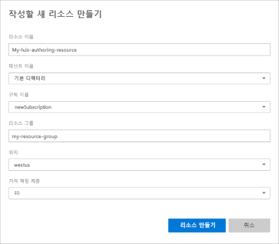

# <a name="steps-to-migrate-to-the-azure-authoring-resource"></a>Azure authoring resource로 마이그레이션하는 단계

Language Understanding (LUIS) 포털에서 Azure 제작 리소스를 사용 하도록 소유 하 고 있는 모든 앱을 마이그레이션합니다.

## <a name="prerequisites"></a>전제 조건

* **필요에 따라**각 앱을 내보내거나 내보내기 [API](https://westus.dev.cognitive.microsoft.com/docs/services/5890b47c39e2bb17b84a55ff/operations/5890b47c39e2bb052c5b9c40)를 사용 하 여 LUIS 포털의 앱 목록에서 앱을 백업 합니다.
* **필요에 따라**각 앱의 collaborator's 목록을 저장 합니다. 모든 협력자는 마이그레이션 프로세스의 일부로 전자 메일을 보낼 수 있습니다.
* **필수**, [Azure 구독이](https://azure.microsoft.com/free/)있어야 합니다. 구독 프로세스의 일부에는 청구 정보가 필요 합니다. 그러나 LUIS를 사용 하는 경우 무료 (F0) 가격 책정 계층을 사용할 수 있습니다. 결과적으로 사용량이 늘어남에 따라 유료 계층이 필요할 수 있습니다. 

Azure 구독이 없는 경우 [등록](https://azure.microsoft.com/free/)합니다. 

## <a name="access-the-migration-process"></a>마이그레이션 프로세스에 액세스

매주 앱을 마이그레이션할지 묻는 메시지가 표시 됩니다. 마이그레이션 없이이 창을 취소할 수 있습니다. 다음 예약 된 기간 전에 마이그레이션하려면 LUIS 포털의 상단 도구 모음에 있는 **잠금** 아이콘에서 마이그레이션 프로세스를 시작할 수 있습니다. 

## <a name="app-owner-begins-the-migration-process"></a>앱 소유자가 마이그레이션 프로세스를 시작 합니다.

LUIS apps의 소유자 인 경우 마이그레이션 프로세스를 사용할 수 있습니다. 

1. [LUIS 포털](https://www.luis.ai) 에 로그인 하 고 사용 약관에 동의 합니다.
1. 마이그레이션 팝업 창에서 마이그레이션을 계속 하거나 나중에 마이그레이션할 수 있습니다. **지금 마이그레이션**을 선택 합니다. 나중에 마이그레이션하려는 경우 Azure에서 새 제작 키로 마이그레이션하는 데 9 개월이 걸릴 수 있습니다.

    

1. 선택적으로, 앱에 협력자가 있는 경우 마이그레이션에 대 한 정보를 알려 주는 **전자 메일을 보낼지** 묻는 메시지가 표시 됩니다. 선택적 단계입니다. 

    계정을 Azure로 마이그레이션한 후에는 공동 작업자에 게 앱을 더 이상 사용할 수 없습니다.

    각 협력자 및 앱에 대해 기본 전자 메일 응용 프로그램은 약간의 서식이 지정 된 전자 메일을 사용 하 여 열립니다. 전자 메일을 보내기 전에 편집할 수 있습니다.

    전자 메일 템플릿에는 정확한 앱 ID 및 앱 이름이 포함 됩니다. 

    ```html
    Dear Sir/Madam,
    
    I will be migrating my LUIS account to Azure. Consequently, you will no longer have access to the following app:
    
    App Id: <app-ID-omitted>
    App name: Human Resources
    
    Thank you
    ```

1. **앱을 마이그레이션할 제작 리소스를 만들어 시작**을 선택 하 여 LUIS authoring 리소스를 만들도록 선택 합니다. 

    

1. 다음 창에서 리소스 키 정보를 입력 합니다. 정보를 입력 한 후 **리소스 만들기**를 선택 합니다. 구독 당 지역 당 10 개의 무료 제작 리소스를 사용할 수 있습니다.

    

    **새 제작 리소스를 만들** 때 다음 정보를 제공합니다. 

    * **리소스 이름** - 사용자가 선택한 사용자 지정 이름으로, 작성 및 예측 엔드포인트 쿼리의 URL 중 일부로 사용됩니다.
    * **테넌트** - Azure 구독이 연결된 테넌트입니다. 
    * **구독 이름** - 리소스에 대해 청구되는 구독입니다.
    * **리소스 그룹** - 사용자가 선택하거나 만드는 사용자 지정 리소스 그룹 이름입니다. 리소스 그룹을 사용하면 액세스 및 관리를 위해 Azure 리소스를 그룹화할 수 있습니다. 
    * **위치** - 선택한 위치는 **리소스 그룹** 선택에 따라 결정됩니다.
    * **가격 책정 계층** - 가격 책정 계층은 초 및 월별 최대 트랜잭션 수를 결정합니다. 

1. 제작 리소스의 유효성을 검사 하 고 **지금 마이그레이션하십시오**.

    

1. 제작 리소스를 만들면 성공 메시지가 표시 됩니다. **닫기** 를 선택 하 여 팝업 창을 닫습니다.

    

    **내 앱** 목록에는 새 제작 리소스로 마이그레이션된 앱이 표시 됩니다. 

    LUIS 포털에서 앱을 계속 편집 하기 위해 제작 리소스의 키를 알 필요가 없습니다. 앱을 프로그래밍 방식으로 편집 하려는 경우 제작 키 값이 필요 합니다. 이러한 값은 LUIS 포털의 **> Azure 리소스** 페이지에 표시 되며, 리소스의 **키** 페이지에 있는 Azure Portal 에서도 사용할 수 있습니다.  

1. 앱에 액세스 하기 전에 구독 및 LUIS authoring 리소스를 선택 하 여 사용자가 작성할 수 있는 앱을 확인 합니다.

    


## <a name="app-contributor-begins-the-migration-process"></a>앱 참가자가 마이그레이션 프로세스를 시작 합니다.

마이그레이션의 앱 소유자와 동일한 단계를 수행 합니다. 이 프로세스는 종류 `LUIS.Authoring`의 새 제작 리소스를 만듭니다. 

다른 사용자가 소유한 마이그레이션된 앱에 대 한 참가자로 추가 되기 위해 계정을 마이그레이션해야 합니다.  

## <a name="after-the-migration-process-add-contributors-to-your-authoring-resource"></a>마이그레이션 프로세스 후 제작 리소스에 참가자를 추가 합니다.

[!INCLUDE [Manage contributors for the Azure authoring resource for language understanding](./includes/manage-contributors-authoring-resource.md)]

[참가자를 추가 하는 방법을](luis-how-to-collaborate.md)알아봅니다. 

## <a name="troubleshooting-errors-with-the-migration-process"></a>마이그레이션 프로세스의 오류 문제 해결

마이그레이션 프로세스 중에 `MissingSubscriptionRegistration` 빨간색 알림 표시줄에 LUIS 포털에 오류가 표시 되는 경우 [Azure Portal](luis-how-to-azure-subscription.md#create-resources-in-the-azure-portal) 또는 [Azure CLI](luis-how-to-azure-subscription.md#create-resources-in-azure-cli)에서 인지 서비스 리소스를 만듭니다. [이 오류의 원인](../../azure-resource-manager/resource-manager-register-provider-errors.md#cause)에 대해 자세히 알아보세요.

## <a name="next-steps"></a>다음 단계


* 제작 및 런타임 키에 대 한 [개념](luis-concept-keys.md) 검토
* [키를 할당](luis-how-to-azure-subscription.md) 하 고 [참가자](luis-how-to-collaborate.md) 를 추가 하는 방법 검토
