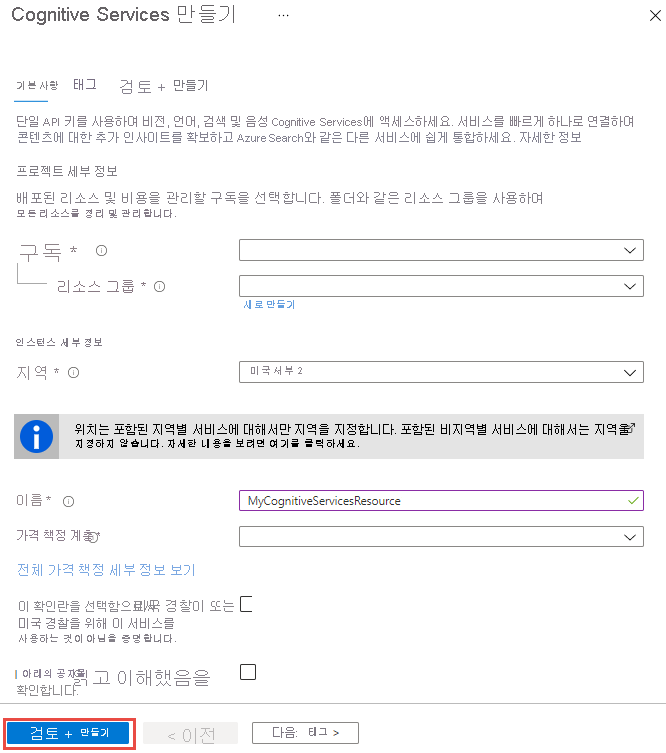

# Azure 포털을 사용하여 코그너티브 서비스 리소스 만들기

이 빠른 시작을 사용하여 Azure 인지 서비스 사용을 시작합니다. Azure 포털에서 Cognitive Service 리소스를 만든 후 응용 프로그램을 인증하기 위한 끝점과 키를 얻게 됩니다.

[!INCLUDE [cognitive-services-subscription-types](../../includes/cognitive-services-subscription-types.md)]

## 사전 요구 사항

* 유효한 Azure 구독 - [무료로 하나를 만듭니다.](https://azure.microsoft.com/free/)

## 새 Azure 코그너티브 서비스 리소스 만들기

1. 리소스를 만듭니다.

    #### [다중 서비스 리소스](#tab/multiservice)
    
    다중 서비스 리소스는 포털의 **인지 서비스라고** 합니다. [코그너티브 서비스 리소스 만들기.](https://ms.portal.azure.com/#create/Microsoft.CognitiveServicesAllInOne)
    
    이 때 다중 서비스 리소스를 사용하면 다음과 같은 코그너티브 서비스에 액세스할 수 있습니다.
    
    |                  |                                                      |                    |                               |                  |
    |------------------|------------------------------------------------------|--------------------|-------------------------------|------------------|
    | Computer Vision  | Content Moderator                                    | Face               | 언어 이해(LUIS) | 텍스트 분석   |
    | Translator Text  | 빙 검색 v7  (웹, 이미지, 뉴스, 비디오, 비주얼) | Bing 사용자 지정 검색 | Bing Entity Search            | Bing Autosuggest |
    | Bing 맞춤법 검사 |                                                      |                    |                               |                  |
    
    #### [단일 서비스 리소스](#tab/singleservice)

    아래 링크를 사용하여 사용 가능한 코그너티브 서비스에 대한 리소스를 만듭니다.

    | 시각                      | Speech                  | 언어                          | 의사 결정             | 검색                 |
    |-----------------------------|-------------------------|-----------------------------------|----------------------|------------------------|
    | [Computer vision](https://ms.portal.azure.com/#create/Microsoft.CognitiveServicesComputerVision)         | [Speech Services](https://ms.portal.azure.com/#create/Microsoft.CognitiveServicesSpeechServices)     | [몰입형 리더](https://ms.portal.azure.com/#create/Microsoft.CognitiveServicesImmersiveReader)              | [Anomaly Detector](https://ms.portal.azure.com/#create/Microsoft.CognitiveServicesAnomalyDetector) | [빙 검색 API V7](https://ms.portal.azure.com/#create/Microsoft.CognitiveServicesBingSearch-v7) |
    | [맞춤형 비전 서비스](https://ms.portal.azure.com/#create/Microsoft.CognitiveServicesCustomVision) | [Speaker Recognition](https://ms.portal.azure.com/#create/Microsoft.CognitiveServicesSpeakerRecognition) | [LUIS(Language Understanding)](https://ms.portal.azure.com/#create/Microsoft.CognitiveServicesLUISAllInOne) | [콘텐츠 진행자](https://ms.portal.azure.com/#create/Microsoft.CognitiveServicesContentModerator) | [빙 사용자 정의 검색](https://ms.portal.azure.com/#create/Microsoft.CognitiveServicesBingCustomSearch) |
    | [얼굴](https://ms.portal.azure.com/#create/Microsoft.CognitiveServicesFace)                    |                         | [QnA 메이커](https://ms.portal.azure.com/#create/Microsoft.CognitiveServicesQnAMaker)                     | [개인화](https://ms.portal.azure.com/#create/Microsoft.CognitiveServicesPersonalizer)     | [빙 엔터티 검색](https://ms.portal.azure.com/#create/Microsoft.CognitiveServicesBingEntitySearch) |
    | [Ink Recognizer](https://ms.portal.azure.com/#create/Microsoft.CognitiveServicesInkRecognizer)        |                         | [텍스트 분석](https://ms.portal.azure.com/#create/Microsoft.CognitiveServicesTextAnalytics)                |                      | [Bing Spell Check](https://ms.portal.azure.com/#create/Microsoft.CognitiveServicesBingSpellCheck-v7)   |
    |           |                         | [번역기 텍스트](https://ms.portal.azure.com/#create/Microsoft.CognitiveServicesTextTranslation)               |                      | [Bing Autosuggest](https://ms.portal.azure.com/#create/Microsoft.CognitiveServicesBingAutosuggest-v7)                       |
    ***

3. **만들기** 페이지에서 다음 정보를 제공합니다.

    #### [다중 서비스 리소스](#tab/multiservice)

    |    |    |
    |--|--|
    | **이름** | Cognitive Services 리소스를 설명하는 이름입니다. 예를 들어, *마이코그너티브서비스리소스*. |
    | **구독** | 사용 가능한 Azure 구독 중 하나를 선택합니다. |
    | **위치** | Cognitive Service 인스턴스의 위치입니다. 다른 위치를 사용하면 대기 시간이 발생할 수 있지만 리소스의 런타임 가용성에는 영향을 주지 않습니다. |
    | **가격 책정 계층** | Cognitive Services 계정의 비용은 선택한 옵션 및 사용량에 따라 다릅니다. 자세한 내용은 API [가격 책정 세부 정보](https://azure.microsoft.com/pricing/details/cognitive-services/)를 참조하세요.
    | **리소스 그룹** | Cognitive Services 리소스를 포함할 Azure 리소스 그룹입니다. 새 그룹을 만들거나 기존 그룹에 추가할 수 있습니다. |

    

    **만들기**를 클릭합니다.

    #### [단일 서비스 리소스](#tab/singleservice)

    |    |    |
    |--|--|
    | **이름** | Cognitive Services 리소스를 설명하는 이름입니다. 예를 들어, *텍스트 분석자료*. |
    | **구독** | 사용 가능한 Azure 구독 중 하나를 선택합니다. |
    | **위치** | Cognitive Service 인스턴스의 위치입니다. 다른 위치를 사용하면 대기 시간이 발생할 수 있지만 리소스의 런타임 가용성에는 영향을 주지 않습니다. |
    | **가격 책정 계층** | Cognitive Services 계정의 비용은 선택한 옵션 및 사용량에 따라 다릅니다. 자세한 내용은 API [가격 책정 세부 정보](https://azure.microsoft.com/pricing/details/cognitive-services/)를 참조하세요.
    | **리소스 그룹** | Cognitive Services 리소스를 포함할 Azure 리소스 그룹입니다. 새 그룹을 만들거나 기존 그룹에 추가할 수 있습니다. |

    

    **만들기**를 클릭합니다.

    ***

## 리소스에 대한 키 받기

1. 리소스가 성공적으로 배포되면 **다음 단계**의 **리소스로 이동을** 클릭합니다.

    

2. 열리는 빠른 시작 창에서 키및 끝점에 액세스할 수 있습니다.

    

[!INCLUDE [cognitive-services-environment-variables](../../includes/cognitive-services-environment-variables.md)]

## 리소스 정리

Cognitive Services 구독을 정리하고 제거하려면 리소스나 리소스 그룹을 삭제하면 됩니다. 리소스 그룹을 삭제해도 그룹에 포함된 다른 리소스도 삭제됩니다.

1. Azure Portal에서 왼쪽의 메뉴를 확장하여 서비스 메뉴를 열고 **리소스 그룹**을 선택하여 리소스 그룹 목록을 표시합니다.
2. 삭제할 리소스가 포함된 리소스 그룹을 찾습니다.
3. 리소스 그룹 목록을 마우스 오른쪽 단추로 클릭합니다. **리소스 그룹 삭제**를 선택하고 확인합니다.

## 참조

* [Azure Cognitive Services에 대한 요청 인증](authentication.md)
* [Azure 코그너티브 서비스란?](Welcome.md)
* [자연어 지원](language-support.md)
* [도커 컨테이너 지원](cognitive-services-container-support.md)
