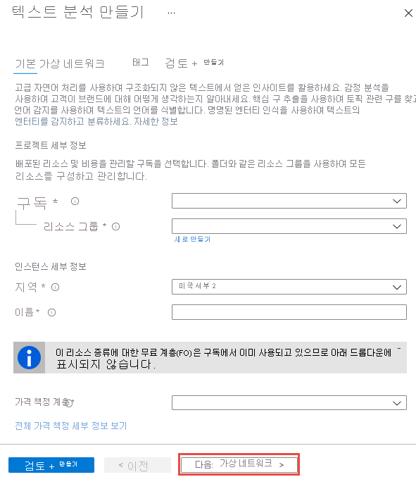

# Azure portal을 사용 하 여 Cognitive Services 계정 만들기

이 빠른 시작에서는 단일 서비스 또는 다중 서비스 구독이 있는 계정 만들기 및 Azure Cognitive Services에 등록 하는 방법에 알아봅니다. 이러한 서비스는 하나 이상의 Azure Cognitive Services API에 연결할 수 있도록 하는 Azure [리소스](https://docs.microsoft.com/azure/azure-resource-manager/resource-group-portal)로 표시됩니다.

## 필수 조건

* 유효한 Azure 구독. 평가판 [계정을 만들 수 있습니다](https://azure.microsoft.com/free/).

[!INCLUDE [cognitive-services-subscription-types](../../includes/cognitive-services-subscription-types.md)]

## 새 Azure Cognitive Services 리소스 만들기

리소스를 만들기 전에 Azure 리소스 그룹을 사용 해야 합니다. 모든 Cognitive Services 계정 (및 관련된 Azure 리소스)은 Azure 리소스 그룹에 속해야 합니다. 계정을 만들면을 새 리소스 그룹을 만들거나 기존 계정을 사용할 수가 있습니다. 이 아티클에서 새 리소스 그룹을 만드는 방법에 설명 합니다.

1. [Azure Portal](https://portal.azure.com)에 로그인한 후 **+리소스 만들기**를 클릭합니다.

    

2. 다음과 같은 방법으로 사용 하 여 사용 가능한 Cognitive Services를 찾을 수 있습니다.
    * 검색 표시줄을 사용 하 고 구독할 서비스의 이름을 입력 합니다.
        * 다중 서비스 구독에 대 한 리소스를 만들려면 입력 **Cognitive Services** 검색 모음을 선택 합니다 **Cognitive Services** 리소스입니다.

        

    * 사용 가능한 모든 cognitive services를 보려면 선택 **AI + Machine Learning**아래에 있는 **Azure Marketplace**합니다. 관심 서비스를 보이지 않으면 클릭 **모두 보기** 스크롤하여 **Cognitive Services**합니다. 클릭 **자세한** Cognitive Services Api의 전체 카탈로그를 볼 수 있습니다.
    
        

3. **만들기** 페이지에서 다음 정보를 제공합니다.

    > [!IMPORTANT]
    > Azure Cognitive Services를 호출할 때 필요한 수 만큼 Azure 위치를 기억 합니다.

    |    |    |
    |--|--|
    | **Name** | Cognitive Services 리소스를 설명하는 이름입니다. 설명이 포함된 이름(예: *MyCognitiveServicesAccount*)을 사용하는 것이 좋습니다. |
    | **구독** | 사용 가능한 Azure 구독 중 하나를 선택합니다. |
    | **위치**: | Cognitive Service 인스턴스의 위치입니다. 다른 위치를 사용하면 대기 시간이 발생할 수 있지만 리소스의 런타임 가용성에는 영향을 주지 않습니다. |
    | **가격 책정 계층** | Cognitive Services 계정의 비용은 선택한 옵션 및 사용량에 따라 다릅니다. 자세한 내용은 API [가격 책정 세부 정보](https://azure.microsoft.com/pricing/details/cognitive-services/)를 참조하세요.
    | **리소스 그룹** | Cognitive Services 리소스를 포함할 [Azure 리소스 그룹](https://docs.microsoft.com/azure/architecture/cloud-adoption/governance/resource-consistency/azure-resource-access#what-is-an-azure-resource-group)입니다. 새 그룹을 만들거나 기존 그룹에 추가할 수 있습니다. |

    

## 구독에 대 한 키를 가져옵니다.

리소스를 만든 후 고정하면 Azure 대시보드에서 액세스할 수 있습니다. 그렇지 않으면 **리소스 그룹**에서 찾을 수 있습니다. 리소스를 선택한 후 선택 하 여 키를 가져올 수 있습니다 **키** 아래에서 **리소스 관리**합니다.

[!INCLUDE [cognitive-services-environment-variables](../../includes/cognitive-services-environment-variables.md)]

## 리소스 정리

정리 하 고 Cognitive Services 구독을 제거 하려는 경우에 리소스 또는 리소스 그룹을 삭제할 수 있습니다. 리소스 그룹과 다른 리소스를 삭제도 리소스 그룹을 삭제 합니다.

Azure Portal을 사용하여 리소스 그룹을 제거하려면

1. Azure Portal에서 왼쪽의 메뉴를 확장하여 서비스 메뉴를 열고 **리소스 그룹**을 선택하여 리소스 그룹 목록을 표시합니다.
2. 리소스 그룹을 삭제 하려면 찾아 목록 오른쪽에 더 많은 단추 (...)를 마우스 오른쪽 단추로 클릭 합니다.
3. **리소스 그룹 삭제**를 선택하고 확인합니다.

## 참고 항목

* [Azure Cognitive Services에 대한 요청 인증](authentication.md)
* [Azure Cognitive Services 란?](Welcome.md)
* [자연 언어 지원](language-support.md)
* [Docker 컨테이너 지원](cognitive-services-container-support.md)
