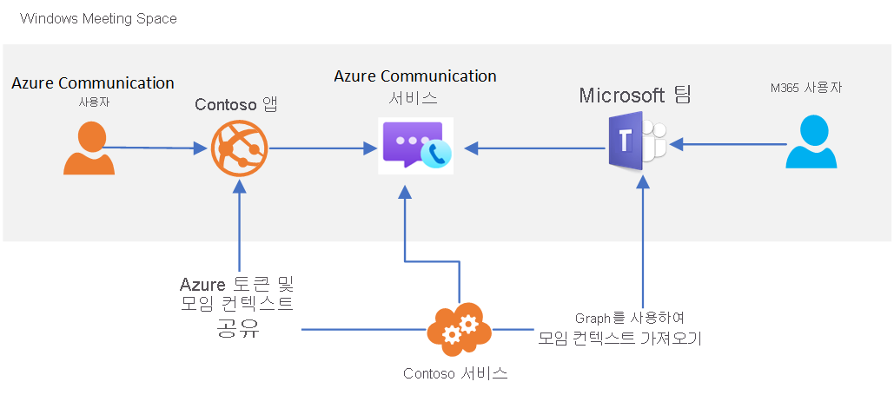

# Teams 상호 운용성

[!INCLUDE [Private Preview Notice](../../includes/private-preview-include.md)]

Azure Communication Services는 Microsoft Teams와 상호 작용하는 사용자 지정 모임 환경을 구축하는 데 사용할 수 있습니다. Communication Services 솔루션의 사용자는 음성, 비디오 및 화면 공유를 통해 Teams 참가자와 상호 작용할 수 있습니다.

이 상호 운용성을 통해 사용자를 Teams 모임에 연결하는 사용자 지정 Azure 애플리케이션을 만들 수 있습니다. 사용자 지정 애플리케이션의 사용자는 이 기능을 사용하기 위해 Azure Active Directory ID 또는 Teams 라이선스를 보유할 필요가 없습니다. 이는 직원(Teams에 익숙할 수 있는 사용자)과 외부 사용자(사용자 지정 애플리케이션 환경 사용자)를 원활한 모임 환경으로 끌어들이는 데 적합합니다. 이렇게 하면 다음과 비슷한 환경을 구축할 수 있습니다.

1. 직원이 Teams를 사용하여 모임을 예약합니다.
2. 사용자 지정 Communication Services 애플리케이션에서 Microsoft Graph API를 사용하여 모임 세부 정보에 액세스합니다.
3. 사용자 지정 애플리케이션을 통해 모임 세부 정보를 외부 사용자와 공유합니다.
4. 외부 사용자가 사용자 지정 애플리케이션을 사용하여 Teams 모임에 참가합니다(Communication Services 호출 클라이언트 라이브러리를 통해).

이 사용 사례에 대한 개략적인 아키텍처는 다음과 같습니다. 

손 들기, 전체 보기 모드 및 소회의실과 같은 특정 Teams 모임 기능은 Teams 사용자에게만 제공되지만, 사용자 지정 애플리케이션은 모임의 핵심 오디오, 비디오 및 화면 공유 기능에 액세스할 수 있습니다.

Communication Services 사용자가 Teams 모임에 참가하면 호출 클라이언트 라이브러리를 통해 제공되는 표시 이름이 Teams 사용자에게 표시됩니다. 그렇지 않으면 Communication Services 사용자가 Teams에서 익명 사용자로 간주됩니다. 사용자 지정 애플리케이션은 Teams 모임을 보호하기 위해 사용자 인증 및 기타 보안 조치를 고려해야 합니다. 익명 사용자가 모임에 참가하도록 설정하는 경우 보안에 미치는 영향을 고려하고, [Teams 보안 가이드](https://docs.microsoft.com/microsoftteams/teams-security-guide#addressing-threats-to-teams-meetings)를 사용하여 익명 사용자가 사용할 수 있는 기능을 구성합니다.

[모임 설정](https://docs.microsoft.com/microsoftteams/meeting-settings-in-teams)에서 익명 참가를 사용하도록 설정되는 한 Communication Services 사용자는 예약된 Teams 모임에 참가할 수 있습니다.

## 다음 단계

> [!div class="nextstepaction"]
> [통화 앱으로 Teams 미팅 참가](../../quickstarts/voice-video-calling/get-started-teams-interop.md)
