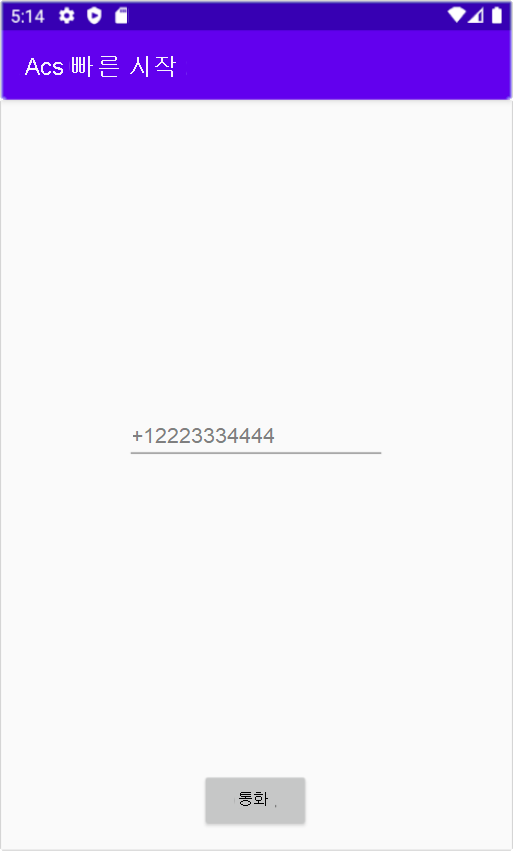

[!INCLUDE [Emergency Calling Notice](../../../includes/emergency-calling-notice-include.md)]
## <a name="prerequisites"></a>필수 구성 요소

- 활성 구독이 있는 Azure 계정. [체험 계정을 만듭니다](https://azure.microsoft.com/free/?WT.mc_id=A261C142F). 
- 배포된 Communication Services 리소스. [Communication Services 리소스를 만듭니다](../../create-communication-resource.md).
- Communication Services 리소스에서 가져온 전화 번호입니다. [전화 번호를 가져오는 방법](../../telephony-sms/get-phone-number.md).
- 호출 클라이언트를 사용하도록 설정하는 `User Access Token`입니다. [`User Access Token`를 가져오는 방법](../../access-tokens.md)에 대한 자세한 정보
- [애플리케이션에 통화 추가 시작](../getting-started-with-calling.md)에 대한 빠른 시작을 완료합니다.

### <a name="prerequisite-check"></a>필수 구성 요소 확인

- Communication Services 리소스와 연결된 전화 번호를 보려면 [Azure Portal](https://portal.azure.com/)에 로그인하고 Communication Services 리소스를 찾아 왼쪽 탐색 창에서 **전화 번호** 탭을 엽니다.

## <a name="setting-up"></a>설치

### <a name="add-pstn-functionality-to-your-app"></a>앱에 PSTN 기능 추가

**MainActivity.java**를 수정하여 앱에 `PhoneNumber` 유형을 추가합니다.


```java
import com.azure.android.communication.common.PhoneNumber;
```

<!--
> [!TBD]
> Namespace based on input from Komivi Agbakpem. But it does not correlates with other use namespaces in Calling Quickstart. E.g: "com.azure.communication.calling.CommunicationUser" or "com.azure.communication.common.client.CommunicationUserCredential". Double-chek this.
-->

## <a name="start-a-call-to-phone"></a>휴대폰에 전화 걸기 시작

Communication Services 리소스 내에서 가져온 전화 번호를 지정합니다. 통화를 시작하는 데 사용됩니다.

> [!WARNING]
> 전화 번호는 E.164 국제 표준 형식으로 제공되어야 합니다. (예: +12223334444)

**MainActivity.java**에서 `startCall()` 이벤트 처리기를 수정하여 전화 통화를 처리합니다.

```java
    private void startCall() {
        EditText calleePhoneView = findViewById(R.id.callee_id);
        String calleePhone = calleePhoneView.getText().toString();
        PhoneNumber callerPhone = new PhoneNumber("+12223334444");
        StartCallOptions options = new StartCallOptions();
        options.setAlternateCallerId(callerPhone);
        options.setVideoOptions(new VideoOptions(null));
        call = agent.call(
                getApplicationContext(),
                new PhoneNumber[] {new PhoneNumber(calleePhone)},
                options);
    }
```

## <a name="launch-the-app-and-call-the-echo-bot"></a>앱 시작 및 echo 봇 호출

이제 도구 모음의 "앱 실행" 단추(Shift+F10)를 사용하여 앱을 시작할 수 있습니다. 추가된 텍스트 필드에 전화 번호를 제공하고 **CALL** 단추를 클릭하여 휴대폰에 전화를 걸 수 있습니다.
> [!WARNING]
> 전화 번호는 E.164 국제 표준 형식으로 제공되어야 합니다. (예: +12223334444)


