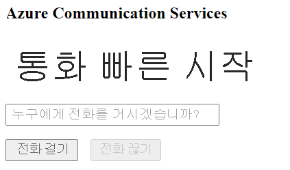

[!INCLUDE [Emergency Calling Notice](../../../includes/emergency-calling-notice-include.md)]
## <a name="prerequisites"></a>필수 구성 요소

- 활성 구독이 있는 Azure 계정. [체험 계정을 만듭니다](https://azure.microsoft.com/free/?WT.mc_id=A261C142F). 
- 배포된 Communication Services 리소스. [Communication Services 리소스를 만듭니다](../../create-communication-resource.md).
- Communication Services 리소스에서 가져온 전화 번호입니다. [전화 번호를 가져오는 방법](../../telephony-sms/get-phone-number.md).
- 호출 클라이언트를 사용하도록 설정하는 `User Access Token`입니다. [`User Access Token`를 가져오는 방법](../../access-tokens.md)에 대한 자세한 정보
- [애플리케이션에 통화 추가 시작](../getting-started-with-calling.md)에 대한 빠른 시작을 완료합니다.

### <a name="prerequisite-check"></a>필수 구성 요소 확인

- Communication Services 리소스와 연결된 전화 번호를 보려면 [Azure Portal](https://portal.azure.com/)에 로그인하고 Communication Services 리소스를 찾아 왼쪽 탐색 창에서 **전화 번호** 탭을 엽니다.
- JavaScript용 Azure Communication Services 통화 클라이언트 라이브러리를 사용하여 앱을 빌드하고 실행할 수 있습니다.

```console
npx webpack-dev-server --entry ./client.js --output bundle.js
```

## <a name="setting-up"></a>설치

### <a name="add-pstn-functionality-to-your-app"></a>앱에 PSTN 기능 추가

전화 걸기 컨트롤을 사용하여 레이아웃을 확장합니다.

`<script />` 태그 앞에 **index.html**의 `<body />` 섹션 끝에 이 코드를 배치합니다.

```html
<input 
  id="callee-phone-input"
  type="text"
  placeholder="Phone number you would like to dial"
  style="margin-bottom:1em; width: 230px;"
/>
<div>
  <button id="call-phone-button" type="button">
    Start Phone Call
  </button>
  &nbsp;
  <button id="hang-up-phone-button" type="button" disabled="true">
    Hang Up Phone Call
  </button>
</div>
```

전화 통신 기능으로 애플리케이션 논리를 확장합니다.

다음 코드를 **client.js**에 추가합니다.

```javascript
const calleePhoneInput = document.getElementById("callee-phone-input");
const callPhoneButton = document.getElementById("call-phone-button");
const hangUpPhoneButton = document.getElementById("hang-up-phone-button");
```

## <a name="start-a-call-to-phone"></a>휴대폰에 전화 걸기 시작

통화를 시작하는 데 사용할 Communication Services 리소스에서 획득한 전화 번호를 지정합니다.
> [!WARNING]
> 전화 번호는 E.164 국제 표준 형식으로 제공되어야 합니다. (예: +12223334444)

`callPhoneButton`을 클릭할 때 제공한 전화 번호로 통화를 시작하는 이벤트 처리기를 추가합니다.


```javascript
callPhoneButton.addEventListener("click", () => {
  // start a call to phone
  const phoneToCall = calleePhoneInput.value;
  call = callAgent.call(
    [{phoneNumber: phoneToCall}], { alternateCallerId: {phoneNumber: '+18336528005'}
  });

  // toggle button states
  hangUpPhoneButton.disabled = false;
  callPhoneButton.disabled = true;
});
```

## <a name="end-a-call-to-phone"></a>휴대폰에 전화 걸기 종료

`hangUpPhoneButton`을 클릭하면 현재 호출을 종료하는 이벤트 수신기를 추가합니다.

```javascript
hangUpPhoneButton.addEventListener("click", () => {
  // end the current call
  call.hangUp({
    forEveryone: true
  });

  // toggle button states
  hangUpPhoneButton.disabled = true;
  callPhoneButton.disabled = false;
});
```

`forEveryone` 속성은 모든 호출 참가자에 대한 호출을 종료합니다.

## <a name="run-the-code"></a>코드 실행

`webpack-dev-server`를 사용하여 앱을 빌드하고 실행합니다. 다음 명령을 실행하여 로컬 웹 서버에서 애플리케이션 호스트를 번들로 묶습니다.


```console
npx webpack-dev-server --entry ./client.js --output bundle.js
```

브라우저를 열고 `http://localhost:8080/`로 이동합니다. 다음이 표시되어야 합니다.




추가된 텍스트 필드에 전화 번호를 제공하고 **휴대폰 통화 시작** 단추를 클릭하여 실제 전화 번호로 전화를 걸 수 있습니다.

> [!WARNING]
> 전화 번호는 E.164 국제 표준 형식으로 제공되어야 합니다. (예: +12223334444)
