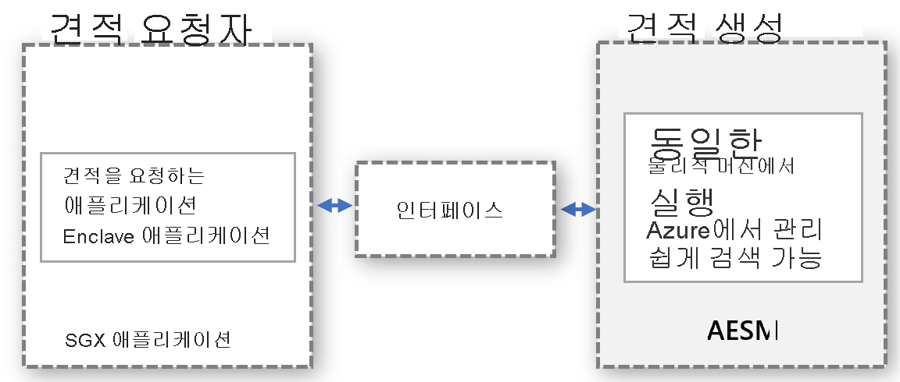

# <a name="platform-software-management-with-sgx-quote-helper-daemon-set"></a>SGX quote 도우미 디먼 집합을 사용하는 플랫폼 소프트웨어 관리

원격 증명을 수행하는 [enclave 애플리케이션](confidential-computing-enclaves.md)에는 생성된 QUOTE가 필요합니다. 이 QUOTE는 enclave가 실행되는 환경뿐만 아니라 애플리케이션의 ID와 상태에 대한 암호화 증명도 제공합니다. QUOTE를 생성하려면 Intel의 PSW(플랫폼 소프트웨어 구성 요소)에 포함된 신뢰할 수 있는 소프트웨어 구성 요소가 필요합니다.

## <a name="overview"></a>개요
 
Intel은 quote 생성을 실행하는 두 가지 증명 모드를 지원합니다.
- **in-proc**: enclave 애플리케이션 프로세스 내부에서 신뢰할 수 있는 소프트웨어 구성 요소를 호스팅합니다.

- **out-of-proc**: enclave 애플리케이션 외부에서 신뢰할 수 있는 소프트웨어 구성 요소를 호스팅합니다.
 
Open Enclave SDK를 사용하여 빌드된 SGX 애플리케이션은 기본적으로 in-proc 증명 모드를 사용합니다. SGX 기반 애플리케이션은 out-of-proc 모드를 허용하며, AESM(Architectural Enclave Service Manager)과 같은 필수 구성 요소를 애플리케이션 외부에 추가로 호스팅하고 공개해야 합니다.

Intel 플랫폼 업데이트 또는 DCAP 드라이버 업데이트 중에 enclave 앱의 가동 시간이 향상되므로 이 기능을 활용하는 것이 **매우 좋습니다**.

## <a name="why-and-what-are-the-benefits-of-out-of-proc"></a>out-of-proc 이점 및 그 이유는 무엇인가요?

-   컨테이너화된 각 애플리케이션에는 PSW의 quote 생성 구성 요소에 대한 업데이트가 필요하지 않습니다. out-of-proc 모드를 사용하면 컨테이너 소유자가 컨테이너 내에서 업데이트를 관리할 필요가 없습니다. 대신 컨테이너 소유자는 컨테이너 외부에서 중앙 서비스를 호출하는 공급자 제공 인터페이스를 사용합니다. 이 인터페이스는 공급자가 업데이트하고 관리합니다.

-   오래된 PSW 구성 요소로 인한 증명 실패에 대해 걱정할 필요가 없습니다. quote 생성에는 신뢰할 수 있는 SW 구성 요소, 즉 TCB(신뢰할 수 있는 컴퓨팅 기반)의 일부인 QE(Quoting Enclave) 및 PCE(Provisioning Certificate Enclave)가 포함됩니다. 증명 요구 사항을 유지하려면 이러한 SW 구성 요소가 최신 상태여야 합니다. 공급자가 이러한 구성 요소에 대한 업데이트를 관리하므로 고객은 컨테이너 내에서 오래된 신뢰할 수 있는 SW 구성 요소로 인한 증명 실패를 처리할 필요가 없습니다.

-   EPC 메모리를 더 효율적으로 활용할 수 있습니다. in-proc 증명 모드에서 각 enclave 애플리케이션은 원격 증명을 위해 QE 및 PCE의 복사본을 인스턴스화해야 합니다. out-of-proc 모드를 사용하면 컨테이너에서 이러한 enclave를 호스팅할 필요가 없으므로 컨테이너 할당량에서 enclave 메모리를 사용하지 않습니다.

-   커널 적용을 방지할 수 있습니다. SGX 드라이버가 Linux 커널로 업스트림되면 enclave에 더 높은 권한이 부여되도록 강제로 적용합니다. 이 권한을 통해 enclave에서 PCE를 호출할 수 있습니다. 이 경우 in-proc 모드에서 실행되는 enclave 애플리케이션은 중단됩니다. 기본적으로 enclave에는 이 권한이 부여되지 않습니다. 이 권한을 enclave 애플리케이션에 부여하려면 애플리케이션 설치 프로세스를 변경해야 합니다. out-of-proc 요청을 처리하는 서비스 공급자가 이 권한을 사용하여 서비스가 설치되는지 확인하므로 이 작업은 out-of-proc 모델에서 쉽게 처리됩니다.

-   이전 PSW 및 DCAP 버전과의 호환성을 확인할 필요가 없습니다. PSW의 quote 생성 구성 요소에 대한 업데이트는 업데이트하기 전에 공급자가 이전 버전과의 호환성에 대한 유효성을 검사합니다. 이렇게 하면 호환성 문제를 미리 처리하고 기밀 워크로드에 대한 업데이트를 배포하기 전에 해결할 수 있습니다.

## <a name="how-does-the-out-of-proc-attestation-mode-work-for-confidential-workloads-scenario"></a>기밀 워크로드에서 out-of-proc 증명 모드는 어떻게 작동하나요?

개략적인 설계는 quote 요청자와 quote 생성이 개별적으로 실행되지만 동일한 물리적 컴퓨터에서 실행되는 모델을 따릅니다. quote 생성은 중앙 집중식으로 수행되며, 모든 엔터티로부터 QUOTE 요청을 처리합니다. 엔터티에서 quote를 요청하려면 인터페이스를 적절하게 정의하고 검색할 수 있어야 합니다.



위의 추상 모델은 이미 사용 가능한 AESM 서비스를 활용하여 기밀 워크로드 시나리오에 적용됩니다. AESM은 컨테이너화되고, Kubernetes 클러스터에서 디먼 집합으로 배포됩니다. Kubernetes는 Pod에 래핑된 AESM 서비스 컨테이너의 단일 인스턴스가 각 에이전트 노드에 배포되도록 보장합니다. AESM 서비스 컨테이너에서 QE 및 PCE enclave를 시작하기 위해 sgx-device-plugin에서 EPC 메모리를 요청하므로 새 SGX Quote 디먼 집합은 sgx-device-plugin 디먼 집합에 종속됩니다.

각 컨테이너는 만드는 동안 **SGX_AESM_ADDR=1** 환경 변수를 설정하여 out-of-proc quote 생성을 사용하도록 옵트인해야 합니다. 또한 컨테이너에는 요청을 기본 Unix 도메인 소켓으로 전달해야 하는 libsgx-quote-ex 패키지가 포함되어야 합니다.

애플리케이션은 이전과 같이 in-proc 증명을 계속 사용할 수 있지만, 애플리케이션 내에서 in-proc 및 out-of-proc 증명을 동시에 사용할 수는 없습니다. out-of-proc 인프라는 기본적으로 사용할 수 있으며 리소스를 소비합니다.

## <a name="sample-implementation"></a>샘플 구현

아래 docker 파일은 Open Enclave 기반 애플리케이션에 대한 샘플입니다. docker 파일 또는 배포 파일에서 SGX_AESM_ADDR=1 환경 변수를 설정합니다. docker 파일 및 배포 yaml 세부 정보는 아래 샘플을 따릅니다. 

  > [!Note] 
  > out-of-proc 증명이 제대로 작동하려면 Intel의 **libsgx-quote-ex**를 애플리케이션 컨테이너에 패키지해야 합니다.
    
```yaml
# Refer to Intel_SGX_Installation_Guide_Linux for detail
FROM ubuntu:18.04 as sgx_base
RUN apt-get update && apt-get install -y \
    wget \
    gnupg

# Add the repository to sources, and add the key to the list of
# trusted keys used by the apt to authenticate packages
RUN echo "deb [arch=amd64] https://download.01.org/intel-sgx/sgx_repo/ubuntu bionic main" | tee /etc/apt/sources.list.d/intel-sgx.list \
    && wget -qO - https://download.01.org/intel-sgx/sgx_repo/ubuntu/intel-sgx-deb.key | apt-key add -
# Add Microsoft repo for az-dcap-client
RUN echo "deb [arch=amd64] https://packages.microsoft.com/ubuntu/18.04/prod bionic main" | tee /etc/apt/sources.list.d/msprod.list \
    && wget -qO - https://packages.microsoft.com/keys/microsoft.asc | apt-key add -

FROM sgx_base as sgx_sample
RUN apt-get update && apt-get install -y \
    clang-7 \
    libssl-dev \
    gdb \
    libprotobuf10 \
    libsgx-dcap-ql \
    libsgx-quote-ex \
    az-dcap-client \
    open-enclave
WORKDIR /opt/openenclave/share/openenclave/samples/remote_attestation
RUN . /opt/openenclave/share/openenclave/openenclaverc \
    && make build
# this sets the flag for out of proc attestation mode. alternatively you can set this flag on the deployment files
ENV SGX_AESM_ADDR=1 

CMD make run
```
또는 배포 yaml 파일에서 아래와 같이 out-of-proc 증명 모드를 설정할 수 있습니다.

```yaml
apiVersion: batch/v1
kind: Job
metadata:
  name: sgx-test
spec:
  template:
    spec:
      containers:
      - name: sgxtest
        image: <registry>/<repository>:<version>
        env:
        - name: SGX_AESM_ADDR
          value: 1
        resources:
          limits:
            kubernetes.azure.com/sgx_epc_mem_in_MiB: 10
        volumeMounts:
        - name: var-run-aesmd
          mountPath: /var/run/aesmd
      restartPolicy: "Never"
      volumes:
      - name: var-run-aesmd
        hostPath:
          path: /var/run/aesmd
```

## <a name="next-steps"></a>다음 단계
[AKS에서 기밀 노드(DCsv2 시리즈) 프로비저닝](./confidential-nodes-aks-get-started.md)

[빠른 시작 샘플 기밀 컨테이너](https://github.com/Azure-Samples/confidential-container-samples)

[DCsv2 SKU 목록](https://docs.microsoft.com/azure/virtual-machines/dcv2-series)

<!-- LINKS - external -->
[Azure Attestation]: https://docs.microsoft.com/en-us/azure/attestation/


<!-- LINKS - internal -->
[DC Virtual Machine]: /confidential-computing/virtual-machine-solutions