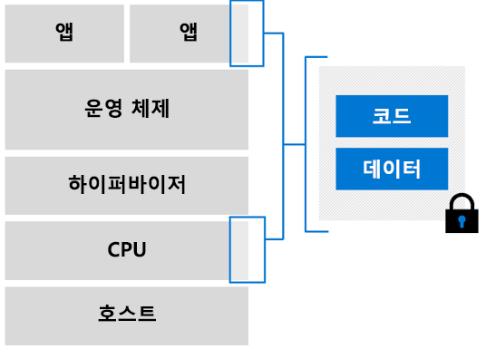

# Azure의 기밀 컴퓨팅

Azure 기밀 컴퓨팅을 사용하면 클라우드에서 처리하는 동안 중요한 데이터를 격리할 수 있습니다. 많은 업계에서 기밀 컴퓨팅을 사용하여 데이터를 보호합니다. 이러한 워크로드는 다음과 같습니다.

- 금융 데이터 보안
- 환자 정보 보호
- 중요한 정보에 대한 기계 학습 프로세스 실행
- 여러 원본에서 암호화된 데이터 세트에 대한 알고리즘 수행

## 개요

> [!VIDEO https://www.youtube.com/embed/rT6zMOoLEqI]

클라우드 데이터 보안이 중요하다는 것을 알고 있습니다. 관심 사항에도 주의를 기울이고 있습니다. 중요한 워크로드를 클라우드로 이동할 때 고객이 가질 수 있는 몇 가지 질문은 다음과 같습니다. 

- Microsoft에서 암호화되지 않은 데이터에 액세스하지 못하도록 하려면 어떻게 해야 하나요?
- 회사 내에서 권한이 있는 관리자의 보안 위협을 방지하려면 어떻게 해야 하나요?
- 타사에서 중요한 고객 데이터에 액세스하지 못하도록 방지하는 다른 방법은 무엇인가요?

Microsoft Azure를 통해 공격 표면을 최소화하여 더 강력한 데이터 보호를 확보할 수 있습니다. Azure는 클라이언트 쪽 암호화 및 서버 쪽 암호화와 같은 모델을 통해 [**미사용 데이터**](../security/fundamentals/encryption-atrest.md)를 보호할 수 있는 많은 도구를 이미 제공하고 있습니다. 또한 Azure는 TLS 및 HTTPS와 같은 보안 프로토콜을 통해 [**전송 중 데이터**](../security/fundamentals/data-encryption-best-practices.md#protect-data-in-transit)를 암호화하는 메커니즘도 제공합니다. 이 페이지에서는 데이터 암호화의 세 번째 단계인 **사용 중 데이터** 암호화를 소개합니다.

## 기밀 컴퓨팅 소개 

기밀 컴퓨팅은 기밀 컴퓨팅의 채택을 정의 및 가속화하기 위한 기반인 [CCC(기밀 컴퓨팅 컨소시엄)](https://confidentialcomputing.io/)에서 정의한 업계 용어입니다. CCC는 하드웨어 기반 TEE(신뢰할 수 있는 실행 환경)에서 계산을 수행하여 사용 중인 데이터 보호로 기밀 컴퓨팅을 정의합니다.

TEE는 권한 있는 코드만 실행하는 환경입니다. TEE의 모든 데이터는 해당 환경 외부의 코드에서 읽거나 변경할 수 없습니다.

### Enclave

Enclave는 하드웨어의 프로세서 및 메모리에 대한 보안 부분입니다. 디버거를 사용하는 경우에도 enclave 내부의 데이터 또는 코드를 볼 수 있는 방법이 없습니다. 신뢰할 수 없는 코드에서 enclave 메모리의 콘텐츠를 수정하려고 하면 환경이 사용하지 않도록 설정되고 작업이 거부됩니다.

애플리케이션을 개발할 때 [소프트웨어 도구](#oe-sdk)를 사용하여 enclave 내의 코드 및 데이터 부분을 보호할 수 있습니다. 이러한 도구는 신뢰할 수 있는 환경 외부의 사용자가 코드와 데이터를 보거나 수정할 수 없도록 합니다. 

기본적으로 enclave는 블랙 박스로 간주됩니다. 암호화된 코드와 데이터를 박스에 넣습니다. 박스 외부에서는 아무것도 볼 수 없습니다. 데이터를 해독할 수 있는 키를 enclave에 지정합니다. 그러면 데이터를 처리하고 다시 암호화한 후에 enclave에서 내보냅니다.

### 증명

신뢰할 수 있는 환경의 보안을 확인하고 유효성을 검사하는 것이 좋습니다. 이 확인은 증명 프로세스입니다. 

증명을 통해 신뢰 당사자는 (1) 자신의 소프트웨어가 enclave에서 실행되고 (2) enclave가 최신 상태이고 안전하다는 확신을 높일 수 있습니다. 예를 들어 enclave는 기본 하드웨어에서 enclave가 플랫폼에 존재한다는 증명을 포함하는 자격 증명을 생성하도록 이 기본 하드웨어에 요청합니다. 그런 다음, 동일한 플랫폼에서 보고서가 생성되었는지 확인하는 두 번째 enclave에 보고서를 제공할 수 있습니다.

증명은 시스템 소프트웨어 및 실리콘과 호환되는 보안 증명 서비스를 사용하여 구현해야 합니다. [Intel의 증명 및 프로비저닝 서비스](https://software.intel.com/sgx/attestation-services)는 Azure 기밀 컴퓨팅 가상 머신과 호환됩니다.

## 클라우드 기반 기밀 컴퓨팅에 Azure 사용 

Azure 기밀 컴퓨팅을 사용하면 가상화된 환경에서 기밀 컴퓨팅 기능을 활용할 수 있습니다. 이제 도구, 소프트웨어 및 클라우드 인프라를 사용하여 보안 하드웨어를 기반으로 하여 빌드할 수 있습니다. 

### Virtual Machines

Azure는 가상화된 환경에서 기밀 컴퓨팅을 제공하는 최초의 클라우드 공급자입니다. 하드웨어와 애플리케이션 간의 추상화 계층으로 작동하는 가상 머신이 개발되었습니다. 중복성 및 가용성 옵션을 사용하여 규모에 맞게 워크로드를 실행할 수 있습니다.  

#### Intel SGX 사용 Virtual Machines

Azure 기밀 컴퓨팅 가상 머신에서 CPU 하드웨어의 일부는 애플리케이션의 일부 코드 및 데이터를 위해 예약됩니다. 이 제한된 부분이 enclave입니다. 

Azure 기밀 컴퓨팅 인프라는 현재 VM(가상 머신)의 특수 SKU로 구성되어 있습니다. 이러한 VM은 Intel SGX(Software Guard Extension)가 있는 Intel 프로세서에서 실행됩니다. [Intel SGX](https://intel.com/sgx)는 기밀 컴퓨팅을 통해 더 강화된 보호를 허용하는 구성 요소입니다. 

현재 Azure는 하드웨어 기반 enclave를 만들기 위한 Intel SGX 기술을 기반으로 하는 [DCsv2 시리즈](https://docs.microsoft.com/azure/virtual-machines/dcv2-series)를 제공하고 있습니다. DCsv2 시리즈 VM에서 실행하는 보안 enclave 기반 애플리케이션을 빌드하여 사용 중인 애플리케이션 데이터와 코드를 보호할 수 있습니다. 

신뢰할 수 있는 하드웨어 기반 enclave를 사용하여 Azure 기밀 컴퓨팅 가상 머신을 배포하는 방법에 대해 [자세히 알아볼 수 있습니다](virtual-machine-solutions.md).

## 애플리케이션 개발 

enclave 및 격리된 환경의 성능을 활용하려면 기밀 컴퓨팅을 지원하는 도구를 사용해야 합니다. enclave 애플리케이션 개발을 지원하는 다양한 도구가 있습니다. 예를 들어 다음과 같은 오픈 소스 프레임워크를 사용할 수 있습니다. 

- [Open Enclave SDK(소프트웨어 개발 키트)](https://github.com/openenclave/openenclave)
- [CCF(기밀 컨소시엄 프레임워크)](https://github.com/Microsoft/CCF)

### 개요

enclave를 사용하여 빌드된 애플리케이션은 다음 두 가지 방법으로 분할됩니다.
1. "신뢰할 수 없는" 구성 요소(호스트)
1. "신뢰할 수 있는" 구성 요소(enclave)

**호스트**는 신뢰할 수 없는 환경에서 실행되는 enclave 애플리케이션입니다. 호스트에 배포된 enclave 코드는 호스트에서 액세스할 수 없습니다. 

**enclave**는 애플리케이션 코드와 캐시된 데이터/메모리가 실행되는 위치입니다. 비밀 및 중요한 데이터가 보호된 상태로 유지되도록 보안 계산이 enclave에서 수행되어야 합니다. 

애플리케이션을 디자인하는 동안 enclaves에서 실행해야 하는 애플리케이션 부분을 식별하고 결정하는 것이 중요합니다. 신뢰할 수 있는 구성 요소에 배치하도록 선택한 코드는 애플리케이션의 나머지 부분과 격리됩니다. enclave가 초기화되고 코드가 메모리에 로드되면 신뢰할 수 없는 구성 요소에서 해당 코드를 읽거나 변경할 수 없습니다. 

### OE SDK(Open Enclave 소프트웨어 개발 키트) 

enclave에서 실행되는 코드를 작성하려면 공급자를 통해 지원되는 라이브러리 또는 프레임워크를 사용합니다. [OE SDK(Open Enclave SDK)](https://github.com/openenclave/openenclave)는 다양한 다른 기밀 컴퓨팅 사용 하드웨어를 추상화할 수 있는 오픈 소스 SDK입니다. 

OE SDK는 모든 CSP의 모든 하드웨어에서 단일 추상화 계층으로 빌드됩니다. OE SDK는 Azure 기밀 컴퓨팅 가상 머신에서 사용되어 enclave를 기반으로 하는 애플리케이션을 만들고 실행할 수 있습니다.

## 다음 단계

DCsv2 시리즈 가상 머신을 배포하고 여기에 OE SDK를 설치합니다.

> [!div class="nextstepaction"]
> [Azure Marketplace에서 기밀 컴퓨팅 VM 배포](quick-create-marketplace.md)