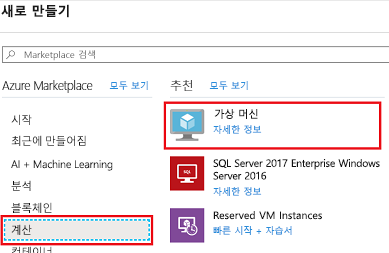
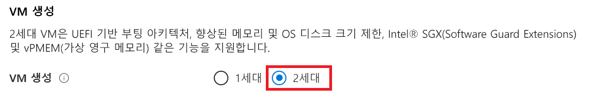
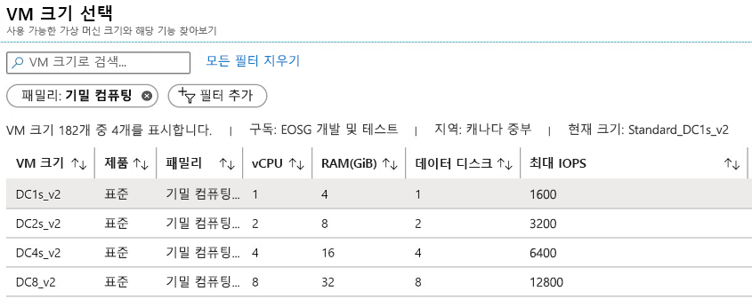
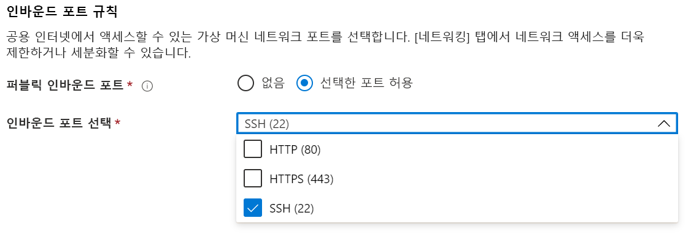
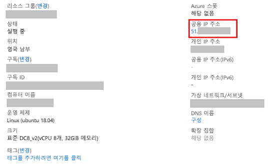

# <a name="quickstart-deploy-an-azure-confidential-computing-vm-in-the-azure-portal"></a>빠른 시작: Azure Portal에서 Azure 기밀 컴퓨팅 VM 배포

Azure Portal을 통해 Intel SGX에서 지원하는 VM(가상 머신)을 만들어 Azure 기밀 컴퓨팅을 시작합니다. 그런 다음, Open Enclave SDK(소프트웨어 개발 키트)를 설치하여 개발 환경을 설정합니다. 

사용자 지정 구성을 사용하여 기밀 컴퓨팅 가상 머신을 배포하는 데 관심이 있는 경우 이 자습서를 사용하는 것이 좋습니다. 그렇지 않으면 [Microsoft 상업용 마켓플레이스를 위한 기밀 컴퓨팅 가상 머신 배포 단계](quick-create-marketplace.md)를 수행하는 것이 좋습니다.


## <a name="prerequisites"></a>사전 요구 사항

Azure 구독이 없는 경우 시작하기 전에 [계정을 만드세요](https://azure.microsoft.com/pricing/purchase-options/pay-as-you-go/).

> [!NOTE]
> 평가판 계정은 이 자습서에서 사용되는 가상 머신에 액세스할 수 없습니다. 종량제 구독으로 업그레이드하세요.


## <a name="sign-in-to-azure"></a>Azure에 로그인

1. [Azure Portal](https://portal.azure.com/)에 로그인합니다.

1. 위쪽에서 **리소스 만들기**를 선택합니다.

1. **Marketplace** 창의 왼쪽에서 **컴퓨팅**을 선택합니다.

1. **가상 머신**을 찾아서 선택합니다.

    

1. 가상 머신 방문 페이지에서 **만들기**를 선택합니다.


## <a name="configure-a-confidential-computing-virtual-machine"></a>기밀 컴퓨팅 가상 머신 구성

1. **기본** 탭에서 **구독** 및 **리소스 그룹**을 선택합니다.

1. **가상 머신 이름**에 대해 새 VM의 이름을 입력합니다.

1. 다음 값을 입력하거나 선택합니다.

   * **지역**: 적합한 Azure 지역을 선택합니다.

        > [!NOTE]
        > 기밀 컴퓨팅 가상 머신은 특정 지역에서 사용할 수 있는 특수한 하드웨어에서만 실행됩니다. DCsv2 시리즈 VM에 사용할 수 있는 최신 지역은 [사용 가능한 지역](https://azure.microsoft.com/global-infrastructure/services/?products=virtual-machines)을 참조하세요.

1. 가상 머신에 사용할 운영 체제 이미지를 구성합니다.

    * **이미지 선택**: 이 자습서에서는 Ubuntu 18.04 LTS를 선택합니다. Windows Server 2019, Windows Server 2016 또는 Ubuntu 16.04 LTS를 선택할 수도 있습니다. 이 작업을 수행하도록 선택하면 이에 따라 이 자습서에서 적절하게 리디렉션됩니다.
    
    * **2세대 이미지 전환**: 기밀 컴퓨팅 가상 머신은 [2세대](../virtual-machines/linux/generation-2.md) 이미지에서만 실행됩니다. 선택한 이미지가 2세대 이미지인지 확인합니다. 가상 머신을 구성하고 있는 위의 **고급** 탭을 클릭합니다. "VM 세대"라는 섹션을 찾을 때까지 아래로 스크롤합니다. [2세대]를 선택한 다음, **기본** 탭으로 돌아갑니다.
    

        


        

    * **기본 구성으로 돌아가기**: 위쪽에 있는 탐색을 사용하여 **기본** 탭으로 돌아갑니다.

1. **크기 변경**을 선택하여 크기 선택기에서 기밀 컴퓨팅 기능이 있는 가상 머신을 선택합니다. 가상 머신 크기 선택기에서 **모든 필터 지우기**를 클릭합니다. **필터 추가**를 선택하고, 필터 형식에 대해 **제품군**을 선택한 다음, **기밀 컴퓨팅**만 선택합니다.

    

    > [!TIP]
    > **DC1s_v2**, **DC2s_v2**, **DC4s_V2** 및 **DC8_v2** 크기가 표시됩니다. 이러한 크기는 현재 기밀 컴퓨팅을 지원하는 유일한 가상 머신 크기입니다. [자세히 알아보기](virtual-machine-solutions.md).

1. 다음 정보를 입력합니다.

   * **인증 형식**: Linux VM을 만드는 경우 **SSH 공개 키**를 선택합니다. 

        > [!NOTE]
         > 인증을 위해 SSH 공개 키를 사용할지 아니면 암호를 사용할지 선택할 수 있습니다. SSH는 더 안전합니다. SSH 키를 생성하는 방법에 대한 지침은 [Azure의 Linux VM용 Linux 및 Mac에서 SSH 키 만들기](https://docs.microsoft.com/azure/virtual-machines/virtual-machines-linux-mac-create-ssh-keys)를 참조하세요.

    * **사용자 이름**: VM에 사용할 관리자 이름을 입력합니다.

    * **SSH 공개 키**: 해당하는 경우 RSA 공개 키를 입력합니다.
    
    * **암호**: 해당하는 경우 인증 암호를 입력합니다.

    * **공용 인바운드 포트**: **선택한 포트 허용**을 선택하고, **공용 인바운드 포트 선택** 목록에서 **SSH(22)** 및 **HTTP(80)** 를 선택합니다. Windows VM을 배포하는 경우 **HTTP(80)** 및 **RDP(3389)** 를 선택합니다. 이 빠른 시작에서 이 단계는 VM에 연결하고 Open Enclave SDK 구성을 완료하는 데 필요합니다. 

     


1. **디스크** 탭에서 변경을 수행합니다.

   * **DC1s_v2**, **DC2s_v2**, **DC4s_V2** 가상 머신을 선택한 경우 **표준 SSD** 또는 **프리미엄 SSD** 디스크 유형 중 하나를 선택합니다. 
   * **DC8_v2** 가상 머신을 선택한 경우 디스크 유형으로 **표준 SSD**를 선택합니다.

1. 다음 탭에서 설정을 원하는 대로 변경하거나 기본 설정을 유지합니다.

    * **네트워킹**
    * **관리**
    * **게스트 구성**
    * **태그**

1. **검토 + 만들기**를 선택합니다.

1. **검토 + 만들기** 창에서 **만들기**를 선택합니다.

> [!NOTE]
> Linux VM을 배포한 경우 다음 섹션으로 이동하여 이 자습서를 계속 진행합니다. Windows VM을 배포한 경우 [다음 단계에 따라 Windows VM에 연결](../virtual-machines/windows/connect-logon.md)한 다음, [OE SDK를 Windows에 설치](https://github.com/openenclave/openenclave/blob/master/docs/GettingStartedDocs/install_oe_sdk-Windows.md)합니다.


## <a name="connect-to-the-linux-vm"></a>Linux VM에 연결

이미 BASH 셸을 사용하는 경우 **ssh** 명령을 사용하여 Azure VM에 연결합니다. 다음 명령에서 VM 사용자 이름 및 IP 주소를 바꿔서 Linux VM에 연결합니다.

```bash
ssh azureadmin@40.55.55.555
```

VM의 공용 IP 주소는 Azure Portal에 있는 가상 머신의 [개요] 섹션 아래에서 확인할 수 있습니다.

[!div class="mx-imgBorder"]


Windows에서 실행 중이고 BASH 셸이 설치되지 않은 경우 PuTTY와 같은 SSH 클라이언트를 설치합니다.

1. [PuTTY 다운로드 및 설치](https://www.chiark.greenend.org.uk/~sgtatham/putty/download.html)

1. PuTTY를 실행합니다.

1. PuTTY 구성 화면에서 VM의 공용 IP 주소를 입력합니다.

1. **열기**를 선택하고 프롬프트에 사용자 이름 및 암호를 입력합니다.

Linux VM에 연결하는 방법에 대한 자세한 내용은 [포털을 사용하여 Azure에서 Linux VM 만들기](../virtual-machines/linux/quick-create-portal.md)를 참조하세요.

> [!NOTE]
> 레지스트리에서 캐시되지 않은 서버의 호스트 키에 대한 PuTTY 보안 경고가 표시되는 경우 다음 옵션 중에서 선택합니다. 이 호스트를 신뢰하는 경우 **예**를 선택하여 PuTTy의 캐시에 키를 추가하여 연결을 계속합니다. 한 번만 연결을 수행하려는 경우 캐시에 키를 추가하지 않고 **아니요**를 선택합니다. 이 호스트를 신뢰하지 않는 경우 **취소**를 선택하여 연결을 중단합니다.

## <a name="install-the-open-enclave-sdk-oe-sdk"></a>OE SDK(Open Enclave SDK) 설치 <a id="Install"></a>

단계별 지침에 따라 Ubuntu 18.04 LTS 2세대 이미지를 실행하는 DCsv2 시리즈 가상 머신에 [OE SDK](https://github.com/openenclave/openenclave)를 설치합니다. 

가상 머신이 Ubuntu 16.04 LTS 2세대에서 실행되는 경우 [Ubuntu 16.04 설치 지침](https://github.com/openenclave/openenclave/blob/master/docs/GettingStartedDocs/install_oe_sdk-Ubuntu_16.04.md)을 따라야 합니다.

#### <a name="1-configure-the-intel-and-microsoft-apt-repositories"></a>1. Intel 및 Microsoft APT 리포지토리 구성

```bash
echo 'deb [arch=amd64] https://download.01.org/intel-sgx/sgx_repo/ubuntu bionic main' | sudo tee /etc/apt/sources.list.d/intel-sgx.list
wget -qO - https://download.01.org/intel-sgx/sgx_repo/ubuntu/intel-sgx-deb.key | sudo apt-key add -

echo "deb http://apt.llvm.org/bionic/ llvm-toolchain-bionic-7 main" | sudo tee /etc/apt/sources.list.d/llvm-toolchain-bionic-7.list
wget -qO - https://apt.llvm.org/llvm-snapshot.gpg.key | sudo apt-key add -

echo "deb [arch=amd64] https://packages.microsoft.com/ubuntu/18.04/prod bionic main" | sudo tee /etc/apt/sources.list.d/msprod.list
wget -qO - https://packages.microsoft.com/keys/microsoft.asc | sudo apt-key add -
```

#### <a name="2-install-the-intel-sgx-dcap-driver"></a>2. Intel SGX DCAP 드라이버 설치

```bash
sudo apt update
sudo apt -y install dkms
wget https://download.01.org/intel-sgx/sgx-dcap/1.4/linux/distro/ubuntuServer18.04/sgx_linux_x64_driver_1.21.bin -O sgx_linux_x64_driver.bin
chmod +x sgx_linux_x64_driver.bin
sudo ./sgx_linux_x64_driver.bin
```

> [!WARNING]
> [Intel의 SGX 사이트](https://01.org/intel-software-guard-extensions/downloads)에 있는 최신 Intel SGX DCAP 드라이버를 사용하세요.

#### <a name="3-install-the-intel-and-open-enclave-packages-and-dependencies"></a>3. Intel 및 Open Enclave 패키지 및 종속성 설치

```bash
sudo apt -y install clang-7 libssl-dev gdb libsgx-enclave-common libsgx-enclave-common-dev libprotobuf10 libsgx-dcap-ql libsgx-dcap-ql-dev az-dcap-client open-enclave
```

> [!NOTE] 
> 이 단계에서는 Azure에서 원격 증명을 수행하는 데 필요한 [az-dcap-client](https://github.com/microsoft/azure-dcap-client) 패키지도 설치합니다.

#### <a name="4-verify-the-open-enclave-sdk-install"></a>4. **Open Enclave SDK 설치 확인**

설치된 SDK를 확인하고 사용하려면 GitHub의 [Open Enclave SDK 사용](https://github.com/openenclave/openenclave/blob/master/docs/GettingStartedDocs/Linux_using_oe_sdk.md)을 참조하세요.

## <a name="clean-up-resources"></a>리소스 정리

리소스 그룹, 가상 머신 및 모든 관련 리소스가 더 이상 필요 없는 경우 삭제해도 됩니다. 

가상머신에 대한 리소스 그룹을 선택한 다음 **삭제**를 선택합니다. 리소스 그룹의 이름을 확인하고 리소스 삭제를 마칩니다.

## <a name="next-steps"></a>다음 단계

이 빠른 시작에서는 기밀 컴퓨팅 가상 머신을 배포하고 Open Enclave SDK를 설치했습니다. Azure의 기밀 컴퓨팅 가상 머신에 대한 자세한 내용은 [Virtual Machines 솔루션](virtual-machine-solutions.md)을 참조하세요. 

Windows VM을 배포한 경우 GitHub의 [Windows용 OE SDK 샘플](https://github.com/openenclave/openenclave/blob/master/samples/README_Windows.md)을 사용하여 애플리케이션을 빌드하는 방법을 알아봅니다. 

GitHub의 Open Enclave SDK Linux 샘플로 계속 진행하여 Linux에서 기밀 컴퓨팅 애플리케이션을 빌드하는 방법을 알아봅니다. 

> [!div class="nextstepaction"]
> [Linux에서 Open Enclave SDK 샘플 빌드](https://github.com/openenclave/openenclave/blob/master/samples/README_Linux.md)
