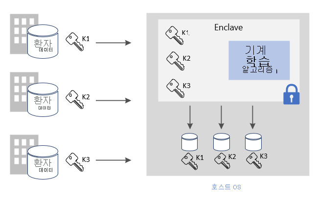
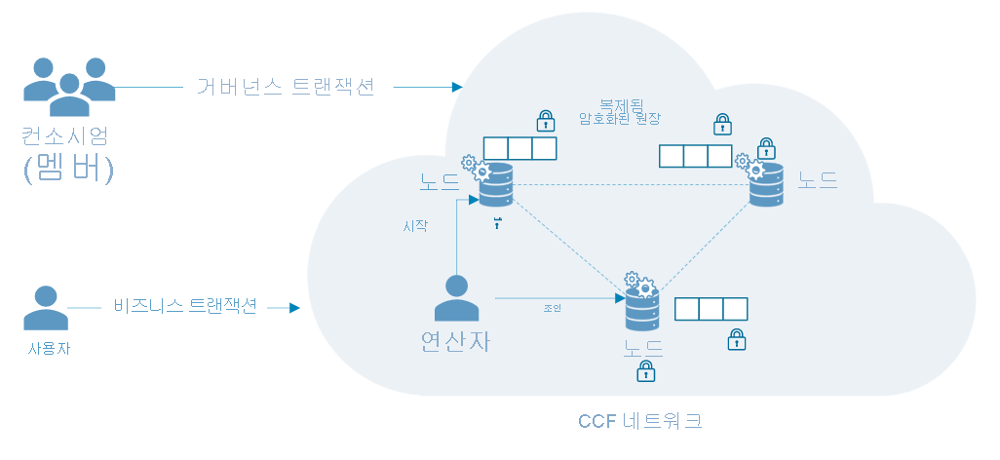

# 일반적인 Azure 기밀 컴퓨팅 시나리오

이 문서에서는 Azure 기밀 컴퓨팅에 대한 몇 가지 일반적인 시나리오에 대해 간략하게 설명합니다. 이 문서의 추천 사항은 기밀 컴퓨팅 서비스와 프레임워크를 사용하여 애플리케이션을 개발하는 시작 지점으로 제공됩니다. 

이 문서를 읽은 다음에는 다음과 같은 질문에 답할 수 있습니다.

- Azure 기밀 컴퓨팅에 대한 몇 가지 시나리오는 무엇인가요?
- Azure 기밀 컴퓨팅을 다자간 시나리오에 사용하면 어떤 이점이 있나요?
- 블록체인 네트워크에서 Azure 기밀 컴퓨팅을 사용하면 어떤 이점이 있나요?

## 다자간 보안 컴퓨팅
Azure 기밀 컴퓨팅을 사용하면 입력 데이터를 다른 당사자에게 공개하지 않고도 여러 원본의 데이터를 처리할 수 있습니다. 이러한 유형의 보안 컴퓨팅을 통해 자금 세탁 방지, 사기 탐지 및 의료 데이터 보안 분석과 같은 다양한 시나리오를 지원합니다.

여러 원본에서 데이터를 가상 머신의 한 enclave에 업로드할 수 있습니다. 한 당사자가 데이터를 계산하거나 처리하도록 enclave에 지시합니다. 어떤 당사자(분석을 실행하는 당사자조차)도 실제로 enclave에 업로드된 다른 당사자의 데이터를 볼 수 없습니다. 

다자간 보안 컴퓨팅에서 암호화된 데이터는 enclave로 이동하고, enclave는 키를 사용하여 데이터의 암호를 해독하고, 분석을 수행하고, 결과를 얻고, 당사자가 지정된 키를 사용하여 해독할 수 있는 암호화된 결과를 다시 보냅니다. 

**사용 중 데이터 보호**: 
- Azure에서 Intel SGX 지원을 사용하도록 설정된 DCsv2 시리즈 VM(가상 머신)을 사용합니다. 이러한 VM은 애플리케이션 데이터 및 코드의 일부를 보호하고 격리하는 TEE(신뢰할 수 있는 실행 환경)에서 사용하도록 설정됩니다.
- enclave 인식 SDK를 사용하여 enclave를 가상 머신 내에 만듭니다. enclave 내에서 데이터는 VM 공급자를 포함하여 어떤 것에도 공개되지 않습니다. enclave의 데이터는 하드웨어 지원을 통해 암호화됩니다.
    - 예를 들어 [OE SDK](https://github.com/openenclave/openenclave)는 서버 쪽 처리에 사용할 수 있습니다. 

**전송 중인 데이터 보호** 
- 증명된 TLS를 보안 채널로 사용하여 전송 중 데이터의 보안을 보장합니다.
- 클라이언트에서 데이터를 enclave로 보호되는 동일한 서버로만 보내도록 합니다. 

**미사용 데이터 보호**
- 보호되고 안전한 데이터 저장소를 사용하여 저장 데이터의 보안을 보장합니다. 

### 자금 세탁 방지
이 다자간 보안 컴퓨팅 예제에서는 여러 은행에서 고객의 개인 데이터를 공개하지 않고 서로 간에 데이터를 공유합니다. 은행은 결합된 중요한 데이터 세트에 대해 합의된 분석을 실행합니다. 집계된 데이터 세트에 대한 분석을 통해 은행에서 서로의 데이터에 액세스하지 않고도 한 사용자의 여러 은행 간 자금 이동을 검색할 수 있습니다.

이러한 금융 기관은 기밀 컴퓨팅을 통해 사기 탐지율을 높이고, 자금 세탁 시나리오를 처리하고, 가양성을 줄이고, 더 큰 데이터 세트를 계속 학습할 수 있습니다. 

### 의료 분야의 의약품 개발
파트너 관계를 맺은 의료 시설은 개인 건강 데이터 세트를 제공하여 ML 모델을 학습시킵니다. 각 시설에서는 자체의 데이터 세트만 볼 수 있습니다. 다른 시설 또는 클라우드 공급자조차도 데이터 또는 학습 모델을 볼 수 없습니다. 

모든 시설에서 학습된 모델을 사용하면 이점을 얻을 수 있습니다. 더 많은 데이터를 사용하여 모델을 만들면 모델이 더 정확하게 됩니다. 모델을 학습시키는 데 기여한 각 시설은 모델을 사용하여 유용한 결과를 얻을 수 있습니다. 

## 블록체인

블록체인 네트워크는 분산된 노드 네트워크입니다. 이러한 노드는 무결성을 보장하고 네트워크 상태에 대한 합의에 도달하려는 운영자 또는 유효성 검사기에 의해 실행되고 유지됩니다. 노드 자체는 원장의 복제본이며, 블록체인 트랜잭션을 추적하는 데 사용됩니다. 각 노드에는 트랜잭션 기록의 전체 복사본이 있으므로 분산 네트워크에서 무결성과 가용성을 보장합니다.

기밀 컴퓨팅을 기반으로 하여 구축된 블록체인 기술은 하드웨어 기반 개인 정보를 사용하여 데이터 기밀성과 보안 컴퓨팅을 가능하게 합니다. 일부 경우에는 전체 원장이 암호화되어 데이터 액세스를 보호합니다. 경우에 따라 트랜잭션 자체는 노드 내의 enclave에 있는 컴퓨팅 모듈 내에서 발생할 수 있습니다.

### CCF(기밀 컨소시엄 프레임워크)
[CCF](https://www.microsoft.com/research/project/confidential-consortium-framework/)는 Azure 기밀 컴퓨팅을 기반으로 하여 구축된 분산 블록체인 프레임워크의 한 예입니다. Microsoft Research에서 선도하는 이 프레임워크는 TEE(신뢰할 수 있는 실행 환경)의 강력한 기능을 활용하여 증명을 위한 원격 enclave 네트워크를 만듭니다. 노드는 Azure 가상 머신([DCsv2 시리즈](confidential-computing-enclaves.md))을 기반으로 하여 실행될 수 있으며 enclave 인프라를 활용할 수 있습니다. 블록체인 사용자는 증명 프로토콜을 통해 하나의 CCF 노드에 대한 무결성을 확인하고 전체 네트워크를 효과적으로 확인할 수 있습니다. 

CCF에서 분산 원장은 모든 네트워크 노드에서 복제되는 키-값 저장소에 기록된 변경 내용으로 구성됩니다. 이러한 각 노드는 TLS를 통해 블록체인 사용자가 트리거할 수 있는 트랜잭션 엔진을 실행합니다. 엔드포인트가 트리거되면 키-값 저장소를 변경할 수 있습니다. 암호화된 변경 내용이 분산 원장에 기록되기 전에 합의에 도달하려면 일정 수의 노드에서 합의해야 합니다. 

## 다음 단계
DCsv2 시리즈 가상 머신을 [배포](quick-create-marketplace.md)합니다.

