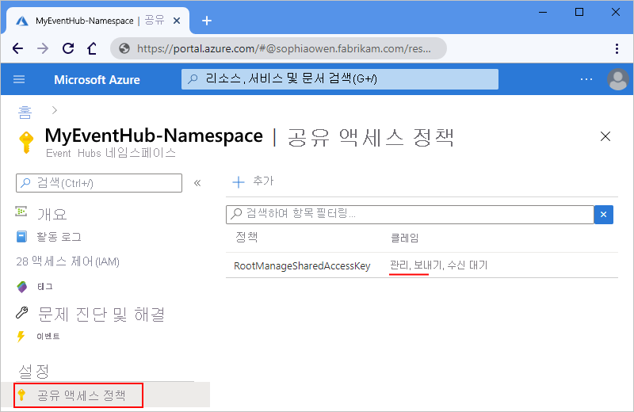
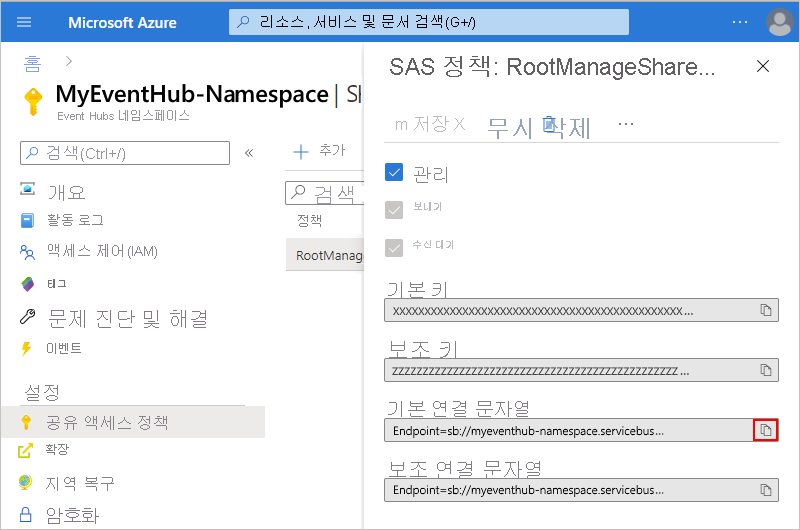
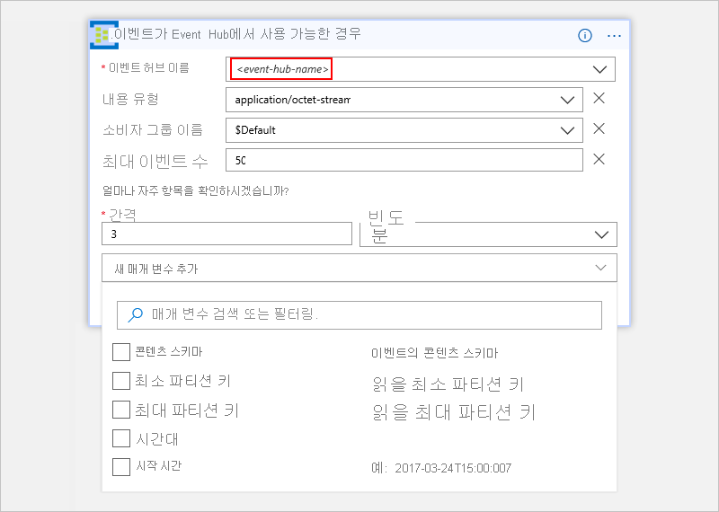
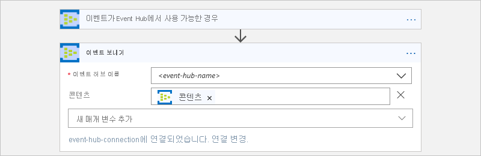
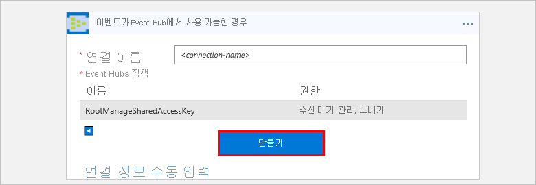

# Azure Event Hubs 및 Azure Logic Apps를 사용하여 이벤트 모니터링, 수신 및 전송

이 아티클에서는 Azure Event Hubs 커넥터를 사용하여 논리 앱 내에서 [Azure Event Hubs](../event-hubs/event-hubs-what-is-event-hubs.md)로 전송된 이벤트를 모니터링하고 관리하는 방법을 보여줍니다. 이런 방식으로 Event Hubs에서 이벤트를 검사하고, 전송하고, 수신하는 작업 및 워크플로를 자동화하는 논리 앱을 만들 수 있습니다. 커넥터 관련 기술 정보에 대 한 참조를 [Azure Event Hubs 커넥터 참조](https://docs.microsoft.com/connectors/eventhubs/)</a>합니다.

## 필수 조건

* Azure 구독. Azure 구독이 없는 경우 [체험 Azure 계정에 등록](https://azure.microsoft.com/free/)합니다. 

* [Azure Event Hubs 네임스페이스 및 Event Hub](../event-hubs/event-hubs-create.md)

* Event Hubs에 액세스하려는 논리 앱입니다. Azure Event Hubs 트리거를 통해 논리 앱을 시작하려면 [빈 논리 앱](../logic-apps/quickstart-create-first-logic-app-workflow.md)이 필요합니다.
논리 앱을 처음 접하는 경우 [Azure Logic Apps란?](../logic-apps/logic-apps-overview.md) 및 [빠른 시작: 첫 번째 논리 앱 만들기](../logic-apps/quickstart-create-first-logic-app-workflow.md)를 검토하세요.

## 사용 권한 확인 및 연결 문자열 가져오기

Event Hub에 액세스하는 논리 앱의 경우 Event Hubs 네임스페이스에 대한 관리 권한과 연결 문자열이 있어야 합니다.

1. [Azure Portal](https://portal.azure.com)에 로그인합니다.

1. 특정 Event Hub가 아닌 Event Hubs *네임스페이스*로 이동합니다. 

1. 네임 스페이스 메뉴 아래 **설정을**를 선택 **공유 액세스 정책**합니다. **클레임** 아래에서 해당 네임스페이스에 대한 **관리** 권한이 있는지 확인합니다.

   

1. 연결 정보를 나중에 수동으로 입력하려는 경우 Event Hubs 네임스페이스에 대한 연결 문자열을 가져옵니다.

   1. **정책**에서 **RootManageSharedAccessKey**를 선택합니다.

   1. 기본 키 연결 문자열을 찾습니다. 복사 단추를 선택하고 나중에 사용할 연결 문자열을 저장합니다.

      

      > [!TIP]
      > 연결 문자열이 Event Hubs 네임스페이스 또는 특정 이벤트 허브와 연결되어 있는지 확인하려면 연결 문자열에 `EntityPath` 매개 변수가 있는지 확인합니다. 이 매개 변수를 찾으면 연결 문자열은 특정 Event Hub "엔터티"에 대한 것이고 논리 앱에 사용할 올바른 문자열이 아닙니다.

1. 이제 [Event Hubs 트리거 추가](#add-trigger) 또는 [Event Hubs 작업 추가](#add-action)를 계속합니다.

## Event Hubs 트리거 추가

Azure Logic Apps에서 모든 논리 앱은 특정 이벤트가 발생하거나 특정 조건이 충족할 때 실행되는 [트리거](../logic-apps/logic-apps-overview.md#logic-app-concepts)를 통해 시작되어야 합니다. 트리거가 실행될 때마다 Logic Apps 엔진에서 논리 앱 인스턴스를 만들고 앱의 워크플로를 실행하기 시작합니다.

이 예제에서는 새 이벤트를 Event Hub로 보내는 경우 논리 앱 워크플로를 시작할 수 있는 방법을 보여줍니다. 

1. Azure Portal 또는 Visual Studio에서 빈 논리 앱을 만들어 논리 앱 디자이너를 엽니다. 이 예에서는 Azure Portal을 사용합니다.

1. 검색 상자에 필터로 “event hubs”를 입력합니다. 트리거 목록에서 다음 트리거를 선택합니다. **이벤트는 Event Hubs-이벤트 허브에서 사용할 수 있는 경우**

   

1. 연결 정보를 묻는 메시지가 표시되면 [이제 Event Hubs 연결을 만듭니다](#create-connection). 

1. 트리거를 모니터링 하려는 이벤트 허브에 대 한 정보를 제공 합니다. 더 많은 속성을 엽니다는 **새 매개 변수 추가** 목록입니다. 트리거 카드에 해당 속성을 추가 매개 변수를 선택 합니다.

   

   | 자산 | 필수 | 설명 |
   |----------|----------|-------------|
   | **이벤트 허브 이름** | 예 | 모니터링 하려는 이벤트 허브 이름 |
   | **콘텐츠 형식** | 아닙니다. | 이벤트의 콘텐츠 형식입니다. 기본값은 `application/octet-stream`입니다. |
   | **소비자 그룹 이름** | 아닙니다. | 합니다 [이벤트 허브 소비자 그룹에 대 한 이름](../event-hubs/event-hubs-features.md#consumer-groups) 이벤트를 읽는 데 있습니다. 지정하지 않으면 기본값 소비자 그룹이 사용됩니다. |
   | **최대 이벤트 수** | 아닙니다. | 이벤트의 최대 수입니다. 트리거는 1과 이 속성으로 지정된 이벤트의 수 범위의 숫자를 반환합니다. |
   | **간격** | 예 | 빈도에 따라 워크플로가 실행 되는 빈도 설명 하는 양의 정수 |
   | **Frequency(빈도)** | 예 | 되풀이 대 한 시간 단위 |
   ||||

   **추가 속성**

   | 자산 | 필수 | 설명 |
   |----------|----------|-------------|
   | **콘텐츠 스키마** | 아닙니다. | 이벤트 허브에서 읽을 수 이벤트에 대 한 JSON 콘텐츠 스키마입니다. 예를 들어 내용 스키마를 지정 하는 경우 스키마와 일치 하는 이벤트에 대 한 논리 앱을 트리거할 수 있습니다. |
   | **최소 파티션 키** | 아닙니다. | 읽을 최소 [파티션](../event-hubs/event-hubs-features.md#partitions) ID를 입력합니다. 기본적으로 모든 파티션이 읽혀집니다. |
   | **최대 파티션 키** | 아닙니다. | 읽을 최대 [파티션](../event-hubs/event-hubs-features.md#partitions) ID를 입력합니다. 기본적으로 모든 파티션이 읽혀집니다. |
   | **표준 시간대** | 아닙니다. | 이 트리거는 UTC 오프셋을 수락 하지 않았기 때문에 시작 시간을 지정 하는 경우에 적용 됩니다. 적용하려는 표준 시간대를 선택합니다. 
자세한 내용은 [되풀이 태스크를 실행된 및 Azure Logic Apps를 사용 하 여 워크플로 만들기 및](../connectors/connectors-native-recurrence.md)합니다. |
   | **시작 시간** | 아닙니다. | 시작 시간을 다음 형식으로 입력합니다. 
표준 시간대를 선택하는 경우 YYYY-MM-DDThh:mm:ss
또는
표준 시간대를 선택하지 않은 경우 YYYY-MM-DDThh:mm:ssZ
자세한 내용은 [되풀이 태스크를 실행된 및 Azure Logic Apps를 사용 하 여 워크플로 만들기 및](../connectors/connectors-native-recurrence.md)합니다. |
   ||||

1. 완료되면 디자이너 도구 모음에서 **저장**을 선택합니다.

1. 이제 트리거 결과와 함께 수행하려는 작업에 대한 논리 앱에 하나 이상의 작업을 계속해서 추가합니다. 

   예를 들어 범주와 같은 특정 값을 기준으로 이벤트를 필터링 할 조건을 추가할 수 있습니다는 되도록 합니다 **Event Hubs-이벤트 보내기** 작업은 조건을 충족 하는 이벤트만 보냅니다. 

> [!NOTE]
> 모든 Event Hub 트리거는 *긴 폴링* 트리거입니다. 즉, 이 트리거는 발생될 때 모든 이벤트를 처리한 다음, 더 많은 이벤트가 Event Hub에 나타날 때까지 30초 동안 기다립니다.
> 30초 후에 이벤트가 수신되지 않으면 트리거 실행을 건너뜁니다. 그렇지 않으면 트리거는 Event Hub가 빈 상태가 될 때까지 이벤트를 계속 읽습니다.
> 다음 트리거 폴링은 트리거의 속성에 지정한 되풀이 간격을 기준으로 발생합니다.

## Event Hubs 작업 추가

Azure Logic Apps에서 [작업](../logic-apps/logic-apps-overview.md#logic-app-concepts)은 트리거 또는 다른 작업을 수행하는 워크플로의 한 단계입니다. 이 예제에서 논리 앱은 Event Hub에서 새 이벤트를 확인하는 Event Hubs 트리거를 시작합니다.

1. Azure Portal 또는 Visual Studio에서 논리 앱 디자이너에서 논리 앱을 엽니다. 이 예에서는 Azure Portal을 사용합니다.

1. 트리거 또는 작업에서 선택 **새 단계**합니다.

   기존 단계 간에 작업을 추가하려면 연결 화살표 위로 마우스를 이동합니다. 
   표시되는 더하기 기호(**+**)를 선택한 다음, **작업 추가**를 선택합니다.

1. 검색 상자에 필터로 “event hubs”를 입력합니다.
작업 목록에서이 작업을 선택 합니다. **Event Hubs-이벤트 보내기**

   

1. 연결 정보를 묻는 메시지가 표시되면 [이제 Event Hubs 연결을 만듭니다](#create-connection). 

1. 작업을 전송 하려는 이벤트에 대 한 정보를 제공 합니다. 더 많은 속성을 엽니다는 **새 매개 변수 추가** 목록입니다. 매개 변수를 선택 하는 속성 작업 카드가 추가 합니다.

   

   | 자산 | 필수 | 설명 |
   |----------|----------|-------------|
   | **이벤트 허브 이름** | 예 | 이벤트 허브 이벤트를 전송 하려는 위치 |
   | **콘텐츠** | 아닙니다. | 전송하려는 이벤트의 콘텐츠 |
   | **Properties** | 아닙니다. | 보낼 앱 속성 및 값 |
   | **파티션 키** | 아닙니다. | 합니다 [파티션](../event-hubs/event-hubs-features.md#partitions) 이벤트를 보낼 위치에 대 한 ID |
   ||||

   예를 들어, 다른 이벤트 허브로 Event Hubs 트리거에서 출력을 보낼 수 있습니다.

   

1. 완료되면 디자이너 도구 모음에서 **저장**을 선택합니다.

## Event Hub에 연결

[!INCLUDE [Create connection general intro](../../includes/connectors-create-connection-general-intro.md)] 

1. 연결 정보에 대한 메시지가 표시되면 다음과 같은 세부 정보를 입력합니다.

   | 자산 | 필수 | Value | 설명 |
   |----------|----------|-------|-------------|
   | **연결 이름** | 예 | <*connection-name*> | 연결에 만들 이름 |
   | **Event Hubs Namespace** | 예 | <*event-hubs-namespace*> | 사용하려는 Event Hubs 네임스페이스를 선택합니다. |
   |||||  

   예를 들면 다음과 같습니다.

   

   연결 문자열을 수동으로 입력하려면 **연결 정보를 수동으로 입력**을 선택합니다. 
   [연결 문자열을 찾는 방법](#permissions-connection-string)을 알아보세요.

2. 선택하지 않은 경우 사용할 Event Hubs 정책을 선택합니다. **만들기**를 선택합니다.

   

3. 연결을 만든 후에 [Event Hubs 트리거 추가](#add-trigger) 또는 [Event Hubs 작업 추가](#add-action)를 계속 진행합니다.

## 커넥터 참조

트리거, 작업 및 커넥터의 OpenAPI에 설명 된 대로 제한 등의 기술 세부 정보에 대 한 (이전의 Swagger) 파일, 참조를 [커넥터의 참조 페이지](/connectors/eventhubs/)합니다.

## 다음 단계

다른 [Logic Apps 커넥터](../connectors/apis-list.md)에 대해 알아봅니다.