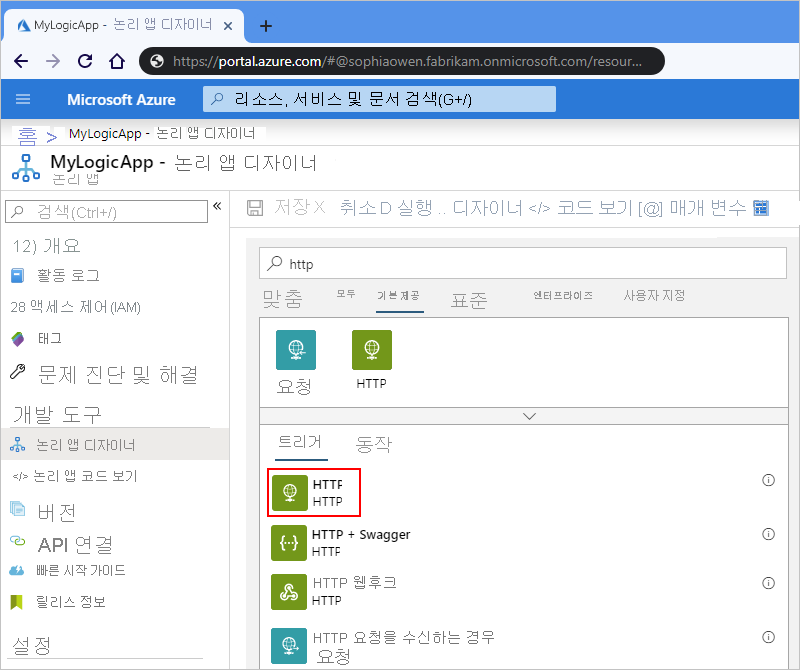
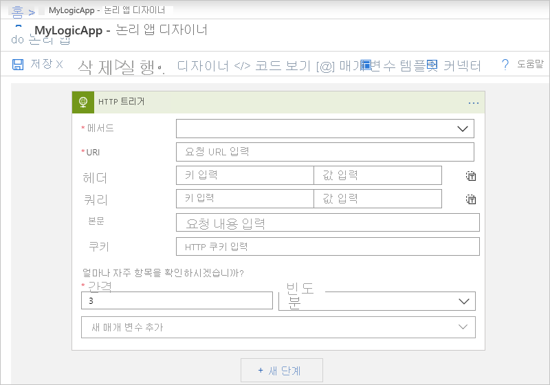
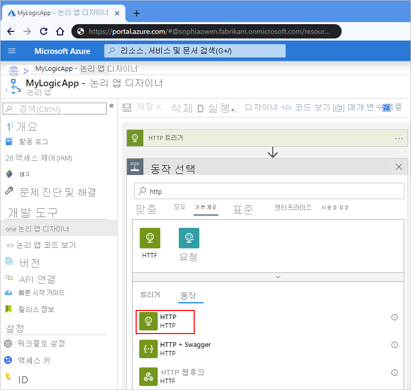
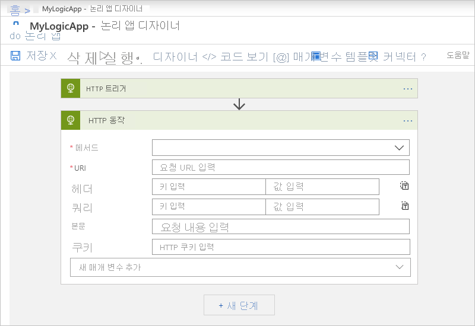

# Azure Logic Apps를 사용하여 HTTP 또는 HTTPS 엔드포인트 호출

Azure Logic Apps 및 HTTP(Hypertext Transfer Protocol) 커넥터를 사용하여 논리 앱을 빌드하여 모든 HTTP 또는 HTTPS 엔드포인트와 통신하는 워크플로를 자동화할 수 있습니다. 예를 들어 웹 사이트에 대한 서비스 엔드포인트를 모니터링할 수 있습니다. 해당 엔드포인트에서 웹 사이트 중지와 같은 이벤트가 발생할 때 이벤트는 논리 앱의 워크플로를 트리거하고 지정된 작업을 실행합니다. 

정기적으로 엔드포인트를 검사 또는 *폴링*하기 위해 워크플로에서 첫 번째 단계로 HTTP 트리거를 사용할 수 있습니다. 각 검사에서 트리거는 엔드포인트에 호출 또는 *요청*을 전송합니다. 엔드포인트의 응답은 논리 앱의 워크플로가 실행될지 여부를 결정합니다. 트리거는 응답에서 논리 앱의 작업으로 모든 콘텐츠를 전달합니다. 

원하는 경우 엔드포인트 호출을 위해 워크플로의 다른 단계로 HTTP 작업을 사용할 수 있습니다. 엔드포인트의 응답은 워크플로의 나머지 작업을 실행하는 방법을 결정합니다.

논리 앱을 처음 접하는 경우 [Azure Logic Apps란?](../logic-apps/logic-apps-overview.md)을 검토합니다.

## 필수 조건

* Azure 구독. Azure 구독이 없는 경우 <a href="https://azure.microsoft.com/free/" target="_blank">체험 Azure 계정에 등록</a>합니다. 

* 호출하려는 대상 엔드포인트에 대한 URL 

* [논리 앱 만드는 방법](../logic-apps/quickstart-create-first-logic-app-workflow.md)에 관한 기본 지식

* 대상 엔드포인트를 호출하려는 논리 앱 HTTP 트리거를 시작하려면 [빈 논리 앱을 만듭니다](../logic-apps/quickstart-create-first-logic-app-workflow.md). HTTP 작업을 사용하려면 트리거로 논리 앱을 시작합니다.

## HTTP 트리거 추가

1. [Azure Portal](https://portal.azure.com)에 로그인하고, 아직 열리지 않은 경우 Logic App Designer에서 빈 논리 앱을 엽니다.

1. 검색 상자에 "http"를 필터로 입력합니다. 트리거 목록에서 **HTTP** 트리거를 선택합니다. 

   

1. 대상 엔드포인트에 대한 호출에 포함하려는 [HTTP 트리거의 매개 변수 및 값](../logic-apps/logic-apps-workflow-actions-triggers.md##http-trigger)을 제공합니다. 트리거에서 대상 엔드포인트를 검사하려는 빈도에 대한 되풀이를 설정합니다.

   

   HTTP 트리거, 매개 변수 및 값에 대한 자세한 내용은 [트리거 및 작업 형식 참조](../logic-apps/logic-apps-workflow-actions-triggers.md##http-trigger)를 참조하세요.

1. 트리거가 발생할 때 실행되는 작업을 사용하여 논리 앱의 워크플로를 계속해서 작성합니다.

## HTTP 작업 추가

[!INCLUDE [Create connection general intro](../../includes/connectors-create-connection-general-intro.md)]

1. [Azure Portal](https://portal.azure.com)에 로그인하고, 아직 열리지 않은 경우 Logic App Designer에서 논리 앱을 엽니다.

1. HTTP 작업을 추가하려는 마지막 단계에서 **새 단계**를 선택합니다. 

   이 예제에서 논리 앱은 첫 번째 단계로 HTTP 트리거로 시작합니다.

1. 검색 상자에 "http"를 필터로 입력합니다. 작업 목록에서 **HTTP** 작업을 선택합니다.

   

   단계 사이에서 작업을 추가하려면 단계 사이에 있는 화살표 위로 포인터를 이동합니다. 
   표시되는 더하기 기호(**+**)를 선택한 다음, **작업 추가**를 선택합니다.

1. 대상 엔드포인트에 대한 호출에 포함하려는 [HTTP 작업의 매개 변수 및 값](../logic-apps/logic-apps-workflow-actions-triggers.md##http-action)을 제공합니다. 

   

1. 완료되면 논리 앱을 저장해야 합니다. 디자이너 도구 모음에서 **저장**을 선택합니다. 

## 인증

인증을 설정하려면 작업 또는 트리거 내에서 **고급 옵션 표시**를 선택합니다. HTTP 트리거 및 작업에 사용 가능한 인증 유형에 대한 자세한 내용은 [트리거 및 작업 형식 참조](../logic-apps/logic-apps-workflow-actions-triggers.md#connector-authentication)를 참조하세요.

## 지원 받기

* 질문이 있는 경우 [Azure Logic Apps 포럼](https://social.msdn.microsoft.com/Forums/en-US/home?forum=azurelogicapps)을 방문해 보세요.
* 기능 아이디어를 제출하거나 투표하려면 [Logic Apps 사용자 의견 사이트](https://aka.ms/logicapps-wish)를 방문하세요.

## 다음 단계

* 다른 [Logic Apps 커넥터](../connectors/apis-list.md)에 대해 알아봅니다.
