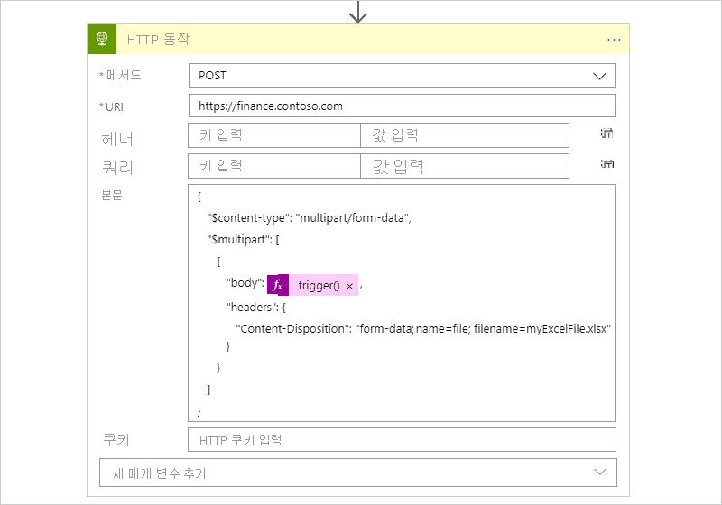

# <a name="call-service-endpoints-over-http-or-https-from-azure-logic-apps"></a>Azure Logic Apps에서 HTTP 또는 HTTPS를 통해 서비스 엔드포인트 호출

[Azure Logic Apps](../logic-apps/logic-apps-overview.md) 및 기본 제공 http 트리거 또는 작업을 사용 하 여 HTTP 또는 HTTPS를 통해 서비스 끝점에 요청을 보내는 자동화 된 작업 및 워크플로를 만들 수 있습니다. 예를 들어 특정 일정에 따라 해당 끝점을 확인 하 여 웹 사이트에 대 한 서비스 끝점을 모니터링할 수 있습니다. 웹 사이트의 작동이 중단 되는 경우와 같이 해당 끝점에서 지정 된 이벤트가 발생 하면 이벤트는 논리 앱의 워크플로를 트리거하고 해당 워크플로에서 작업을 실행 합니다. 대신 인바운드 HTTPS 호출을 수신 하 고 응답 하려면 기본 제공 [요청 트리거 또는 응답 작업](../connectors/connectors-native-reqres.md)을 사용 합니다.

* 되풀이 일정에 따라 끝점을 검사 하거나 *폴링* 하려면 워크플로의 첫 단계로 [HTTP 트리거를 추가](#http-trigger) 합니다. 트리거에서 끝점을 확인할 때마다 트리거는 끝점에 *요청* 을 호출 하거나 보냅니다. 엔드포인트의 응답은 논리 앱의 워크플로가 실행될지 여부를 결정합니다. 트리거는 끝점의 응답에서 논리 앱의 동작에 대 한 모든 콘텐츠를 전달 합니다.

* 워크플로의 다른 위치에서 끝점을 호출 하려면 [HTTP 작업을 추가](#http-action)합니다. 엔드포인트의 응답은 워크플로의 나머지 작업을 실행하는 방법을 결정합니다.

이 문서에서는 논리 앱의 워크플로에 HTTP 트리거 또는 작업을 추가 하는 방법을 보여 줍니다.

## <a name="prerequisites"></a>사전 요구 사항

* Azure 구독 Azure 구독이 없는 경우 [체험 Azure 계정에 등록](https://azure.microsoft.com/free/)합니다.

* 호출 하려는 대상 끝점의 URL입니다.

* [논리 앱 만드는 방법](../logic-apps/quickstart-create-first-logic-app-workflow.md)에 관한 기본 지식 논리 앱을 처음 접하는 경우 [Azure Logic Apps 된 항목](../logic-apps/logic-apps-overview.md)을 검토 하세요.

* 대상 엔드포인트를 호출할 논리 앱입니다. HTTP 트리거를 시작 하려면 [빈 논리 앱을 만듭니다](../logic-apps/quickstart-create-first-logic-app-workflow.md). HTTP 작업을 사용 하려면 원하는 트리거를 사용 하 여 논리 앱을 시작 합니다. 이 예제에서는 첫 번째 단계로 HTTP 트리거를 사용 합니다.

<a name="http-trigger"></a>

## <a name="add-an-http-trigger"></a>HTTP 트리거 추가

이 기본 제공 트리거는 끝점에 대해 지정 된 URL에 대 한 HTTP 호출을 수행 하 고 응답을 반환 합니다.

1. [Azure Portal](https://portal.azure.com)에 로그인합니다. 논리 앱 디자이너에서 빈 논리 앱을 엽니다.

1. 디자이너의 검색 상자 아래에서 **기본 제공**을 선택 합니다. 검색 상자에서 필터로 `http`을 입력합니다. **트리거** 목록에서 **HTTP** 트리거를 선택 합니다.

   

   이 예에서는 단계가 보다 설명적인 이름을 갖도록 "HTTP 트리거"로 트리거의 이름을 바꿉니다. 또한 나중에이 예제에서는 HTTP 작업을 추가 하 고 두 이름이 모두 고유 해야 합니다.

1. 대상 끝점에 대 한 호출에 포함 하려는 [HTTP 트리거 매개 변수에](../logic-apps/logic-apps-workflow-actions-triggers.md#http-trigger) 대 한 값을 제공 합니다. 트리거가 대상 끝점을 확인 하는 빈도에 대 한 되풀이를 설정 합니다.

   

   **없음**이외의 인증 유형을 선택 하는 경우 인증 설정은 선택 사항에 따라 달라 집니다. HTTP에 사용할 수 있는 인증 유형에 대 한 자세한 내용은 다음 항목을 참조 하세요.

   * [아웃바운드 호출에 대한 인증 추가](../logic-apps/logic-apps-securing-a-logic-app.md#add-authentication-outbound)
   * [관리 id를 사용 하 여 리소스에 대 한 액세스 인증](../logic-apps/create-managed-service-identity.md)

1. 다른 사용 가능한 매개 변수를 추가하려면 **새 매개 변수 추가** 목록을 열고 원하는 매개 변수를 선택합니다.

1. 트리거가 발생할 때 실행되는 작업을 사용하여 논리 앱의 워크플로를 계속해서 작성합니다.

1. 완료 되 면 논리 앱을 저장 해야 합니다. 디자이너 도구 모음에서 **저장**을 선택합니다.

<a name="http-action"></a>

## <a name="add-an-http-action"></a>HTTP 동작 추가

이 기본 제공 작업은 끝점에 대해 지정 된 URL에 대 한 HTTP 호출을 수행 하 고 응답을 반환 합니다.

1. [Azure Portal](https://portal.azure.com)에 로그인합니다. Logic Apps 디자이너에서 논리 앱을 엽니다.

   이 예제에서는 첫 번째 단계로 HTTP 트리거를 사용 합니다.

1. HTTP 작업을 추가 하려는 단계 아래에서 **새 단계**를 선택 합니다.

   단계 사이에서 작업을 추가하려면 단계 사이에 있는 화살표 위로 포인터를 이동합니다. 표시되는 더하기 기호( **+** )를 선택한 다음, **작업 추가**를 선택합니다.

1. **작업 선택** 아래에서 **기본 제공**을 선택합니다. 검색 상자에서 필터로 `http`을 입력합니다. **작업** 목록에서 **HTTP** 작업을 선택 합니다.

   

   이 예에서는 단계에 보다 설명적인 이름을 포함 하도록 동작의 이름을 "HTTP action"으로 바꿉니다.

1. 대상 끝점에 대 한 호출에 포함 하려는 [HTTP 작업 매개 변수의](../logic-apps/logic-apps-workflow-actions-triggers.md#http-action) 값을 제공 합니다.

   

   **없음**이외의 인증 유형을 선택 하는 경우 인증 설정은 선택 사항에 따라 달라 집니다. HTTP에 사용할 수 있는 인증 유형에 대 한 자세한 내용은 다음 항목을 참조 하세요.

   * [아웃바운드 호출에 대한 인증 추가](../logic-apps/logic-apps-securing-a-logic-app.md#add-authentication-outbound)
   * [관리 id를 사용 하 여 리소스에 대 한 액세스 인증](../logic-apps/create-managed-service-identity.md)

1. 다른 사용 가능한 매개 변수를 추가하려면 **새 매개 변수 추가** 목록을 열고 원하는 매개 변수를 선택합니다.

1. 완료 되 면 논리 앱을 저장 해야 합니다. 디자이너 도구 모음에서 **저장**을 선택합니다.

<a name="tls-support"></a>

## <a name="transport-layer-security-tls"></a>TLS(전송 계층 보안)

대상 끝점의 기능을 기반으로 하는 아웃 바운드 호출은 TLS (전송 계층 보안)를 지원 합니다 .이는 이전에 SSL(Secure Sockets Layer) (SSL) 버전 1.0, 1.1 및 1.2입니다. 가능 하면 지원 되는 가장 높은 버전을 사용 하 여 끝점에 대 한 Logic Apps 협상 합니다.

예를 들어 끝점이 1.2을 지 원하는 경우 HTTP 커넥터는 1.2를 먼저 사용 합니다. 그렇지 않으면 커넥터에서 지원 되는 가장 높은 다음 버전을 사용 합니다.

<a name="self-signed"></a>

## <a name="self-signed-certificates"></a>자체 서명된 인증서

* 전역 다중 테 넌 트 Azure 환경에서 논리 앱의 경우 HTTP 커넥터는 자체 서명 된 TLS/SSL 인증서를 허용 하지 않습니다. 논리 앱이 서버에 대 한 HTTP 호출을 수행 하 고 TLS/SSL 자체 서명 된 인증서를 제공 하는 경우 HTTP 호출은 오류가 발생 하 고 실패 `TrustFailure` 합니다.

* [ISE (통합 서비스 환경)](../logic-apps/connect-virtual-network-vnet-isolated-environment-overview.md)의 논리 앱에 대해 HTTP 커넥터는 TLS/SSL 핸드셰이크에 자체 서명 된 인증서를 허용 합니다. 그러나 Logic Apps REST API를 사용 하 여 기존 ISE 또는 새 ISE에 대해 [자체 서명 된 인증서 지원을 사용 하도록 설정](../logic-apps/create-integration-service-environment-rest-api.md#request-body) 하 고 위치에 공용 인증서를 설치 해야 합니다 `TrustedRoot` .

## <a name="content-with-multipartform-data-type"></a>Multipart/form 데이터 형식의 콘텐츠

HTTP 요청에 형식이 있는 콘텐츠를 처리 하려면 `multipart/form-data` `$content-type` 이 형식을 사용 하 여 및 특성을 포함 하는 JSON 개체를 `$multipart` http 요청의 본문에 추가할 수 있습니다.

```json
"body": {
   "$content-type": "multipart/form-data",
   "$multipart": [
      {
         "body": "<output-from-trigger-or-previous-action>",
         "headers": {
            "Content-Disposition": "form-data; name=file; filename=<file-name>"
         }
      }
   ]
}
```

예를 들어 형식을 지 원하는 해당 사이트의 API를 사용 하 여 Excel 파일에 대 한 HTTP POST 요청을 웹 사이트로 보내는 논리 앱이 있다고 가정 `multipart/form-data` 합니다. 이 작업의 모양은 다음과 같습니다.



다음은 기본 워크플로 정의에서 HTTP 작업의 JSON 정의를 보여 주는 동일한 예제입니다.

```json
"HTTP_action": {
   "inputs": {
      "body": {
         "$content-type": "multipart/form-data",
         "$multipart": [
            {
               "body": "@trigger()",
               "headers": {
                  "Content-Disposition": "form-data; name=file; filename=myExcelFile.xlsx"
               }
            }
         ]
      },
      "method": "POST",
      "uri": "https://finance.contoso.com"
   },
   "runAfter": {},
   "type": "Http"
}
```

<a name="asynchronous-pattern"></a>

## <a name="asynchronous-request-response-behavior"></a>비동기 요청-응답 동작

기본적으로 Azure Logic Apps의 모든 HTTP 기반 작업은 표준 [비동기 작업 패턴](https://docs.microsoft.com/azure/architecture/patterns/async-request-reply)을 따릅니다. 이 패턴은 HTTP 작업에서 끝점, 서비스, 시스템 또는 API에 대 한 요청을 호출 하거나 보낸 후 수신자가 ["202 수락"](https://www.w3.org/Protocols/rfc2616/rfc2616-sec10.html#sec10.2.3) 응답을 즉시 반환 하도록 지정 합니다. 이 코드는 수신자가 요청을 수락 했지만 처리가 완료 되지 않았음을 확인 합니다. 응답에는 수신기가 `location` 처리를 중지 하 고 ["200 OK"](https://www.w3.org/Protocols/rfc2616/rfc2616-sec10.html#sec10.2.1) 성공 응답 또는 다른 비 202 응답을 반환할 때까지 호출자가 비동기 요청의 상태를 폴링하거나 확인 하는 데 사용할 수 있는 URL 및 새로 고침 ID를 지정 하는 헤더가 포함 될 수 있습니다. 그러나 호출자는 요청이 처리를 마칠 때까지 기다릴 필요가 없으며 다음 작업을 계속 실행할 수 있습니다. 자세한 내용은 [비동기 마이크로 서비스 통합에 마이크로 서비스 자율성 적용](https://docs.microsoft.com/azure/architecture/microservices/design/interservice-communication#synchronous-versus-asynchronous-messaging)을 참조 하세요.

* 논리 앱 디자이너에서 트리거는 제외 하 고 HTTP 작업에는 기본적으로 사용 되는 **비동기 패턴** 설정이 있습니다. 이 설정은 호출자가 처리가 완료 될 때까지 기다리지 않고 다음 작업으로 이동할 수 있도록 지정 하지만 처리가 중지 될 때까지 계속 해 서 상태를 확인 합니다. 사용 하지 않도록 설정 된 경우이 설정은 호출자가 다음 작업으로 이동 하기 전에 처리가 완료 될 때까지 대기 하도록 지정 합니다.

  이 설정을 찾으려면 다음 단계를 수행 합니다.

  1. HTTP 작업의 제목 표시줄에서 줄임표 (**...**) 단추를 선택 하 여 작업의 설정을 엽니다.

  1. **비동기 패턴** 설정을 찾습니다.

     

* HTTP 작업의 내부 JavaScript Object Notation (JSON) 정의는 암시적으로 비동기 작업 패턴을 따릅니다.

<a name="disable-asynchronous-operations"></a>

## <a name="disable-asynchronous-operations"></a>비동기 작업 사용 안 함

경우에 따라 특정 시나리오에서 HTTP 작업의 비동기 동작을 원할 수 있습니다. 예를 들어 다음과 같은 작업을 수행할 수 있습니다.

* [장기 실행 작업의 HTTP 시간 제한 방지](#avoid-http-timeouts)
* [위치 헤더 확인 사용 안 함](#disable-location-header-check)

<a name="turn-off-asynchronous-pattern-setting"></a>

### <a name="turn-off-asynchronous-pattern-setting"></a>**비동기 패턴** 설정 해제

1. 논리 앱 디자이너에서 HTTP 작업의 제목 표시줄에 있는 줄임표 (**...**) 단추를 선택 하 여 작업의 설정을 엽니다.

1. **비동기 패턴** 설정을 찾고, 설정 된 경우 **해제** 로 설정 하 고, **완료**를 선택 합니다.

   

<a name="add-disable-async-pattern-option"></a>

### <a name="disable-asynchronous-pattern-in-actions-json-definition"></a>작업의 JSON 정의에서 비동기 패턴을 사용 하지 않도록 설정

HTTP 작업의 기본 JSON 정의에서 작업이 동기 작업 패턴을 대신 수행 하도록 작업의 정의에 [ `"DisableAsyncPattern"` 작업 옵션을 추가](../logic-apps/logic-apps-workflow-actions-triggers.md#operation-options) 합니다. 자세한 내용은 [동기 작업 패턴에서 작업 실행](../logic-apps/logic-apps-workflow-actions-triggers.md#disable-asynchronous-pattern)을 참조 하세요.

<a name="avoid-http-timeouts"></a>

## <a name="avoid-http-timeouts-for-long-running-tasks"></a>장기 실행 작업의 HTTP 시간 제한 방지

HTTP 요청에는 [제한 시간 제한이](../logic-apps/logic-apps-limits-and-config.md#http-limits)있습니다. 이 제한으로 인해 시간이 초과 되는 장기 실행 HTTP 작업이 있는 경우 다음과 같은 옵션을 사용할 수 있습니다.

* 작업이 지속적으로 요청 상태를 폴링하거나 확인 하지 않도록 [HTTP 작업의 비동기 작업 패턴을 사용 하지 않도록 설정](#disable-asynchronous-operations) 합니다. 대신,이 작업은 요청이 처리를 완료 한 후 수신자가 상태 및 결과에 응답할 때까지 대기 합니다.

* HTTP 작업을 Http 웹 후크 [작업](../connectors/connectors-native-webhook.md)으로 바꿉니다. 그러면 요청의 처리가 완료 된 후 수신자가 상태 및 결과에 응답할 때까지 대기 합니다.

<a name="disable-location-header-check"></a>

## <a name="disable-checking-location-headers"></a>위치 헤더 확인 사용 안 함

일부 끝점, 서비스, 시스템 또는 Api는 헤더가 없는 "202 수락 됨" 응답을 반환 합니다 `location` . 헤더가 존재 하지 않을 때 HTTP 동작에서 요청 상태를 지속적으로 확인 하지 않도록 하려면 `location` 다음 옵션을 사용할 수 있습니다.

* 작업이 지속적으로 요청 상태를 폴링하거나 확인 하지 않도록 [HTTP 작업의 비동기 작업 패턴을 사용 하지 않도록 설정](#disable-asynchronous-operations) 합니다. 대신,이 작업은 요청이 처리를 완료 한 후 수신자가 상태 및 결과에 응답할 때까지 대기 합니다.

* HTTP 작업을 Http 웹 후크 [작업](../connectors/connectors-native-webhook.md)으로 바꿉니다. 그러면 요청의 처리가 완료 된 후 수신자가 상태 및 결과에 응답할 때까지 대기 합니다.

## <a name="known-issues"></a>알려진 문제

<a name="omitted-headers"></a>

### <a name="omitted-http-headers"></a>생략 HTTP 헤더

HTTP 트리거 또는 작업에 이러한 헤더가 포함 된 경우 Logic Apps는 경고 또는 오류를 표시 하지 않고 생성 된 요청 메시지에서 이러한 헤더를 제거 합니다.

* `Accept-*`
* `Allow`
* `Content-Disposition`, `Content-Encoding` 및 `Content-Type`과 같은 예외가 있는 `Content-*`
* `Cookie`
* `Expires`
* `Host`
* `Last-Modified`
* `Origin`
* `Set-Cookie`
* `Transfer-Encoding`

Logic Apps에서 HTTP 트리거 또는 작업을 사용 하는 논리 앱을 이러한 헤더와 함께 저장 하는 것을 중지 하지는 않지만 Logic Apps는 이러한 헤더를 무시 합니다.

## <a name="connector-reference"></a>커넥터 참조

트리거 및 동작 매개 변수에 대 한 자세한 내용은 다음 섹션을 참조 하십시오.

* [HTTP 트리거 매개 변수](../logic-apps/logic-apps-workflow-actions-triggers.md#http-trigger)
* [HTTP 동작 매개 변수](../logic-apps/logic-apps-workflow-actions-triggers.md#http-action)

### <a name="output-details"></a>출력 세부 정보

이 정보를 반환 하는 HTTP 트리거 또는 작업의 출력에 대 한 자세한 내용은 다음과 같습니다.

| 속성 | 형식 | 설명 |
|----------|------|-------------|
| `headers` | JSON 개체 | 요청의 헤더 |
| `body` | JSON 개체 | 요청의 본문 콘텐츠가 포함된 개체 |
| `status code` | 정수 | 요청의 상태 코드 |
|||

| 상태 코드 | Description |
|-------------|-------------|
| 200 | 확인 |
| 202 | 수락됨 |
| 400 | 잘못된 요청 |
| 401 | 권한 없음 |
| 403 | 사용할 수 없음 |
| 404 | 찾을 수 없음 |
| 500 | 내부 서버 오류. 알 수 없는 오류 발생. |
|||

## <a name="next-steps"></a>다음 단계

* 다른 [Logic Apps 커넥터](../connectors/apis-list.md)에 대해 알아봅니다.
