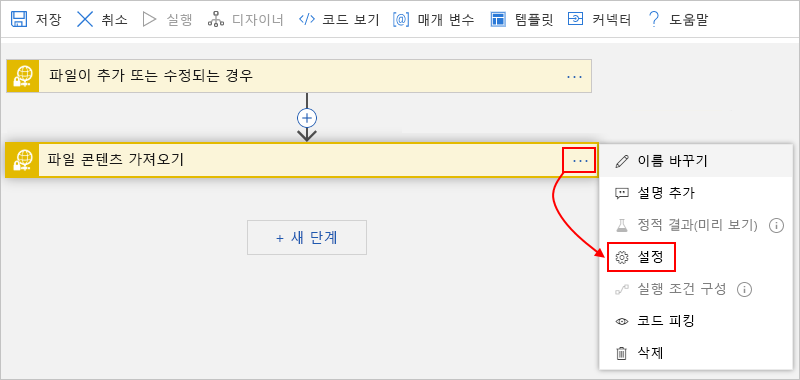

# SSH 및 Azure Logic Apps를 사용하여 SFTP 파일 모니터링, 만들기 및 관리

[SSH(Secure Shell)](https://www.ssh.com/ssh/protocol/) 프로토콜을 사용하여 [SFTP(보안 파일 전송 프로토콜)](https://www.ssh.com/ssh/sftp/) 서버에서 파일을 모니터링, 만들기, 전송 및 수신하는 작업을 자동화하려면 Azure Logic Apps 및 SFTP-SSH 커넥터를 사용하여 통합 워크플로를 빌드하고 자동화할 수 있습니다. SFTP는 신뢰할 수 있는 데이터 스트림을 통해 파일 액세스, 파일 전송 및 파일 관리를 제공하는 네트워크 프로토콜입니다. 다음은 자동화할 수 있는 몇 가지 예제 작업입니다.

* 파일이 추가되거나 변경될 때 모니터링합니다.
* 파일 가져오기/만들기/복사/이름 바꾸기/업데이트/나열/삭제를 수행합니다.
* 폴더를 만듭니다.
* 파일 콘텐츠 및 메타데이터를 가져옵니다.
* 보관을 폴더로 추출합니다.

SFTP 서버에서 이벤트를 모니터링하는 트리거를 사용하고 다른 작업에서 출력을 사용하도록 할 수 있습니다. SFTP 서버에서 다양한 작업을 수행하는 작업을 사용할 수 있습니다. 또한 논리 앱의 다른 작업에서 SFTP 작업의 출력을 사용하도록 할 수 있습니다. 예를 들어 정기적으로 SFTP 서버에서 파일을 검색하는 경우 Office 365 Outlook 커넥터 또는 Outlook.com 커넥터를 사용하여 해당 파일 및 해당 콘텐츠에 대한 이메일 경고를 보낼 수 있습니다. 로직 앱을 새로 접하는 경우 [Azure 논리 앱이란 무엇입니까?](../logic-apps/logic-apps-overview.md)

SFTP-SSH 커넥터와 SFTP 커넥터 간의 차이점에 대해 이 항목의 후반부에서 [SFTP-SSH 비교](#comparison) 섹션을 검토하십시오.

## 제한

* [청크를](../logic-apps/logic-apps-handle-large-messages.md) 지원하는 SFTP-SSH 작업은 최대 1GB의 파일을 처리할 수 있으며 청크를 지원하지 않는 SFTP-SSH 작업은 최대 50MB의 파일을 처리할 수 있습니다. 기본 청크 크기는 15MB이지만 이 크기는 네트워크 대기 시간, 서버 응답 시간 등의 요인에 따라 5MB에서 시작하여 점차 적으로 50MB 최대값으로 증가하여 동적으로 변경될 수 있습니다.

  > [!NOTE]
  > [통합 서비스 환경(ISE)의](../logic-apps/connect-virtual-network-vnet-isolated-environment-overview.md)논리 앱의 경우 이 커넥터의 ISE 레이블이 지정된 버전은 [ISE 메시지 제한을](../logic-apps/logic-apps-limits-and-config.md#message-size-limits) 대신 사용합니다.

  대신 사용할 [상수 청크 크기를 지정할](#change-chunk-size) 때 이 적응 동작을 재정의할 수 있습니다. 이 크기는 5MB에서 50MB까지 다양합니다. 예를 들어 45MB 파일과 대기 시간 없이 해당 파일 크기를 지원할 수 있는 네트워크가 있다고 가정합니다. 적응 청크는 한 번의 호출이 아닌 여러 호출로 이릅니다. 호출 수를 줄이려면 50MB 청크 크기를 설정해 볼 수 있습니다. 다른 시나리오에서 논리 앱이 시간 초과인 경우(예: 15MB 청크를 사용하는 경우) 크기를 5MB로 줄일 수 있습니다.

  청크 크기는 연결과 연결되어 있으므로 청크를 지원하는 작업과 청크를 지원하지 않는 작업에 대해 동일한 연결을 사용할 수 있습니다. 이 경우 청크를 지원하지 않는 작업의 청크 크기는 5MB에서 50MB까지입니다. 이 표에서는 청크를 지원하는 SFTP-SSH 작업을 보여 주며 있습니다.

  | 작업 | 청크 지원 | 청크 크기 지원 재정의 |
  |--------|------------------|-----------------------------|
  | **파일 복사** | 예 | 해당 없음 |
  | **파일 만들기** | yes | yes |
  | **폴더 만들기** | 해당 없음 | 해당 없음 |
  | **파일 삭제** | 해당 없음 | 해당 없음 |
  | **폴더에 보관 추출** | 해당 없음 | 해당 없음 |
  | **파일 콘텐츠 가져오기** | yes | yes |
  | **경로를 사용하여 파일 콘텐츠 가져오기** | yes | yes |
  | **파일 메타데이터 가져오기** | 해당 없음 | 해당 없음 |
  | **경로를 사용하여 파일 메타데이터 가져오기** | 해당 없음 | 해당 없음 |
  | **폴더의 파일 나열** | 해당 없음 | 해당 없음 |
  | **파일 이름 바꾸기** | 해당 없음 | 해당 없음 |
  | **파일 업데이트** | 예 | 해당 없음 |
  ||||

* SFTP-SSH 트리거는 메시지 청크를 지원하지 않습니다. 파일 콘텐츠를 요청할 때 트리거는 15MB 이하의 파일만 선택합니다. 15MB보다 큰 파일을 얻으려면 대신 이 패턴을 따르십시오.

  1. **파일이 추가되거나 수정된 경우(속성만 해당)와**같이 파일 속성만 반환하는 SFTP-SSH 트리거를 사용합니다.

  1. 전체 파일을 읽고 암시적으로 메시지 청크를 사용하는 SFTP-SSH **파일 콘텐츠** 작업으로 트리거를 따릅니다.

## SFTP-SSH와 SFTP 비교

다음은 SFTP-SSH 커넥터와 SFTP 커넥터 간의 다른 주요 차이점입니다. 여기에서 SFTP-SSH 커넥터는 다음과 같은 기능을 갖습니다.

* .NET을 지원하는 오픈 소스 보안 셸(SSH) 라이브러리인 [SSH.NET](https://github.com/sshnet/SSH.NET)라이브러리를 사용합니다.

* SFTP 서버의 지정된 경로에 폴더를 만드는 **폴더 만들기** 작업을 제공합니다.

* SFTP 서버의 파일 이름을 바꾸는 **파일 이름 바꾸기** 작업을 제공합니다.

* *최대 1시간 동안* SFTP 서버에 대한 연결을 캐시합니다. 그러면 서버에 대한 연결에서 시도 수가 감소하며 성능이 개선됩니다. 이 캐싱 동작에 대한 기간을 설정하려면 SFTP 서버의 SSH 구성에서 [**ClientAliveInterval**](https://man.openbsd.org/sshd_config#ClientAliveInterval) 속성을 편집합니다.

## 사전 요구 사항

* Azure 구독 Azure 구독이 없는 경우 [체험 Azure 계정에 등록](https://azure.microsoft.com/free/)합니다.

* 논리 앱에서 SFTP 계정에 액세스하도록 하는 SFTP 서버 주소 및 계정 자격 증명 SSH 프라이빗 키 및 SSH 프라이빗 키 암호에 대한 액세스도 필요합니다. 대용량 파일을 업로드할 때 청크를 사용하려면 SFTP 서버의 루트 폴더에 대한 읽기 및 쓰기 권한이 모두 필요합니다. 그렇지 않으면 "401 무단" 오류가 발생합니다.

  > [!IMPORTANT]
  >
  > SFTP-SSH 커넥터는 이러한 프라이빗 키 형식, 알고리즘 및 지문*만*을 지원합니다.
  >
  > * **개인 키 형식**: RSA (리베스트 샤미르 Adleman) 및 DSA (디지털 서명 알고리즘) 오픈시 및 ssh.com 형식 모두에서 키. 개인 키가 PuTTY(.ppk) 파일 형식인 경우 먼저 [키를 OpenSSH(.pem) 파일 형식으로 변환합니다.](#convert-to-openssh)
  >
  > * **암호화 알고리즘**: DES-EDE3-CBC, DES-EDE3-CFB, DES-CBC, AES-128-CBC, AES-192-CBC 및 AES-256-CBC
  >
  > * **지문**: MD5
  >
  > 논리 앱에 SFTP-SSH 트리거 또는 작업을 추가한 후 SFTP 서버에 대한 연결 정보를 제공해야 합니다. 이 연결에 대해 SSH 개인 키를 제공할 때 연결실패의 원인이 될 수 있는 ***키를 수동으로 입력하거나 편집하지 마십시오.*** 대신 SSH 개인 키 파일에서 ***키를 복사하고*** 해당 키를 연결 세부 정보에 ***붙여 넣습니다.*** 
  > 자세한 내용은 이 문서의 후반부 [SSH가 있는 SFTP 연결](#connect) 섹션을 참조하십시오.

* [논리 앱을 만드는 방법에](../logic-apps/quickstart-create-first-logic-app-workflow.md) 대한 기본 지식

* SFTP 계정에 액세스하려는 논리 앱입니다. SFTP-SSH 트리거를 시작하려면 [빈 논리 앱을 만듭니다](../logic-apps/quickstart-create-first-logic-app-workflow.md). SFTP-SSH 작업을 사용하려면 예를 들어 **되풀이** 트리거 같은 다른 트리거를 통해 논리 앱을 시작합니다.

## SFTP-SSH 트리거작동 방식

SFTP-SSH는 SFTP 파일 시스템을 폴링하고 마지막 폴링 이후 변경된 파일을 찾아서 작동을 트리거합니다. 일부 도구를 통해 파일을 변경하는 경우 타임스탬프를 유지할 수 있습니다. 이러한 경우 트리거가 작동할 수 있도록 이 기능을 사용하지 않도록 설정해야 합니다. 아래에는 몇 가지 일반적인 설정이 나와 있습니다.

| SFTP 클라이언트 | 작업 |
|-------------|--------|
| Winscp | **옵션** > **환경 설정으로** > 이동**전송** > **편집** > 보존**타임스탬프** > **비활성화** |
| FileZilla | **전송된 파일의** > 타임스탬프 **유지** > 로 이동**사용 안 함** |
|||

트리거는 새 파일을 찾으면 해당 파일이 완전한 상태이며 부분적으로 작성된 것이 아닌지 확인합니다. 예를 들어 트리거가 파일 서버를 확인할 때 파일을 변경하는 중일 수 있습니다. 부분적으로 작성된 파일이 반환되지 않도록 하기 위해 트리거는 최근 변경된 내용이 있는 파일의 타임스탬프를 기록하되 해당 파일을 즉시 반환하지는 않으며, 서버를 다시 폴링할 때만 해당 파일을 반환합니다. 이 동작으로 인해 트리거 폴링 간격의 최대 2배까지 지연이 발생하는 경우도 있습니다.

## PuTTY 기반 키를 OpenSSH로 변환

개인 키가 .ppk (PuTTY 개인 키) 파일 이름 확장명을 사용하는 PuTTY 형식인 경우 먼저 .pem (개인 정보 강화 메일) 파일 이름 확장명을 사용하는 OpenSSH 형식으로 키를 변환합니다.

### 유닉스 기반 OS

1. PuTTY 도구가 시스템에 아직 설치되어 있지 않은 경우 다음과 같은 작업을 수행하십시오.

   `sudo apt-get install -y putty`

1. SFTP-SSH 커넥터에서 사용할 수 있는 파일을 만드는 이 명령을 실행합니다.

   `puttygen <path-to-private-key-file-in-PuTTY-format> -O private-openssh -o <path-to-private-key-file-in-OpenSSH-format>`

   예를 들어:

   `puttygen /tmp/sftp/my-private-key-putty.ppk -O private-openssh -o /tmp/sftp/my-private-key-openssh.pem`

### Windows OS

1. 아직 다운로드하지 않은 경우 [최신 PuTTY 생성기(puttygen.exe) 도구를 다운로드한](https://www.chiark.greenend.org.uk/~sgtatham/putty/latest.html)다음 도구를 실행하십시오.

1. 이 화면에서 **로드를**선택합니다.

   

1. PuTTY 형식으로 개인 키 파일을 찾아보고 **열기를**선택합니다.

1. **변환** 메뉴에서 **OpenSSH 내보내기 키를**선택합니다.

   

1. 파일 이름 확장명으로 `.pem` 개인 키 파일을 저장합니다.

## SSH를 사용하여 SFTP에 연결

[!INCLUDE [Create connection general intro](../../includes/connectors-create-connection-general-intro.md)]

1. [Azure Portal](https://portal.azure.com)에 로그인하고, 아직 열리지 않은 경우 Logic App Designer에서 논리 앱을 엽니다.

1. 빈 논리 앱의 경우 검색 `sftp ssh` 상자에 필터로 입력합니다. 트리거 목록에서 원하는 트리거를 선택합니다.

   또는

   기존 논리 앱의 경우 작업을 추가할 마지막 단계에서 **새 단계를**선택합니다. 검색 상자에서 필터로 `sftp ssh`을 입력합니다. 작업 목록에서 원하는 작업을 선택합니다.

   단계 사이에서 작업을 추가하려면 단계 사이에 있는 화살표 위로 포인터를 이동합니다. 표시되는 더하기**+** 기호 ()를 선택한 다음 **작업 추가를**선택합니다.

1. 연결에 필요한 정보를 입력합니다.

   > [!IMPORTANT]
   >
   > **SSH 프라이빗 키** 속성에 SSH 프라이빗 키를 입력할 때 이 속성에 대한 완전하고 올바른 값을 제공하는 데 도움이 되는 다음 추가 단계를 수행합니다. 잘못된 키로 인해 연결 실패가 발생합니다.

   모든 텍스트 편집기를 사용할 수 있지만 예를 들어 Notepad.exe를 사용하여 키를 올바르게 복사하고 붙여넣는 방법을 보여주는 샘플 단계는 다음과 같습니다.

   1. 텍스트 편집기에서 SSH 프라이빗 키 파일을 엽니다. 이러한 단계는 예제로 메모장을 사용합니다.

   1. 메모장 **편집** 메뉴에서 **모두 선택을**선택합니다.

   1. **복사** **편집을** > 선택합니다.

   1. 추가한 SFTP-SSH 트리거 또는 작업에서 **SSH 프라이빗 키** 속성으로 복사한 *전체* 키를 붙여넣습니다. 이는 여러 줄을 지원합니다.  키를 ***붙여넣었는지 확인합니다***. ***키를 수동으로 입력하거나 편집하지 마십시오***.

1. 연결 세부 정보 입력이 완료되면 **에서 만들기를**선택합니다.

1. 이제 선택한 트리거 또는 작업에 대해 필요한 세부 정보를 제공하고 논리 앱의 워크플로를 계속 빌드합니다.

## 청크 크기 재정의

청크가 사용하는 기본 적응 동작을 재정의하려면 5MB에서 50MB까지 상수 청크 크기를 지정할 수 있습니다.

1. 작업의 오른쪽 위 모서리에서 타원**단추(...)를**선택한 다음 **설정을**선택합니다.

   

1. **콘텐츠 전송**에서 **Chunk 크기** 속성에서 에서 부터 `5` 에 `50`정수 값을 입력합니다. 

   

1. 완료되면 **완료**를 선택합니다.

## 예

### SFTP - SSH 트리거: 파일이 추가되거나 수정되는 경우

이 트리거는 SFTP 서버에서 파일이 추가되거나 변경되는 경우 논리 앱 워크플로를 시작합니다. 예를 들어 콘텐츠가 지정된 조건을 충족하는지 여부에 따라 파일의 콘텐츠를 확인하고 콘텐츠를 가져오는 조건을 추가할 수 있습니다. 그런 다음, 파일의 콘텐츠를 가져오고 해당 콘텐츠를 SFTP 서버의 폴더에 넣는 작업을 추가할 수 있습니다.

**엔터프라이즈 예제**: 이 트리거를 사용하여 고객의 주문을 나타내는 새 파일에 대한 SFTP 폴더를 모니터링할 수 있습니다. 그런 다음, **파일 콘텐츠 가져오기**와 같은 SFTP 작업을 사용할 수 있으므로 추가로 처리할 주문의 콘텐츠를 가져오고 주문 데이터베이스에 해당 주문을 저장합니다.

### SFTP - SSH 액션: 경로를 사용하여 콘텐츠 받기

이 작업은 SFTP 서버의 파일에서 콘텐츠를 가져옵니다. 따라서 예를 들어 이전 예제의 트리거와 파일의 콘텐츠가 충족해야 하는 조건을 추가할 수 있습니다. 조건이 true인 경우 콘텐츠를 가져오는 작업을 실행할 수 있습니다.

## 커넥터 참조

커넥터의 Swagger 파일에 설명된 트리거, 작업 및 제한과 같은 이 커넥터에 대한 자세한 내용은 [커넥터의 참조 페이지를](https://docs.microsoft.com/connectors/sftpwithssh/)참조하십시오.

> [!NOTE]
> [통합 서비스 환경(ISE)의](../logic-apps/connect-virtual-network-vnet-isolated-environment-overview.md)논리 앱의 경우 이 커넥터의 ISE 레이블이 지정된 버전은 [ISE 메시지 제한을](../logic-apps/logic-apps-limits-and-config.md#message-size-limits) 대신 사용합니다.

## 다음 단계

* 다른 [Logic Apps 커넥터](../connectors/apis-list.md)에 대해 알아봅니다.
