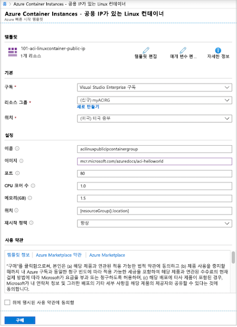
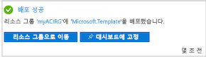
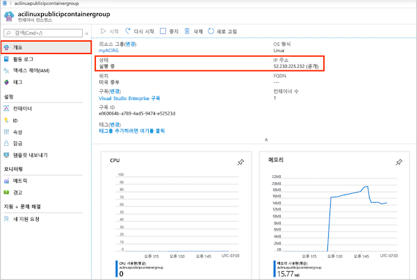
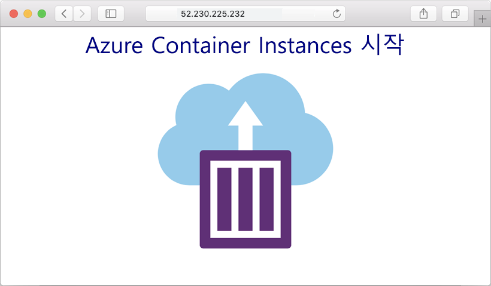
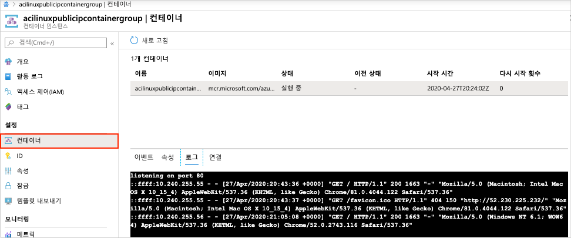

# 빠른 시작: Resource Manager 템플릿을 사용하여 Azure에서 컨테이너 인스턴스 배포

Azure Container Instances를 사용하여 Azure에서 서버리스 Docker 컨테이너를 간단하고 빠르게 실행합니다. Azure Kubernetes Service와 같은 풀 컨테이너 오케스트레이션 플랫폼이 필요하지 않을 경우 애플리케이션을 요청 시 컨테이너 인스턴스에 배포합니다. 이 빠른 시작에서는 Azure Resource Manager 템플릿을 사용하여 격리된 Docker 컨테이너를 배포하고 해당 웹 애플리케이션을 공용 IP 주소로 사용 가능하게 합니다.

[!INCLUDE [About Azure Resource Manager](../../includes/resource-manager-quickstart-introduction.md)]

Azure 구독이 아직 없는 경우 시작하기 전에 [체험](https://azure.microsoft.com/free/) 계정을 만듭니다.

## 사전 요구 사항

없음

## 컨테이너 인스턴스 만들기

### 템플릿 검토

이 빠른 시작에 사용되는 템플릿은 [Azure 빠른 시작 템플릿](https://azure.microsoft.com/resources/templates/101-aci-linuxcontainer-public-ip/)에서 나온 것입니다.

:::code language="json" source="~/quickstart-templates/101-aci-linuxcontainer-public-ip/azuredeploy.json" range="1-107" highlight="61-100":::

템플릿에 다음 리소스가 정의되어 있습니다.

* **[Microsoft.ContainerInstance/containerGroups](/azure/templates/microsoft.containerinstance/containergroups)** : Azure 컨테이너 그룹을 만듭니다. 이 템플릿은 단일 컨테이너 인스턴스로 구성된 그룹을 정의합니다.

더 많은 Azure Container Instances 템플릿 샘플은 [빠른 시작 템플릿 갤러리](https://azure.microsoft.com/resources/templates/?resourceType=Microsoft.Containerinstance&pageNumber=1&sort=Popular)에서 찾을 수 있습니다.

### 템플릿 배포

 1. 다음 이미지를 선택하고 Azure에 로그인하여 템플릿을 엽니다. 템플릿은 다른 위치에 레지스트리와 복제본을 만듭니다.

    

 2. 다음 값을 선택하거나 입력합니다.

    * **구독**: Azure 구독을 선택합니다.
    * **리소스 그룹**: **새로 만들기**를 선택하고 리소스 그룹에 고유한 이름을 입력한 다음, **확인**을 선택합니다.
    * **위치**: 리소스 그룹에 대한 위치를 선택합니다. 예제: **미국 중부**
    * **이름**: 인스턴스에 대해 생성된 이름을 적용하거나 이름을 입력합니다.
    * **이미지**: 기본 이미지 이름을 그대로 적용합니다. 이 샘플 Linux 이미지는 고정 HTML 페이지를 제공하는 Node.js로 작성된 작은 웹앱을 패키징합니다. 

    나머지 속성에 대해 기본값을 그대로 적용합니다.

    사용 약관을 검토합니다. 동의하는 경우 **위에 명시된 사용 약관에 동의함**을 선택합니다.

    

 3. 인스턴스가 성공적으로 만들어지면 다음과 같이 알림을 받게 됩니다.

    

 Azure Portal은 템플릿을 배포하는데 사용됩니다. Azure Portal 외에도 Azure PowerShell, Azure CLI 및 REST API를 사용할 수 있습니다. 다른 배포 방법을 알아보려면 [템플릿 배포](../azure-resource-manager/templates/deploy-cli.md)를 참조하세요.

## 배포된 리소스 검토

Azure Portal 또는 [Azure CLI](container-instances-quickstart.md)와 같은 도구를 사용하여 컨테이너 인스턴스의 속성을 검토합니다.

1. 포털에서 Container Instances를 검색하고, 생성한 컨테이너 인스턴스를 선택합니다.

1. **개요** 페이지에서 인스턴스의 **상태** 및 해당 **IP 주소**를 확인합니다.

    

2. 상태가 *실행 중*이면 브라우저에서 IP 주소로 이동합니다. 

    

### 컨테이너 로그 보기

컨테이너 또는 컨테이너가 실행되는 애플리케이션 문제를 해결할 때 컨테이너 인스턴스의 로그를 살펴보면 도움이 됩니다.

컨테이너의 로그를 보려면 **설정** 아래에서 **컨테이너** > **로그**를 선택합니다. 브라우저에서 애플리케이션을 살펴볼 때 생성된 HTTP GET 요청이 보일 것입니다.

## 리소스 정리

컨테이너 작업을 마친 후에는 컨테이너 인스턴스에 대한 **개요** 페이지에서 **삭제**를 선택합니다. 메시지가 표시되면 삭제를 확인합니다.

## 다음 단계

이 빠른 시작에서는 공용 Microsoft 이미지에서 Azure 컨테이너 인스턴스를 만들었습니다. 컨테이너 이미지를 빌드하고 프라이빗 Azure 컨테이너 레지스트리에서 배포하려면 Azure Container Instances 자습서로 계속 진행하세요.

> [!div class="nextstepaction"]
> [자습서: Azure Container Instances에 배포할 컨테이너 이미지 만들기](./container-instances-tutorial-prepare-app.md)

템플릿을 만드는 과정을 안내하는 단계별 자습서는 다음을 참조하세요.

> [!div class="nextstepaction"]
> [자습서: 첫 번째 Azure Resource Manager 템플릿을 만들고 배포](../azure-resource-manager/templates/template-tutorial-create-first-template.md)