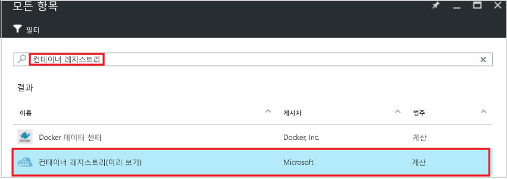
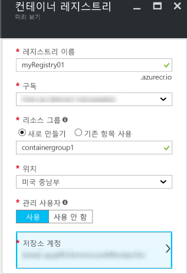
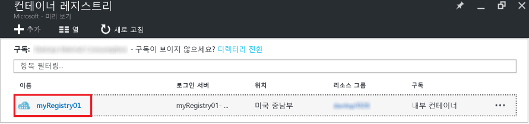
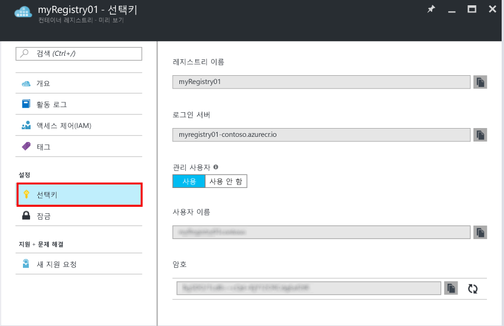

# Azure Portal을 사용하여 컨테이너 레지스트리 만들기
Azure Portal을 사용하여 컨테이너 레지스트리를 만들고 설정을 관리합니다. [Azure CLI 2.0 미리 보기 명령](container-registry-get-started-azure-cli.md)을 사용하여 또는 Container Registry [REST API](https://go.microsoft.com/fwlink/p/?linkid=834376)를 사용하여 프로그래밍 방식으로 컨테이너 레지스트리를 만들고 관리할 수도 있습니다.

백그라운드 및 개념은 [Azure Container Registry란?](container-registry-intro.md)을 참조하세요.

> [!NOTE]
> Container Registry는 현재 미리 보기 상태입니다.

## 컨테이너 레지스트리 만들기
1. [포털](https://portal.azure.com)에서 **+ 새로 만들기**를 클릭합니다.
2. **컨테이너 레지스트리**에 대한 마켓플레이스를 검색합니다.
3. 게시자가 **Microsoft**인 **Container Registry(미리 보기)**를 선택합니다. 
    
4. **만들기**를 클릭합니다. **Container Registry** 블레이드가 표시됩니다.

    
5. **Container Registry** 블레이드에서 다음 정보를 입력합니다. 완료하면 **만들기**를 클릭합니다.
   
    a. **레지스트리 이름** - 특정 레지스트리에 대한 전역적으로 고유한 최상위 도메인 이름입니다. 이 예제의 경우 레지스트리 이름이 *myRegistry01*이지만 자신만의 고유한 이름으로 대체합니다. 이름은 문자와 숫자만 포함할 수 있습니다.
   
    b. **리소스 그룹** - 기존 [리소스 그룹](../azure-resource-manager/resource-group-overview.md#resource-groups)을 선택하거나 새 리소스 그룹의 이름을 입력합니다. 
   
    c. **위치** - **미국 중남부**와 같이 서비스를 [사용할 수 있는](https://azure.microsoft.com/regions/services/) Azure 데이터 센터 위치를 선택합니다. 
   
    d. **관리 사용자** - 필요한 경우 관리 사용자가 레지스트리에 액세스할 수 있도록 설정합니다. 이 설정은 레지스트리를 만든 후에 변경할 수 있습니다.
   
   > [!IMPORTANT]
   > 관리 사용자 계정을 통해 액세스를 제공하는 것 외에, 컨테이너 레지스트리는 Azure Active Directory 서비스 주체에 의해 지원되는 인증을 지원합니다. 자세한 내용 및 고려 사항은 [컨테이너 레지스트리로 인증](container-registry-authentication.md)을 참조하세요.
   
    e. **저장소 계정** - 기본 설정을 사용하여 [저장소 계정](../storage/storage-introduction.md)을 만들거나 동일한 위치에서 기존 저장소 계정을 선택합니다. 프리미엄 및 기본 저장소 계정은 지원되지 않습니다.

## 레지스트리 설정 관리
레지스트리를 만든 후 포털의 **Container Registry** 블레이드를 시작하여 레지스트리 설정을 찾습니다. 예를 들어 레지스트리에 로그인하기 위해 설정이 필요하거나 관리 사용자를 사용하거나 사용하지 않도록 설정할 수 있습니다.

1. **Container Registry** 블레이드에서 레지스트리의 이름을 클릭합니다.
   
    
2. 액세스 설정을 관리하려면 **액세스 키**를 클릭합니다.
   
    
3. 다음 설정에 유의하세요.
   
   * **로그인 서버** - 레지스트리에 로그인하기 위해 사용하는 정규화된 이름입니다. 이 예제에서는 `myregistry01-contoso.azurecr.io`입니다.
   * **관리 사용자** - 레지스트리의 관리 사용자 계정을 사용하거나 사용하지 않도록 설정합니다.
   * **사용자 이름** 및 **암호** - 레지스트리에 로그인하는 데 사용할 수 있는 관리 사용자(사용하는 경우)의 자격 증명입니다. 암호는 선택적으로 다시 생성할 수 있습니다.

## 다음 단계
* [Docker CLI를 사용하여 첫 번째 이미지 푸시](container-registry-get-started-docker-cli.md)

<!--HONumber=Feb17_HO2-->

