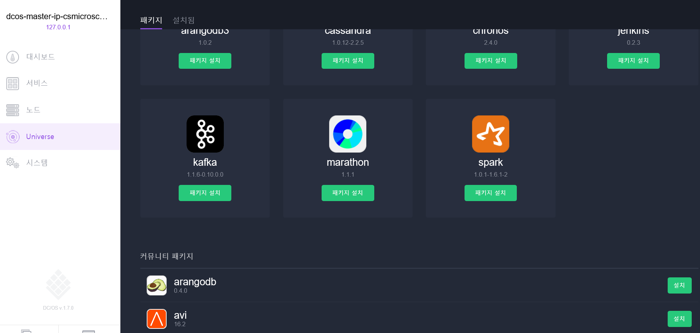
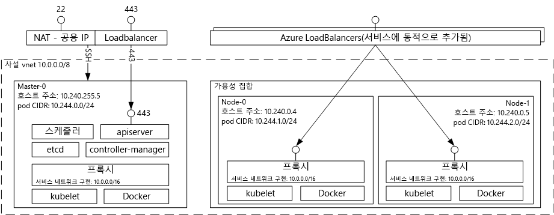

# (사용되지 않음) Azure Container Service를 사용한 Docker 컨테이너 호스팅 솔루션 소개 

[!INCLUDE [ACS deprecation](../../../includes/container-service-deprecation.md)]

Azure 컨테이너 서비스를 사용하면 컨테이너화된 애플리케이션을 실행하는 미리 구성된 가상 머신의 클러스터를 보다 간편하게 만들고 구성하고 관리할 수 있습니다. Azure 컨테이너 서비스는 일반적인 오픈 소스 예약 및 오케스트레이션 도구의 최적화된 구성을 사용합니다. 이를 통해 기존 기술을 사용하거나 크고 확장된 커뮤니티 전문 지식의 본문을 이용하여 Microsoft Azure의 컨테이너 기반 애플리케이션을 배포하고 관리할 수 있습니다.

Azure 컨테이너 서비스는 Docker 컨테이너 형식을 활용하여 애플리케이션 컨테이너가 완전히 이식 가능한지 확인합니다. 또한 Marathon 및 DC/OS, Docker Swarm 또는 Kubernetes 중에서 선택하여 이러한 애플리케이션을 수천 또는 수만 개의 컨테이너로 확장할 수 있습니다.

Azure 컨테이너 서비스를 사용하면 오케스트레이션 계층의 이식성을 포함하여 애플리케이션 이식성을 유지하면서 Azure의 엔터프라이즈급 기능을 활용할 수 있습니다.

## Azure 컨테이너 서비스 사용
Azure 컨테이너 서비스를 사용하는 우리의 목표는 현재 우리 고객들 사이에서 인기 있는 오픈 소스 도구 및 기술을 사용하여 컨테이너 호스팅 환경을 제공하는 것입니다. 이를 위해 사용자가 선택한 Orchestrator에 대한 표준 API 엔드포인트를 노출합니다(DC/OS, Docker Swarm 또는 Kubernetes). 이러한 엔드포인트를 사용하면 해당 엔드포인트와 통신할 수 있는 모든 소프트웨어를 활용할 수 있습니다. 예를 들어 Docker Swarm 엔드포인트의 경우 Docker CLI(명령줄 인터페이스)를 사용하도록 선택할 수 있고 DC/OS의 경우 DCOS CLI를 선택할 수 있습니다. Kubernetes의 경우 `kubectl`을 선택할 수 있습니다.

## Azure 컨테이너 서비스를 사용하여 Docker 클러스터 만들기
Azure Container Service를 사용하기 시작하려면 포털을 통해(**Azure Container Service**에 대한 Marketplace 검색) Azure Resource Manager 템플릿([Docker Swarm](https://github.com/Azure/azure-quickstart-templates/tree/master/101-acs-swarm), [DC/OS](https://github.com/Azure/azure-quickstart-templates/tree/master/101-acs-dcos) 또는 [Kubernetes](https://github.com/Azure/azure-quickstart-templates/tree/master/101-acs-kubernetes))을 사용하거나 [Azure CLI](container-service-create-acs-cluster-cli.md)를 사용하여 Azure Container Service 클러스터를 배포합니다. 추가 또는 고급 Azure 구성을 포함하도록 제공된 빠른 시작 템플릿을 수정할 수 있습니다. 자세한 내용은 [Azure Container Service 클러스터 배포](container-service-deployment.md)를 참조하세요.

## 애플리케이션 배포
Azure Container Service는 오케스트레이션을 위해 Docker Swarm, DC/OS 또는 Kubernetes 옵션을 제공합니다. 애플리케이션을 배포하는 방법은 선택한 Orchestrator에 따라 달라집니다.

### DC/OS 사용
DC/OS는 Apache Mesos 분산 시스템 커널을 기반으로 운영 체제를 배포합니다. Apache Mesos는 Apache Software Foundation에 들어있고 [IT 업계에서 가장 유명한 기업](https://mesos.apache.org/documentation/latest/powered-by-mesos/) 일부를 사용자 및 참가자로 나열합니다.

DC/OS 및 Apache Mesos는 다음과 같은 인상적인 기능 집합을 포함합니다.

* 입증된 확장성
* Apache ZooKeeper를 사용하는 내결함성 있는 복제된 기본 및 보조 항목
* Docker 형식의 컨테이너에 대한 지원
* Linux 컨테이너를 사용하여 작업 간에 네이티브 격리
* 다중 리소스 예약(메모리, CPU, 디스크 및 포트)
* 새로운 병렬 애플리케이션을 개발하기 위한 Java, Python 및 C++ API
* 클러스터 상태를 볼 수 있는 웹 UI

기본적으로 Azure 컨테이너 서비스에서 실행 중인 DC/OS에는 워크로드를 예약하기 위한 Marathon 오케스트레이션 플랫폼이 포함되어 있습니다. 그러나 ACS의 DC/OS 배포에는 서비스에 추가할 수 있는 서비스의 Mesosphere Universe가 포함되어 있습니다. Universe의 서비스에는 Spark, Hadoop, Cassandra 등이 포함되어 있습니다.

#### Marathon 사용
Marathon은 cgroups의 서비스 또는 Docker 형식의 컨테이너(Azure 컨테이너 서비스의 경우)에 대한 클러스터 전체 초기화 및 제어 시스템입니다. Marathon은 애플리케이션을 배포할 수 있는 웹 UI를 제공합니다. `http://DNS_PREFIX.REGION.cloudapp.azure.com`처럼 표시되는 URL에서 여기에 액세스할 수 있습니다.
여기서 DNS\_PREFIX 및 REGION은 둘 다 배포 시 정의됩니다. 물론, 사용자는 자체 DNS 이름을 제공할 수도 있습니다. Marathon 웹 UI를 사용하여 컨테이너를 실행하는 방법에 대한 자세한 내용은 [Marathon 웹 UI를 통한 DC/OS 컨테이너 관리](container-service-mesos-marathon-ui.md)를 참조하세요.

또한 Marathon과 통신하기 위해 REST API를 사용할 수 있습니다. 각 도구에 사용할 수 있는 여러 클라이언트 라이브러리가 있습니다. 이러한 라이브러리는 다양한 언어를 지원할 뿐만 아닐라 모든 언어로 된 HTTP 프로토콜을 사용할 수 있습니다. 또한 인기 있는 다양한 DevOps 도구는 Marathon에 대한 지원을 제공합니다. Azure 컨테이너 서비스 클러스터를 사용하여 작업하는 경우 운영 팀에 최대의 유연성을 제공합니다. Marathon REST API를 사용하여 컨테이너를 실행하는 방법에 대한 자세한 내용은 [Marathon REST API를 통한 DC/OS 컨테이너 관리](container-service-mesos-marathon-rest.md)를 참조하세요.

### Docker Swarm 사용
Docker Swarm은 Docker에 대한 네이티브 클러스터링을 제공합니다. Docker Swarm은 표준 Docker API를 준수하므로 이미 Docker 데몬과 통신하는 모든 도구에서 Swarm을 사용하여 Azure 컨테이너 서비스의 여러 호스트에 대해 투명하게 크기를 조정할 수 있습니다.

[!INCLUDE [container-service-swarm-mode-note](../../../includes/container-service-swarm-mode-note.md)]

Swarm 클러스터의 컨테이너를 관리하기 위해 지원된 도구를 포함하지만 다음으로 제한되지 않습니다.

* Dokku
* Docker CLI 및 Docker Compose
* Krane
* Jenkins

### Kubernetes 사용
Kubernetes는 인기 있는 프로덕션급 오픈 소스 컨테이너 오케스트레이터 도구입니다. Kubernetes는 컨테이너화된 애플리케이션의 배포, 크기 조정 및 관리를 자동화합니다. Kubernetes는 오픈 소스 솔루션이며 오픈 소스 커뮤니티에서 구동하므로 Azure Container Service에서 원활하게 실행되며 이 서비스에서 컨테이너를 대규모로 배포하는 데 사용할 수 있습니다.

여기에는 다음과 같이 풍부한 기능들이 포함되어 있습니다.
* 수평적 크기 조정
* 서비스 검색 및 부하 분산
* 비밀 및 구성 관리
* API 기반 자동화된 롤아웃 및 롤백
* 자동 복구

## 동영상
Azure Container Service 시작(101):  

> [!VIDEO https://channel9.msdn.com/Shows/Azure-Friday/Azure-Container-Service-101/player]
>
>

Azure Container Service를 사용하여 애플리케이션 빌드(빌드 2016)

> [!VIDEO https://channel9.msdn.com/Events/Build/2016/B822/player]
>
>

## 다음 단계

[포털](container-service-deployment.md) 또는 [Azure CLI](container-service-create-acs-cluster-cli.md)를 사용하여 컨테이너 서비스 클러스터를 배포합니다.
