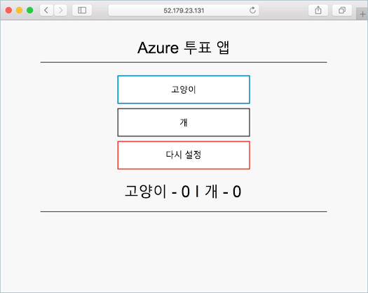

# <a name="deprecated-deploy-kubernetes-cluster-for-linux-containers"></a>(사용되지 않음) Linux 컨테이너용 Kubernetes 클러스터 배포

> [!TIP]
> Azure Kubernetes Service를 사용하는 이 빠른 시작의 업데이트된 버전은 [빠른 시작: AKS(Azure Kubernetes Service) 클러스터 배포](../../aks/kubernetes-walkthrough.md)를 참조하세요.

[!INCLUDE [ACS deprecation](../../../includes/container-service-kubernetes-deprecation.md)]

이 빠른 시작에서는 Azure CLI를 사용하여 Kubernetes 클러스터가 배포됩니다. 웹 프런트 엔드 및 Redis 인스턴스로 구성된 다중 컨테이너 애플리케이션이 클러스터에 배포되어 실행됩니다. 완료되면 인터넷을 통해 애플리케이션에 액세스할 수 있습니다. 

이 문서에서 사용된 애플리케이션은 Python으로 작성되었습니다. 여기에 상세하게 설명된 개념 및 단계는 Kubernetes 클러스터에 컨테이너 이미지를 배포하는 데 사용할 수 있습니다. 이 프로젝트와 관련된 코드, Dockerfile 및 사전 생성된 Kubernetes 매니페스트 파일은 [GitHub](https://github.com/Azure-Samples/azure-voting-app-redis.git)에 있습니다.



이 빠른 시작에서는 Kubernetes 개념에 대한 기본적인 이해가 있다고 가정하며 Kubernetes에 대한 자세한 정보는 [Kubernetes 설명서]( https://kubernetes.io/docs/home/)를 참조하세요.

Azure 구독이 아직 없는 경우 시작하기 전에 [체험 계정](https://azure.microsoft.com/free/?WT.mc_id=A261C142F)을 만듭니다.

[!INCLUDE [cloud-shell-try-it.md](../../../includes/cloud-shell-try-it.md)]

CLI를 로컬로 설치하여 사용하도록 선택한 경우 이 빠른 시작에서 Azure CLI 버전 2.0.4 이상을 실행해야 합니다. `az --version`을 실행하여 버전을 찾습니다. 설치 또는 업그레이드가 필요한 경우, [Azure CLI 설치]( /cli/azure/install-azure-cli)를 참조하세요. 

## <a name="create-a-resource-group"></a>리소스 그룹 만들기

[az group create](/cli/azure/group#az-group-create) 명령을 사용하여 리소스 그룹을 만듭니다. Azure 리소스 그룹은 Azure 리소스가 배포되고 관리되는 논리 그룹입니다. 

다음 예제에서는 *westeurope* 위치에 *myResourceGroup*이라는 리소스 그룹을 만듭니다.

```azurecli-interactive 
az group create --name myResourceGroup --location westeurope
```

출력:

```json
{
  "id": "/subscriptions/00000000-0000-0000-0000-000000000000/resourceGroups/myResourceGroup",
  "location": "westeurope",
  "managedBy": null,
  "name": "myResourceGroup",
  "properties": {
    "provisioningState": "Succeeded"
  },
  "tags": null
}
```

## <a name="create-kubernetes-cluster"></a>Kubernetes 클러스터 만들기

[az acs create](/cli/azure/acs#az-acs-create) 명령을 사용하여 Azure Container Service에서 Kubernetes 클러스터를 만듭니다. 다음 예제에서는 하나의 Linux 마스터 노드와 세 개의 Linux 에이전트 노드가 있는 *myK8sCluster*라는 클러스터를 만듭니다.

```azurecli-interactive 
az acs create --orchestrator-type kubernetes --resource-group myResourceGroup --name myK8sCluster --generate-ssh-keys
```

제한 평가판과 같이 Azure 구독의 Azure 리소스 액세스 권한이 제한되는 경우도 있습니다. 사용 가능한 코어 제한으로 인해 배포가 실패하는 경우 [az acs create](/cli/azure/acs#az-acs-create) 명령에 `--agent-count 1`을 추가하여 기본 에이전트 수를 줄이세요. 

몇 분 후 명령이 완료되고 클러스터에 대해 json으로 형식화된 정보가 반환됩니다. 

## <a name="connect-to-the-cluster"></a>클러스터에 연결

Kubernetes 클러스터를 관리하려면 Kubernetes 명령줄 클라이언트인 [kubectl](https://kubernetes.io/docs/user-guide/kubectl/)을 사용하세요. 

Azure Cloud Shell을 사용하는 경우 kubectl이 이미 설치되어 있습니다. 로컬로 설치하려면 [az acs kubernetes install-cli](/cli/azure/acs/kubernetes) 명령을 사용하면 됩니다.

Kubernetes 클러스터에 연결하도록 kubectl을 구성하려면 [az acs kubernetes get-credentials](/cli/azure/acs/kubernetes) 명령을 실행합니다. 이 단계에서는 자격 증명을 다운로드하고 Kubernetes CLI가 자격 증명을 사용하도록 구성합니다.

```azurecli-interactive 
az acs kubernetes get-credentials --resource-group=myResourceGroup --name=myK8sCluster
```

클러스터에 대한 연결을 확인하려면 [kubectl get](https://kubernetes.io/docs/reference/generated/kubectl/kubectl-commands#get) 명령을 사용하여 클러스터 노드 목록을 반환합니다.

```azurecli-interactive
kubectl get nodes
```

출력:

```bash
NAME                    STATUS                     AGE       VERSION
k8s-agent-14ad53a1-0    Ready                      10m       v1.6.6
k8s-agent-14ad53a1-1    Ready                      10m       v1.6.6
k8s-agent-14ad53a1-2    Ready                      10m       v1.6.6
k8s-master-14ad53a1-0   Ready,SchedulingDisabled   10m       v1.6.6
```

## <a name="run-the-application"></a>애플리케이션 실행

Kubernetes 매니페스트 파일은 어떤 컨테이너 이미지가 실행되는지 등과 같은 클러스터에 대해 원하는 상태를 정의합니다. 이 예제에서는 Azure Vote 애플리케이션을 실행하는 데 필요한 모든 개체를 만드는 데 매니페스트를 사용합니다. 

`azure-vote.yml`이라는 파일을 만들고 다음 YAML에 복사합니다. Azure Cloud Shell에서 작업하고 있는 경우 이 파일은 가상 또는 실제 시스템에서 작업하고 있는 것처럼 vi 또는 Nano를 사용하여 만들 수 있습니다.

```yaml
apiVersion: apps/v1beta1
kind: Deployment
metadata:
  name: azure-vote-back
spec:
  replicas: 1
  template:
    metadata:
      labels:
        app: azure-vote-back
    spec:
      containers:
      - name: azure-vote-back
        image: redis
        ports:
        - containerPort: 6379
          name: redis
---
apiVersion: v1
kind: Service
metadata:
  name: azure-vote-back
spec:
  ports:
  - port: 6379
  selector:
    app: azure-vote-back
---
apiVersion: apps/v1beta1
kind: Deployment
metadata:
  name: azure-vote-front
spec:
  replicas: 1
  template:
    metadata:
      labels:
        app: azure-vote-front
    spec:
      containers:
      - name: azure-vote-front
        image: microsoft/azure-vote-front:v1
        ports:
        - containerPort: 80
        env:
        - name: REDIS
          value: "azure-vote-back"
---
apiVersion: v1
kind: Service
metadata:
  name: azure-vote-front
spec:
  type: LoadBalancer
  ports:
  - port: 80
  selector:
    app: azure-vote-front
```

[kubectl create](https://kubernetes.io/docs/reference/generated/kubectl/kubectl-commands#create) 명령을 사용하여 애플리케이션을 실행합니다.

```azurecli-interactive
kubectl create -f azure-vote.yml
```

출력:

```bash
deployment "azure-vote-back" created
service "azure-vote-back" created
deployment "azure-vote-front" created
service "azure-vote-front" created
```

## <a name="test-the-application"></a>애플리케이션 테스트

애플리케이션을 실행하면 애플리케이션 프런트 엔드를 인터넷에 공개하는 [Kubernetes 서비스](https://kubernetes.io/docs/concepts/services-networking/service/)가 만들어집니다. 이 프로세스를 완료하는 데 몇 분이 걸릴 수 있습니다. 

진행 상태를 모니터링하려면 `--watch` 인수와 함께 [kubectl get service](https://kubernetes.io/docs/reference/generated/kubectl/kubectl-commands#get) 명령을 사용합니다.

```azurecli-interactive
kubectl get service azure-vote-front --watch
```

처음에는 *azure-vote-front* 서비스에 대한 **EXTERNAL-IP**가 *보류 중*으로 표시됩니다. EXTERNAL-IP 주소가 *보류 중*에서 *IP 주소*로 변경되면 `CTRL-C`를 사용하여 kubectl 조사식 프로세스를 중지합니다. 
  
```bash
azure-vote-front   10.0.34.242   <pending>     80:30676/TCP   7s
azure-vote-front   10.0.34.242   52.179.23.131   80:30676/TCP   2m
```

이제 외부 IP 주소로 이동하여 Azure Vote 앱을 볼 수 있습니다.

  

## <a name="delete-cluster"></a>클러스터 삭제
클러스터가 더 이상 필요하지 않으면 [az group delete](/cli/azure/group#az-group-delete) 명령을 사용하여 리소스 그룹, 컨테이너 서비스 및 모든 관련 리소스를 제거할 수 있습니다.

```azurecli-interactive 
az group delete --name myResourceGroup --yes --no-wait
```

## <a name="get-the-code"></a>코드 가져오기

이 빠른 시작에서는 Kubernetes 배포를 만드는 데 미리 생성된 컨테이너 이미지를 사용했습니다. 관련된 애플리케이션 코드, Dockerfile 및 Kubernetes 매니페스트 파일을 GitHub에서 사용할 수 있습니다.

[https://github.com/Azure-Samples/azure-voting-app-redis](https://github.com/Azure-Samples/azure-voting-app-redis.git)

## <a name="next-steps"></a>다음 단계

이 빠른 시작에서는 Kubernetes 클러스터를 배포하고, 이 클러스터에 다중 컨테이너 애플리케이션을 배포했습니다. 

Azure Container Service에 대해 자세히 알아보고 배포 예제에 대한 전체 코드를 연습해 보려면Kubernetes 클러스터 자습서를 계속 진행합니다.

> [!div class="nextstepaction"]
> [ACS Kubernetes 클러스터 관리](./container-service-tutorial-kubernetes-prepare-app.md)
