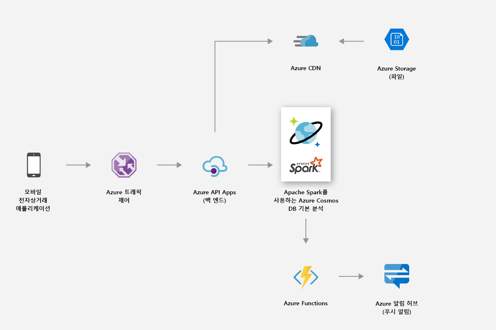
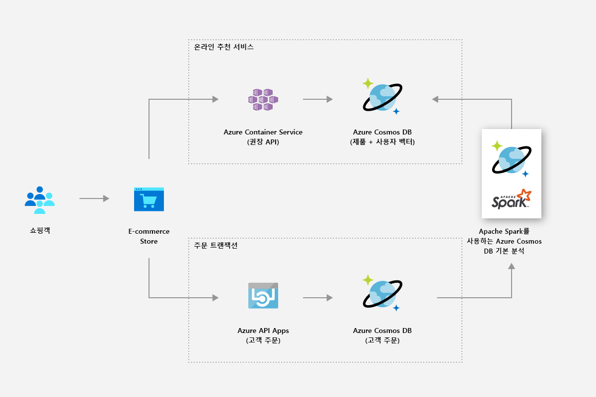
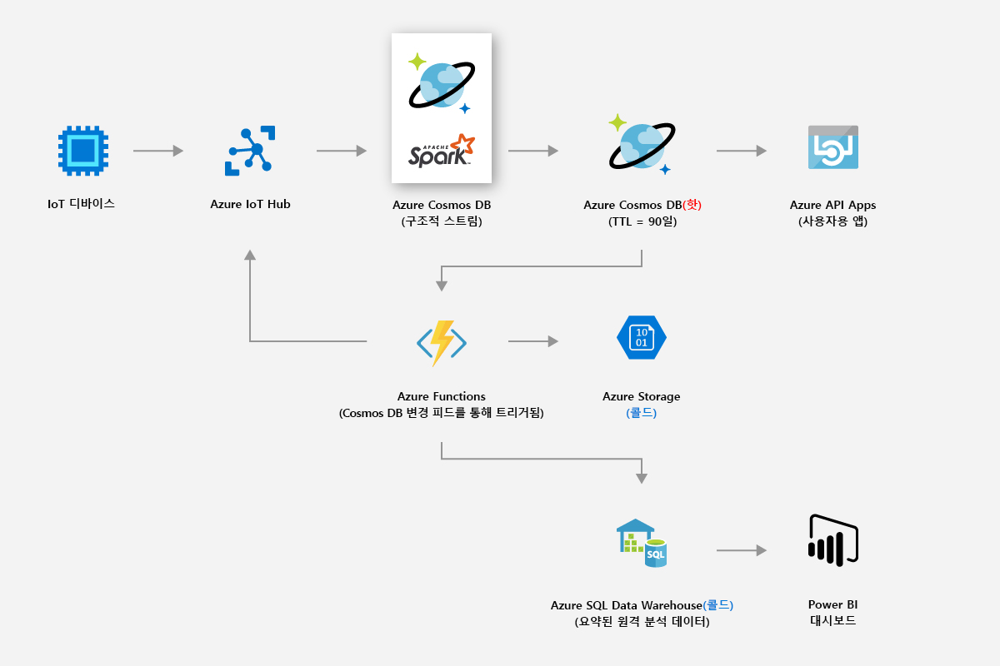
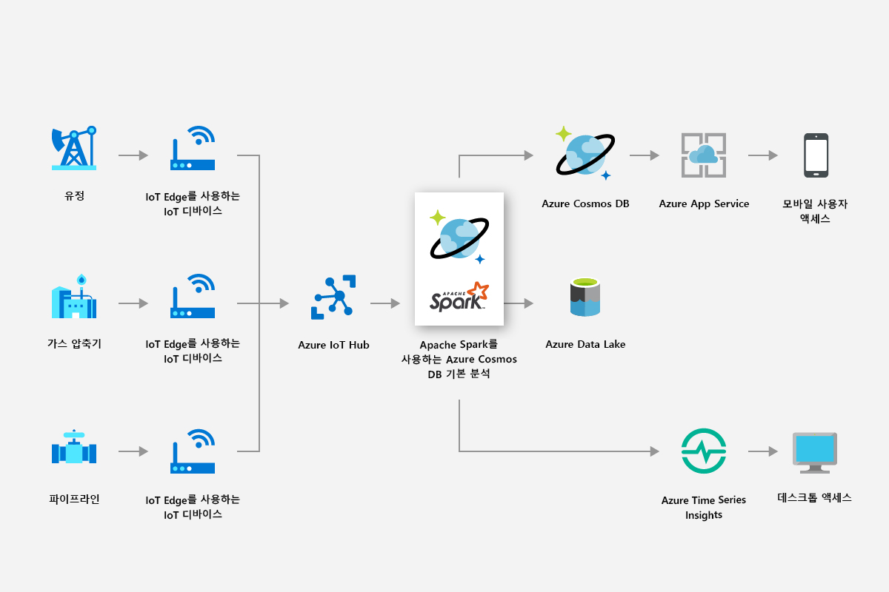
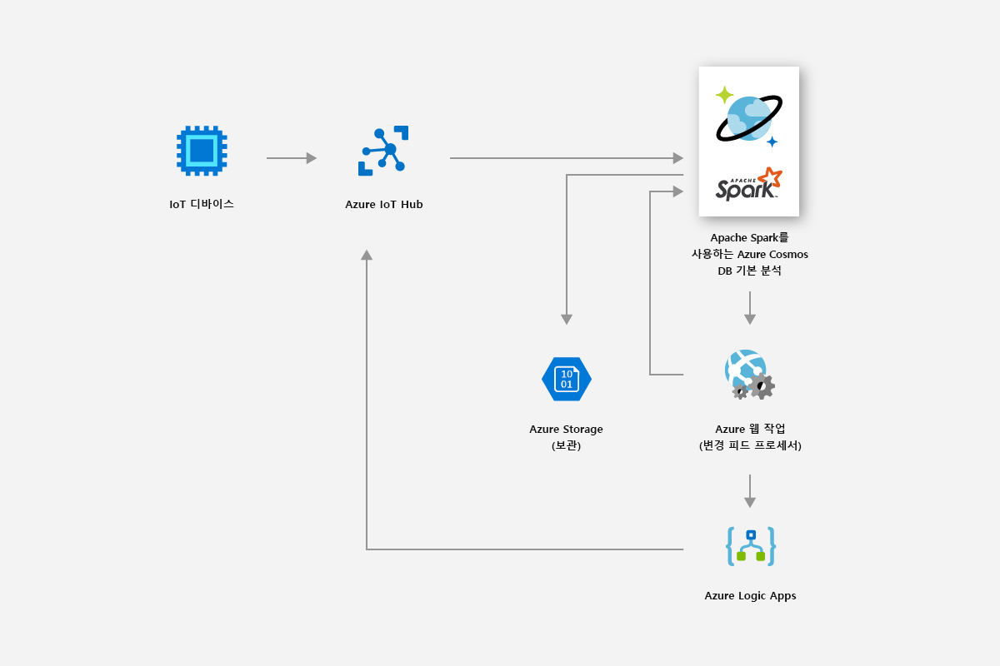
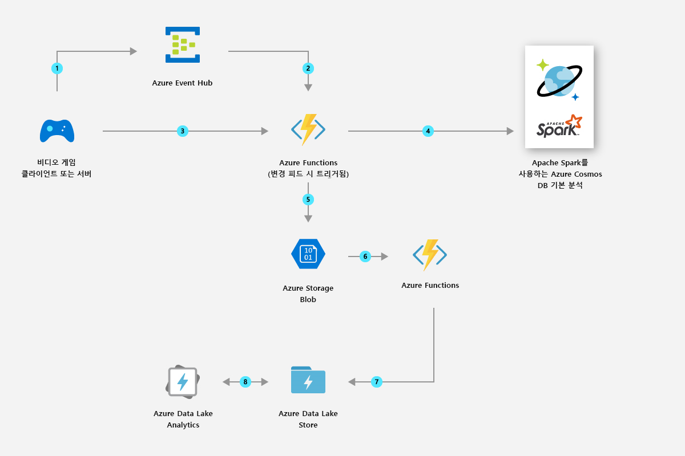

# Azure Cosmos DB에서 전역적으로 분산 분석을 사용 하는 솔루션

이 문서에서는 Azure Cosmos DB의 전역적으로 분산 된 분석을 사용 하 여 빌드할 수 있는 솔루션에 대해 설명 합니다.

## 소매 및 소비재

Azure Cosmos DB의 Spark 지원을 사용하여 실시간 추천 사항과 제안을 제공할 수 있습니다. 고객이 실시간 맞춤 설정 및 제품 추천 사항을 통해 필요한 항목을 찾을 수 있도록 도움을 줄 수 있습니다.

* Apache Spark 런타임에서 제공하는 기본 제공 Machine Learning 지원을 사용하여 제품 카탈로그에서 실시간 추천 사항을 생성할 수 있습니다.

* 클릭 스트림 데이터, 구매 데이터 및 고객 데이터를 마이닝하여 평생 가치를 추구하는 대상 지정 추천 사항을 제공할 수 있습니다.

* Azure Cosmos DB의 글로벌 배포 기능을 사용하면 여러 지역에 분산된 대량의 제품 데이터를 밀리초 단위로 분석할 수 있습니다.

* 지리적으로 분산된 사용자 및 데이터에 대한 인사이트를 빠르게 얻을 수 있습니다. 적절한 사용자에게 적절한 광고를 적시에 제공하여 판촉 전환율을 향상시킬 수 있습니다.

* 기본 제공 Spark 스트리밍 기능은 정적 고객 데이터와 결합하여 라이브 데이터를 보강하는 데 활용할 수 있습니다. 이렇게 하면 고객이 수행하는 작업에 맞게 더 나은 맞춤형으로 설정되고 대상으로 지정된 광고를 실시간으로 제공할 수 있습니다.

다음 이미지에서는 Azure Cosmos DB Spark 지원을 사용하여 가격 책정 및 판촉을 최적화하는 방법을 보여 줍니다.

다음 이미지에서는 Azure Cosmos DB Spark 지원이 실시간 추천 엔진에서 사용되는 방법을 보여 줍니다.

## 제조 및 IoT

Azure Cosmos DB의 기본 제공 분석 플랫폼을 사용하면 전 세계 수백만 개의 디바이스에서 IoT 데이터를 실시간으로 분석할 수 있습니다. 날씨 패턴 예측, 예측 분석, 에너지 최적화 같은 최신 혁신을 수행할 수 있습니다.

* Azure Cosmos DB를 사용하면 실시간 자산 메트릭 및 날씨 요소와 같은 데이터를 마이닝한 다음, 스마트 그리드 분석을 적용하여 현장에서 연결된 디바이스의 성능을 최적화할 수 있습니다. 스마트 그리드 분석은 운영 비용을 제어하고, 그리드 안정성을 향상시키고, 소비자에게 맞춤형 에너지 서비스를 제공하는 핵심 요소입니다.

다음 이미지에서는 Azure Cosmos DB Spark 지원을 사용하여 IoT 디바이스의 메트릭스를 읽고 스마트 그리드 분석을 적용하는 방법을 보여 줍니다.

## 예측적 유지관리

* 소형 시추 장치에 사용되는 압축기와 같은 자산을 심해 플랫폼에 유지하는 것은 복잡한 노력입니다. 이러한 자산은 전 세계에 있으며 페타바이트 단위의 데이터를 생성합니다. Azure Cosmos DB를 사용하면 Spark 스트리밍을 통해 대량의 센서 원격 분석, 자산 부품 저장 및 센서 매핑 데이터를 처리하는 엔드투엔드 예측 데이터 파이프라인을 작성할 수 있습니다.

* 기계 학습 모델을 작성하고 배포하여 자산 오류를 예측하고, 오류가 발생하기 전에 유지 관리 작업 주문을 발급할 수 있습니다.

다음 이미지에서는 Azure Cosmos DB Spark 지원을 사용하여 예측 유지 관리 시스템을 구축하는 방법을 보여 줍니다.

다음 이미지에서는 Azure Cosmos DB Spark 지원을 사용하여 실시간 차량 진단 시스템을 구축하는 방법을 보여 줍니다.

## 게임

* 기본 제공 Spark 지원을 사용하면 Azure Cosmos DB를 통해 고급 분석 및 기계 학습 모델을 수분 내에 쉽게 빌드, 크기 조정 및 배포하여 가능한 최고의 게임 환경을 구축할 수 있습니다.

* 높은 전환율을 달성할 수 있도록 플레이어, 구매 및 동작 데이터를 분석하여 관련 맞춤형 제안을 만들 수 있습니다.

* Spark 기계 학습을 사용하면 게임 원격 분석 데이터를 분석하고 인사이트를 얻을 수 있습니다. 느린 로드 시간 및 게임 내 문제를 진단하고 방지할 수 있습니다.

다음 이미지에서는 Azure Cosmos DB Spark 지원이 게임 분석에서 사용되는 방법을 보여 줍니다.

## 다음 단계

* Azure Cosmos DB의 이점에 대한 자세한 내용은 [개요](introduction.md) 문서를 참조하세요.
* [MongoDB용 Azure Cosmos DB API 시작](mongodb-introduction.md)
* [Azure Cosmos DB Cassandra API 시작](cassandra-introduction.md)
* [Azure Cosmos DB Gremlin API 시작](graph-introduction.md)
* [Azure Cosmos DB Table API 시작](table-introduction.md)
